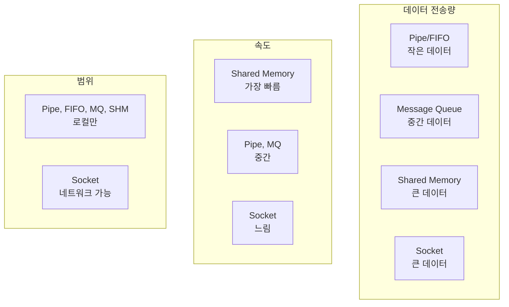
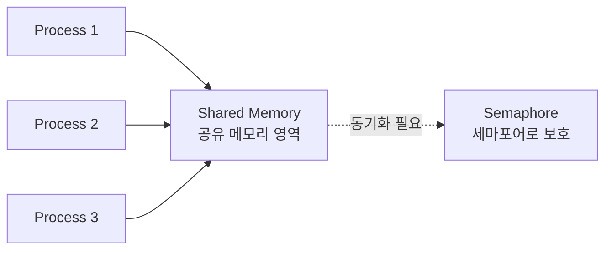
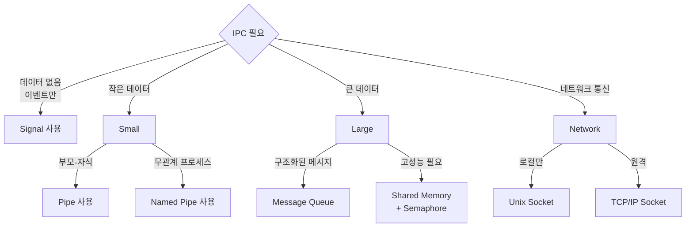

## 🌐 개요 (Overview)

**IPC (Inter-Process Communication)** 는 [[process-states-lifecycle|프로세스]] 간에 데이터를 교환하고 동기화하는 메커니즘입니다. 각 프로세스는 독립된 메모리 공간을 가지므로, 커널이 제공하는 IPC 메커니즘을 통해서만 통신할 수 있습니다.

## 🎯 IPC가 필요한 이유 (Why IPC?)

1. **메모리 격리**: 프로세스는 다른 프로세스의 메모리에 직접 접근 불가
2. **협업**: 여러 프로세스가 협력하여 작업 수행
3. **클라이언트-서버 모델**: 서비스 제공 프로세스와 클라이언트 간 통신
4. **이벤트 알림**: 한 프로세스의 상태 변화를 다른 프로세스에 알림

## 🔧 IPC 메커니즘 비교 (IPC Mechanisms Comparison)

| 메커니즘 | 방향 | 데이터 크기 | 속도 | 네트워크 | 사용 예시 |
|----------|------|-------------|------|----------|-----------|
| **Pipe** | 단방향 | 제한적 | 빠름 | ❌ | 셸 파이프라인 |
| **Named Pipe (FIFO)** | 단방향 | 제한적 | 빠름 | ❌ | 로그 수집 |
| **Message Queue** | 양방향 | 중간 | 중간 | ❌ | 비동기 작업 |
| **Shared Memory** | 양방향 | 큼 | 매우 빠름 | ❌ | 고성능 데이터 교환 |
| **Semaphore** | - | - | 빠름 | ❌ | 동기화, 락 |
| **Socket** | 양방향 | 큼 | 느림 | ✅ | 네트워크 통신 |
| **[[signals\|Signal]]** | 단방향 | 없음 | 빠름 | ❌ | 이벤트 통지 |



## 1️⃣ 파이프 (Pipe)

### 익명 파이프 (Anonymous Pipe)

부모-자식 프로세스 간에만 사용 가능한 단방향 통신 채널입니다.

```c
#include <unistd.h>
#include <stdio.h>
#include <string.h>

int main() {
    int pipefd[2];  // pipefd[0]: read end, pipefd[1]: write end
    char buffer[100];
    
    pipe(pipefd);
    
    if (fork() == 0) {
        // 자식: 읽기
        close(pipefd[1]);  // 쓰기 끝 닫기
        read(pipefd[0], buffer, sizeof(buffer));
        printf("Child received: %s\n", buffer);
        close(pipefd[0]);
    } else {
        // 부모: 쓰기
        close(pipefd[0]);  // 읽기 끝 닫기
        strcpy(buffer, "Hello from parent");
        write(pipefd[1], buffer, strlen(buffer) + 1);
        close(pipefd[1]);
    }
    
    return 0;
}
```

**셸에서의 파이프**:

```bash
ls -l | grep ".txt" | wc -l
#     파이프1      파이프2
```

### Named Pipe (FIFO)

파일시스템에 이름을 가진 파이프로, 관계없는 프로세스 간에도 사용 가능합니다.

```bash
# Named pipe 생성
mkfifo /tmp/mypipe

# 터미널 1: 읽기
cat < /tmp/mypipe

# 터미널 2: 쓰기
echo "Hello" > /tmp/mypipe
```

```c
#include <sys/stat.h>
#include <fcntl.h>
#include <unistd.h>

// Writer
mkfifo("/tmp/mypipe", 0666);
int fd = open("/tmp/mypipe", O_WRONLY);
write(fd, "Hello", 6);
close(fd);

// Reader  
int fd = open("/tmp/mypipe", O_RDONLY);
char buffer[100];
read(fd, buffer, sizeof(buffer));
close(fd);
```

## 2️⃣ 메시지 큐 (Message Queue)

구조화된 메시지를 비동기적으로 전송하는 메커니즘입니다.

```c
#include <sys/msg.h>
#include <string.h>

struct message {
    long msg_type;
    char msg_text[100];
};

int main() {
    key_t key = ftok("/tmp", 'A');
    int msgid = msgget(key, 0666 | IPC_CREAT);
    
    struct message msg;
    
    // 메시지 전송
    msg.msg_type = 1;
    strcpy(msg.msg_text, "Hello");
    msgsnd(msgid, &msg, sizeof(msg.msg_text), 0);
    
    // 메시지 수신
    msgrcv(msgid, &msg, sizeof(msg.msg_text), 1, 0);
    printf("Received: %s\n", msg.msg_text);
    
    // 메시지 큐 삭제
    msgctl(msgid, IPC_RMID, NULL);
    
    return 0;
}
```

**명령어로 확인**:
```bash
# 메시지 큐 목록
ipcs -q

# 메시지 큐 삭제
ipcrm -q <msgid>
```

## 3️⃣ 공유 메모리 (Shared Memory)

가장 빠른 IPC 메커니즘으로, 여러 프로세스가 같은 메모리 영역에 접근합니다.



```c
#include <sys/shm.h>
#include <string.h>

int main() {
    key_t key = ftok("/tmp", 'B');
    
    // 공유 메모리 생성 (1024 bytes)
    int shmid = shmget(key, 1024, 0666 | IPC_CREAT);
    
    // 공유 메모리 첨부
    char *str = (char*) shmat(shmid, NULL, 0);
    
    // 데이터 쓰기/읽기
    strcpy(str, "Hello from shared memory");
    printf("Data: %s\n", str);
    
    // 공유 메모리 분리
    shmdt(str);
    
    // 공유 메모리 삭제
    shmctl(shmid, IPC_RMID, NULL);
    
    return 0;
}
```

**주의사항**:
- 동기화 필수 (Semaphore 또는 Mutex 사용)
- Race condition 방지 필요

```bash
# 공유 메모리 목록
ipcs -m

# 공유 메모리 삭제
ipcrm -m <shmid>
```

## 4️⃣ 세마포어 (Semaphore)

공유 자원에 대한 접근을 제어하는 동기화 메커니즘입니다.

```c
#include <sys/sem.h>

union semun {
    int val;
    struct semid_ds *buf;
    unsigned short *array;
};

int main() {
    key_t key = ftok("/tmp", 'C');
    int semid = semget(key, 1, 0666 | IPC_CREAT);
    
    // 세마포어 초기화 (1로 설정)
    union semun arg;
    arg.val = 1;
    semctl(semid, 0, SETVAL, arg);
    
    struct sembuf sb;
    
    // P 연산 (잠금)
    sb.sem_num = 0;
    sb.sem_op = -1;  // 1 감소
    sb.sem_flg = 0;
    semop(semid, &sb, 1);
    
    // 임계 영역 (Critical Section)
    printf("In critical section\n");
    
    // V 연산 (해제)
    sb.sem_op = 1;  // 1 증가
    semop(semid, &sb, 1);
    
    // 세마포어 삭제
    semctl(semid, 0, IPC_RMID);
    
    return 0;
}
```

```bash
# 세마포어 목록
ipcs -s

# 세마포어 삭제
ipcrm -s <semid>
```

## 5️⃣ 소켓 (Socket)

네트워크 통신뿐만 아니라 로컬 프로세스 간 통신에도 사용됩니다.

### Unix Domain Socket

파일시스템 경로를 사용하는 로컬 소켓입니다.

```c
#include <sys/socket.h>
#include <sys/un.h>
#include <string.h>
#include <unistd.h>

// Server
int server_fd = socket(AF_UNIX, SOCK_STREAM, 0);
struct sockaddr_un addr;
addr.sun_family = AF_UNIX;
strcpy(addr.sun_path, "/tmp/mysocket");

bind(server_fd, (struct sockaddr*)&addr, sizeof(addr));
listen(server_fd, 5);
int client_fd = accept(server_fd, NULL, NULL);

// 데이터 수신
char buffer[100];
recv(client_fd, buffer, sizeof(buffer), 0);

// Client
int client_fd = socket(AF_UNIX, SOCK_STREAM, 0);
struct sockaddr_un addr;
addr.sun_family = AF_UNIX;
strcpy(addr.sun_path, "/tmp/mysocket");

connect(client_fd, (struct sockaddr*)&addr, sizeof(addr));
send(client_fd, "Hello", 6, 0);
```

### TCP/IP Socket

네트워크를 통한 통신에 사용됩니다 (자세한 내용은 [[tcp-ip-model]] 참조).

## 💡 실무 사용 사례 (Real-World Use Cases)

### 1. Nginx 마스터-워커 통신

```plaintext
마스터 프로세스 (설정 관리)
    ↓ Shared Memory (설정 공유)
워커 프로세스들 (요청 처리)
```

### 2. Chrome 멀티 프로세스 아키텍처

```plaintext
브라우저 프로세스
    ↓ IPC (메시지 전달)
렌더러 프로세스 (탭마다 1개)
```

### 3. Docker 데몬 통신

```bash
docker ps
# Docker CLI → Unix socket (/var/run/docker.sock) → Docker daemon
```

### 4. systemd 저널 로깅

```plaintext
애플리케이션 → Socket → systemd-journald
```

## ⚖️ IPC 선택 가이드 (Choosing the Right IPC)



### 선택 기준

1. **속도가 중요**: Shared Memory
2. **간단한 구조**: Pipe, FIFO
3. **네트워크 필요**: Socket
4. **이벤트 통지**: Signal
5. **비동기 메시지**: Message Queue

## 🔗 연결 문서 (Related Documents)

- [[process-states-lifecycle]] - 프로세스 개념과 fork/exec
- [[signals]] - 시그널을 통한 이벤트 통지
- [[tcp-ip-model]] - 네트워크 소켓 통신의 기반
- [[kernel]] - 커널의 IPC 구현
