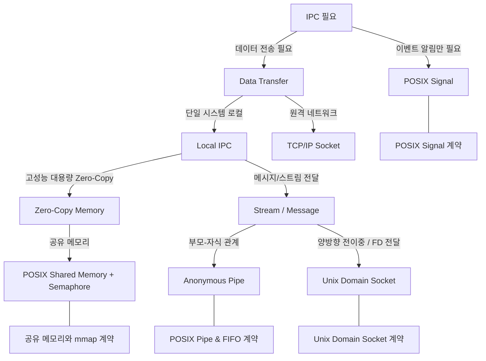

## 🌐 POSIX IPC 메커니즘 개념 지도 (Inter-Process Communication Map)

>**이 문서의 목적**: 운영체제(OS) 환경에서 프로세스 간 데이터 교환 및 동기화를 위한 **전통적 POSIX IPC 메커니즘(Pipe, Shared Memory, Socket, Signal)의 커널 동작 원리, 성능 특성 및 선택 기준**을 한눈에 조망한다. 각 세부 메커니즘은 원자적 계약 노트로 연결된다.

---

### 🎯 IPC 가 필요한 이유 (Why IPC?)

1. **메모리 격리 (Memory Isolation)**: 가상 메모리 체계에 의해 프로세스는 독립된 주소 공간을 가지므로 커널 중재 없이는 타 프로세스 메모리 직접 접근 불가
2. **프로세스 협업 (Cooperation)**: 다중 프로세스 아키텍처 기반의 분산 작업 처리
3. **클라이언트 - 서버 모델 (Client-Server)**: 서비스 제공 데몬과 유저 프로세스 간 통신
4. **비동기 이벤트 통지 (Event Notification)**: 시그널/인터럽트를 통한 예외 상태 전달

---

### 🔧 POSIX IPC 메커니즘 전체 비교표

| 메커니즘 | 방향성 | 데이터 복사 오버헤드 | 주요 특징 및 한계 | 핵심 활용처 | 원자 계약 노트 |
| :--- | :--- | :--- | :--- | :--- | :--- |
| **Pipe / FIFO** | 단방향 | 2-Copy (Kernel Ring Buffer) | `PIPE_BUF` 이내 Atomic Write. 혈연 프로세스 또는 경로 노드 기반 | Shell 파이프라인, 간단한 로그 전달 | [POSIX Pipe & FIFO 계약](./ipc-contracts/posix-pipe-and-fifo-contracts.md) |
| **Shared Memory** | 양방향 | **0-Copy** (Page Table Mapping) | 가장 빠른 통신. 동기화(Semaphore) 미적용 시 Race Condition | 대용량 데이터 공유, 고성능 IPC | [공유 메모리와 mmap 계약](./ipc-contracts/shared-memory-and-mmap-contracts.md) |
| **Unix Domain Socket** | 양방향 전이중 | 1-Copy (Kernel Socket Buffer) | 파일 디스크립터 패스스루(`SCM_RIGHTS`), `SO_PEERCRED` UID 검증 | Docker, DBus, Local Server | [Unix Domain Socket 계약](./ipc-contracts/unix-domain-socket-contracts.md) |
| **Signal** | 단방향 | 없음 (Interrupt Signal Mask) | 비동기 이벤트 알림. 데이터 탑재 불가, 핸들러 내 Async-Signal-Safe 제한 | `SIGINT`, `SIGTERM`, ANR Trace | [POSIX Signal 계약](./ipc-contracts/posix-signal-contracts.md) |

---

### 🗺️ IPC 분류 및 탐색 지도

```mermaid
graph TD
    Start["IPC 필요"]
    Start -->|"이벤트 알림만 필요"| Signal["POSIX Signal"]
    Start -->|"데이터 전송 필요"| Data["Data Transfer"]

    Data -->|"단일 시스템 로컬"| Local["Local IPC"]
    Data -->|"원격 네트워크"| Network["TCP/IP Socket"]

    Local -->|"고성능 대용량 Zero-Copy"| FastMemory["Zero-Copy Memory"]
    Local -->|"메시지/스트림 전달"| Stream["Stream / Message"]

    FastMemory -->|"공유 메모리"| SHM["POSIX Shared Memory + Semaphore"]
    Stream -->|"부모-자식 관계"| Pipe["Anonymous Pipe"]
    Stream -->|"양방향 전이중 / FD 전달"| UnixSock["Unix Domain Socket"]

    Signal --- RefSignal["POSIX Signal 계약"]
    SHM --- RefSHM["공유 메모리와 mmap 계약"]
    Pipe --- RefPipe["POSIX Pipe & FIFO 계약"]
    UnixSock --- RefSock["Unix Domain Socket 계약"]
```

---

### 💡 실무 적용 사례 (Real-World Architectures)

1. **Nginx 마스터 - 워커 통신**: Shared Memory 및 Channel Pipe 기반 설정 공유 및 프로세스 제어
2. **Chrome 멀티 프로세스 아키텍처**: Browser Process 와 Renderer Process 간 IPC (Unix Domain Socket 및 Shared Memory 기반 Mojo IPC)
3. **Docker 데몬 통신**: Docker CLI 가 `/var/run/docker.sock` Unix Domain Socket 을 통해 Docker Daemon 과 통신

---

### 🌐 하위 도메인 확장 (Sub-domain Extensions)

- **Android OS IPC 아키텍처 결정**: Android 환경에서는 커널 레벨 UID/PID 신원 검증, 참조 카운팅 기반 수명 관리, 커널 스레드 풀 제어를 위해 전통적 POSIX IPC 대신 Binder 와 Ashmem 을 도입했다. 세부 내용은 **POSIX IPC vs Android Binder 구조적 비교** 문서를 참조한다.

---

### 🔗 연결 문서 (Related Documents)

- [POSIX Pipe와 FIFO 계약](./ipc-contracts/posix-pipe-and-fifo-contracts.md)
- [공유 메모리와 mmap 계약](./ipc-contracts/shared-memory-and-mmap-contracts.md)
- [Unix Domain Socket 계약](./ipc-contracts/unix-domain-socket-contracts.md)
- [POSIX Signal 계약](./ipc-contracts/posix-signal-contracts.md)
- **POSIX IPC vs Android Binder & Ashmem 계약**
