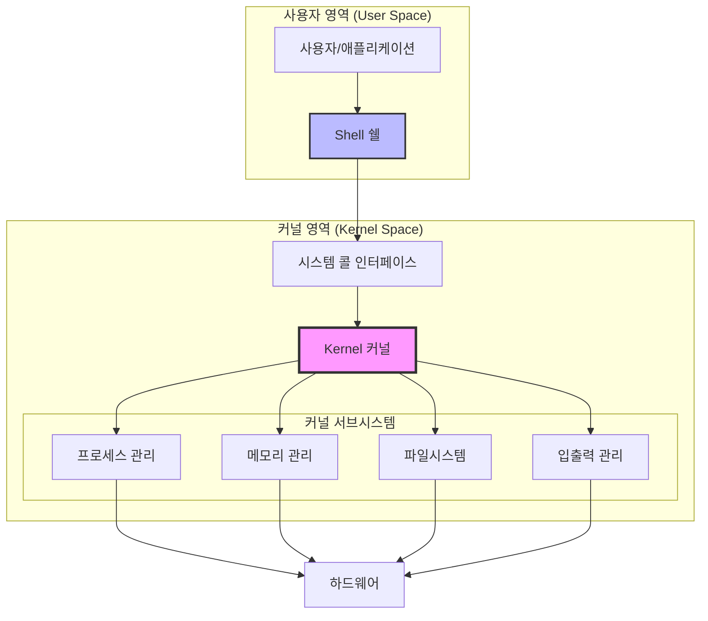
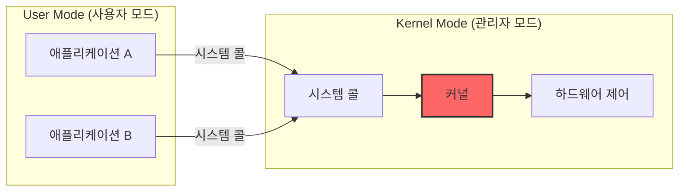
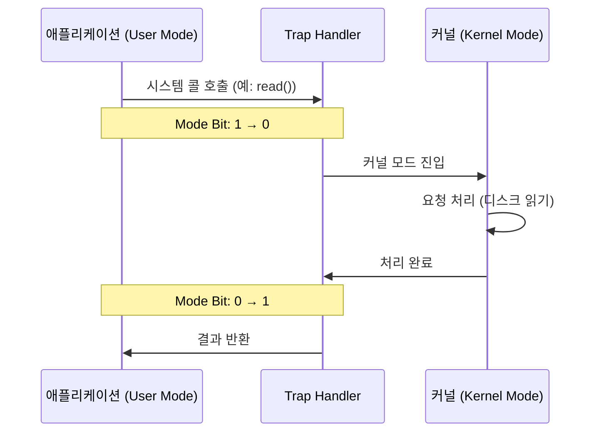
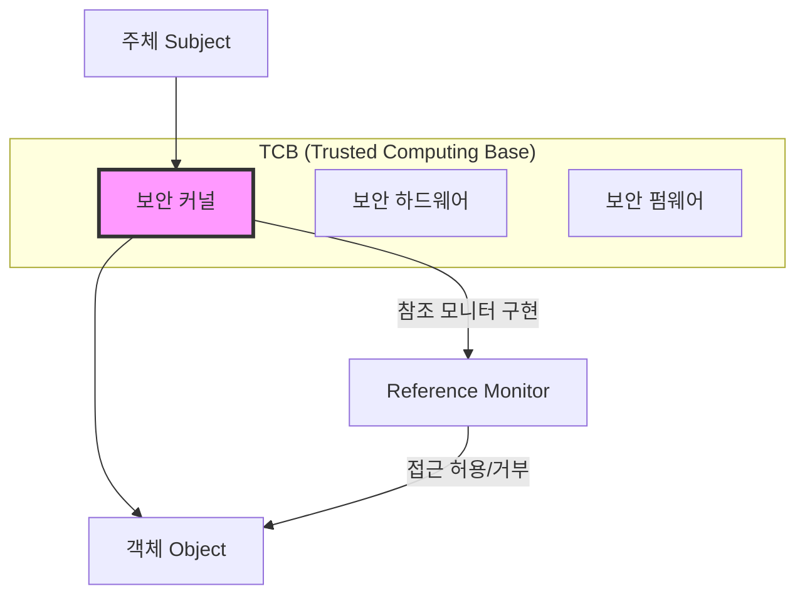

## 🌐 개요 (Overview)

운영체제(OS)는 사용자가 컴퓨터 하드웨어를 효율적으로 사용할 수 있도록 인터페이스를 제공하고, 시스템 자원(CPU, 메모리, 입출력 장치 등)을 관리하는 시스템 소프트웨어입니다.

## 🎯 운영체제의 목적

| 목적 | 설명 |
|------|------|
| **처리능력 (Throughput)** | 단위 시간당 처리하는 작업량 증대 |
| **신뢰도 (Reliability)** | 시스템이 주어진 작업을 정확하게 수행하는 정도 |
| **응답시간 (Turn-around Time)** | 작업 요청 후 결과가 나올 때까지의 시간 단축 |
| **사용 가능도 (Availability)** | 시스템 자원을 필요할 때 즉시 사용할 수 있는 정도 |

## 📊 운영체제의 구조

### 전체 구조



### 1. 커널 (Kernel)

**운영체제의 핵심 부분**으로, 주기억장치에 상주하며 하드웨어와 직접 상호작용합니다.

**주요 기능**:
- **프로세스 관리**: 프로세스 생성/종료, [[process-scheduling|스케줄링]], 동기화
- **메모리 관리**: [[virtual-memory|가상 메모리]], 페이지 교체, 메모리 보호
- **파일시스템 관리**: 파일 생성/삭제, 디렉토리 구조, [[inode]]
- **입출력 관리**: 디바이스 드라이버, 버퍼링, 인터럽트 처리
- **보안**: 접근 제어, 인증, 암호화

```bash
# Linux에서 커널 버전 확인
uname -r
# 5.15.0-generic

# 커널 정보 상세
cat /proc/version
```

### 2. 쉘 (Shell)

**사용자와 커널 사이의 인터페이스**로, 명령어 해석기 역할을 합니다.

**특징**:
- 사용자가 입력한 명령어를 해석하여 커널에 전달
- 주기억장치에 상주하지 않음 (보조기억장치에서 교체 처리 가능)
- 스크립트 언어로 프로그래밍 가능

**주요 쉘 종류**:

| 쉘 | 설명 | 특징 |
|---|---|---|
| **sh (Bourne Shell)** | 최초의 Unix 쉘 | 기본적, 스크립트 표준 |
| **bash (Bourne Again Shell)** | Linux 기본 쉘 | sh 호환, 기능 확장 |
| **csh (C Shell)** | C 언어 문법 기반 | 히스토리, 별칭 지원 |
| **ksh (Korn Shell)** | sh + csh 장점 결합 | 상용 Unix 에서 많이 사용 |
| **zsh (Z Shell)** | 현대적 기능 | 자동완성, 플러그인 |

```bash
# 현재 사용 중인 쉘 확인
echo $SHELL
# /bin/bash

# 사용 가능한 쉘 목록
cat /etc/shells
```

## 🔐 이중 모드 (Dual Mode)

### 왜 필요한가?

다중 프로그래밍 환경에서 **사용자 프로그램이 시스템에 치명적인 영향**을 주지 못하도록 보호하기 위해 두 가지 실행 모드를 제공합니다.

### 모드 구분



### 1. 사용자 모드 (User Mode)

- **일반 애플리케이션**이 실행되는 영역
- **제한적인 명령어**만 사용 가능
- 하드웨어에 **직접 접근 불가**
- 메모리의 제한된 영역만 접근 가능

```c
// 사용자 모드에서 실행되는 일반 프로그램
int main() {
    int x = 10;           // OK - 일반 연산
    printf("Hello");      // OK - 시스템 콜을 통해 커널에 요청
    
    // 아래는 직접 실행 불가 - 시스템 콜 필요
    // write_to_disk();   // X - 하드웨어 직접 접근 불가
    // halt_cpu();        // X - 특권 명령 불가
    return 0;
}
```

### 2. 커널 모드 (Kernel Mode / Supervisor Mode)

- **특권 명령(Privileged Instruction)** 포함 모든 명령어 실행 가능
- 하드웨어에 **직접 접근 가능**
- 시스템의 **모든 메모리** 접근 가능
- CPU 의 Mode Bit 가 0 으로 설정됨

**특권 명령 예시**:
- I/O 장치 접근 (디스크 읽기/쓰기)
- 인터럽트 활성화/비활성화
- 메모리 보호 레지스터 설정
- 시스템 정지 (Halt)
- 타이머 설정

### 모드 전환 (Mode Switching)



**모드 전환 발생 시점**:
1. **시스템 콜**: 사용자 프로그램이 커널 서비스 요청
2. **인터럽트**: 하드웨어 이벤트 발생 (키보드, 타이머 등)
3. **예외 (Exception)**: 오류 발생 (0 으로 나누기, 잘못된 메모리 접근)

### 시스템 콜 (System Call)

사용자 모드에서 커널 모드의 기능을 요청하는 **인터페이스**입니다.

```c
// 시스템 콜 예시 (Linux)
#include <unistd.h>
#include <fcntl.h>

int main() {
    // open() - 파일 열기 시스템 콜
    int fd = open("/etc/passwd", O_RDONLY);
    
    char buffer[1024];
    // read() - 파일 읽기 시스템 콜
    ssize_t bytes = read(fd, buffer, sizeof(buffer));
    
    // write() - 화면 출력 시스템 콜
    write(STDOUT_FILENO, buffer, bytes);
    
    // close() - 파일 닫기 시스템 콜
    close(fd);
    
    return 0;
}
```

**주요 시스템 콜 분류**:

| 분류 | 시스템 콜 예시 |
|------|--------------|
| **프로세스 제어** | fork(), exec(), exit(), wait() |
| **파일 관리** | open(), read(), write(), close() |
| **디바이스 관리** | ioctl(), read(), write() |
| **정보 유지** | getpid(), alarm(), sleep() |
| **통신** | pipe(), socket(), send(), recv() |

```bash
# Linux에서 시스템 콜 추적
strace ls -l
# execve("/bin/ls", ["ls", "-l"], ...) = 0
# openat(AT_FDCWD, ".", O_RDONLY|O_DIRECTORY) = 3
# ...
```

## 🔒 보안 커널 (Security Kernel)

### 정의

**TCB(Trusted Computing Base)** 의 하드웨어, 펌웨어, 소프트웨어 요소로 구성되며, **참조 모니터(Reference Monitor)** 개념을 구현합니다.



### 보안 커널의 역할

1. **접근 통제**: 주체와 객체 간의 모든 접근을 중재
2. **감사 (Audit)**: 보안 관련 이벤트 기록
3. **인증**: 사용자/프로세스의 신원 확인
4. **암호화**: 데이터 보호

>💡 **Reference Monitor**에 대한 자세한 내용은 [[secure-operating-systems]] 참조

## 💡 실무 예시

### 권한 에러 확인

```bash
# 일반 사용자로 특권 명령 시도
cat /etc/shadow
# cat: /etc/shadow: Permission denied

# 커널 모드 필요한 작업
mount /dev/sdb1 /mnt
# mount: only root can do that
```

### 커널 파라미터 조정

```bash
# /proc/sys를 통한 커널 파라미터 조정 (root 필요)
# 커널 모드에서만 가능한 시스템 설정
echo 1 > /proc/sys/net/ipv4/ip_forward

# sysctl로 확인/설정
sysctl net.ipv4.ip_forward
sysctl -w net.ipv4.ip_forward=1
```

## ⚠️ 보안 고려사항

### User Mode ↔ Kernel Mode 취약점

1. **시스템 콜 취약점**: 잘못 구현된 시스템 콜을 통한 권한 상승
2. **커널 익스플로잇**: 커널 버그를 이용한 루트 권한 획득
3. **드라이버 취약점**: 디바이스 드라이버를 통한 커널 모드 접근

```bash
# 커널 보안 업데이트 확인
apt list --upgradable | grep linux-image

# 커널 보안 설정 확인
cat /proc/sys/kernel/randomize_va_space  # ASLR
cat /proc/sys/kernel/kptr_restrict       # 커널 포인터 제한
```

## 🔗 연결 문서 (Related Documents)

- [[process-states-lifecycle]] - 프로세스 상태와 생명주기
- [[process-scheduling]] - CPU 스케줄링 알고리즘
- [[virtual-memory]] - 가상 메모리와 메모리 보호
- [[secure-operating-systems]] - 보안 운영체제와 Reference Monitor
- [[systemd]] - Linux 의 init 시스템
