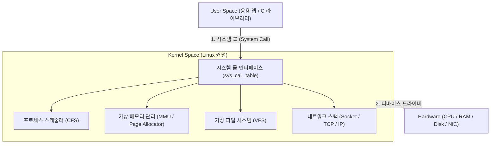

## Linux Kernel (리눅스 커널 아키텍처)

### 1. 개요 (Overview)

**Linux Kernel (리눅스 커널)** 은 컴퓨터 하드웨어(CPU, RAM, 디바이스)와 사용자 응용 소프트웨어 사이를 중재하며, **프로세스 스케줄링, 가상 메모리 관리, 가상 파일 시스템(VFS), 네트워크 스택, 디바이스 드라이버를 제공하는 모놀리식(Monolithic) 하이브리드 운영체제 핵심 엔지니어링 시스템**이다.

서버 OS, 락탑 Linux, 모바일 OS([Android Kernel](../mobile/android/01_system_internals/android-kernel.md)) 및 임베디드 기기 전반의 기초 실행 기반을 담당한다.

---

#### 초보자를 위한 쉽게 이해하는 비유

- **Linux 커널 (대형 공장의 중앙 기계 엔진실)**:
  - 공장 작업자들(응용 앱/프로세스)이 전력과 공장 기계(하드웨어 자원)를 요청할 때, 안전하게 모터 속도([스케줄러](../computer-science/operating-systems/system-call.md))를 조절하고, 작업 공간([가상 메모리](../computer-science/operating-systems/system-call.md))을 할당해 주며, 사고가 나지 않도록 통제하는 중앙 기계 통제실.



---

### 2. Linux 커널의 5 대 핵심 서브시스템

1. **프로세스 관리기 (Process Scheduler)**:
   - 태스크(`task_struct`) 생성, CFS (Completely Fair Scheduler) 기반 CPU 시간분배.
2. **메모리 관리기 (Memory Manager)**:
   - 가상 메모리 페이징(Paging), Page Fault 처리, OOM Killer.
3. **가상 파일 시스템 (VFS - Virtual File System)**:
   - 다양한 파일 시스템(ext4, xfs)을 동일한 `read() / write()` [시스템 콜](../computer-science/operating-systems/system-call.md) 로 단일화.
4. **네트워크 스택 (Network Stack)**:
   - BSD [소켓](../computer-science/networking/socket.md) 인터페이스, TCP/IP 프로토콜, [eBPF 패킷 필터](../computer-science/operating-systems/ebpf.md).
5. **디바이스 드라이버 (Device Drivers)**:
   - 하드웨어 칩셋 입출력 컨트롤.

---

### 3. 관측 가능 증거 및 Linux CLI 명령어

Linux 환경에서 현재 커널 버전 및 모듈 상태를 진단할 수 있다:

```bash
# 1. Linux 커널 버전 및 아키텍처 조회
uname -a

# 2. 커널 메시지 버퍼 (dmesg) 최근 덤프
sudo dmesg | tail -n 20
```

---

### 4. 연결 문서 (Related Links)

- [시스템 콜 (System Call)](../computer-science/operating-systems/system-call.md) - 유저스페이스 ➔ 커널 진입 인터페이스
- [eBPF 커널 런타임 엔진](../computer-science/operating-systems/ebpf.md) - 커널 내부 0ms 실행 엔진
- [소켓 (Socket)](../computer-science/networking/socket.md) - 커널 네트워크 VFS 엔드포인트
- [커널 이벤트 (Kernel Event)](../computer-science/operating-systems/kernel-event.md) - kprobes & tracepoints 훅
- [Android Kernel 특화 구조](../mobile/android/01_system_internals/android-kernel.md) - 안드로이드 특화 커널 확장 (LMK, WakeLocks, Binder, Ashmem)
