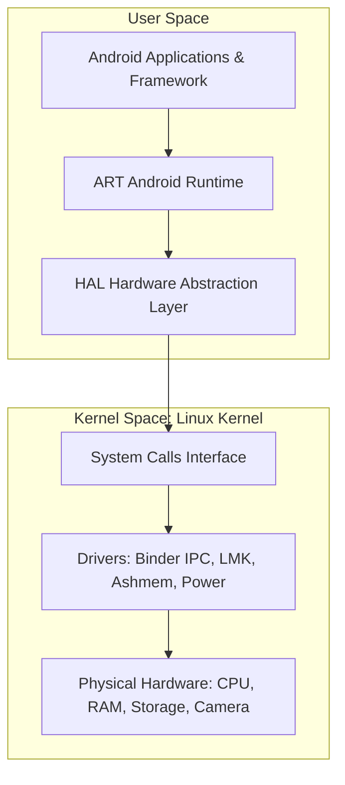

## Linux Kernel (리눅스 커널)

---

### 초보자를 위한 쉽게 이해하는 비유

리눅스 커널은 소프트웨어와 하드웨어 사이에서 작동하는 **"지휘자(Conductor)이자 지배인"**입니다.
컴퓨터나 스마트폰의 앱(카메라 앱, 게임 등)이 실재하는 전자기판(CPU, RAM, 카메라 렌즈, 스피커)을 직접 제어하려 하면 복잡하고 위험합니다. 커널은 이 물리 하드웨어를 안전하게 감싸고, 앱의 요청(시스템 콜)을 받아 하드웨어를 효율적으로 작동시켜 주는 중계자 역할을 합니다.

---

### 1. 개요 (Overview)

**리눅스 커널(Linux Kernel)**은 시스템의 물리 하드웨어 자원을 직접 제어 및 관리하고, 사용자 공간(User Space)의 애플리케이션에 일관된 시스템 콜(System Call) 인터페이스를 제공하는 운영체제의 핵심 엔진입니다.

모놀리식 커널(Monolithic Kernel) 구조로 설계되었으나, 동적 모듈 로딩(Loadable Kernel Modules, LKM)을 지원하여 높은 performance와 확장성을 자랑합니다.

안드로이드(Android) OS 역시 리눅스 메인라인 커널을 기반으로 모바일 환경 특화 패치를 적용하여 구축되었으며, 상위의 [HAL](../mobile/android/01_system_internals/hal.md) 및 [ART](../mobile/android/01_system_internals/art.md) 계층이 이 위에서 실행됩니다.

---

### 2. 핵심 기능 및 역할

1. **하드웨어 추상화 (Hardware Abstraction)**
   * 복잡한 물리 하드웨어(CPU, 메모리, 저장장치 등)를 표준 파일 시스템 및 시스템 콜 인터페이스로 추상화하여, 일반 앱이 하드웨어 세부 작동을 몰라도 접근할 수 있게 합니다.
2. **프로세스 관리 및 스케줄링 (Process Management)**
   * CFS(Completely Fair Scheduler) 등을 통해 수많은 프로세스와 스레드가 CPU 자원을 공정하고 빠르게 나눠 쓸 수 있도록 관리합니다.
3. **가상 메모리 관리 (Virtual Memory Management)**
   * 각 프로세스에 독립된 가상 주소 공간을 부여하여 프로그램 간 메모리 침범을 방지하고 보안과 안정성을 확보합니다.
4. **디바이스 드라이버 (Device Drivers)**
   * 디스플레이, 카메라, 센서, Wi-Fi 등 다양한 주변 하드웨어와 직접 대화하는 소프트웨어 모듈을 관리합니다.

---

### 3. 안드로이드 OS에서의 특화 역할

안드로이드는 모바일 단말의 전력, 메모리, 성능 제약을 해결하기 위해 리눅스 커널에 다음과 같은 전용 드라이버를 탑재했습니다.

* **[Binder IPC](../mobile/android/01_system_internals/binder-ipc.md)**: 안드로이드 특화 프로세스 간 통신(IPC) 메커니즘으로, 커널 수준에서 고성능 메시지 전달 및 보안 검증을 수행합니다.
* **Low Memory Killer (LMK)**: 모바일 메모리가 부족해지면 우선순위가 낮은 백그라운드 앱 프로세스를 강제 종료하여 전체 시스템 멈춤을 예방합니다.
* **Ashmem (Anonymous Shared Memory)**: 프로세스 간 대용량 메모리 버퍼를 공유하기 위한 안드로이드 전용 공유 메모리 드라이버입니다.
* **Wake Locks (전력 관리)**: 불필요한 배터리 소모를 막기 위해 기기의 수면 상태와 깨어남을 조절합니다.

---

### 4. 연관 노트

- [HAL (Hardware Abstraction Layer)](../mobile/android/01_system_internals/hal.md) - 커널 드라이버 위에서 프레임워크에 표준 인터페이스를 제공하는 계층
- [ART (Android Runtime)](../mobile/android/01_system_internals/art.md) - 리눅스 커널 위 사용자 공간에서 앱 바이트코드를 실행하는 런타임
- [Binder IPC](../mobile/android/01_system_internals/binder-ipc.md) - 커널 드라이버 기반의 안드로이드 핵심 IPC 메커니즘

