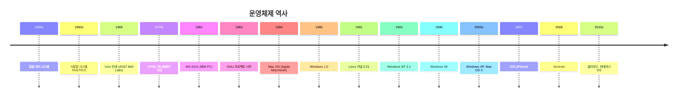
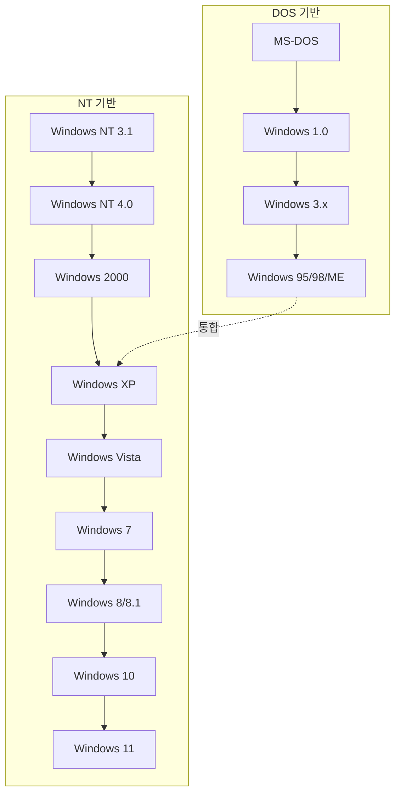
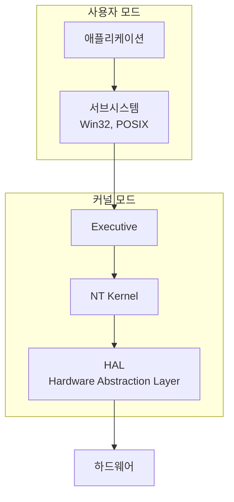
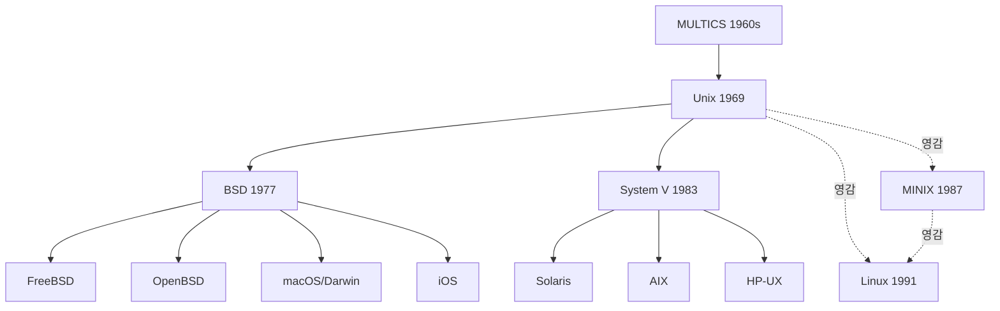

## 🌐 개요 (Overview)

**운영체제(Operating System)** 는 컴퓨터 하드웨어를 관리하고 사용자에게 편의를 제공하는 시스템 소프트웨어입니다. 이 문서는 주요 운영체제의 역사와 발전 과정을 다룹니다.

---

## 📜 운영체제 발전 연대표



---

## 🖥️ MS-DOS (Microsoft Disk Operating System)

### 역사

| 연도 | 사건 |
|------|------|
| **1980** | Tim Paterson 이 QDOS (Quick and Dirty OS) 개발 |
| **1981** | Microsoft 가 QDOS 인수, **MS-DOS 1.0** 출시 (IBM PC 용) |
| **1983** | MS-DOS 2.0 (디렉토리 구조 도입) |
| **1984** | MS-DOS 3.0 (하드디스크 지원) |
| **1988** | MS-DOS 4.0 |
| **1994** | MS-DOS 6.22 (마지막 독립 버전) |
| **2000** | Windows ME 이후 DOS 기반 종료 |

### 특징

```plaintext
MS-DOS 특징:
- CLI (Command Line Interface) 기반
- 단일 사용자, 단일 작업
- 16비트 운영체제
- 640KB 메모리 제한 (Conventional Memory)
- FAT 파일시스템 (FAT12, FAT16)
- 명령어 해석기: COMMAND.COM
```

### 주요 명령어

```cmd
:: 파일/디렉토리 관리
dir         :: ls와 유사
cd          :: 디렉토리 이동
md / mkdir  :: 디렉토리 생성
rd / rmdir  :: 디렉토리 삭제
copy        :: 파일 복사
del         :: 파일 삭제
type        :: 파일 내용 출력 (cat과 유사)

:: 시스템
ver         :: 버전 확인
cls         :: 화면 지우기
mem         :: 메모리 상태
chkdsk      :: 디스크 검사
format      :: 디스크 포맷
```

---

## 🪟 Windows 운영체제

### 발전 과정



### 주요 버전별 특징

| 버전 | 연도 | 주요 특징 |
|------|------|----------|
| **Windows 1.0** | 1985 | GUI 도입, DOS 위에서 실행 |
| **Windows 3.1** | 1992 | 대중화, 멀티태스킹 지원 |
| **Windows 95** | 1995 | 시작 메뉴, 작업 표시줄, Plug and Play |
| **Windows NT** | 1993 | 32 비트, 선점형 멀티태스킹, NTFS |
| **Windows XP** | 2001 | NT/9x 통합, 안정성 향상 |
| **Windows 7** | 2009 | 성능 개선, 터치 지원 시작 |
| **Windows 10** | 2015 | 서비스형 Windows (WaaS), UWP |
| **Windows 11** | 2021 | 새로운 UI, TPM 2.0 필수 |

### Windows NT 아키텍처



**NT 커널 특징**:
- 선점형 멀티태스킹
- 메모리 보호
- 하드웨어 추상화 계층 (HAL)
- NTFS 파일시스템
- 보안 서브시스템 (LSA, SAM)

---

## 🐧 Unix 계열

### Unix 계보



### Unix 역사

| 연도 | 사건 |
|------|------|
| **1969** | Ken Thompson, Dennis Ritchie 가 Bell Labs 에서 Unix 개발 |
| **1973** | C 언어로 재작성 (이식성 확보) |
| **1977** | BSD (Berkeley Software Distribution) 분기 |
| **1983** | System V 릴리즈 |
| **1983** | Richard Stallman GNU 프로젝트 시작 |
| **1987** | Andrew Tanenbaum MINIX 개발 |
| **1991** | Linus Torvalds Linux 커널 개발 |

### Unix 특징

```plaintext
Unix 설계 철학:
1. 모든 것은 파일이다 (Everything is a file)
2. 작고 단순한 프로그램 조합
3. 파이프로 프로그램 연결
4. 텍스트 기반 인터페이스
5. 이식성 중시 (C 언어)

기술적 특징:
- 다중 사용자 (Multi-user)
- 다중 작업 (Multi-tasking)
- 계층적 파일 시스템
- 쉘 (Shell) 인터페이스
- 프로세스 개념
```

---

## 🍎 macOS / iOS

### Apple 운영체제 변천

| 연도 | 운영체제 | 기반 |
|------|----------|------|
| **1984** | Mac System Software | 독자 개발 |
| **1997** | NeXTSTEP 인수 | Unix 기반 |
| **2001** | Mac OS X | Darwin (BSD 기반) |
| **2007** | iPhone OS (iOS) | Darwin |
| **2012** | OS X | macOS 로 명칭 변경 예정 |
| **2016** | macOS Sierra | macOS 명칭 사용 |
| **2020** | macOS Big Sur | Apple Silicon 지원 |

### Darwin/XNU 커널

```plaintext
macOS/iOS 커널 구조:

XNU (X is Not Unix)
├── Mach (마이크로커널)
│   ├── 프로세스/스레드 관리
│   ├── 메모리 관리
│   └── IPC
├── BSD 계층
│   ├── 파일시스템 (APFS)
│   ├── 네트워크 스택
│   └── POSIX API
└── I/O Kit (드라이버)
```

---

## 📊 운영체제 비교

### 계열별 비교

| 항목 | MS-DOS | Windows | Unix/Linux | macOS |
|------|--------|---------|------------|-------|
| **인터페이스** | CLI | GUI | CLI/GUI | GUI |
| **사용자** | 단일 | 다중 | 다중 | 다중 |
| **작업** | 단일 | 다중 | 다중 | 다중 |
| **커널** | 모놀리식 | 하이브리드 (NT) | 모놀리식 | 하이브리드 (XNU) |
| **라이선스** | 상용 | 상용 | GPL (Linux) | 상용 |
| **파일시스템** | FAT | NTFS | ext4, XFS | APFS |

### 시장 점유율 (2025 년 기준)

```plaintext
데스크톱 OS:
┌────────────────────────────────────────┐
│ Windows      ████████████████████ 72%  │
│ macOS        █████ 15%                 │
│ Linux        ██ 4%                     │
│ Chrome OS    ██ 3%                     │
│ 기타          █ 6%                      │
└────────────────────────────────────────┘

서버 OS:
┌────────────────────────────────────────┐
│ Linux        █████████████████████ 80% │
│ Windows      ████ 15%                  │
│ Unix 계열     █ 5%                      │
└────────────────────────────────────────┘

모바일 OS:
┌────────────────────────────────────────┐
│ Android      █████████████████ 71%     │
│ iOS          ███████ 28%               │
│ 기타          █ 1%                      │
└────────────────────────────────────────┘
```

---

## ⚠️ 시험 대비 핵심 포인트

```plaintext
📌 MS-DOS:
- 1981년 IBM PC용으로 출시
- 단일 사용자, 단일 작업
- 16비트, 640KB 메모리 제한
- 명령어 해석기: COMMAND.COM

📌 Windows:
- DOS 기반 (95/98/ME) → NT 기반 (XP 이후)
- Windows NT: 32비트, NTFS, 선점형 멀티태스킹
- HAL (Hardware Abstraction Layer)로 이식성 확보

📌 Unix:
- 1969년 Bell Labs (Ken Thompson, Dennis Ritchie)
- 1973년 C 언어로 재작성
- "모든 것은 파일" 철학
- BSD와 System V로 분기

📌 Linux:
- 1991년 Linus Torvalds
- Unix 호환, 오픈소스 (GPL)
- GNU 도구와 결합 (GNU/Linux)
```

---

## 🔗 연결 문서 (Related Documents)

- [[linux-history]] - 리눅스 역사 상세
- [[kernel-structure]] - 운영체제 커널 구조
- [[boot-sequence]] - 부팅 과정
- [[filesystems]] - 파일시스템 (FAT, NTFS, ext4)
- [[windows-client-security]] - Windows 보안
- [[secure-operating-systems]] - 보안 운영체제
