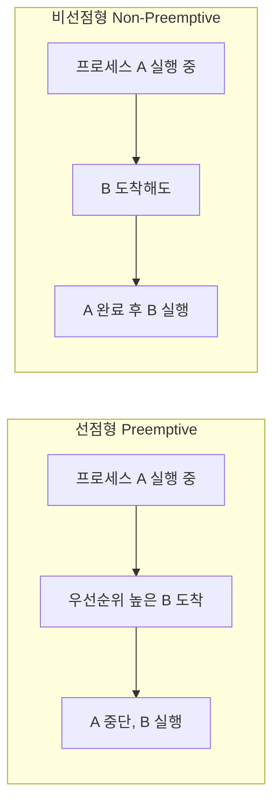
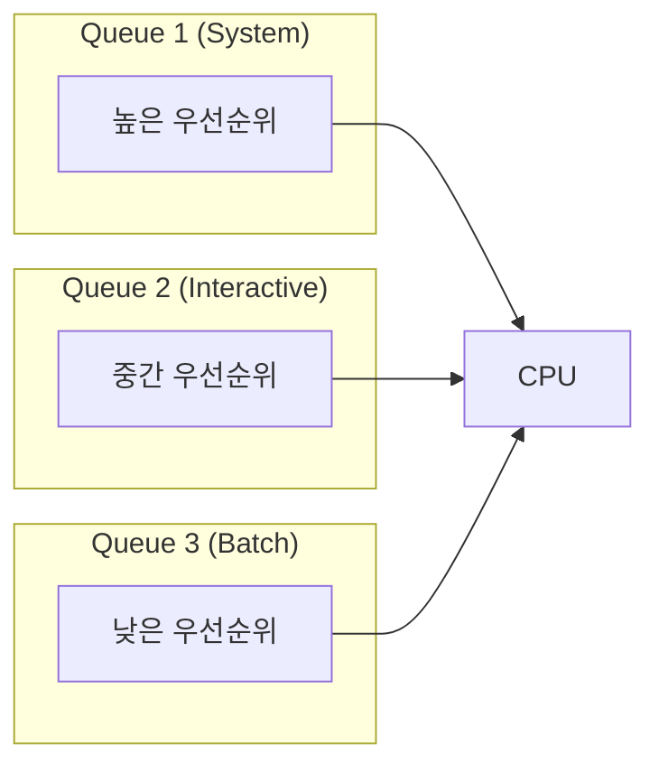
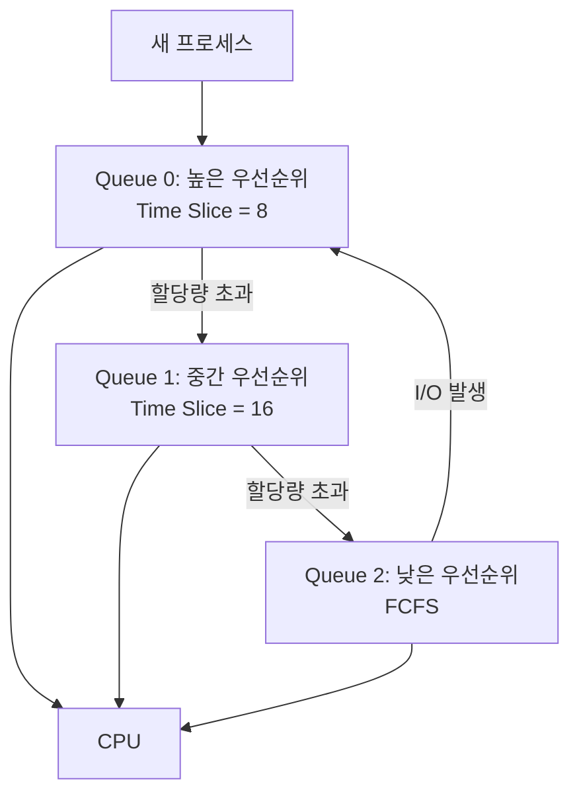

## 🌐 개요 (Overview)

**프로세스 스케줄링**은 CPU 자원을 여러 프로세스에게 효율적으로 배분하기 위한 정책입니다. 스케줄러는 Ready Queue 에서 다음에 실행할 프로세스를 선택합니다.

## 🎯 스케줄링 목표

| 목표 | 설명 |
|------|------|
| **CPU 이용률 (Utilization)** | CPU 를 가능한 한 바쁘게 유지 |
| **처리량 (Throughput)** | 단위 시간당 완료되는 프로세스 수 최대화 |
| **대기 시간 (Waiting Time)** | Ready Queue 에서 대기하는 시간 최소화 |
| **응답 시간 (Response Time)** | 요청 후 첫 응답까지의 시간 최소화 |
| **반환 시간 (Turnaround Time)** | 제출부터 완료까지의 총 시간 최소화 |

## 📊 스케줄링 유형

### 선점형 vs 비선점형



| 구분 | 선점형 (Preemptive) | 비선점형 (Non-Preemptive) |
|------|---------------------|-------------------------|
| **정의** | 실행 중인 프로세스를 강제로 중단 가능 | CPU 를 강제로 빼앗을 수 없음 |
| **응답성** | 빠름 | 느림 |
| **오버헤드** | Context Switch 빈번 | 적음 |
| **적용** | 대화형 시스템, 실시간 시스템 | 일괄 처리 시스템 |

---

## ⚡ 선점형 스케줄링 알고리즘

### 1. RR (Round Robin)

**시분할 시스템(Time Sharing)** 을 위해 고안된 알고리즘입니다.

**동작 방식**:
- 각 프로세스에 **시간 할당량(Time Slice/Quantum)** 부여
- 할당량 동안 실행 후, 완료되지 않으면 Ready Queue 맨 뒤로 이동
- 모든 프로세스가 공평하게 CPU 사용

```mermaid
gantt
    title RR 스케줄링 (Time Slice = 2)
    dateFormat X
    axisFormat %s
    
    section CPU
    P1 :0, 2
    P2 :2, 4
    P3 :4, 6
    P1 :6, 8
    P2 :8, 9
    P1 :9, 10
```



**Time Slice 크기의 영향**:

| Time Slice | 효과 |
|------------|------|
| **너무 큼** | FIFO 와 동일해짐 (긴 대기 시간) |
| **너무 작음** | Context Switch 오버헤드 증가 |
| **적절함** | 일반적으로 10~100ms |

```plaintext
예시: P1(5), P2(3), P3(2) / Time Slice = 2

시간:  0  1  2  3  4  5  6  7  8  9  10
      |P1 |P1 |P2 |P2 |P3 |P3 |P1 |P1 |P2 |P1 |
      
완료 순서: P3(6) → P2(9) → P1(10)
```

### 2. SRT (Shortest Remaining Time)

**남아있는 실행 시간이 가장 짧은** 프로세스에게 CPU 할당. SJF 의 선점형 버전입니다.

**동작 방식**:
- 새 프로세스가 도착하면 남은 시간 비교
- 현재 프로세스보다 짧으면 선점

```plaintext
예시: P1(도착 0, 8) P2(도착 1, 4) P3(도착 2, 2)

시간:  0  1  2  3  4  5  6  7  8  9  10 11 12 13 14
      |P1|P2|P3|P3|P2|P2|P2|P1|P1|P1|P1|P1|P1|P1|

0: P1 시작 (남은 8)
1: P2 도착 (남은 4) → P2로 선점 (P1 남은 7)
2: P3 도착 (남은 2) → P3로 선점 (P2 남은 3)
4: P3 완료, P2 재개
7: P2 완료, P1 재개
14: P1 완료
```

### 3. MLQ (Multi-Level Queue)

프로세스를 **성격에 따라 여러 그룹**으로 나누고, 각 그룹마다 별도의 큐를 둡니다.



**특징**:
- 각 큐는 독립적인 스케줄링 알고리즘 사용 가능
- **큐 간 이동 불가능** (고정 우선순위)
- 상위 큐가 비어야 하위 큐 실행

**큐 분류 예시**:
1. 시스템 프로세스 (최고 우선순위)
2. 대화형 프로세스
3. 대화형 편집 프로세스
4. 일괄 처리 프로세스 (최저 우선순위)

### 4. MFQ (Multi-Level Feedback Queue)

MLQ 를 개선하여 **큐 간 이동이 가능**한 방식입니다.



**동작 방식**:
1. 새 프로세스는 최상위 큐에 삽입
2. 시간 할당량 내 완료하지 못하면 하위 큐로 이동
3. I/O 중심 작업은 상위 큐 유지 (빠른 응답)
4. CPU 중심 작업은 점점 하위 큐로 이동

**장점**:
- 짧은 작업에 우선순위 부여
- I/O 중심 작업의 응답성 향상
- 기아 현상 방지 (에이징 적용 가능)

---

## 🔄 비선점형 스케줄링 알고리즘

### 1. FIFO / FCFS (First Come First Served)

**먼저 도착한 프로세스**를 먼저 처리합니다.

```mermaid
gantt
    title FCFS 스케줄링
    dateFormat X
    axisFormat %s
    
    section CPU
    P1 (24) :0, 24
    P2 (3)  :24, 27
    P3 (3)  :27, 30
```



**특징**:
- 구현이 가장 단순 (FIFO Queue)
- **Convoy Effect**: 긴 프로세스가 앞에 있으면 모두 대기

```plaintext
예시: P1(24), P2(3), P3(3) 순서 도착

평균 대기 시간 = (0 + 24 + 27) / 3 = 17

만약 순서가 P2, P3, P1 이었다면:
평균 대기 시간 = (0 + 3 + 6) / 3 = 3
```

### 2. SJF (Shortest Job First)

**실행 시간이 가장 짧은 작업**을 먼저 처리합니다.

```mermaid
gantt
    title SJF 스케줄링
    dateFormat X
    axisFormat %s
    
    section CPU
    P3 (3)  :0, 3
    P2 (3)  :3, 6
    P1 (24) :6, 30
```



**특징**:
- **평균 대기 시간 최소화** (이론적 최적)
- **기아 현상(Starvation)**: 긴 작업이 무한정 대기할 수 있음
- 실제 실행 시간 예측이 어려움

```plaintext
예시: P1(6), P2(8), P3(7), P4(3)

실행 순서: P4 → P1 → P3 → P2

대기 시간:
P4: 0
P1: 3
P3: 3 + 6 = 9
P2: 9 + 7 = 16

평균 대기 시간 = (0 + 3 + 9 + 16) / 4 = 7
```

### 3. HRN (Highest Response-ratio Next)

SJF 의 **기아 현상을 보완**하기 위해 대기 시간도 함께 고려합니다.

**우선순위 공식**:

$$\text{우선순위} = \frac{\text{대기시간} + \text{서비스시간}}{\text{서비스시간}} = 1 + \frac{\text{대기시간}}{\text{서비스시간}}$$

**특징**:
- 대기 시간이 길수록 우선순위 상승 (에이징 효과)
- 짧은 작업과 오래 기다린 작업 모두 고려

```plaintext
예시: 현재 시간 = 10

프로세스  도착시간  서비스시간  대기시간  우선순위
P1        0         3           10        (10+3)/3 = 4.33
P2        2         6           8         (8+6)/6 = 2.33
P3        4         4           6         (6+4)/4 = 2.5
P4        6         2           4         (4+2)/2 = 3.0

선택: P1 (우선순위 4.33으로 가장 높음)
```

---

## 📊 알고리즘 비교

| 알고리즘 | 유형 | 장점 | 단점 |
|---------|------|------|------|
| **FCFS** | 비선점 | 단순, 공평 | Convoy Effect |
| **SJF** | 비선점 | 평균 대기 최소 | 기아 현상, 예측 어려움 |
| **HRN** | 비선점 | 기아 방지 | 계산 복잡 |
| **RR** | 선점 | 공평, 응답성 | 오버헤드 |
| **SRT** | 선점 | 평균 대기 최소 | 오버헤드, 기아 |
| **MLQ** | 선점 | 차별화된 서비스 | 경직성 |
| **MFQ** | 선점 | 유연성, 적응성 | 복잡 |

## 💡 예제 문제

### 문제 1: 평균 대기 시간 계산 (FCFS)

```plaintext
프로세스  도착시간  서비스시간
P1        0         5
P2        1         3
P3        2         8
P4        3         6

FCFS 순서: P1 → P2 → P3 → P4

완료 시간:
P1: 5 (대기 0)
P2: 5+3=8 (대기 8-1-3=4)
P3: 8+8=16 (대기 16-2-8=6)
P4: 16+6=22 (대기 22-3-6=13)

평균 대기 시간 = (0+4+6+13)/4 = 5.75
```

### 문제 2: SJF vs HRN

```plaintext
현재 시간: 5
프로세스  도착  서비스  대기
P1        0     8       5
P2        1     4       4
P3        2     2       3

SJF: P3 선택 (서비스 시간 2로 최소)

HRN:
P1: (5+8)/8 = 1.625
P2: (4+4)/4 = 2.0
P3: (3+2)/2 = 2.5

HRN: P3 선택 (우선순위 2.5로 최고)

이 경우 SJF와 HRN 결과가 같음
(대기 시간이 더 길면 결과가 달라질 수 있음)
```

## 🔧 Linux 의 스케줄링

### CFS (Completely Fair Scheduler)

Linux 2.6.23 부터 도입된 기본 스케줄러입니다.

```bash
# 프로세스 우선순위 확인
ps -eo pid,ni,pri,comm
# PID  NI PRI COMMAND
# 1    0  20  systemd
# 2   -20 40  kthreadd

# nice 값 변경 (-20 ~ 19)
nice -n 10 ./program        # 낮은 우선순위로 실행
renice -n -5 -p 1234        # 실행 중인 프로세스 우선순위 변경

# 스케줄링 정책 확인
chrt -p 1234
# pid 1234's current scheduling policy: SCHED_OTHER
```

### 스케줄링 정책

| 정책 | 설명 | 용도 |
|------|------|------|
| **SCHED_OTHER** | CFS 기본 정책 | 일반 프로세스 |
| **SCHED_FIFO** | 실시간, 선점 없음 | 실시간 응용 |
| **SCHED_RR** | 실시간, Round Robin | 실시간 응용 |
| **SCHED_BATCH** | 일괄 처리 최적화 | 백그라운드 작업 |
| **SCHED_IDLE** | 최저 우선순위 | 유휴 시간 활용 |

## 🔗 연결 문서 (Related Documents)

- [[process-states-lifecycle]] - 프로세스 상태와 생명주기
- [[deadlock]] - 교착상태와 해결 방법
- [[kernel-structure]] - 운영체제 커널 구조
