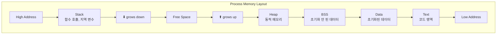
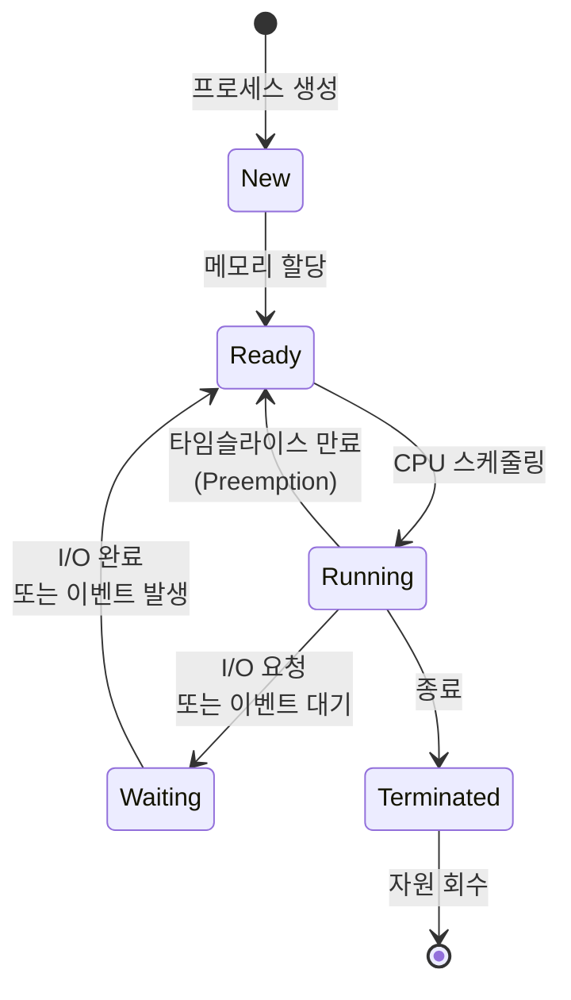
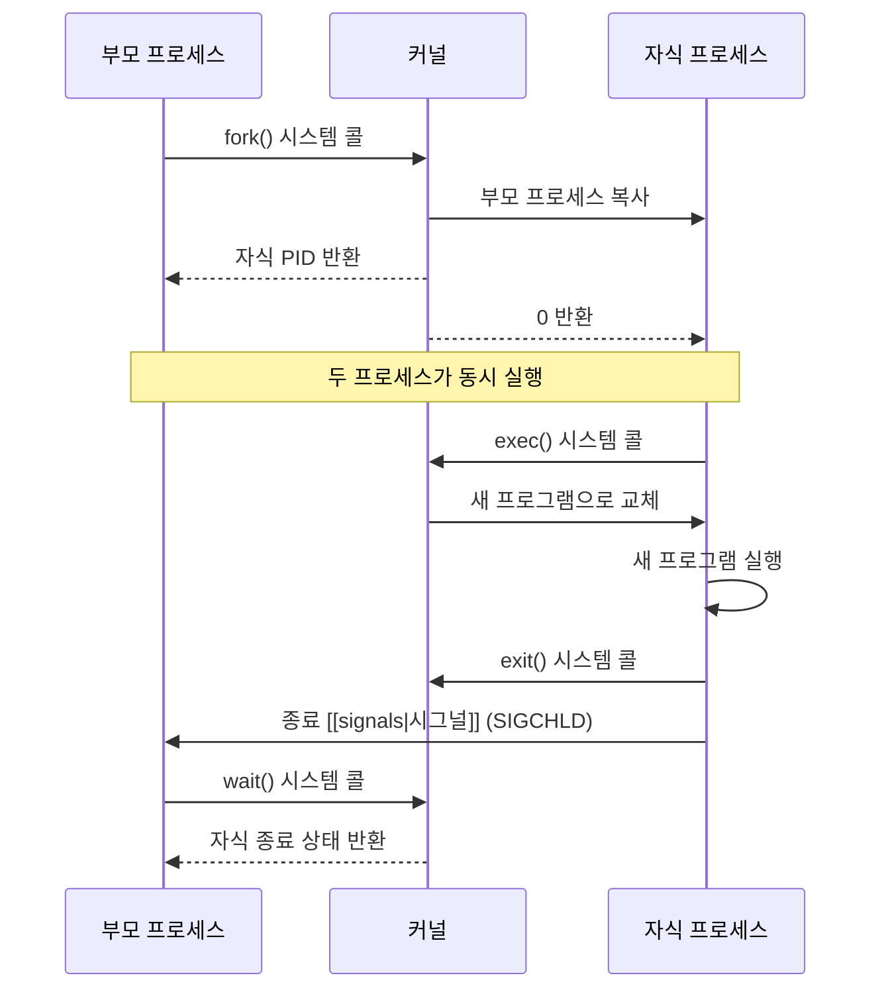

## 🌐 개요 (Overview)

**프로세스(Process)** 는 실행 중인 프로그램의 인스턴스입니다. 프로그램이 디스크에 저장된 정적인 파일이라면, 프로세스는 메모리에 로드되어 실제로 실행되는 동적인 개체입니다.

## 🆚 프로그램 vs 프로세스 (Program vs Process)

| 특성 | 프로그램 | 프로세스 |
|------|----------|----------|
| **상태** | 정적 (Static) | 동적 (Dynamic) |
| **위치** | 디스크 (Disk) | 메모리 (RAM) |
| **생명주기** | 영구적 | 일시적 |
| **리소스** | 코드만 포함 | 코드 + 데이터 + 스택 + 힙 |
| **실행** | 실행 불가 | 실행 중 |

**예시**:
```bash
# /bin/ls는 프로그램 (디스크의 파일)
ls -l /bin/ls

# ls 실행 시 프로세스가 생성됨
ls / &
# [1] 12345  <- 프로세스 ID (PID)
```

## 🏗️ 프로세스 구성 요소 (Process Components)

### 1. 코드 영역 (Text Segment)

- 실행 가능한 기계어 코드
- 읽기 전용 (Read-only)
- 여러 프로세스가 공유 가능

### 2. 데이터 영역 (Data Segment)

- 전역 변수, 정적 변수
- 초기화된 데이터 (Initialized Data)
- 초기화되지 않은 데이터 (BSS - Block Started by Symbol)

### 3. 힙 (Heap)

- 동적 메모리 할당 영역
- `malloc()`, `new` 등으로 할당
- 낮은 주소에서 높은 주소로 증가

### 4. 스택 (Stack)

- 함수 호출 정보, 지역 변수
- 높은 주소에서 낮은 주소로 증가
- LIFO (Last In First Out) 구조



### 5. PCB (Process Control Block)

[[kernel|커널]] 이 프로세스를 관리하기 위해 유지하는 자료구조:

- **PID (Process ID)**: 프로세스 고유 식별자
- **PPID (Parent Process ID)**: 부모 프로세스 ID
- **프로세스 상태**: Running, Sleeping, Zombie 등
- **프로그램 카운터 (PC)**: 다음 실행할 명령어 주소
- **CPU 레지스터**: 컨텍스트 스위칭 시 저장
- **메모리 관리 정보**: 페이지 테이블, 세그먼트 테이블
- **I/O 상태 정보**: 열린 파일 디스크립터, I/O 디바이스
- **자원 사용량**: CPU 시간, 메모리 사용량

## 🔄 프로세스 상태 (Process States)

### 상태 전이도 (State Transition Diagram)



### 주요 상태 설명

#### 1. New (생성)

- 프로세스가 막 생성된 상태
- 아직 메모리에 로드되지 않음
- PCB 가 생성됨

#### 2. Ready (준비)

- 실행 준비가 완료된 상태
- CPU 만 할당받으면 즉시 실행 가능
- 스케줄러의 준비 큐(Ready Queue)에 대기

#### 3. Running (실행)

- CPU 를 할당받아 실제로 실행 중
- 단일 코어에서는 한 번에 1 개 프로세스만 Running
- 멀티코어에서는 코어 개수만큼 동시 Running 가능

#### 4. Waiting (대기) = Blocked

- I/O 완료, 이벤트 발생 등을 기다리는 상태
- CPU 를 주어도 실행 불가
- **Interruptible Sleep (S)**: 시그널로 깨울 수 있음
- **Uninterruptible Sleep (D)**: 시그널로 깨울 수 없음 (디스크 I/O 등)

#### 5. Terminated (종료)

- 실행이 완료되어 종료된 상태
- 아직 PCB 는 존재 (부모가 종료 상태 수집 전)
- **Zombie (Z)**: 종료되었지만 부모가 회수하지 않은 상태

### Linux 에서의 추가 상태

#### Stopped (T)

- 실행이 중지된 상태
- `Ctrl+Z` 또는 SIGSTOP 시그널로 전환
- SIGCONT 시그널로 재개 가능

#### Zombie (Z)

- 프로세스는 종료되었지만 부모가 종료 코드를 읽지 않음
- 메모리는 해제되었지만 PCB 는 남아있음
- `ps aux` 에서 `<defunct>` 로 표시

```bash
# 좀비 프로세스 확인
ps aux | grep 'Z'
# USER   PID  %CPU %MEM  VSZ  RSS TTY  STAT START TIME COMMAND
# user   1234  0.0  0.0    0    0 ?    Z    00:00 0:00 [defunct]
```

## ⚙️ 프로세스 생성 (Process Creation)

### Unix/Linux 의 fork-exec 모델



### fork() 시스템 콜

```c
#include <unistd.h>
#include <stdio.h>

int main() {
    pid_t pid = fork();
    
    if (pid == 0) {
        // 자식 프로세스
        printf("Child process: PID = %d, PPID = %d\n", 
               getpid(), getppid());
    } else if (pid > 0) {
        // 부모 프로세스
        printf("Parent process: PID = %d, Child PID = %d\n", 
               getpid(), pid);
    } else {
        // fork 실패
        perror("fork failed");
    }
    
    return 0;
}
```

### exec() 계열 함수

```c
// exec()는 현재 프로세스를 새 프로그램으로 교체
execl("/bin/ls", "ls", "-l", NULL);
// 이 줄은 실행되지 않음 (exec 성공 시)
printf("This won't be printed\n");
```

## 🔚 프로세스 종료 (Process Termination)

### 정상 종료

1. **exit() 시스템 콜**: 프로그램에서 명시적 호출
2. **return from main**: `main()` 함수에서 반환
3. **모든 스레드 종료**: 마지막 스레드가 종료될 때

### 비정상 종료

1. **시그널에 의한 종료**: SIGKILL, SIGTERM 등
2. **예외 발생**: Segmentation Fault, Divide by Zero 등
3. **부모 프로세스 종료**: 고아 프로세스는 init(PID 1)에 입양됨

### 좀비와 고아 프로세스

#### 좀비 프로세스 (Zombie Process)

```c
// 부모가 wait()를 호출하지 않으면 자식은 좀비가 됨
if (fork() == 0) {
    exit(0);  // 자식 종료
}
// 부모가 wait() 없이 계속 실행
while(1) sleep(1);  // 자식은 좀비 상태로 남음
```

**해결 방법**:

```c
#include <sys/wait.h>

// 방법 1: wait() 호출
wait(NULL);

// 방법 2: SIGCHLD 시그널 무시
signal(SIGCHLD, SIG_IGN);

// 방법 3: 시그널 핸들러에서 waitpid() 호출
void sigchld_handler(int sig) {
    while (waitpid(-1, NULL, WNOHANG) > 0);
}
signal(SIGCHLD, sigchld_handler);
```

#### 고아 프로세스 (Orphan Process)

```c
if (fork() == 0) {
    sleep(10);  // 자식이 대기
    printf("PPID: %d\n", getppid());  // init(1)이 부모가 됨
} else {
    exit(0);  // 부모가 먼저 종료
}
```

## 🔀 프로세스 vs 스레드 (Process vs Thread)

| 특성 | 프로세스 | 스레드 |
|------|----------|--------|
| **메모리** | 독립적 | 공유 (코드, 데이터, 힙) |
| **생성 비용** | 높음 (fork) | 낮음 |
| **통신** | [[ipc-mechanisms\|IPC]] 필요 | 공유 메모리로 쉬움 |
| **안정성** | 격리됨 (충돌 시 다른 프로세스 영향 없음) | 한 스레드 충돌 시 전체 프로세스 종료 |
| **컨텍스트 스위칭** | 느림 (페이지 테이블 교체) | 빠름 |

## 💡 실무 활용 (Practical Usage)

### 프로세스 정보 확인

```bash
# 프로세스 상태 확인
ps aux | grep process_name

# 프로세스 트리 보기
pstree -p

# /proc을 통한 상세 정보
cat /proc/PID/status
cat /proc/PID/cmdline
ls -l /proc/PID/fd/  # 열린 파일 디스크립터
```

### 프로세스 우선순위

```bash
# nice 값으로 우선순위 조정 (-20: 높음, 19: 낮음)
nice -n 10 ./process
renice 5 -p PID
```

## 🔗 연결 문서 (Related Documents)

- [[signals]] - 프로세스 간 통신과 제어를 위한 시그널
- [[ipc-mechanisms]] - 프로세스 간 통신 메커니즘
- [[kernel]] - 커널의 프로세스 스케줄링
- [[boot-sequence]] - init 프로세스와 부팅 과정
