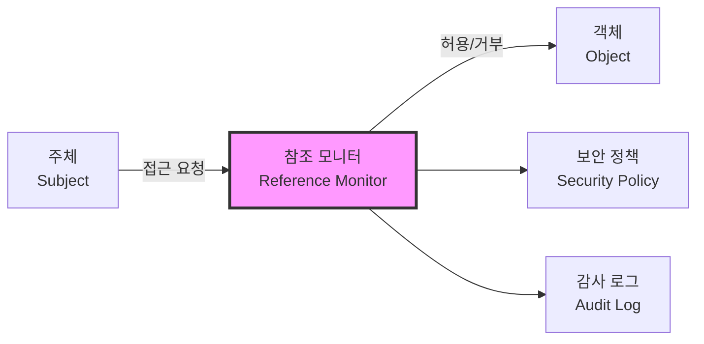
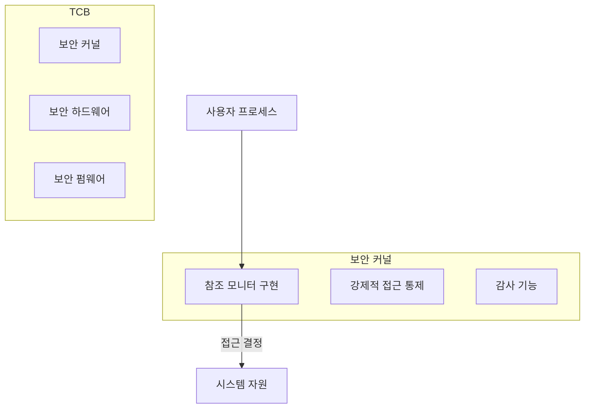

## 🌐 개요 (Overview)

**참조 모니터(Reference Monitor)** 와 **TCB(Trusted Computing Base)** 는 보안 운영체제의 핵심 이론입니다. 참조 모니터는 모든 접근을 중재하는 추상적 개념이고, TCB는 이를 실제로 구현하는 시스템의 신뢰 기반입니다.

---

## 🔐 참조 모니터 (Reference Monitor)

### 정의

**주체(Subject)와 객체(Object) 사이의 모든 접근 요청을 중재**하는 추상 머신입니다. 보안 정책의 집행 지점으로 작동합니다.



**용어 정의**:
- **주체 (Subject)**: 자원에 접근하려는 능동적 개체 (사용자, 프로세스)
- **객체 (Object)**: 접근 대상이 되는 수동적 개체 (파일, 메모리, 포트)
- **접근 (Access)**: 읽기, 쓰기, 실행 등의 작업

### 참조 모니터의 3 대 요건

| 요건 | 설명 | 목적 |
|------|------|------|
| **격리성 (Isolation)** | 참조 모니터 자체는 위변조로부터 보호 | 부정 조작 방지 |
| **검증 가능성 (Verifiability)** | 구현이 작고 단순하여 무결성 검증 가능 | 신뢰성 확보 |
| **완전성 (Completeness)** | 우회 불가능, 모든 접근을 검사 | 보안 공백 방지 |

### 보안 커널 (Security Kernel)

참조 모니터 개념을 **실제로 구현**한 커널 수준의 메커니즘입니다.



---

## 🏗️ TCB (Trusted Computing Base)

### 정의

**신뢰 컴퓨팅 기반**으로, 시스템 보안을 담당하는 모든 하드웨어, 펌웨어, 소프트웨어의 총체입니다.

```plaintext
TCB 구성 요소:
├── 하드웨어
│   ├── CPU (보호 링, 특권 모드)
│   ├── 메모리 보호 장치
│   └── TPM (Trusted Platform Module)
├── 펌웨어
│   ├── BIOS/UEFI
│   └── 부트로더
└── 소프트웨어
    ├── 보안 커널
    ├── 참조 모니터
    └── 인증 모듈
```

### TCB 의 특성

- **최소화**: TCB 크기가 작을수록 검증과 보안이 용이
- **격리**: TCB 는 일반 소프트웨어로부터 보호
- **검증**: 모든 TCB 구성 요소는 검증되어야 함

---

## 💡 참조 모니터 vs 보안 커널

| 측면 | 참조 모니터 | 보안 커널 |
|------|-----------|---------|
| **특성** | 추상적 개념 | 구체적 구현 |
| **역할** | 접근 통제 이론 모델 | 이론을 실현하는 소프트웨어 |
| **검증** | 이론적 증명 | 구현 코드 검증 필요 |
| **예시** | 개념적 정의 | Windows SRM, SELinux |

---

## 🔗 연결 문서 (Related Documents)

- [tpm-hardware-security](tpm-hardware-security.md) - TPM 하드웨어 보안
- [windows-security-subsystem](windows-security-subsystem.md) - Windows 보안 서브시스템
- [kernel-structure](kernel-structure.md) - 커널 구조와 Dual Mode
