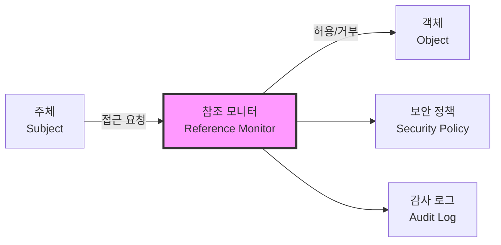
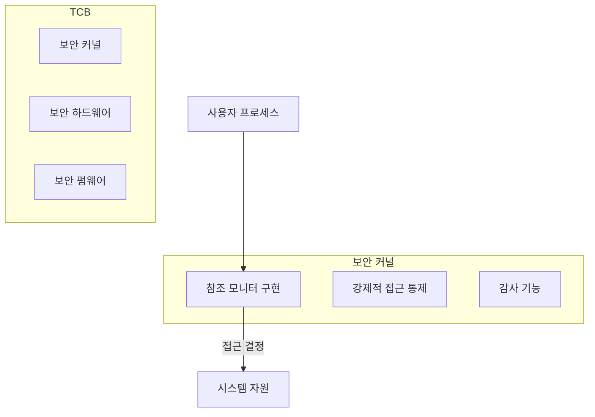
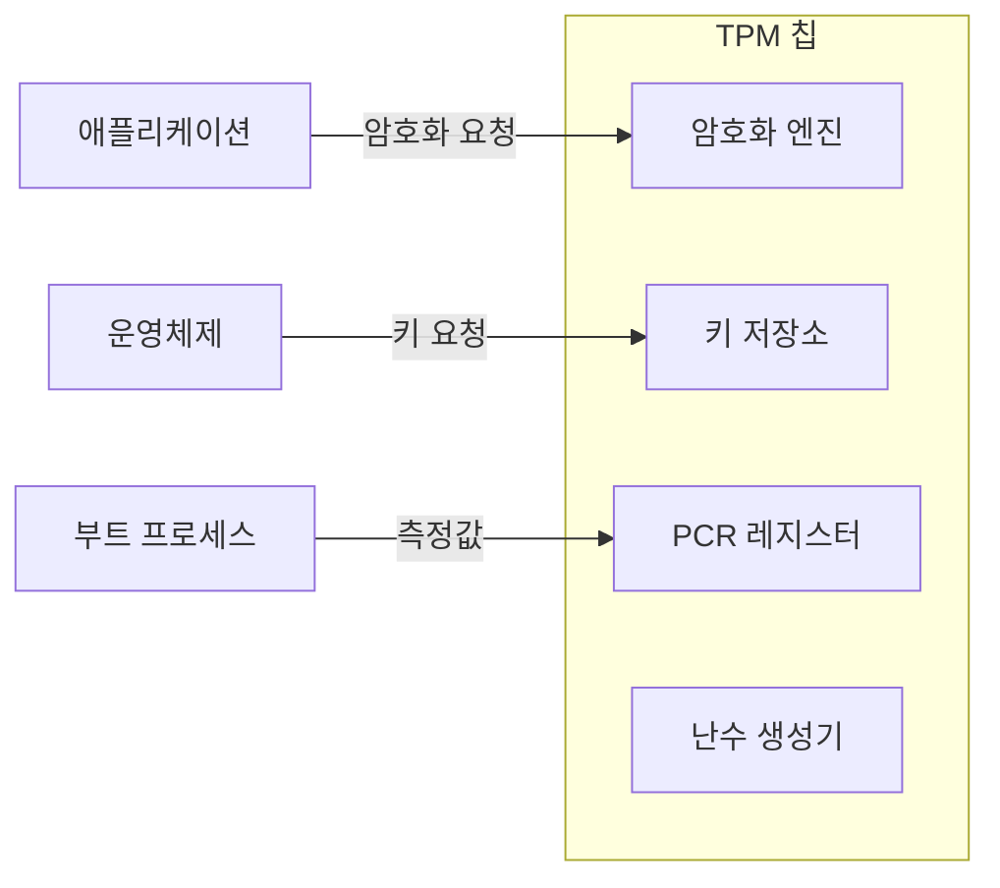
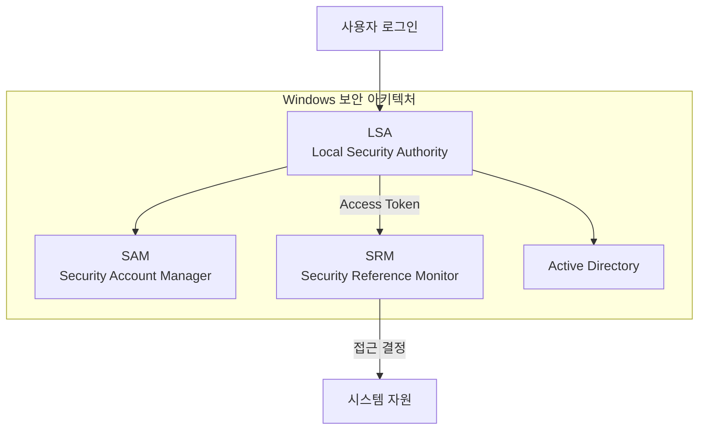

## 🌐 개요 (Overview)

**보안 운영체제(Secure OS)** 는 기존 운영체제의 보안 취약점(root 권한 집중, 취약한 패스워드 등)을 보완하기 위해 **커널 수준에서 보안 기능을 강화**한 운영체제입니다.

## 🎯 보안 운영체제의 필요성

### 기존 OS의 보안 취약점

| 취약점 | 설명 |
|--------|------|
| **root 권한 집중** | 하나의 계정이 모든 권한 보유 |
| **DAC 한계** | 소유자가 권한 임의 변경 가능 |
| **취약한 인증** | 패스워드 기반 인증의 한계 |
| **커널 취약점** | 커널 버그 시 전체 시스템 침해 |

### 보안 OS의 목표

1. **최소 권한 원칙**: 필요한 최소 권한만 부여
2. **강제적 접근 통제 (MAC)**: 시스템 정책에 의한 접근 제어
3. **감사 (Audit)**: 모든 보안 관련 활동 기록
4. **무결성 보장**: 시스템 및 데이터 변조 방지

---

## 🔐 참조 모니터 (Reference Monitor)

### 정의

Secure OS의 핵심 이론으로, **주체(Subject)와 객체(Object) 사이의 모든 접근 요청을 중재**하는 추상 머신입니다.



**용어 정의**:
- **주체 (Subject)**: 자원에 접근하려는 능동적 개체 (사용자, 프로세스)
- **객체 (Object)**: 접근 대상이 되는 수동적 개체 (파일, 메모리, 포트)
- **접근 (Access)**: 읽기, 쓰기, 실행 등의 작업

### 참조 모니터의 3대 요건

| 요건 | 설명 | 목적 |
|------|------|------|
| **격리성 (Isolation)** | 참조 모니터 자체는 위변조로부터 보호 | 부정 조작 방지 |
| **검증 가능성 (Verifiability)** | 구현이 작고 단순하여 무결성 검증 가능 | 신뢰성 확보 |
| **완전성 (Completeness)** | 우회 불가능, 모든 접근을 검사 | 보안 공백 방지 |

### 보안 커널 (Security Kernel)

참조 모니터 개념을 **실제로 구현**한 커널 수준의 메커니즘입니다.



---

## 🏗️ TCB (Trusted Computing Base)

### 정의

**신뢰 컴퓨팅 기반**으로, 시스템 보안을 담당하는 모든 하드웨어, 펌웨어, 소프트웨어의 총체입니다.

```plaintext
TCB 구성 요소:
├── 하드웨어
│   ├── CPU (보호 링, 특권 모드)
│   ├── 메모리 보호 장치
│   └── TPM (Trusted Platform Module)
├── 펌웨어
│   ├── BIOS/UEFI
│   └── 부트로더
└── 소프트웨어
    ├── 보안 커널
    ├── 참조 모니터
    └── 인증 모듈
```

### TCB의 특성

- **최소화**: TCB 크기가 작을수록 검증과 보안이 용이
- **격리**: TCB는 일반 소프트웨어로부터 보호
- **검증**: 모든 TCB 구성 요소는 검증되어야 함

---

## 💻 TPM (Trusted Platform Module)

### 정의

**하드웨어 기반의 보안 모듈**로, 암호화 키 생성/저장, 시스템 무결성 검증 등을 수행합니다.



### TPM의 주요 기능

| 기능 | 설명 |
|------|------|
| **키 생성/저장** | 하드웨어 내부에서 암호화 키 관리 |
| **시스템 무결성 측정** | 부팅 과정의 각 단계를 해시로 기록 |
| **봉인 (Sealing)** | 특정 시스템 상태에서만 데이터 복호화 |
| **원격 증명 (Remote Attestation)** | 시스템 상태를 원격으로 증명 |

### PCR (Platform Configuration Register)

```plaintext
PCR 레지스터: 부팅 과정의 무결성 측정값 저장

PCR[0]: BIOS 측정값
PCR[1]: BIOS 설정
PCR[2]: 옵션 ROM
PCR[4]: MBR/부트로더
PCR[5]: MBR 설정
...

부팅 시 각 단계가 다음 단계를 측정 → 신뢰 체인(Chain of Trust)
```

```bash
# Linux에서 TPM 확인
ls /dev/tpm*
# /dev/tpm0

# TPM 정보 확인
tpm2_getcap properties-fixed

# PCR 값 읽기
tpm2_pcrread
```

---

## 🪟 Windows 보안 구조

### 주요 보안 구성 요소



### 1. SAM (Security Account Manager)

**사용자 계정 및 암호화된 해시 값**을 저장하는 데이터베이스입니다.

```plaintext
위치: %SystemRoot%\System32\config\SAM

저장 내용:
- 로컬 사용자 계정
- 해시된 패스워드 (NTLM 또는 NTLMv2)
- 계정 정책

보안:
- 시스템 실행 중 접근 불가 (잠금)
- SYSKEY로 추가 암호화 (구버전)
```

**공격 시나리오**:
```plaintext
1. 오프라인 공격: 부팅 미디어로 SAM 파일 복사
2. mimikatz: 메모리에서 해시 추출
3. Pass-the-Hash: 해시만으로 인증 우회

방어:
- Credential Guard (Windows 10+)
- BitLocker로 디스크 암호화
```

### 2. LSA (Local Security Authority)

**로컬 보안 정책을 관리하고 사용자 인증**을 처리합니다.

```plaintext
역할:
- 로그인 인증 처리
- Access Token 생성
- 보안 정책 적용
- 감사 로그 생성

프로세스: lsass.exe (매우 중요, 공격 대상)
```

### 3. SRM (Security Reference Monitor)

**사용자의 자원 접근 허용 여부를 결정**하는 커널 모듈입니다. 참조 모니터 개념의 Windows 구현체입니다.

```plaintext
동작:
1. 프로세스가 객체(파일 등)에 접근 시도
2. SRM이 Access Token과 ACL 비교
3. 접근 허용 또는 거부 결정

Access Token 내용:
- 사용자 SID
- 그룹 SID
- 권한 (Privileges)
- 무결성 레벨 (Integrity Level)
```

### 4. BitLocker

**디스크 볼륨 전체를 암호화**하는 기능입니다.

```plaintext
보호 대상:
- 시스템 드라이브
- 데이터 드라이브
- 이동식 드라이브 (BitLocker To Go)

인증 방법:
- TPM만
- TPM + PIN
- TPM + USB 키
- 패스워드 (외장 드라이브)
```

```powershell
# BitLocker 상태 확인
manage-bde -status

# BitLocker 활성화
Enable-BitLocker -MountPoint "C:" -EncryptionMethod XtsAes256 -UsedSpaceOnly -TpmProtector

# 복구 키 백업
manage-bde -protectors -get C:
```

---

## 📋 Windows 이벤트 로그

### 이벤트 뷰어 (Event Viewer)

Windows는 **이벤트 뷰어(eventvwr.msc)** 를 통해 로그를 관리합니다.

```powershell
# 이벤트 뷰어 실행
eventvwr.msc
```

### 주요 로그 유형

| 로그 | 설명 | 주요 이벤트 |
|------|------|------------|
| **Application** | 애플리케이션 오류/이벤트 | 앱 충돌, 오류 |
| **System** | OS 구성 요소 이벤트 | 드라이버 로드, 부팅 |
| **Security** | 보안 감사 이벤트 | 로그인, 권한 변경 |
| **Setup** | 설치 관련 | Windows 업데이트 |

### 주요 보안 이벤트 ID

| 이벤트 ID | 설명 |
|----------|------|
| **4624** | 로그인 성공 |
| **4625** | 로그인 실패 |
| **4634** | 로그오프 |
| **4648** | 명시적 자격 증명 로그인 |
| **4672** | 특수 권한 할당 (admin) |
| **4720** | 계정 생성 |
| **4726** | 계정 삭제 |
| **4732** | 그룹에 멤버 추가 |
| **4756** | 보안 그룹에 멤버 추가 |

```powershell
# PowerShell로 보안 이벤트 조회
Get-EventLog -LogName Security -Newest 100 | Where-Object {$_.EventID -eq 4625}

# 로그인 실패 이벤트
Get-WinEvent -FilterHashtable @{LogName='Security'; ID=4625} -MaxEvents 50
```

---

## 🔗 접근 통제 모델

### DAC (Discretionary Access Control)

**소유자가 임의로 권한을 부여**할 수 있는 방식입니다.

```plaintext
특징:
- 소유자가 권한 결정
- 유연하지만 보안 취약
- Linux 기본 권한, Windows ACL

예: chmod, chown
```

### MAC (Mandatory Access Control)

**시스템 정책에 의해 강제로 접근을 통제**하는 방식입니다.

```plaintext
특징:
- 관리자가 정책 설정
- 사용자가 변경 불가
- 군사/정부 시스템에 사용

예: SELinux, AppArmor
```

```bash
# SELinux 상태 확인
getenforce
# Enforcing

# SELinux 컨텍스트 확인
ls -Z /etc/passwd
# system_u:object_r:passwd_file_t:s0 /etc/passwd
```

### RBAC (Role-Based Access Control)

**역할(Role)에 따라 권한을 부여**하는 방식입니다.

```plaintext
구조:
사용자 → 역할 → 권한

예:
- 개발자 역할 → 소스코드 읽기/쓰기
- 운영자 역할 → 서버 재시작, 로그 조회
- 감사자 역할 → 로그 조회만 가능
```

---

## 💡 실무 적용

### Linux 보안 강화

```bash
# 1. SELinux 활성화
setenforce 1
sed -i 's/SELINUX=disabled/SELINUX=enforcing/' /etc/selinux/config

# 2. 불필요한 SetUID 제거
find / -perm -4000 -type f -exec ls -la {} \;

# 3. 패스워드 정책 강화
vi /etc/login.defs
# PASS_MAX_DAYS 90
# PASS_MIN_DAYS 7
# PASS_MIN_LEN 12

# 4. SSH 강화
vi /etc/ssh/sshd_config
# PermitRootLogin no
# PasswordAuthentication no
```

### Windows 보안 강화

```powershell
# 1. BitLocker 활성화
Enable-BitLocker -MountPoint "C:"

# 2. Credential Guard 활성화 (Hyper-V 필요)
Enable-WindowsOptionalFeature -Online -FeatureName Microsoft-Hyper-V-All
# 그룹 정책에서 활성화

# 3. 감사 정책 설정
auditpol /set /category:"Logon/Logoff" /success:enable /failure:enable

# 4. Windows Defender 확인
Get-MpComputerStatus
```

## 🔗 연결 문서 (Related Documents)

- [[kernel-structure]] - 커널 구조와 Dual Mode
- [[selinux]] - SELinux 상세 설명
- [[linux-account-security]] - Linux 계정 보안
- [[linux-log-management]] - Linux 로그 관리
