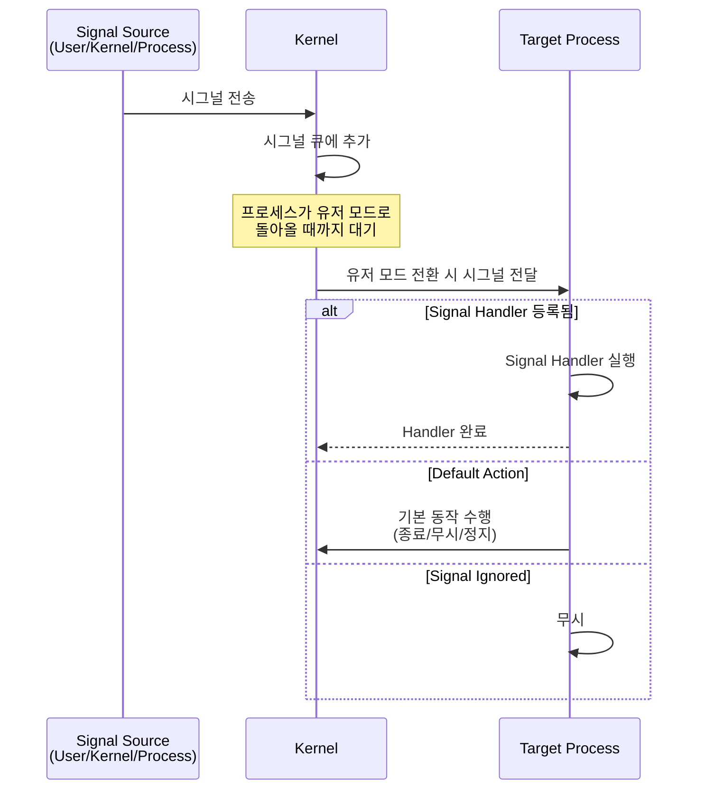

## 🌐 개요 (Overview)

**Signal (시그널)** 은 Unix/Linux에서 [[process-states-lifecycle|프로세스]]에게 이벤트가 발생했음을 알리는 소프트웨어 인터럽트입니다. 키보드 입력(Ctrl+C), 프로그램 오류(Segmentation Fault), 타이머 만료 등 다양한 상황에서 발생합니다.

## 🎯 시그널의 목적 (Purpose)

1. **비동기 이벤트 통지**: 프로세스가 poll 하지 않아도 이벤트 알림
2. **프로세스 제어**: 일시정지, 재개, 종료 등
3. **에러 처리**: 프로그램 오류 상황 처리
4. **[[ipc-mechanisms|프로세스 간 통신]]**: 단순한 메시지 전달

## 📋 주요 시그널 목록 (Common Signals)

### 사용자 유발 시그널

| 시그널 | 번호 | 기본 동작 | 설명 | 발생 조건 |
|--------|------|-----------|------|-----------|
| **SIGINT** | 2 | 종료 | Interrupt | Ctrl+C |
| **SIGQUIT** | 3 | 종료 + 코어덤프 | Quit | Ctrl+\\ |
| **SIGTSTP** | 20 | 정지 | Terminal Stop | Ctrl+Z |

### 프로세스 관리 시그널

| 시그널 | 번호 | 기본 동작 | 설명 | 차단 가능 |
|--------|------|-----------|------|-----------|
| **SIGTERM** | 15 | 종료 | Termination (정상 종료 요청) | ✅ |
| **SIGKILL** | 9 | 즉시 종료 | Kill (강제 종료) | ❌ |
| **SIGSTOP** | 19 | 즉시 정지 | Stop | ❌ |
| **SIGCONT** | 18 | 재개 | Continue | - |

### 시스템 이벤트 시그널

| 시그널 | 번호 | 기본 동작 | 설명 |
|--------|------|-----------|------|
| **SIGHUP** | 1 | 종료 | Hangup (터미널 종료, 설정 다시 로드) |
| **SIGCHLD** | 17 | 무시 | Child process 종료 또는 정지 |
| **SIGALRM** | 14 | 종료 | Alarm clock (타이머 만료) |
| **SIGPIPE** | 13 | 종료 | Broken pipe (읽는 쪽 없이 파이프에 쓰기) |

### 프로그램 오류 시그널

| 시그널 | 번호 | 기본 동작 | 설명 |
|--------|------|-----------|------|
| **SIGSEGV** | 11 | 종료 + 코어덤프 | Segmentation Fault (잘못된 메모리 접근) |
| **SIGFPE** | 8 | 종료 + 코어덤프 | Floating Point Exception (0으로 나누기 등) |
| **SIGILL** | 4 | 종료 + 코어덤프 | Illegal Instruction |
| **SIGBUS** | 7 | 종료 + 코어덤프 | Bus Error (정렬되지 않은 메모리 접근) |

### 시그널 확인

```bash
# 모든 시그널 목록
kill -l

# 시그널 매뉴얼
man 7 signal
```

## 🔄 시그널 처리 과정 (Signal Handling Process)



## 🛠️ 시그널 처리 방법 (Signal Handling)

### 1. 기본 동작 (Default Action)

시그널 핸들러를 등록하지 않으면 기본 동작 수행:
- **Term**: 프로세스 종료
- **Ign**: 시그널 무시
- **Core**: 코어 덤프 생성 후 종료
- **Stop**: 프로세스 정지
- **Cont**: 정지된 프로세스 재개

### 2. 시그널 무시 (Ignore)

```c
#include <signal.h>

// SIGINT 무시
signal(SIGINT, SIG_IGN);

// 이제 Ctrl+C를 눌러도 종료되지 않음
while(1) {
    sleep(1);
}
```

### 3. 커스텀 핸들러 (Custom Handler)

#### signal() 함수 (간단, 구식)

```c
#include <signal.h>
#include <stdio.h>
#include <unistd.h>

void sigint_handler(int signum) {
    printf("Caught SIGINT (Ctrl+C)\n");
    // 시그널 핸들러는 재진입 가능해야 함!
}

int main() {
    signal(SIGINT, sigint_handler);
    
    printf("Press Ctrl+C to test signal handler\n");
    while(1) {
        sleep(1);
    }
    
    return 0;
}
```

#### sigaction() 함수 (권장, POSIX 표준)

```c
#include <signal.h>
#include <stdio.h>
#include <string.h>

void sigint_handler(int signum, siginfo_t *info, void *context) {
    printf("Caught SIGINT from PID: %d\n", info->si_pid);
}

int main() {
    struct sigaction sa;
    memset(&sa, 0, sizeof(sa));
    
    sa.sa_sigaction = sigint_handler;
    sa.sa_flags = SA_SIGINFO;  // siginfo_t 사용
    sigemptyset(&sa.sa_mask);  // 핸들러 실행 중 차단할 시그널 없음
    
    sigaction(SIGINT, &sa, NULL);
    
    while(1) sleep(1);
    return 0;
}
```

## 📤 시그널 전송 (Sending Signals)

### kill 명령어

```bash
# SIGTERM (15) 전송 (기본값)
kill PID

# SIGKILL (9) 전송 (강제 종료)
kill -9 PID
kill -KILL PID

# SIGHUP (1) 전송 (설정 다시 로드)
kill -HUP PID

# 자신에게 시그널 전송
kill -USR1 $$  # $$ = 현재 셸의 PID
```

### killall / pkill

```bash
# 프로세스 이름으로 시그널 전송
killall -9 firefox
pkill -TERM httpd

# 사용자의 모든 프로세스 종료
pkill -u username
```

### 프로그램에서 시그널 전송

```c
#include <signal.h>
#include <sys/types.h>

// 특정 프로세스에게 시그널 전송
kill(pid, SIGTERM);

// 자기 자신에게 시그널 전송
raise(SIGINT);  // = kill(getpid(), SIGINT)

// 프로세스 그룹에 시그널 전송
killpg(pgid, SIGTERM);
```

## 🎭 시그널 마스킹 (Signal Masking)

### 시그널 차단 (Block)

특정 시그널을 일시적으로 차단하여 나중에 처리:

```c
#include <signal.h>

sigset_t set, oldset;

// 시그널 집합 초기화
sigemptyset(&set);
sigaddset(&set, SIGINT);
sigaddset(&set, SIGTERM);

// 시그널 차단
sigprocmask(SIG_BLOCK, &set, &oldset);

// 임계 영역 (Critical Section)
// 이 구간에서는 SIGINT, SIGTERM이 전달되지 않음
// ...

// 시그널 차단 해제
sigprocmask(SIG_SETMASK, &oldset, NULL);
```

### 보류된 시그널 확인

```c
sigset_t pending;
sigpending(&pending);

if (sigismember(&pending, SIGINT)) {
    printf("SIGINT is pending\n");
}
```

## ⚠️ 시그널 핸들러 주의사항 (Handler Caveats)

### 재진입 안전성 (Reentrancy)

시그널 핸들러는 언제든지 실행될 수 있으므로 **재진입 안전(Reentrant)** 함수만 사용해야 합니다.

**안전한 함수**:
- `write()`, `_exit()`, `signal()`, `sigaction()`
- 대부분의 시스템 콜

**위험한 함수**:
- `printf()`, `malloc()`, `free()` (내부적으로 락 사용)
- 전역 변수 수정

```c
// ❌ 위험한 코드
void bad_handler(int sig) {
    printf("Signal received\n");  // printf는 재진입 안전하지 않음
}

// ✅ 안전한 코드
volatile sig_atomic_t signal_received = 0;

void safe_handler(int sig) {
    signal_received = 1;  // sig_atomic_t만 수정
}

int main() {
    signal(SIGINT, safe_handler);
    
    while(1) {
        if (signal_received) {
            write(STDOUT_FILENO, "Signal received\n", 16);
            signal_received = 0;
        }
    }
}
```

## 💡 실무 활용 예시 (Practical Examples)

### 1. 우아한 종료 (Graceful Shutdown)

```c
volatile sig_atomic_t keep_running = 1;

void sigterm_handler(int sig) {
    keep_running = 0;
}

int main() {
    signal(SIGTERM, sigterm_handler);
    signal(SIGINT, sigterm_handler);
    
    while (keep_running) {
        // 작업 수행
        process_data();
    }
    
    // 정리 작업
    cleanup();
    return 0;
}
```

### 2. 데몬 프로세스의 설정 다시 로드

```bash
# nginx 예시
# SIGHUP: 설정 파일 다시 로드
sudo kill -HUP $(cat /var/run/nginx.pid)

# SIGUSR1: 로그 파일 로테이션
sudo kill -USR1 $(cat /var/run/nginx.pid)
```

### 3. 자식 프로세스 회수

```c
#include <sys/wait.h>

void sigchld_handler(int sig) {
    // 모든 종료된 자식 프로세스 회수 (좀비 방지)
    while (waitpid(-1, NULL, WNOHANG) > 0);
}

int main() {
    struct sigaction sa;
    sa.sa_handler = sigchld_handler;
    sa.sa_flags = SA_RESTART | SA_NOCLDSTOP;
    sigemptyset(&sa.sa_mask);
    sigaction(SIGCHLD, &sa, NULL);
    
    // fork() 호출...
}
```

### 4. 타임아웃 구현

```c
#include <signal.h>
#include <unistd.h>

void alarm_handler(int sig) {
    printf("Timeout!\n");
    exit(1);
}

int main() {
    signal(SIGALRM, alarm_handler);
    
    alarm(5);  // 5초 타이머 설정
    
    // 오래 걸리는 작업
    slow_operation();
    
    alarm(0);  // 타이머 취소
    return 0;
}
```

## 🚫 차단 불가능한 시그널 (Uncatchable Signals)

**SIGKILL (9)** 과 **SIGSTOP (19)** 은 핸들러를 등록하거나 무시할 수 없습니다.

**이유**: [[kernel|커널]]이 프로세스를 강제로 제어할 수단이 필요
- **SIGKILL**: 무조건 종료 (무한 루프 프로세스 강제 종료)
- **SIGSTOP**: 무조건 정지 (디버깅, 작업 제어)

```bash
# 아무리 견고한 프로그램도 SIGKILL로 종료 가능
kill -9 PID
```

## 🔗 연결 문서 (Related Documents)

- [[process-states-lifecycle]] - 프로세스 상태와 시그널의 영향
- [[ipc-mechanisms]] - 시그널 외의 프로세스 간 통신 방법
- [[kernel]] - 커널의 시그널 처리 메커니즘