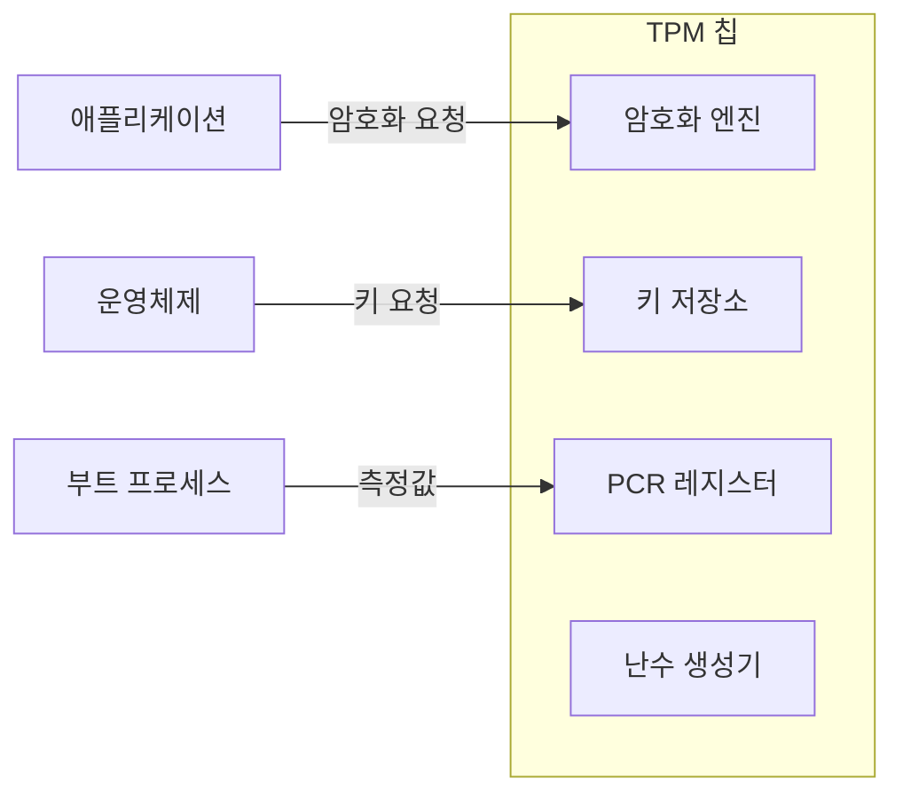

## 🌐 개요 (Overview)

**TPM (Trusted Platform Module)** 은 **하드웨어 기반의 보안 모듈**로, 암호화 키 생성/저장, 시스템 무결성 검증 등을 수행합니다. 컴퓨터의 신뢰 체인(Chain of Trust)의 근간입니다.

---

## 💻 TPM의 구조

### 주요 컴포넌트



### TPM 의 주요 기능

| 기능 | 설명 |
|------|------|
| **키 생성/저장** | 하드웨어 내부에서 암호화 키 관리 |
| **시스템 무결성 측정** | 부팅 과정의 각 단계를 해시로 기록 |
| **봉인 (Sealing)** | 특정 시스템 상태에서만 데이터 복호화 |
| **원격 증명 (Remote Attestation)** | 시스템 상태를 원격으로 증명 |

---

## 📊 PCR (Platform Configuration Register)

### 개념

**부팅 과정의 무결성 측정값을 저장**하는 레지스터들입니다. 신뢰 체인의 각 단계가 다음 단계를 측정합니다.

```plaintext
PCR 레지스터: 부팅 과정의 무결성 측정값 저장

PCR[0]: BIOS 측정값
PCR[1]: BIOS 설정
PCR[2]: 옵션 ROM
PCR[4]: MBR/부트로더
PCR[5]: MBR 설정
...

부팅 시 각 단계가 다음 단계를 측정 → 신뢰 체인(Chain of Trust)
```

### PCR 동작 원리

1. **초기 상태**: PCR은 0으로 초기화
2. **각 단계 측정**: BIOS → 부트로더 → 커널 → 애플리케이션
3. **불변성**: 한 단계라도 변조되면 PCR 값이 전혀 달라짐
4. **검증**: 원격에서 PCR 값으로 시스템 상태 확인

---

## 🛠️ TPM 기본 명령어

### Linux에서 TPM 확인

```bash
# TPM 장치 확인
ls /dev/tpm*
# /dev/tpm0

# TPM 2.0 도구 설치 (tpm2-tools)
sudo apt install tpm2-tools  # Debian/Ubuntu
sudo yum install tpm2-tools   # RHEL/CentOS

# TPM 정보 확인
tpm2_getcap properties-fixed

# PCR 값 읽기 (모든 PCR)
tpm2_pcrread

# 특정 PCR 읽기
tpm2_pcrread 0:sha256

# PCR 리셋 (시스템 재부팅 필요)
tpm2_pcrreset 0
```

### Windows에서 TPM 확인

```powershell
# TPM 상태 확인
Get-WmiObject -Namespace "root\cimv2\security\microsofttpm" -Class Win32_Tpm

# PowerShell 6.0+ (Get-Tpm cmdlet 사용 권장)
Get-Tpm

# TPM 기능 확인
Get-Tpm | Select-Object *

# TPM 활성화
Clear-Tpm
```

---

## 🔒 TPM의 보안 기능

### 1. 봉인 (Sealing)

**특정 시스템 상태(PCR 값)에서만 데이터를 복호화**합니다.

```bash
# 데이터를 현재 시스템 상태로 봉인
echo "secret data" | tpm2_quote -c 0x81000001 -l 0:sha256 -o quote.out

# 특정 PCR 값으로 데이터 봉인
tpm2_create -C 0x81000001 -L "pcr:sha256:0,1,7" -c obj.priv -c obj.pub
```

**사용 예시**:
- BitLocker: 디스크 키를 TPM에 봉인
- 디스크 암호화 복구 키: 시스템이 변조되면 접근 불가

### 2. 원격 증명 (Remote Attestation)

**원격 서버가 시스템의 무결성을 검증**합니다.

```
클라이언트 (신뢰 검증 대상)
     ↓
  1. 시스템 상태 측정 (PCR 값)
  2. TPM에서 서명된 증명서(Quote) 생성
     ↓
원격 서버 (검증자)
     ↓
  3. 증명서의 서명 검증
  4. PCR 값이 알려진 안전 상태와 일치 확인
     ↓
  결과: 시스템 무결성 인증
```

---

## 🔄 신뢰 체인 (Chain of Trust)

### 부팅 과정의 무결성 검증

```plaintext
1. BIOS (신뢰할 수 있는 펌웨어)
   ↓ (측정)
   PCR[0] = BIOS 코드 해시
   ↓
2. 부트로더
   ↓ (측정)
   PCR[4] = 부트로더 코드 해시
   ↓
3. 커널
   ↓ (측정)
   PCR[8] = 커널 코드 해시
   ↓
4. 애플리케이션
   
각 단계가 다음 단계를 측정하므로:
- 어느 한 단계라도 변조되면 탐지됨
- 신뢰성이 체인처럼 연결됨
```

### 신뢰 체인 검증 시나리오

| 상황 | PCR 값 | 결과 |
|------|--------|------|
| 정상 부팅 | 알려진 값과 일치 | ✅ 신뢰 |
| 커널 변조 | PCR[8] 불일치 | ❌ 신뢰 불가 |
| BIOS 변조 | PCR[0] 불일치 | ❌ 신뢰 불가 |
| 부트키트 감염 | PCR[4] 불일치 | ❌ 신뢰 불가 |

---

## 🌍 실무 활용

### Windows BitLocker와 TPM

BitLocker는 TPM을 활용하여 디스크 암호화 키를 보호합니다.

```powershell
# TPM만 사용하여 BitLocker 활성화
Enable-BitLocker -MountPoint "C:" -EncryptionMethod XtsAes256 -UsedSpaceOnly -TpmProtector

# TPM + PIN 조합
Enable-BitLocker -MountPoint "C:" -EncryptionMethod XtsAes256 -UsedSpaceOnly -TpmAndPinProtector

# BitLocker 상태 확인
manage-bde -status
```

**동작 원리**:
- TPM이 시스템 상태 정상 확인 → 디스크 키 자동 복호화
- 시스템 변조되면 → 디스크 키 접근 불가 → 복구 키 필요

### Linux LUKS와 TPM

TPM을 사용하여 LUKS 암호화 파일시스템 키를 관리합니다.

```bash
# tpm2-pytss 또는 tpm2-tools와 함께 사용
# systemd-cryptsetup에서 TPM 기반 자동 언락

# TPM에 키 봉인
tpm2_createprimary -C o -g sha256 -G rsa -c primary.ctx
tpm2_create -C primary.ctx -g sha256 -G aes -r private.pem -u public.pem -L "pcr:sha256:7"
```

---

## ⚠️ TPM의 한계

| 한계 | 설명 |
|------|------|
| **하드웨어 의존성** | TPM이 없으면 기능 미지원 |
| **PCR 변조 가능성** | 트루스테드 부트로 부팅하지 않으면 PCR 조작 가능 |
| **Rootkit 우회** | 부트 과정 후 시스템이 변조되면 탐지 불가 |
| **펌웨어 취약점** | TPM 펌웨어 자체의 보안 버그 가능 |

---

## 🔗 연결 문서 (Related Documents)

- [reference-monitor-and-tcb](reference-monitor-and-tcb.md) - 참조 모니터와 TCB
- [windows-security-subsystem](windows-security-subsystem.md) - Windows 보안 서브시스템 (BitLocker 포함)
- [kernel-structure](kernel-structure.md) - 커널 구조와 보호 모드
