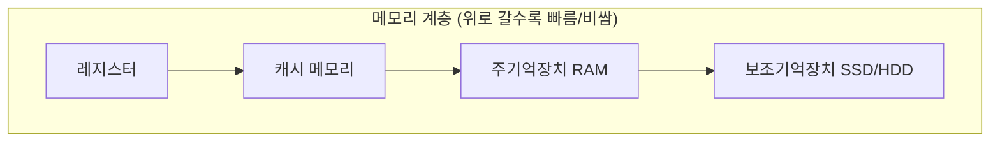
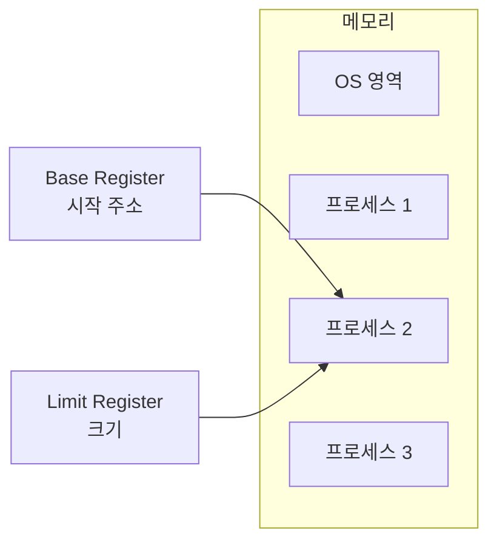
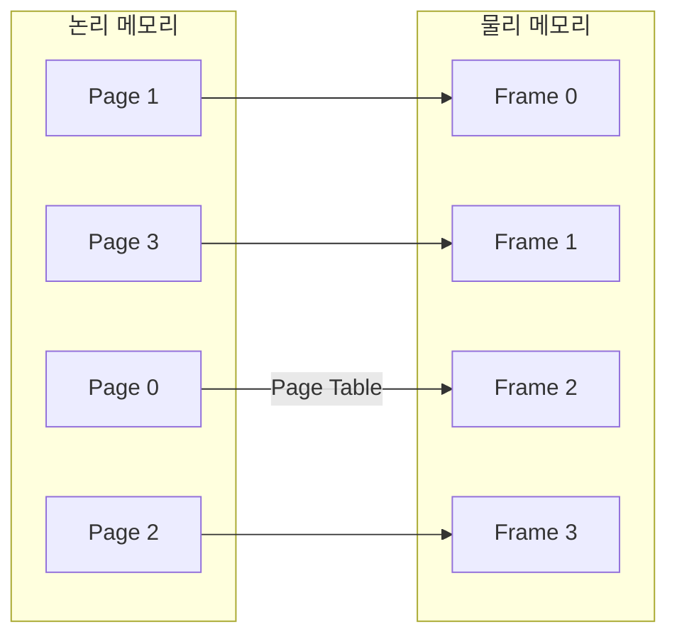
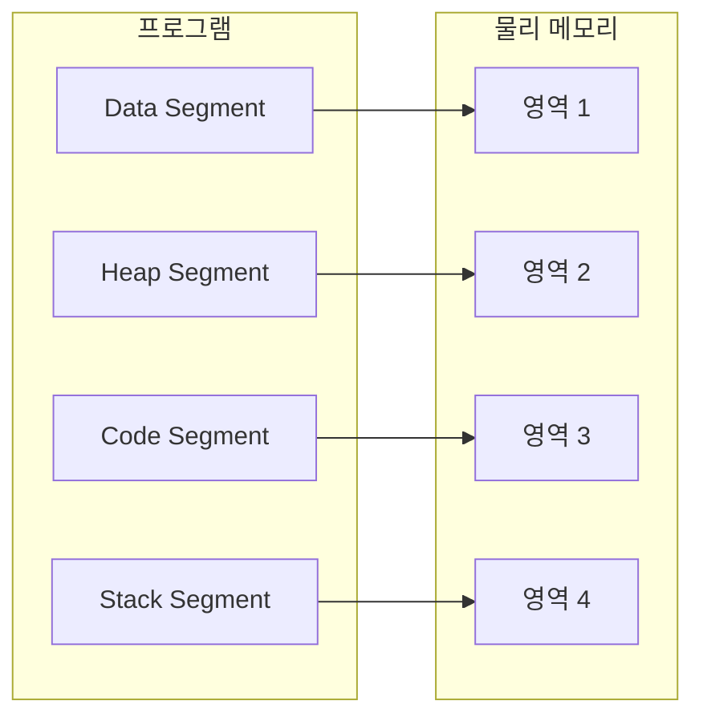
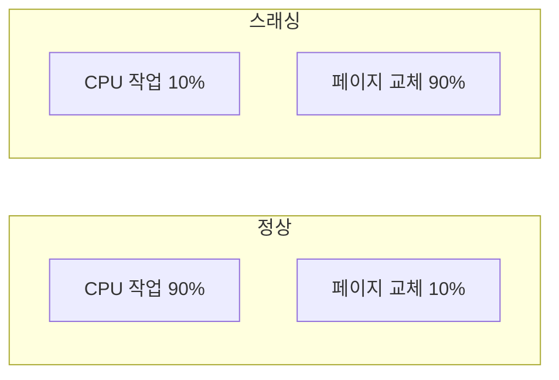

## 🌐 개요 (Overview)

**가상 메모리(Virtual Memory)** 는 보조기억장치(디스크)의 일부를 주기억장치처럼 사용하여, **물리 메모리보다 큰 프로그램**을 실행할 수 있게 하는 기술입니다.

## 🎯 메모리 계층 구조



| 계층 | 속도 | 용량 | 휘발성 |
|------|------|------|--------|
| **레지스터** | ~1ns | ~KB | O |
| **캐시** | ~10ns | ~MB | O |
| **RAM** | ~100ns | ~GB | O |
| **SSD/HDD** | ~ms | ~TB | X |

## 📊 메모리 보호

### 왜 필요한가?

다중 프로그래밍 환경에서 **프로세스가 서로의 영역을 침범하지 못하도록** 보호해야 합니다.

### 보호 레지스터



| 레지스터 | 역할 |
|---------|------|
| **베이스 레지스터 (Base)** | 프로세스의 물리적 시작 주소 |
| **한계 레지스터 (Limit)** | 프로세스가 사용할 수 있는 메모리 크기 |
| **경계 레지스터 (Bound)** | 접근 가능한 주소 범위 |

```plaintext
유효 주소 검사:
Base ≤ 논리 주소 < Base + Limit

조건을 벗어나면 → 메모리 접근 위반 예외!
```

---

## 📦 가상 메모리 기법

### 1. 페이징 (Paging)

프로그램과 주기억장치를 **동일한 크기(Page)** 로 나눕니다.



**특징**:
- **페이지 (Page)**: 논리 메모리의 고정 크기 블록 (보통 4KB)
- **프레임 (Frame)**: 물리 메모리의 고정 크기 블록
- **페이지 테이블**: 페이지 번호 → 프레임 번호 매핑
- **내부 단편화** 발생 가능 (마지막 페이지가 가득 차지 않을 때)

**주소 변환**:
```plaintext
논리 주소 = 페이지 번호(p) + 오프셋(d)
물리 주소 = 프레임 번호(f) + 오프셋(d)

예: 페이지 크기 = 4KB (2^12)
논리 주소 0x12345
→ 페이지 번호 = 0x12 (상위 비트)
→ 오프셋 = 0x345 (하위 12비트)
```

### 2. 세그멘테이션 (Segmentation)

프로그램을 **논리적 단위(Segment)** 로 나눕니다.



**특징**:
- 세그먼트 크기가 **가변적** (논리적 의미 단위)
- 세그먼트 테이블: 세그먼트 번호 → (시작 주소, 길이)
- **외부 단편화** 발생 가능 (빈 공간이 흩어짐)

### 페이징 vs 세그멘테이션

| 특징 | 페이징 | 세그멘테이션 |
|------|--------|-------------|
| **단위** | 고정 크기 (Page) | 가변 크기 (Segment) |
| **논리적 의미** | 없음 | 있음 (함수, 배열 등) |
| **단편화** | 내부 단편화 | 외부 단편화 |
| **복잡도** | 단순 | 복잡 |
| **현대 OS** | 주로 사용 | 페이징과 혼합 사용 |

---

## 🔄 페이지 교체 알고리즘

주기억장치가 **가득 찼을 때** 어떤 페이지를 내보낼지 결정합니다.

### 1. FIFO (First In First Out)

**가장 먼저 들어온 페이지**를 교체합니다.

```plaintext
프레임 수: 3
참조 문자열: 7 0 1 2 0 3 0 4

Step  참조    프레임 상태        부재
1     7      [7, -, -]         O
2     0      [7, 0, -]         O
3     1      [7, 0, 1]         O
4     2      [2, 0, 1]         O (7 교체)
5     0      [2, 0, 1]         X (적중)
6     3      [2, 3, 1]         O (0 교체)
7     0      [2, 3, 0]         O (1 교체)
8     4      [4, 3, 0]         O (2 교체)

페이지 부재: 7회
```

**벨라디의 모순 (Belady's Anomaly)**:
- 프레임 수가 증가해도 페이지 부재가 증가할 수 있음
- FIFO에서만 발생할 수 있는 현상

### 2. LRU (Least Recently Used)

**가장 오랫동안 사용되지 않은 페이지**를 교체합니다. (시간성 고려)

```plaintext
프레임 수: 3
참조 문자열: 7 0 1 2 0 3 0 4

Step  참조    프레임 상태        최근 사용 순서
1     7      [7, -, -]         7
2     0      [7, 0, -]         0, 7
3     1      [7, 0, 1]         1, 0, 7
4     2      [2, 0, 1]         2, 0, 1 (7 교체: 가장 오래됨)
5     0      [2, 0, 1]         0, 2, 1 (적중)
6     3      [2, 0, 3]         3, 0, 2 (1 교체: 가장 오래됨)
7     0      [2, 0, 3]         0, 3, 2 (적중)
8     4      [4, 0, 3]         4, 0, 3 (2 교체: 가장 오래됨)

페이지 부재: 6회 (FIFO보다 적음)
```

**장점**: 성능이 좋음, 벨라디 모순 없음
**단점**: 구현 복잡 (사용 시간 기록 필요)

### 3. LFU (Least Frequently Used)

**사용 횟수가 가장 적은 페이지**를 교체합니다. (빈도성 고려)

```plaintext
프레임 수: 3
페이지(사용 횟수): A(5), B(3), C(2)

새 페이지 D 필요 → C 교체 (사용 횟수 2로 최소)
```

**장점**: 자주 사용되는 페이지 유지
**단점**: 최근 적재된 페이지가 불리함

### 4. NUR (Not Used Recently)

**참조 비트**와 **변형 비트**를 사용하여 최근 사용 여부를 판단합니다.

```plaintext
참조 비트(R): 최근 참조됨
변형 비트(M): 수정됨 (dirty)

우선순위 (교체 순서):
1. R=0, M=0 : 참조 X, 수정 X (최우선 교체)
2. R=0, M=1 : 참조 X, 수정 O
3. R=1, M=0 : 참조 O, 수정 X
4. R=1, M=1 : 참조 O, 수정 O (가장 나중에 교체)
```

### 5. SCR (Second Chance Replacement)

FIFO를 개선하여, **참조 비트가 1이면 기회**를 한 번 더 줍니다.

```plaintext
교체 대상 선정:
1. FIFO 순서로 검사
2. 참조 비트 = 1 → 0으로 바꾸고 뒤로 이동
3. 참조 비트 = 0 → 교체
```

### 6. OPT (Optimal)

**앞으로 가장 오랫동안 사용되지 않을 페이지**를 교체합니다.

```plaintext
참조 문자열: 7 0 1 2 0 3 0 4
현재 프레임: [7, 0, 1]
새 페이지 2 필요

미래 참조:
- 7: 더 이상 참조 안 됨
- 0: 2번 후 참조됨
- 1: 더 이상 참조 안 됨

→ 7 또는 1 교체 (가장 늦게/안 쓰이는 것)
```

**특징**:
- **이론적 최적** (가장 적은 페이지 부재)
- **구현 불가능** (미래를 알 수 없음)
- 다른 알고리즘의 성능 비교 기준으로 사용

### 알고리즘 비교

| 알고리즘 | 교체 기준 | 장점 | 단점 |
|---------|----------|------|------|
| **FIFO** | 가장 오래된 | 단순 | 벨라디 모순 |
| **LRU** | 가장 오래 미사용 | 성능 좋음 | 구현 복잡 |
| **LFU** | 사용 횟수 최소 | 빈도 고려 | 최근 페이지 불리 |
| **NUR** | 참조/변형 비트 | 구현 용이 | 근사치 |
| **SCR** | FIFO + 참조 비트 | FIFO 개선 | 오버헤드 |
| **OPT** | 미래 예측 | 최적 | 구현 불가 |

---

## ⚠️ 스래싱 (Thrashing)

### 정의

페이지 부재(Page Fault)가 **너무 빈번하게 발생**하여 CPU가 프로세스 실행보다 **페이지 교체에 대부분의 시간**을 소비하는 현상입니다.



### 발생 원인

1. **다중 프로그래밍 정도 과다**: 너무 많은 프로세스
2. **물리 메모리 부족**: 각 프로세스에 할당된 프레임 부족
3. **지역성(Locality) 위반**: 자주 사용하는 페이지가 메모리에 없음

### 해결 방법

#### 워킹 셋 (Working Set)

**자주 참조되는 페이지 집합**을 주기억장치에 유지합니다.

```plaintext
워킹 셋 = 최근 Δ시간 동안 참조된 페이지 집합

예: Δ = 10, 참조 문자열 끝: 2 6 1 5 7 7 7 7 5 1
현재 시점의 워킹 셋 = {1, 2, 5, 6, 7}

워킹 셋 전체를 메모리에 유지 → 스래싱 방지
```

#### 페이지 부재 빈도 (PFF)

페이지 부재 비율을 모니터링하여 프레임 할당을 조절합니다.

```plaintext
PFF가 높으면 → 프레임 추가 할당
PFF가 낮으면 → 프레임 회수

목표: 적정 PFF 범위 유지
```

---

## 💡 Linux에서 가상 메모리

```bash
# 메모리 사용량 확인
free -h
#               total        used        free      shared  buff/cache   available
# Mem:           16Gi       8.0Gi       2.0Gi       500Mi       6.0Gi       7.0Gi
# Swap:          4.0Gi       100Mi      3.9Gi

# 페이지 크기 확인
getconf PAGE_SIZE
# 4096 (4KB)

# 스왑 사용량
swapon --show
# NAME      TYPE      SIZE  USED PRIO
# /dev/sda2 partition 4G    100M -2

# 프로세스별 메모리 맵
pmap <PID>
cat /proc/<PID>/maps

# 페이지 테이블 정보
cat /proc/<PID>/pagemap
```

### 스왑 공간 관리

```bash
# 스왑 파일 생성
sudo fallocate -l 4G /swapfile
sudo chmod 600 /swapfile
sudo mkswap /swapfile
sudo swapon /swapfile

# /etc/fstab에 추가 (영구 설정)
/swapfile swap swap defaults 0 0

# 스왑 사용 경향 (swappiness)
cat /proc/sys/vm/swappiness
# 60 (기본값, 0-100)
# 낮을수록 스왑 사용 자제, 높을수록 적극 사용

# swappiness 조정
sudo sysctl vm.swappiness=10
```

## 🔗 연결 문서 (Related Documents)

- [[kernel-structure]] - 운영체제 커널과 메모리 보호
- [[process-states-lifecycle]] - 프로세스 메모리 구조
- [[filesystems]] - 스왑 파일/파티션
- [[lvm]] - 논리 볼륨과 스왑: 관리
