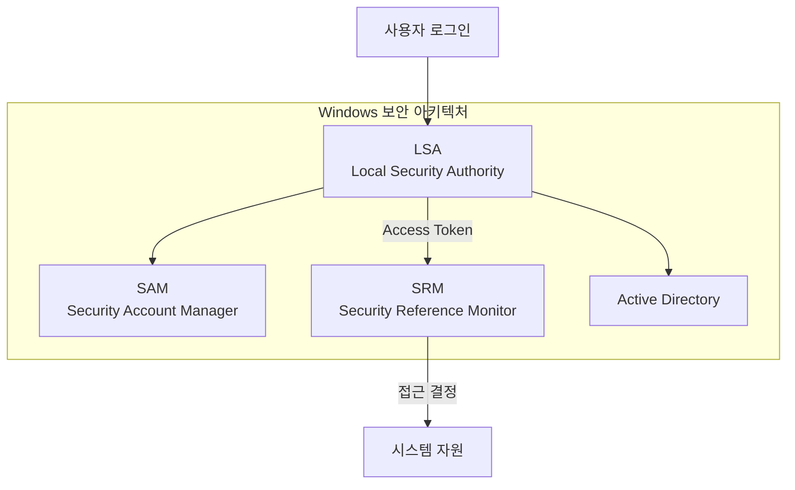

## 🌐 개요 (Overview)

**Windows 보안 서브시스템**은 사용자 인증, 권한 관리, 접근 통제, 감사 로그를 담당하는 핵심 보안 구성 요소들입니다.

---

## 🪟 Windows 보안 구조

### 아키텍처 개요



---

## 1️⃣ SAM (Security Account Manager)

### 정의

**사용자 계정 및 암호화된 해시 값**을 저장하는 데이터베이스입니다.

### 파일 위치와 내용

```plaintext
위치: %SystemRoot%\System32\config\SAM

저장 내용:
- 로컬 사용자 계정
- 해시된 패스워드 (NTLM 또는 NTLMv2)
- 계정 정책
- 사용자 그룹 정보

보안:
- 시스템 실행 중 접근 불가 (잠금)
- SYSKEY로 추가 암호화 (구버전)
```

### 공격 시나리오

```plaintext
1. 오프라인 공격: 부팅 미디어로 SAM 파일 복사
2. mimikatz: 메모리에서 해시 추출
3. Pass-the-Hash: 해시만으로 인증 우회

방어:
- Credential Guard (Windows 10+) - 메모리 격리
- BitLocker로 디스크 암호화 - 오프라인 공격 방지
```

---

## 2️⃣ LSA (Local Security Authority)

### 정의

**로컬 보안 정책을 관리하고 사용자 인증**을 처리합니다.

### 주요 역할

```plaintext
역할:
- 로그인 인증 처리
- Access Token 생성
- 보안 정책 적용
- 감사 로그 생성

핵심 프로세스: lsass.exe (매우 중요, 공격 대상)

동작 흐름:
1. 사용자 자격증명 입력 (Winlogon)
2. LSA가 SAM과 비교하여 인증
3. 성공 시 Access Token 생성
4. 토큰에 SID, 그룹, 권한 포함
5. 토큰을 프로세스에 부여
```

### Access Token 구성

```plaintext
Access Token 내용:
- 사용자 SID (Security Identifier)
- 그룹 SID 리스트
- 권한 (Privileges) - SeImpersonatePrivilege 등
- 무결성 레벨 (Integrity Level) - High, Medium, Low
- 로그인 SID
- 제한된 SID 리스트 (AppContainer 등)
```

---

## 3️⃣ SRM (Security Reference Monitor)

### 정의

**사용자의 자원 접근 허용 여부를 결정**하는 커널 모듈입니다. 참조 모니터 개념의 Windows 구현체입니다.

### 동작 프로세스

```plaintext
1. 프로세스가 객체(파일, 레지스트리 등)에 접근 시도
2. SRM이 프로세스의 Access Token 확인
3. 객체의 ACL (Access Control List) 확인
4. 토큰의 SID가 ACL에 포함되어 있는지 검사
5. 접근 허용 또는 거부 결정
6. 결과를 감사 로그에 기록 (감사 정책이 켜져 있을 경우)
```

### ACL (Access Control List)

```plaintext
ACL 예시 (파일 속성):
- BUILTIN\Administrators: Full Control (읽기, 쓰기, 실행, 삭제)
- BUILTIN\Users: Read & Execute
- SYSTEM: Full Control
```

---

## 4️⃣ BitLocker

### 정의

**디스크 볼륨 전체를 암호화**하는 기능입니다. TPM 또는 패스워드를 사용하여 암호화 키를 보호합니다.

### 보호 대상 및 인증 방법

```plaintext
보호 대상:
- 시스템 드라이브 (OS가 설치된 드라이브)
- 데이터 드라이브 (추가 내부 드라이브)
- 이동식 드라이브 (BitLocker To Go)

인증 방법:
- TPM만 사용 - 가장 투명 (자동 복호화)
- TPM + PIN - PIN 입력 후 복호화
- TPM + USB 키 - USB 키 필요
- 패스워드 - 부팅 시 패스워드 입력 (외장 드라이브)
```

### BitLocker 명령어

```powershell
# BitLocker 상태 확인
manage-bde -status

# 특정 드라이브의 BitLocker 상태
Get-BitLockerVolume -MountPoint "C:"

# BitLocker 활성화 (TPM 사용)
Enable-BitLocker -MountPoint "C:" -EncryptionMethod XtsAes256 -UsedSpaceOnly -TpmProtector

# BitLocker 활성화 (TPM + PIN)
Enable-BitLocker -MountPoint "C:" -EncryptionMethod XtsAes256 -UsedSpaceOnly -TpmAndPinProtector

# BitLocker 일시 중지 (업데이트 전)
Suspend-BitLocker -MountPoint "C:"

# BitLocker 재개
Resume-BitLocker -MountPoint "C:"

# BitLocker 비활성화
Disable-BitLocker -MountPoint "C:"

# 복구 키 백업 (중요!)
manage-bde -protectors -get C:

# 복구 키 저장 (Azure AD)
Add-BitLockerKeyProtector -MountPoint "C:" -AdAccountOrGroupProtector -AdEncryptionProtector
```

### BitLocker 동작 원리

```plaintext
시작 시:
1. TPM이 시스템 상태 확인 (부팅 체인)
2. PCR 값이 예상값과 일치 확인
3. 일치하면 디스크 암호화 키 자동 복호화 (투명)
4. 시스템 정상 부팅

부팅 환경 변조 시 (예: TPM 제거, 부트로더 변조):
1. PCR 값 불일치 감지
2. 디스크 암호화 키 접근 거부
3. 복구 키 입력 필요
```

---

## 📋 Windows 이벤트 로그

### 이벤트 뷰어 (Event Viewer)

Windows는 **이벤트 뷰어(eventvwr.msc)** 를 통해 보안 감사 로그를 관리합니다.

```powershell
# 이벤트 뷰어 실행
eventvwr.msc
```

### 주요 로그 유형

| 로그 | 설명 | 주요 이벤트 |
|------|------|------------|
| **Application** | 애플리케이션 오류/이벤트 | 앱 충돌, 오류 |
| **System** | OS 구성 요소 이벤트 | 드라이버 로드, 부팅 |
| **Security** | 보안 감사 이벤트 | 로그인, 권한 변경 |
| **Setup** | 설치 관련 | Windows 업데이트 |

### 주요 보안 이벤트 ID

| 이벤트 ID | 설명 | 중요도 |
|----------|------|--------|
| **4624** | 로그인 성공 | 정보 |
| **4625** | 로그인 실패 | 경고 |
| **4634** | 로그오프 | 정보 |
| **4648** | 명시적 자격 증명 로그인 (RunAs) | 경고 |
| **4672** | 특수 권한 할당 (관리자 권한) | 경고 |
| **4688** | 새 프로세스 생성 | 정보 |
| **4720** | 계정 생성 | 경고 |
| **4722** | 계정 활성화 | 경고 |
| **4723** | 계정 암호 변경 시도 | 정보 |
| **4724** | 계정 암호 재설정 | 경고 |
| **4726** | 계정 삭제 | 경고 |
| **4728** | 글로벌 보안 그룹에 멤버 추가 | 경고 |
| **4732** | 로컬 보안 그룹에 멤버 추가 | 경고 |
| **4756** | 보안 그룹에 멤버 추가 | 경고 |
| **4765** | SID 이력 추가 | 경고 |
| **4781** | 계정 이름 변경 | 경고 |

### PowerShell로 보안 이벤트 조회

```powershell
# 로그인 실패 이벤트 (최근 50개)
Get-WinEvent -FilterHashtable @{LogName='Security'; ID=4625} -MaxEvents 50

# 로그인 성공 이벤트 조회
Get-WinEvent -FilterHashtable @{LogName='Security'; ID=4624} -MaxEvents 50

# 관리자 권한 사용 기록
Get-WinEvent -FilterHashtable @{LogName='Security'; ID=4672} -MaxEvents 50

# 프로세스 생성 기록
Get-WinEvent -FilterHashtable @{LogName='Security'; ID=4688} -MaxEvents 50 | Select-Object -Property TimeCreated, Message | Format-Table

# 로그인 실패 통계
Get-WinEvent -FilterHashtable @{LogName='Security'; ID=4625} | 
  Group-Object -Property @{expression={$_.Properties[5].Value}} | 
  Sort-Object -Property Count -Descending | 
  Select-Object Count, Name | 
  Head -10
```

### 감사 정책 설정

```powershell
# 로그온/로그오프 감사 활성화
auditpol /set /category:"Logon/Logoff" /success:enable /failure:enable

# 객체 접근 감사 활성화
auditpol /set /category:"Object Access" /success:enable /failure:enable

# 정책 변경 감사 활성화
auditpol /set /category:"Policy Change" /success:enable /failure:enable

# 권한 사용 감사 활성화
auditpol /set /category:"Privilege Use" /success:enable /failure:enable

# 현재 감사 정책 확인
auditpol /get /category:*
```

---

## 💡 Windows 보안 강화

### 주요 강화 조치

```powershell
# 1. BitLocker 활성화
Enable-BitLocker -MountPoint "C:"

# 2. Credential Guard 활성화 (Hyper-V 필요)
# Windows Defender Credential Guard로 LSA 메모리 격리
Enable-WindowsOptionalFeature -Online -FeatureName Microsoft-Hyper-V-All

# 3. 감사 정책 설정
auditpol /set /category:"Logon/Logoff" /success:enable /failure:enable

# 4. Windows Defender (Antivirus) 확인
Get-MpComputerStatus

# 5. 방화벽 상태 확인
Get-NetFirewallProfile

# 6. 보안 업데이트 확인
Get-WindowsUpdate
```

---

## 🔗 연결 문서 (Related Documents)

- [reference-monitor-and-tcb](reference-monitor-and-tcb.md) - 참조 모니터와 TCB
- [tpm-hardware-security](tpm-hardware-security.md) - TPM 하드웨어 보안
- [kernel-structure](kernel-structure.md) - 커널 구조
