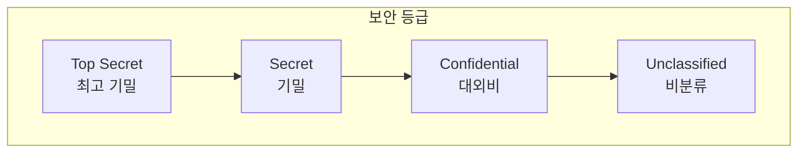

## 🌐 개요 (Overview)

**접근통제 모델**은 보안 정책을 이론적으로 정립한 모델로, 시스템이 **기밀성** 또는 **무결성**을 보장하도록 접근 규칙을 정의합니다.

---

## 🔐 벨-라파듈라 모델 (BLP: Bell-LaPadula)

### 목적

**기밀성 (Confidentiality)** 유지에 중점을 둡니다.

### 배경

미국 국방부 군사 보안 시스템을 위해 개발되었습니다.

### 규칙



| 규칙 | 이름 | 설명 |
|------|------|------|
| **No Read Up** | 단순 보안 속성 | 낮은 등급 주체는 **높은 등급 객체를 읽을 수 없다** |
| **No Write Down** | *-속성 (Star Property) | 높은 등급 주체는 **낮은 등급 객체에 쓸 수 없다** |

### 예시

```plaintext
사용자: Secret 등급

✅ 읽기 가능: Confidential, Unclassified
❌ 읽기 불가: Top Secret (No Read Up)

✅ 쓰기 가능: Secret, Top Secret
❌ 쓰기 불가: Confidential, Unclassified (No Write Down)
```

### 의미

- **No Read Up**: 높은 기밀 정보 열람 방지
- **No Write Down**: 높은 기밀 정보가 낮은 등급으로 **유출 방지**

---

## 🛡️ 비바 모델 (Biba)

### 목적

**무결성 (Integrity)** 보장에 중점을 둡니다. BLP의 **역방향**입니다.

### 규칙

| 규칙 | 이름 | 설명 |
|------|------|------|
| **No Read Down** | 단순 무결성 | 높은 등급 주체는 **낮은 등급 객체를 읽을 수 없다** |
| **No Write Up** | *-무결성 속성 | 낮은 등급 주체는 **높은 등급 객체에 쓸 수 없다** |

### 예시

```plaintext
사용자: High Integrity 등급

✅ 읽기 가능: High Integrity 이상
❌ 읽기 불가: Low Integrity (오염된 정보 열람 방지)

❌ 쓰기 불가: High Integrity 이상에 (변조 방지)
```

### 의미

- **No Read Down**: 오염된(신뢰할 수 없는) 정보 읽기 방지
- **No Write Up**: 신뢰할 수 없는 사용자가 중요 데이터 **변조 방지**

---

## 📊 BLP vs Biba 비교

| 항목 | BLP | Biba |
|------|-----|------|
| **중점** | 기밀성 | 무결성 |
| **읽기 규칙** | No Read Up | No Read Down |
| **쓰기 규칙** | No Write Down | No Write Up |
| **목표** | 정보 유출 방지 | 정보 변조 방지 |
| **용도** | 군사 시스템 | 상업 시스템 |

```plaintext
BLP (기밀성):  "위는 못 읽고, 아래는 못 쓴다"
Biba (무결성): "아래는 못 읽고, 위는 못 쓴다"
```

---

## 🏢 클락-윌슨 모델 (Clark-Wilson)

### 목적

**상업용 무결성** 보장을 위해 개발되었습니다.

### 특징

| 특징 | 설명 |
|------|------|
| **직무 분리** | Separation of Duty |
| **트랜잭션 처리** | 잘 정의된 프로시저로만 데이터 변경 |
| **인가된 실수 방지** | 인가된 사용자의 실수에 의한 무결성 훼손도 방지 |

### 구성 요소

| 요소 | 설명 |
|------|------|
| **CDI (Constrained Data Item)** | 무결성이 보장되어야 하는 데이터 |
| **UDI (Unconstrained Data Item)** | 무결성이 검증되지 않은 데이터 |
| **TP (Transformation Procedure)** | CDI를 조작하는 인가된 절차 |
| **IVP (Integrity Verification Procedure)** | CDI의 무결성 검증 절차 |

### Biba와 차이점

| 항목 | Biba | Clark-Wilson |
|------|------|--------------|
| **목표** | 비인가 변조 방지 | 비인가 + 인가된 실수 방지 |
| **방식** | 등급 기반 | **트랜잭션/절차 기반** |
| **적용** | 정보 흐름 | 비즈니스 프로세스 |

---

## 🏯 만리장성 모델 (Chinese Wall)

### 목적

**이해 충돌 (Conflict of Interest)** 방지

### 배경

컨설팅, 법무법인 등에서 경쟁사 데이터에 동시 접근을 차단합니다.

### 특징

| 특징 | 설명 |
|------|------|
| **동적 권한** | 접근에 따라 권한이 **동적으로 변경** |
| **이해 충돌 클래스** | 경쟁 관계 기업군 정의 |
| **최초 접근** | 자유로움 |
| **이후 접근** | 같은 충돌 클래스 내 다른 기업 접근 **불가** |

### 예시

```plaintext
이해 충돌 클래스: [삼성, LG, SK]

1. 컨설턴트가 삼성 데이터에 최초 접근 → 허용
2. 이후 LG 데이터 접근 시도 → ❌ 차단!
3. SK 데이터 접근 시도 → ❌ 차단!
4. 현대(다른 클래스) 접근 → ✅ 허용
```

---

## 📋 보안 모델 요약

| 모델 | 중점 | 규칙 | 용도 |
|------|------|------|------|
| **BLP** | 기밀성 | No Read Up, No Write Down | 군사 |
| **Biba** | 무결성 | No Read Down, No Write Up | 상업 |
| **Clark-Wilson** | 무결성 | TP, 직무 분리 | 비즈니스 |
| **Chinese Wall** | 이해 충돌 | 동적 접근 제한 | 컨설팅/법무 |

## 🔗 연결 문서 (Related Documents)

- [[authentication-authorization]] - 접근통제 정책 (DAC, MAC, RBAC)
- [[security-fundamentals]] - CIA Triad
- [[linux-account-security]] - Linux 접근통제
