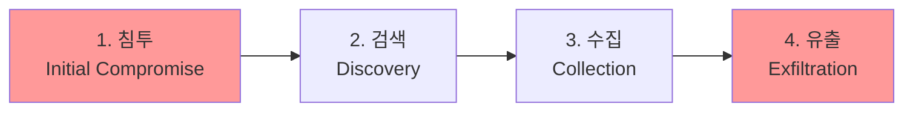

## 🌐 개요 (Overview)

**APT (Advanced Persistent Threat)** 는 특정 조직이나 기업을 표적으로 삼아 **장기간에 걸쳐 지속적이고 지능적으로** 공격하는 형태입니다.

## 📋 APT 특징

| 특징 | 설명 |
|------|------|
| **Advanced (지능형)** | 제로데이, 사회공학 등 복합 기법 사용 |
| **Persistent (지속적)** | 수개월~수년간 은밀하게 진행 |
| **Threat (위협)** | 특정 목표를 겨냥한 표적 공격 |

### 일반 공격 vs APT

| 특성 | 일반 공격 | APT |
|------|----------|-----|
| **목표** | 불특정 다수 | **특정 조직** |
| **기간** | 단기 | **장기 (수개월~수년)** |
| **기법** | 알려진 취약점 | **제로데이, 사회공학** |
| **목적** | 금전, 과시 | **기밀 탈취, 파괴** |
| **은닉** | 낮음 | **높음 (탐지 회피)** |

---

## 🔄 APT 공격 단계



### 1단계: 침투 (Initial Compromise)

내부 네트워크 **거점을 확보**합니다.

| 방법 | 설명 |
|------|------|
| **스피어 피싱** | 특정인 대상 맞춤형 피싱 이메일 |
| **워터링 홀** | 타겟이 자주 방문하는 사이트 감염 |
| **제로데이 취약점** | 알려지지 않은 취약점 악용 |
| **공급망 공격** | 신뢰된 소프트웨어/하드웨어 감염 |

```plaintext
예: 스피어 피싱
"[긴급] 연봉 협상 관련 문서.xlsx"
→ 악성 매크로 포함
→ 실행 시 백도어 설치
```

### 2단계: 검색 (Discovery)

**내부망 정보를 수집**하고 확장 경로를 탐색합니다.

| 활동 | 목적 |
|------|------|
| **내부 스캔** | 네트워크 구조 파악 |
| **권한 상승** | 더 높은 권한 획득 |
| **횡적 이동** | 다른 시스템으로 확장 |
| **키로깅** | 자격 증명 탈취 |

### 3단계: 수집 (Collection)

**중요 데이터를 찾아 수집**합니다.

```plaintext
대상:
- 기밀 문서
- 고객 데이터
- 지적 재산
- 인증서/키
```

### 4단계: 유출 (Exfiltration)

수집한 데이터를 **외부로 유출**합니다.

| 방법 | 설명 |
|------|------|
| **암호화 전송** | HTTPS, 커스텀 암호화 |
| **스테가노그래피** | 이미지 파일에 데이터 숨김 |
| **DNS 터널링** | DNS 쿼리로 데이터 유출 |
| **클라우드 이용** | 정상 클라우드 서비스 악용 |

---

## 🛡️ APT 공격 기법

### 스피어 피싱 (Spear Phishing)

**특정인을 겨냥**한 맞춤형 피싱입니다.

```plaintext
일반 피싱: "은행 계정이 정지되었습니다" (불특정)
스피어 피싱: "김과장님, 3분기 매출 보고서입니다." (특정인)
```

### 워터링 홀 (Watering Hole)

타겟이 **자주 방문하는 사이트를 감염**시킵니다.


### 제로데이 (Zero-day)

**알려지지 않은 취약점**을 악용합니다.

```plaintext
특징:
- 패치가 없어 방어 불가
- 높은 가치 (암시장 거래)
- APT에서 자주 사용
```

### 공급망 공격 (Supply Chain)

**신뢰된 소프트웨어/하드웨어**를 통해 침투합니다.

| 사례 | 설명 |
|------|------|
| SolarWinds | 업데이트 서버 해킹 → 백도어 배포 |
| NotPetya | 우크라이나 회계 S/W 업데이트 감염 |

---

## 🔍 APT 탐지

### 탐지가 어려운 이유

| 요인 | 설명 |
|------|------|
| **정상 위장** | 정상 트래픽/프로세스 위장 |
| **암호화** | C&C 통신 암호화 |
| **저빈도** | 간헐적 활동으로 탐지 회피 |
| **제로데이** | 시그니처 없음 |

### 탐지 방법

| 방법 | 설명 |
|------|------|
| **행위 분석** | 비정상 패턴 탐지 (UEBA) |
| **IOC 매칭** | 침해지표 데이터베이스 활용 |
| **네트워크 모니터링** | 이상 통신 탐지 (NDR) |
| **엔드포인트 탐지** | EDR 솔루션 |
| **위협 인텔리전스** | 외부 위협 정보 연동 |

---

## 🛡️ APT 대응 전략

### 예방

```plaintext
✅ DO
- 전 직원 보안 인식 교육
- 제로 트러스트 아키텍처
- 패치 관리 철저
- 네트워크 분리 (세그멘테이션)
- 다중 인증 (MFA)
- 최소 권한 원칙

❌ DON'T
- 알 수 없는 첨부파일 실행
- 관리자 권한 남용
- 보안 경고 무시
```

### 탐지 및 대응

| 단계 | 활동 |
|------|------|
| **모니터링** | SIEM, EDR, NDR 상시 가동 |
| **탐지** | 이상 행위 알림 |
| **분석** | IOC 분석, 포렌식 |
| **격리** | 감염 시스템 격리 |
| **제거** | 악성코드/백도어 제거 |
| **복구** | 시스템 복원 |
| **교훈** | 공격 분석, 방어 개선 |

---

## 📊 주요 APT 그룹

| 그룹 | 추정 국가 | 주요 대상 |
|------|----------|----------|
| APT28 (Fancy Bear) | 러시아 | 정부, 군사 |
| APT29 (Cozy Bear) | 러시아 | 정부, 싱크탱크 |
| APT1 | 중국 | 기업, 기술 |
| Lazarus | 북한 | 금융, 암호화폐 |
| APT33 | 이란 | 항공, 에너지 |

## 🔗 연결 문서 (Related Documents)

- [[malware-types]] - 악성코드 유형
- [[ddos-attacks]] - DDoS 공격
- [[email-security]] - 피싱 방어
- [[digital-forensics]] - 침해사고 분석
