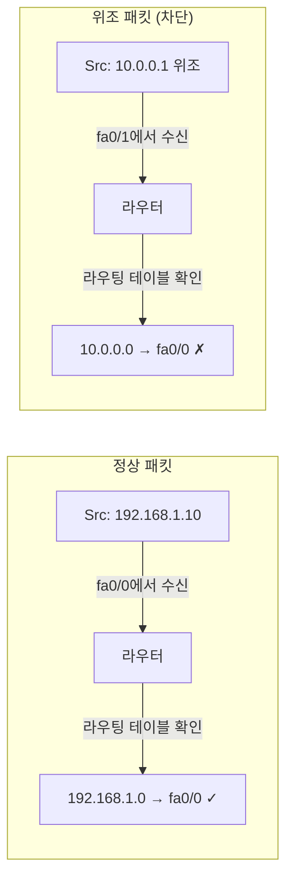

## 🌐 개요 (Overview)

라우터 보안의 핵심은 **관리자 접근 보호**와 **ACL을 통한 패킷 필터링**입니다. 이 문서에서는 라우터 보안 설정과 ACL 기법을 다룹니다.

## 🔐 라우터 기본 보안 설정

### 패스워드 설정

| 설정 | 용도 | 암호화 |
|------|------|--------|
| **Console Password** | 물리적 콘솔 접속 | 평문 |
| **VTY Password** | 텔넷/SSH 원격 접속 | 평문 |
| **Enable Password** | 관리자 모드 진입 | **평문** (취약) |
| **Enable Secret** | 관리자 모드 진입 | **MD5 암호화** |

```cisco
! 콘솔 패스워드 설정
Router(config)# line console 0
Router(config-line)# password cisco123
Router(config-line)# login

! VTY 패스워드 설정 (텔넷/SSH)
Router(config)# line vty 0 4
Router(config-line)# password telnet123
Router(config-line)# login

! Enable Password (취약 - 사용 지양)
Router(config)# enable password weakpass

! Enable Secret (권장 - MD5 암호화)
Router(config)# enable secret SecretPass!

! 모든 평문 패스워드 암호화
Router(config)# service password-encryption
```

### SSH 설정 (텔넷 대체)

```cisco
! 호스트네임 및 도메인 설정
Router(config)# hostname R1
R1(config)# ip domain-name example.com

! RSA 키 생성
R1(config)# crypto key generate rsa

! SSH 버전 2 사용
R1(config)# ip ssh version 2

! VTY에서 SSH만 허용
R1(config)# line vty 0 4
R1(config-line)# transport input ssh
```

---

## 📋 ACL (Access Control List)

패킷 필터링을 통해 트래픽을 **허용(Permit)** 하거나 **차단(Deny)** 하는 보안 기능입니다.

### ACL 종류

| 유형 | 번호 | 검사 항목 |
|------|:----:|----------|
| **표준 (Standard)** | 1~99 | 출발지 IP만 |
| **확장 (Extended)** | 100~199 | 출발지/목적지 IP, 프로토콜, 포트 |

### 표준 ACL (Standard ACL)

**출발지 IP 주소만** 검사합니다.

```cisco
! 형식
access-list [번호] [permit/deny] [출발지IP] [와일드카드마스크]

! 예시: 192.168.1.0/24 네트워크 허용
Router(config)# access-list 10 permit 192.168.1.0 0.0.0.255

! 특정 호스트 차단
Router(config)# access-list 10 deny host 10.0.0.100

! 모든 트래픽 허용 (암시적 deny all 우회)
Router(config)# access-list 10 permit any

! 인터페이스에 적용
Router(config)# interface fa0/0
Router(config-if)# ip access-group 10 in
```

### 확장 ACL (Extended ACL)

**출발지/목적지 IP, 프로토콜, 포트**를 검사합니다.

```cisco
! 형식
access-list [번호] [permit/deny] [프로토콜] [출발지] [목적지] [포트]

! 예시: 192.168.1.0/24에서 웹서버(80)로의 접근만 허용
Router(config)# access-list 100 permit tcp 192.168.1.0 0.0.0.255 host 10.0.0.50 eq 80

! SSH(22) 차단
Router(config)# access-list 100 deny tcp any any eq 22

! ICMP 차단 (ping 차단)
Router(config)# access-list 100 deny icmp any any

! 나머지 허용
Router(config)# access-list 100 permit ip any any

! 인터페이스에 적용
Router(config)# interface fa0/1
Router(config-if)# ip access-group 100 out
```

### 와일드카드 마스크

서브넷 마스크의 **반대 (비트 반전)** 입니다.

| 의미 | 서브넷 마스크 | 와일드카드 마스크 |
|------|-------------|-----------------|
| 단일 호스트 | /32 | 0.0.0.0 |
| /24 네트워크 | 255.255.255.0 | 0.0.0.255 |
| /16 네트워크 | 255.255.0.0 | 0.0.255.255 |
| 모든 주소 | 0.0.0.0 | 255.255.255.255 |

---

## 📏 ACL 적용 규칙

### 1. 순차적 처리 (Top-Down)

```plaintext
access-list 100 deny ip host 10.0.0.1 any        ← 먼저 검사
access-list 100 permit ip 10.0.0.0 0.0.0.255 any ← 다음 검사
access-list 100 deny ip any any                  ← 마지막 (암시적)
```

- 윗줄부터 차례대로 비교
- 조건이 맞으면 **즉시 실행하고 종료**

### 2. Implicit Deny All

맨 마지막에 **"모든 패킷 차단"** 규칙이 **생략되어 존재**합니다.

```cisco
! 최소 하나의 permit 규칙 필요!
access-list 10 permit 192.168.1.0 0.0.0.255
! (암시적) access-list 10 deny any
```

### 3. 규칙 배치

**좁은 범위를 먼저, 넓은 범위를 나중에** 배치해야 합니다.

```cisco
! 잘못된 순서 (특정 호스트 규칙이 무시됨)
access-list 10 permit 10.0.0.0 0.0.0.255
access-list 10 deny host 10.0.0.100  ← 절대 매칭 안 됨!

! 올바른 순서
access-list 10 deny host 10.0.0.100  ← 먼저 검사
access-list 10 permit 10.0.0.0 0.0.0.255
```

### 4. 적용 위치

| 유형 | 적용 위치 |
|------|----------|
| **표준 ACL** | 목적지 가까이 |
| **확장 ACL** | 출발지 가까이 |

---

## 🛡️ 주요 필터링 기법

### Ingress Filtering

라우터 **내부로 들어오는** 패킷 필터링입니다.

```cisco
! 외부에서 내부 사설 IP 위장 패킷 차단
access-list 110 deny ip 10.0.0.0 0.255.255.255 any
access-list 110 deny ip 172.16.0.0 0.15.255.255 any
access-list 110 deny ip 192.168.0.0 0.0.255.255 any
access-list 110 permit ip any any

interface fa0/0
 ip access-group 110 in
```

### Egress Filtering

라우터 **외부로 나가는** 패킷 필터링입니다.

```cisco
! 내부에서 허용된 IP만 외부로 나가게 함
access-list 120 permit ip 192.168.1.0 0.0.0.255 any
access-list 120 deny ip any any log

interface fa0/1
 ip access-group 120 out
```

### Null Routing (Blackhole)

특정 IP 대역을 **가상의 쓰레기통 인터페이스(Null0)** 로 보내 폐기합니다.

```cisco
! 공격 IP 대역 차단 (DDoS 방어)
ip route 192.0.2.0 255.255.255.0 Null0
ip route 198.51.100.0 255.255.255.0 Null0
```

**장점**: ACL보다 **CPU 부하가 적음**

### uRPF (Unicast Reverse Path Forwarding)

들어온 패킷의 출발지 IP가 **라우팅 테이블에서 그 인터페이스로 돌아가는지** 확인합니다.

```cisco
! Strict Mode: 정확히 같은 인터페이스로 리턴 경로 확인
interface fa0/0
 ip verify unicast source reachable-via rx

! Loose Mode: 어떤 인터페이스로든 리턴 경로만 있으면 OK
interface fa0/0
 ip verify unicast source reachable-via any
```

**용도**: **IP Spoofing 차단**



---

## 💡 실무 예시

### 웹서버 보호 ACL

```cisco
! 외부에서 웹 (80, 443), DNS (53)만 허용
access-list 150 permit tcp any host 10.0.0.50 eq 80
access-list 150 permit tcp any host 10.0.0.50 eq 443
access-list 150 permit udp any host 10.0.0.50 eq 53
access-list 150 deny ip any host 10.0.0.50
access-list 150 permit ip any any

interface fa0/0
 ip access-group 150 in
```

## 🔗 연결 문서 (Related Documents)

- [[routing-basics]] - 라우팅 기초
- [[routing-protocols]] - 라우팅 프로토콜
- [[firewall-ids-ips]] - 방화벽과 IDS/IPS
- [[network-security-protocols]] - 네트워크 보안 프로토콜
