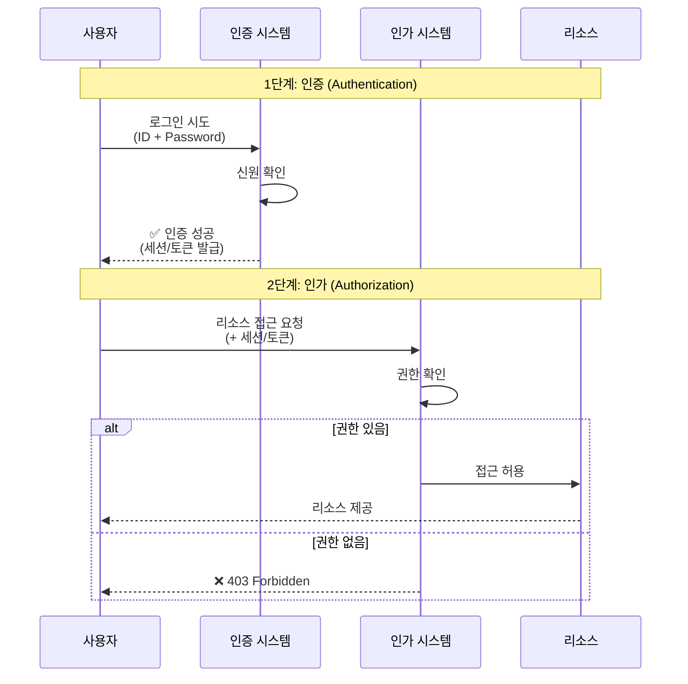
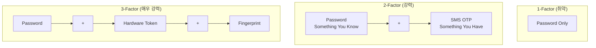
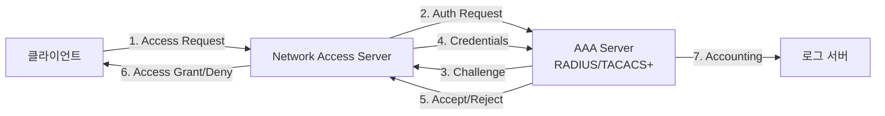
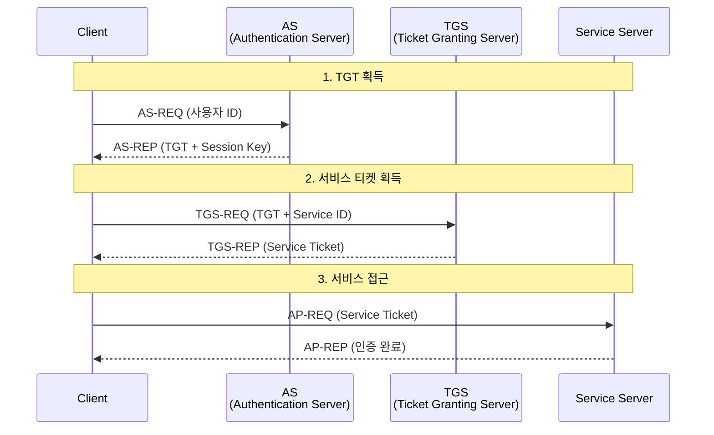
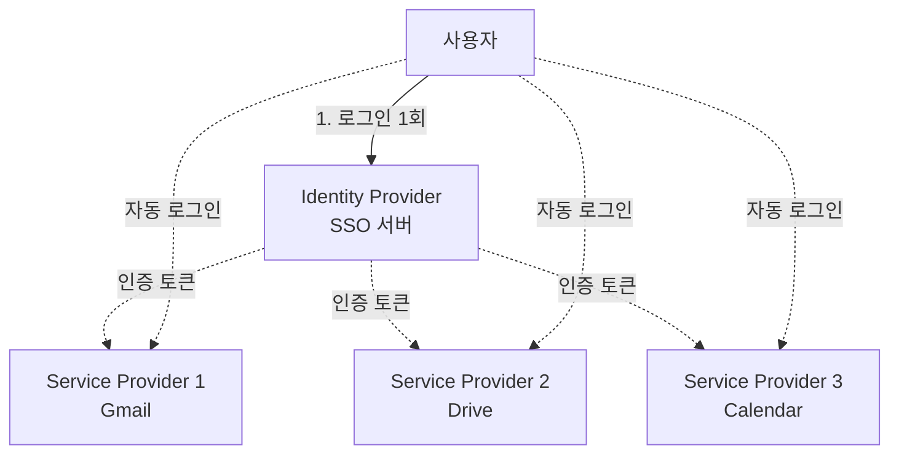
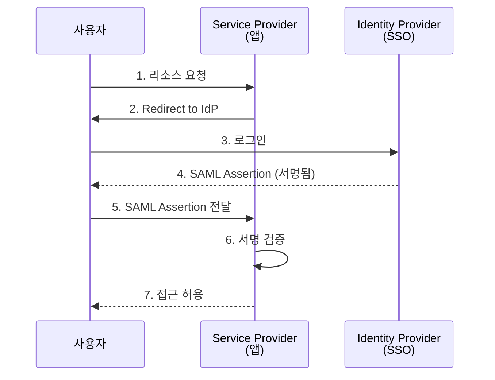
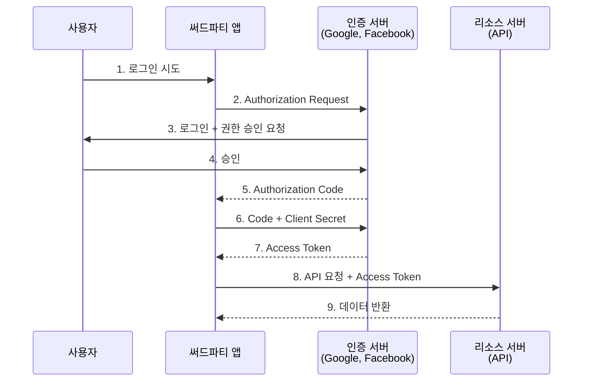
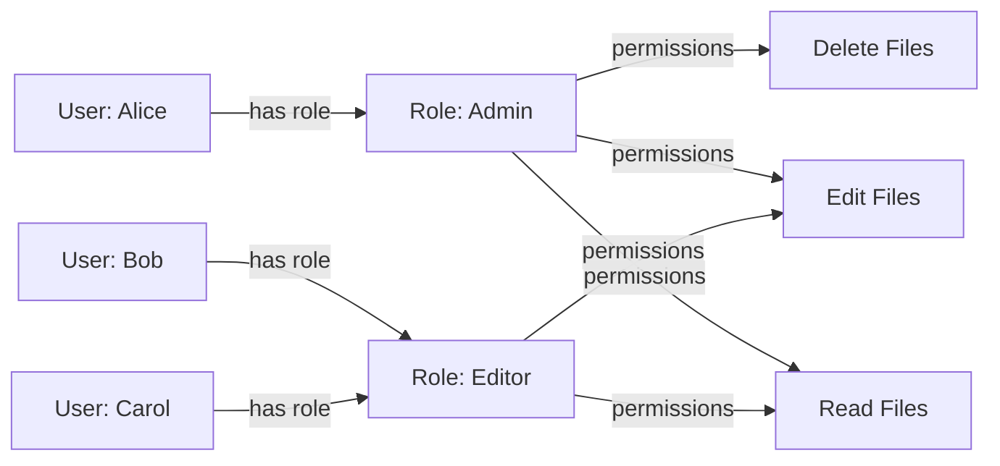

## 🌐 개요 (Overview)

**인증 (Authentication)** 과 **인가 (Authorization)** 는 보안의 핵심 개념으로, "누구인가"를 확인하고 "무엇을 할 수 있는가"를 결정합니다.

## 🔐 인증 vs 인가 (Authentication vs Authorization)



| 구분 | 인증 (Authentication) | 인가 (Authorization) |
|------|----------------------|---------------------|
| **질문** | "당신은 누구입니까?" | "무엇을 할 수 있습니까?" |
| **목적** | 신원 확인 | 권한 확인 |
| **순서** | 먼저 수행 | 인증 후 수행 |
| **예시** | 로그인 | 파일 접근, 기능 사용 |
| **실패 시** | 401 Unauthorized | 403 Forbidden |

## 🎭 인증 (Authentication)

### 인증 요소 (Authentication Factors)

#### 1. 지식 기반 (Something You Know)
- **패스워드/PIN**: 가장 일반적
- **보안 질문**: 추가 인증용
- **패턴**: 모바일 기기

**취약점**:
- 추측, 무차별 대입 공격
- 피싱, 소셜 엔지니어링
- 재사용, 약한 패스워드

#### 2. 소유 기반 (Something You Have)
- **OTP 토큰**: 일회용 비밀번호 생성기
- **스마트카드**: PKI 인증서 저장
- **모바일 앱**: Google Authenticator, Authy
- **SMS**: 문자 메시지 코드

#### 3. 특성 기반 (Something You Are)
- **지문 인식**: 가장 보편화
- **홍채/망막 스캔**: 고보안 환경
- **얼굴 인식**: Face ID
- **음성 인식**: 콜센터
- **정맥 패턴**: 은행 ATM

#### 4. 위치 기반 (Somewhere You Are)
- **IP 주소**: 지역 제한
- **GPS 좌표**: 모바일 인증
- **네트워크**: 내부망 접근

#### 5. 행위 기반 (Something You Do)
- **서명 패턴**: 필기 서명
- **타이핑 리듬**: 키스트로크 다이나믹스
- **걸음걸이**: 보행 패턴 분석

### 다중 인증 (Multi-Factor Authentication, MFA)

**정의**: 2개 이상의 **서로 다른** 인증 요소 조합



**MFA 구현 방법**:

1. **TOTP (Time-based OTP)**
   ```
   알고리즘: HMAC-SHA1(Secret, Time)
   유효 기간: 30초
   예: Google Authenticator
   ```

2. **HOTP (HMAC-based OTP)**
   ```
   카운터 기반
   한 번 사용 후 무효화
   ```

3. **Push 알림**
   ```
   모바일 앱으로 승인 요청
   예: Duo, Microsoft Authenticator
   ```

4. **U2F/FIDO2**
   ```
   하드웨어 보안 키
   예: YubiKey, Titan Security Key
   ```

## 🔑 주요 인증 프로토콜

### AAA (Authentication, Authorization, Accounting)



#### RADIUS (Remote Authentication Dial-In User Service)
- **포트**: UDP 1812 (인증), 1813 (회계)
- **암호화**: 패스워드만 암호화 (취약)
- **용도**: WiFi, VPN, 네트워크 장비 인증

#### TACACS+ (Terminal Access Controller Access-Control System Plus)
- **포트**: TCP 49
- **암호화**: 전체 패킷 암호화
- **장점**: 인증/인가/회계 분리 가능
- **용도**: Cisco 장비 관리

### Kerberos

MIT에서 개발한 네트워크 인증 프로토콜 (Windows Active Directory의 기본 인증)



**장점**:
- 패스워드가 네트워크에 전송되지 않음
- 상호 인증 (클라이언트 ↔ 서버)
- 티켓 만료로 보안 강화

**단점**:
- 시간 동기화 필수 (5분 이내)
- KDC가 단일 장애점
- 초기 설정 복잡

### LDAP (Lightweight Directory Access Protocol)

- **포트**: 389 (LDAP), 636 (LDAPS)
- **용도**: 디렉토리 서비스 (사용자/그룹 관리)
- **구조**: 계층적 트리 구조 (DN, OU, CN)

```
DN: cn=John Doe,ou=Users,dc=example,dc=com
     │         │        └─ Domain Component
     │         └─ Organizational Unit
     └─ Common Name
```

## 🌐 SSO (Single Sign-On)

### 개념

한 번의 인증으로 여러 서비스에 접근하는 메커니즘



### SAML (Security Assertion Markup Language)

XML 기반 SSO 표준



### OAuth 2.0

**목적**: **인가** 프레임워크 (인증이 아님!)



**Grant Types**:
1. **Authorization Code**: 가장 안전 (서버 사이드 앱)
2. **Implicit**: SPA용 (deprecated)
3. **Resource Owner Password**: 신뢰된 앱만
4. **Client Credentials**: 서버 간 통신

### OpenID Connect (OIDC)

OAuth 2.0 위에 **인증** 계층 추가

```
OAuth 2.0: 인가 (Authorization)
OIDC: 인증 (Authentication) + 인가
```

**ID Token** (JWT):
```json
{
  "iss": "https://accounts.google.com",
  "sub": "user-unique-id",
  "aud": "your-client-id",
  "exp": 1672531200,
  "iat": 1672527600,
  "email": "user@example.com",
  "email_verified": true
}
```

## 🛡️ 인가 (Authorization)

### 접근 제어 모델

#### 1. DAC (Discretionary Access Control)

**소유자**가 권한을 결정

```bash
# Linux 예시
chmod 755 myfile.txt  # 소유자가 rwx, 그룹/기타는 r-x
chown user:group myfile.txt
```

**장점**: 유연성
**단점**: 권한 전파 문제, 관리 어려움

#### 2. MAC (Mandatory Access Control)

**시스템**이 보안 레이블 기반으로 권한 결정

```
파일 레이블: Top Secret
사용자 클리어런스: Secret
→ 접근 거부 (사용자 클리어런스 < 파일 레이블)
```

**구현**: SELinux, AppArmor
**용도**: 군사, 정부 시스템

#### 3. RBAC (Role-Based Access Control)

**역할**에 권한 부여, 사용자에게 역할 할당



**예시**:
- Admin: 모든 권한
- Editor: 읽기/쓰기
- Viewer: 읽기만

#### 4. ABAC (Attribute-Based Access Control)

**속성** 조합으로 동적 권한 결정

```
IF (user.department == "HR" AND 
    resource.type == "personnel_records" AND 
    time.hour >= 9 AND time.hour <= 18)
THEN ALLOW
ELSE DENY
```

**속성 예시**:
- 사용자: 부서, 직급, 위치
- 리소스: 분류, 소유자, 타입
- 환경: 시간, 위치, 디바이스

## 🔐 패스워드 보안

### 패스워드 정책

```
최소 길이: 12자 이상
복잡도: 대/소문자 + 숫자 + 특수문자
만료 주기: 90일 (최근 추세: 만료 없음)
재사용 방지: 최근 5개
계정 잠금: 5회 실패 시 30분
```

### 패스워드 해싱

**절대 금지**:
```python
# ❌ 절대 사용 금지
password_hash = md5(password)
password_hash = sha256(password)
```

**권장**:
```python
# ✅ bcrypt
import bcrypt
hashed = bcrypt.hashpw(password.encode(), bcrypt.gensalt(rounds=12))

# ✅ scrypt
from hashlib import scrypt
hashed = scrypt(password.encode(), salt=salt, n=16384, r=8, p=1)

# ✅ Argon2 (가장 권장)
from argon2 import PasswordHasher
ph = PasswordHasher()
hashed = ph.hash(password)
```

### 패스워드 관리자

**장점**:
- 강력하고 고유한 패스워드 생성
- 안전한 저장
- 자동 입력

**예시**: 1Password, Bitwarden, LastPass

## 💡 실무 권장 사항

### MFA는 필수

```
Critical Systems: Hardware tokens (FIDO2)
Corporate Services: Authenticator apps (TOTP)
Low-Risk: SMS (최후의 수단)
```

### 제로 트러스트 원칙

```
"Trust Nothing, Verify Everything"
- 내부망도 신뢰하지 않음
- 모든 접근 시 인증/인가
- 최소 권한 원칙
```

### 세션 관리

```bash
# 세션 타임아웃 설정
Idle Timeout: 15분
Absolute Timeout: 8시간

# 세션 고정 공격 방지
로그인 성공 시 새 세션 ID 발급
```

## 🔗 연결 문서 (Related Documents)

- [[cryptography-basics]] - 인증에 사용되는 암호화 기술
- [[network-security-protocols]] - HTTPS, TLS에서의 인증
- [[process-states-lifecycle]] - 시스템 레벨 권한과 프로세스
