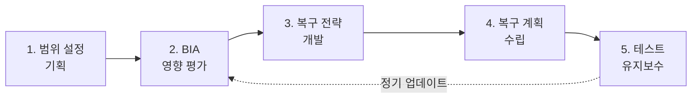
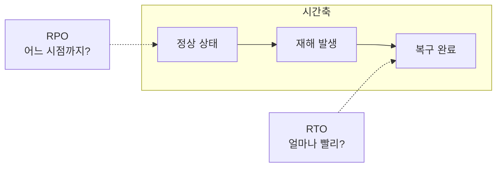
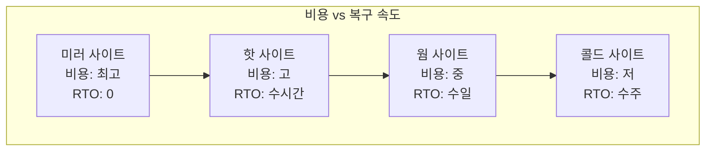

## 🌐 개요 (Overview)

**업무 연속성 계획 (BCP)** 은 재해나 재난으로 인해 조직의 핵심 업무가 **중단되지 않고 지속**될 수 있도록 사전에 수립하는 계획입니다.

## 📋 BCP 수립 5단계



| 단계 | 활동 |
|------|------|
| **1. 범위 설정 및 기획** | 프로젝트 계획, 조직 구성 |
| **2. BIA (사업 영향 평가)** | 재해 시 손실/영향 분석, RTO/RPO 결정 |
| **3. 복구 전략 개발** | 비용 효과적인 복구 방안 수립 |
| **4. 복구 계획 수립** | 구체적 절차와 행동 요령 문서화 |
| **5. 테스트 및 유지보수** | 정기 훈련, 계획 업데이트 |

---

## 📊 BIA (Business Impact Analysis)

**사업 영향 평가**는 재해 발생 시 각 업무가 입는 **손실과 영향을 분석**하는 핵심 활동입니다.

### BIA 산출물

| 항목 | 설명 |
|------|------|
| **업무 우선순위** | 복구 순서 결정 |
| **RTO** | 목표 복구 시간 |
| **RPO** | 목표 복구 시점 |
| **필수 자원** | 복구에 필요한 인력/장비 |

---

## ⏱️ 주요 용어



| 용어 | 정의 |
|------|------|
| **RTO (Recovery Time Objective)** | 업무 중단 시점부터 복구까지 **허용 시간** |
| **RPO (Recovery Point Objective)** | 데이터 유실을 허용할 수 있는 **시점** |
| **MTPD** | 치명적 손실 전까지 견딜 수 있는 **최대 중단 시간** |

### RTO vs RPO 이해

```plaintext
예: 은행 코어뱅킹 시스템

RPO = 0 (실시간 동기화)
→ 재해 발생 직전 데이터까지 복구 필요

RTO = 4시간
→ 4시간 내에 시스템 복구 완료 필요
```

---

## 🏢 재해 복구 시스템 (DRS) 유형

대체 사이트의 **준비 상태**에 따른 분류입니다.

### 1. 미러 사이트 (Mirror Site)

**실시간 데이터 동기화 (Active-Active)** 구성입니다.

| 항목 | 내용 |
|------|------|
| **구성** | 주 센터와 동일 시스템, 실시간 복제 |
| **RTO** | **즉시 (0에 수렴)** |
| **RPO** | **0** |
| **비용** | 가장 높음 |


### 2. 핫 사이트 (Hot Site)

**Active-Standby** 구성으로 대기 상태를 유지합니다.

| 항목 | 내용 |
|------|------|
| **구성** | 동일 장비, 주기적 백업 |
| **RTO** | **수 시간** |
| **RPO** | 마지막 백업 시점 |
| **비용** | 높음 |

### 3. 웜 사이트 (Warm Site)

**중요 장비만 부분적**으로 갖추어 둡니다.

| 항목 | 내용 |
|------|------|
| **구성** | 일부 장비, 백업 테이프 보관 |
| **RTO** | **수일~수주** |
| **RPO** | 테이프 백업 주기 |
| **비용** | 중간 |

### 4. 콜드 사이트 (Cold Site)

**기본 설비 공간만** 확보합니다.

| 항목 | 내용 |
|------|------|
| **구성** | 전원, 냉방, 통신 배선만 |
| **RTO** | **수주~수개월** |
| **RPO** | 오프사이트 백업 주기 |
| **비용** | 가장 낮음 |

---

## 📊 DRS 유형 비교

| 유형 | 장비 | 데이터 | RTO | 비용 |
|------|------|--------|-----|------|
| **미러** | 완전 동일 | 실시간 동기화 | 즉시 | $$$$$ |
| **핫** | 완전 동일 | 주기적 백업 | 수 시간 | $$$$ |
| **웜** | 일부 | 테이프 백업 | 수일~수주 | $$$ |
| **콜드** | 없음 | 오프사이트 | 수주~수개월 | $ |



---

## 🔧 복구 전략 선택 기준

| 고려 사항 | 설명 |
|----------|------|
| **업무 중요도** | 핵심 업무 → 미러/핫 |
| **허용 중단 시간** | MTPD가 짧으면 고비용 필요 |
| **예산** | 비용 대비 효과 분석 |
| **규제 요건** | 법적 복구 요구사항 |

---

## 📝 BCP 테스트 유형

| 유형 | 설명 |
|------|------|
| **체크리스트 리뷰** | 문서 검토 |
| **워크스루 (Walkthrough)** | 테이블탑 시뮬레이션 |
| **시뮬레이션** | 가상 재해 상황 훈련 |
| **병행 테스트** | 실제 전환 없이 테스트 |
| **완전 중단 테스트** | 실제 전환 (위험도 높음) |

---

## 💡 실무 고려사항

```plaintext
✅ DO
- 정기적 BCP 테스트/훈련
- 복구 절차 문서화
- 역할과 책임 명확화
- 비상 연락망 유지
- 백업 데이터 정기 검증

❌ DON'T
- 계획만 수립하고 테스트 하지 않음
- 변경 사항 반영 안 함
- 단일 담당자에게 의존
```

## 🔗 연결 문서 (Related Documents)

- [[security-fundamentals]] - 정보보호 기초 (가용성)
- [[risk-management]] - 위험 관리
- [[backup-strategies]] - 백업 전략
- [[system-attacks]] - 시스템 공격과 가용성 침해
