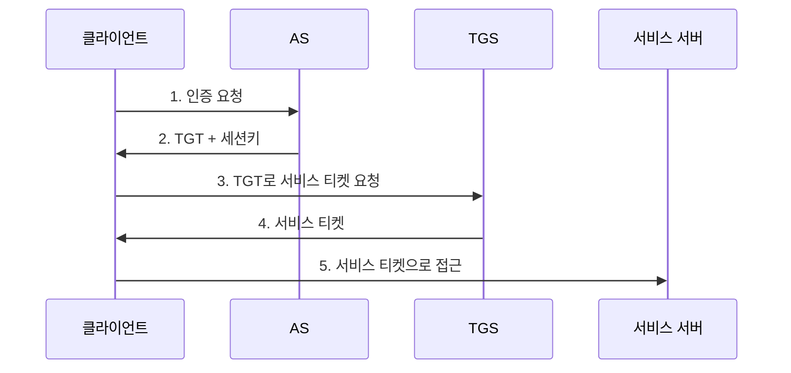

## 🌐 개요 (Overview)

사용자 인증을 위한 **생체 인식 기술**과 **일회용 비밀번호 (OTP)** 기술을 다룹니다.

---

## 🔐 인증의 4가지 유형 (Factors)

| Type | 분류 | 설명 | 예시 |
|:----:|------|------|------|
| **I** | 지식 기반 | What You **Know** | 패스워드, PIN |
| **II** | 소유 기반 | What You **Have** | 스마트카드, OTP 토큰 |
| **III** | 생체 기반 | What You **Are** | 지문, 홍채, 정맥 |
| **IV** | 행동 기반 | What You **Do** | 서명, 키스트로크 |

---

## 👁️ 생체 인식 (Biometrics)

### 특성

| 특성 | 설명 |
|------|------|
| **만인부동** | 모든 사람이 서로 다름 |
| **종생불변** | 평생 변하지 않음 |

### 주요 방식

| 방식 | 특징 | 장점 | 단점 |
|------|------|------|------|
| **지문** | 가장 대중적 | 저렴 | 위조, 상처에 취약 |
| **홍채** | 눈동자 패턴 | 복제 거의 불가, 높은 보안 | 비용 높음 |
| **정맥** | 적외선 혈관 촬영 | 복제 어려움, 거부감 적음 | 장비 비용 |
| **얼굴** | 얼굴 형상 분석 | 비접촉, 편리 | 조명, 각도 영향 |
| **음성** | 음성 패턴 | 원격 인증 가능 | 녹음 공격, 질병 영향 |

---

## 📊 생체 인식 오류율

### 주요 지표


| 지표 | 정의 | 오류 유형 | 영향 |
|------|------|:--------:|------|
| **FRR (False Rejection Rate)** | 정당한 사용자 거부 확률 | Type I | 사용자 불편 |
| **FAR (False Acceptance Rate)** | 비인가자 허용 확률 | Type II | **보안 치명적** |
| **CER (Crossover Error Rate)** | FRR = FAR 되는 지점 | - | 시스템 성능 지표 |

### FRR vs FAR 관계

```plaintext
민감도 높음 (엄격):
  → FRR ↑ (정당 사용자 거부 증가)
  → FAR ↓ (비인가자 허용 감소)

민감도 낮음 (관대):
  → FRR ↓ (사용자 편의)
  → FAR ↑ (보안 약화)
```

### CER (Equal Error Rate)

```plaintext
CER이 낮을수록 → 시스템 성능 우수

예:
- 시스템 A: CER = 1%  → 우수
- 시스템 B: CER = 3%  → 보통
```

---

## 🔑 OTP (One Time Password)

### 개념

**매번 변경**되는 일회용 비밀번호로, 고정 패스워드의 취약점을 보완합니다.

### 동기화 방식

| 방식 | 설명 |
|------|------|
| **시간 동기 (Time Sync)** | 현재 시간 기반으로 OTP 생성 (TOTP) |
| **이벤트 동기 (Event Sync)** | 버튼 클릭 횟수 기반 (HOTP) |
| **질의응답 (Challenge-Response)** | 서버 Challenge에 응답 |

### TOTP (Time-based OTP)

```plaintext
OTP = HMAC-SHA1(Secret Key, Time Counter)

- Time Counter = Unix 시간 / 30초
- 보통 30초마다 새 OTP 생성
```

### HOTP (HMAC-based OTP)

```plaintext
OTP = HMAC-SHA1(Secret Key, Counter)

- Counter: 버튼 클릭 시 1 증가
- 시간 동기화 불필요
```

---

## 🔐 S/Key

**해시 체인**을 이용한 OTP 방식입니다.

### 원리

```plaintext
초기 설정:
비밀값 S에 해시를 N번 적용
H^N(S) → 서버에 저장

인증:
1차: H^(N-1)(S) 제출 → 서버가 해시해서 H^N(S)와 비교
2차: H^(N-2)(S) 제출 → 서버가 해시해서 H^(N-1)(S)와 비교
...
```

### 특징

| 특징 | 설명 |
|------|------|
| **일회용** | 사용한 값 재사용 불가 |
| **스니핑 저항** | 도청해도 다음 값 유추 불가 |
| **횟수 제한** | N회 사용 후 재설정 필요 |

### 보안

```plaintext
해시 함수의 일방향성:
H^(N-1)(S) → H^N(S) 가능
H^N(S) → H^(N-1)(S) 불가능 (역산 불가)

→ 스니핑해도 다음 비밀번호 알 수 없음
```

---

## 🎫 Kerberos 인증 요약

[[authentication-authorization]] 참조

### 구성 요소

| 요소 | 역할 |
|------|------|
| **KDC** | AS + TGS (신뢰할 수 있는 제3자) |
| **AS** | 최초 인증, TGT 발급 |
| **TGS** | 서비스 티켓 발급 |
| **TGT** | Ticket Granting Ticket |

### 동작 흐름



### 특징/취약점

| 항목 | 내용 |
|------|------|
| **SSO** | 한번 로그인으로 여러 서비스 이용 |
| **타임스탬프** | 재전송 공격 방지 (시간 동기화 필수) |
| **SPoF** | KDC 다운 시 전체 인증 마비 |
| **사전 공격** | 패스워드 추측에 취약 |

---

## 📊 인증 방식 비교

| 방식 | 특징 | 장점 | 단점 |
|------|------|------|------|
| **패스워드** | 지식 기반 | 저렴, 쉬움 | 추측, 스니핑 |
| **OTP** | 일회용 | 재사용 불가 | 토큰 필요 |
| **생체 인식** | 고유 특성 | 분실 없음 | 변경 불가, 비용 |
| **Kerberos** | 티켓 기반 | SSO, 상호 인증 | 복잡, SPoF |

## 🔗 연결 문서 (Related Documents)

- [[authentication-authorization]] - 인증과 인가
- [[cryptography-basics]] - 해시와 암호화
- [[access-control-models]] - 접근통제 모델
