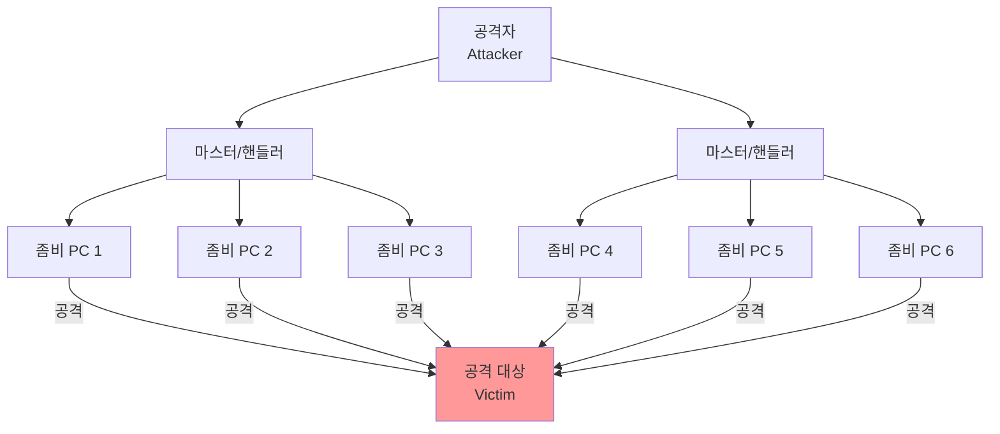
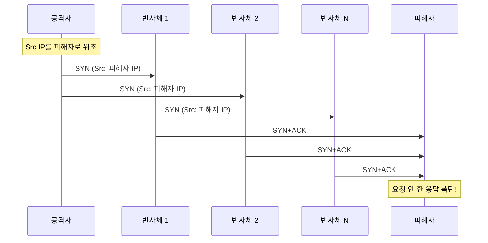
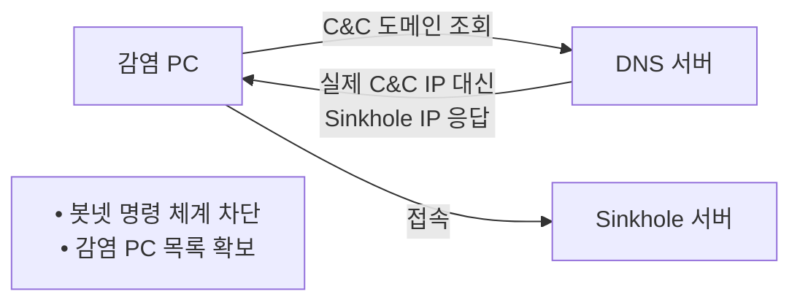

## 🌐 개요 (Overview)

**DDoS (Distributed Denial of Service)** 는 감염된 수많은 PC (좀비 PC)를 원격에서 조종하여 동시에 공격 대상에게 다량의 패킷을 전송하는 공격입니다.

## 🏗️ DDoS 공격 구조



### 구성 요소

| 구성 요소 | 역할 |
|----------|------|
| **공격자 (Attacker)** | 공격을 주도하고 명령을 내리는 해커 |
| **마스터 (Master/Handler)** | 공격자 명령을 중계하는 시스템 |
| **에이전트 (Agent/Zombie)** | 실제 공격 패킷을 전송하는 감염 PC |
| **공격 대상 (Victim)** | 공격을 받는 타겟 시스템 |

---

## 🔧 주요 DDoS 공격 도구

### 1. Trinoo (트리누)

**최초의 DDoS 도구**입니다.

| 항목 | 내용 |
|------|------|
| **공격 유형** | UDP Flooding |
| **통신** | 마스터-에이전트 간 **평문** |
| **탐지** | 비교적 쉬움 |
| **포트** | Master: 27665/TCP, Agent: 27444/UDP |

### 2. TFN (Tribe Flood Network)

Trinoo보다 발전된 도구입니다.

| 항목 | 내용 |
|------|------|
| **공격 유형** | UDP, TCP SYN, ICMP, Smurf |
| **통신** | ICMP Echo Reply 사용 |
| **암호화** | 없음 |

### 3. Stacheldraht (슈타헬드라트)

독일어로 **"철조망"** 을 의미합니다.

| 항목 | 내용 |
|------|------|
| **기반** | TFN 기반 발전 |
| **통신** | **암호화** (탐지 어려움) |
| **특징** | 에이전트 **자동 업데이트** 기능 |
| **포트** | 16660/TCP (암호화 통신) |

### 4. TFN2K

TFN의 발전형으로 **탐지 회피 기능이 강화**되었습니다.

| 항목 | 내용 |
|------|------|
| **공격 유형** | TCP, UDP, ICMP 복합 공격 |
| **통신** | **암호화** (CAST-256) |
| **포트** | **임의 변경** |
| **회피** | Decoy 패킷으로 위장 |

---

## 📊 DDoS 도구 비교

| 도구 | 공격 유형 | 통신 암호화 | 탐지 난이도 |
|------|----------|:----------:|:-----------:|
| **Trinoo** | UDP | ❌ | 쉬움 |
| **TFN** | UDP, SYN, ICMP | ❌ | 보통 |
| **Stacheldraht** | UDP, SYN, ICMP | ✅ | 어려움 |
| **TFN2K** | 복합 | ✅ | 매우 어려움 |

---

## 🔄 DRDoS (Distributed Reflection DoS)

**반사 서버를 이용한 분산 반사 서비스 거부 공격**입니다.

### 공격 원리



**과정**:
1. 공격자가 **출발지 IP를 피해자 IP로 위조**
2. 정상 서버(반사체)들에게 연결 요청 전송
3. 반사체들이 응답을 **피해자에게 전송**
4. 피해자는 요청하지 않은 응답 패킷으로 마비

### DRDoS 특징 (공격자 관점)

| 특징 | 설명 |
|------|------|
| **은닉성** | 공격자는 반사체 뒤에 숨음 |
| **증폭 효과** | 반사체 대역폭 이용 (증폭) |
| **방어 어려움** | 반사체가 정상 서버라 차단 어려움 |

### 증폭 공격 유형

| 프로토콜 | 증폭 비율 | 포트 |
|----------|:--------:|:----:|
| **DNS** | ~50x | 53/UDP |
| **NTP** | ~550x | 123/UDP |
| **SSDP** | ~30x | 1900/UDP |
| **Memcached** | ~50,000x | 11211/UDP |
| **SNMP** | ~6x | 161/UDP |

---

## 🌐 애플리케이션 계층 공격 (L7)

네트워크 대역폭이 아닌 **웹 서버/애플리케이션 자원**을 고갈시킵니다.

### HTTP GET Flooding

정상 TCP 연결 후 **처리 비용 높은 URL에 반복 요청**합니다.

```http
GET /search?q=expensive_query HTTP/1.1
Host: target.com
(반복...)
```

**특징**: 적은 트래픽으로 웹 서버 마비

### HULK (HTTP Unbearable Load King)

**URL 파라미터를 매번 변경**하여 캐시 우회합니다.

```http
GET /page?id=12345&rand=abc123 HTTP/1.1
GET /page?id=12345&rand=xyz789 HTTP/1.1
GET /page?id=12345&rand=def456 HTTP/1.1
(매번 다른 파라미터)
```

**효과**: 캐시 사용 불가 → 매번 새로운 처리

### Slowloris (Slow HTTP Header)

**HTTP 헤더를 완성하지 않고 천천히** 전송하여 연결을 점유합니다.

```http
GET / HTTP/1.1
Host: target.com
X-a: b
(... \r\n\r\n 미전송, 천천히 헤더 추가 ...)
(Connection Pool 소진)
```

**원리**: 헤더 종료 표시 (`\r\n\r\n`)를 보내지 않아 서버가 계속 대기

### RUDY (R-U-Dead-Yet? / Slow HTTP POST)

**Content-Length를 크게 설정**하고 데이터를 **매우 천천히** 전송합니다.

```http
POST /form HTTP/1.1
Host: target.com
Content-Length: 1000000
Content-Type: application/x-www-form-urlencoded

a  (1바이트씩 천천히 전송...)
```

**원리**: 
- `Content-Length: 1000000` 설정
- 실제 데이터는 1바이트씩 아주 느리게 전송
- 서버는 전체 데이터가 올 때까지 연결 유지

### Slow 공격 비교

| 공격 | 대상 | 원리 |
|------|------|------|
| **Slowloris** | HTTP 헤더 | 헤더 미완성 (`\r\n\r\n` 미전송) |
| **RUDY** | HTTP POST Body | 큰 Content-Length + 느린 전송 |

---

## 🛡️ DDoS 대응

### 네트워크 수준

| 방법 | 설명 |
|------|------|
| **Ingress Filtering** | 스푸핑된 IP 차단 |
| **Egress Filtering** | 내부에서 스푸핑 방지 |
| **Null Routing** | 공격 트래픽을 Null0로 폐기 |
| **uRPF** | IP Spoofing 차단 |

### DNS Sinkhole

**봇넷의 C&C 서버 접속을 우회**시키는 기법입니다.



### 보안 솔루션

| 솔루션 | 역할 |
|--------|------|
| **CDN/Scrubbing Center** | 트래픽 분산/정화 |
| **WAF** | L7 공격 필터링 |
| **IPS** | 공격 패턴 탐지/차단 |
| **DDoS 전용 장비** | 임계치/행위 기반 방어 |

---

## 📊 DDoS 공격 계층 분류

| 계층 | 공격 유형 | 특징 |
|:----:|----------|------|
| **L3/L4** | SYN Flood, UDP Flood | 대역폭/연결 고갈 |
| **L7** | HTTP Flood, Slowloris | 애플리케이션 자원 고갈 |
| **반사형** | DRDoS (DNS, NTP Amplification) | 증폭 효과 |

## 🔗 연결 문서 (Related Documents)

- [[dos-attacks]] - 서비스 거부 공격 (단일)
- [[malware-types]] - 봇넷과 악성코드
- [[router-acl-security]] - ACL과 Ingress Filtering
- [[firewall-ids-ips]] - 방화벽과 IDS/IPS
