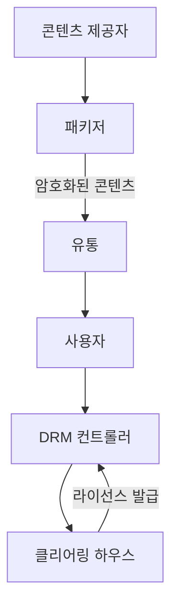
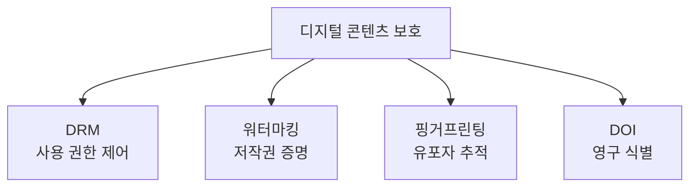

## 🌐 개요 (Overview)

**디지털 콘텐츠 보호**는 저작권을 보호하고 불법 복제를 방지하기 위한 기술입니다.

---

## 🔐 DRM (Digital Rights Management)

### 정의

디지털 콘텐츠의 **생성, 유통, 이용** 전 과정에서 **사용 권한을 제어**하고 불법 복제를 방지하는 기술입니다.

### 구성 요소



| 구성 요소 | 역할 |
|----------|------|
| **콘텐츠 제공자** | 콘텐츠 생성, DRM 패키징 의뢰 |
| **패키저** | 콘텐츠 암호화 + 메타데이터 결합 |
| **클리어링 하우스** | 라이선스 발급, 저작권료 정산 |
| **DRM 컨트롤러** | 사용자 디바이스에서 권한 통제 |

### 보호 방식

| 방식 | 설명 |
|------|------|
| **암호화** | 권한 없이 재생 불가 |
| **라이선스** | 재생 횟수, 기간, 기기 제한 |
| **복사 방지** | 화면 캡처, 복사 차단 |

---

## 🖼️ 디지털 워터마킹 (Digital Watermarking)

### 정의

디지털 콘텐츠에 **저작권자 정보**를 **인간이 인지할 수 없도록** 삽입하는 기술입니다.

### 분류

| 유형 | 특징 | 용도 |
|------|------|------|
| **강성 (Robust)** | 압축/변환에도 유지 | **저작권 보호** |
| **연성 (Fragile)** | 변조 시 깨짐 | **무결성 검증** |

```plaintext
강성 워터마킹: "내 저작물임을 증명"
연성 워터마킹: "변조되었는지 검증"
```

### 요구사항

| 요구사항 | 설명 |
|----------|------|
| **비가시성** | 육안으로 보이지 않음 |
| **강인성** | 공격에도 살아남음 |
| **용량** | 충분한 정보 삽입 |
| **보안성** | 제거/위조 어려움 |

---

## 👤 핑거프린팅 (Fingerprinting)

### 정의

워터마킹과 유사하지만, 저작권자가 아닌 **구매자 정보**를 삽입합니다.

### 목적

**불법 유포자 추적 (Traitor Tracing)** - 누가 최초로 유출했는지 추적

### 워터마킹 vs 핑거프린팅

| 특성 | 워터마킹 | 핑거프린팅 |
|------|---------|-----------|
| **삽입 정보** | 저작권자 | **구매자** |
| **목적** | 저작권 증명 | **유포자 추적** |
| **삽입 시점** | 제작 시 | 배포 시 |

```plaintext
워터마킹: "이건 A회사 저작물"
핑거프린팅: "이건 고객 B가 구매한 것"
```

---

## ⚔️ 워터마킹 공격 기법

| 공격 | 설명 |
|------|------|
| **Mosaic Attack** | 이미지를 잘게 쪼개 웹에서 조립 |
| **Copy Attack** | 타인의 워터마크를 복사해 붙여넣기 |
| **Stirmark** | 기하학적 변형으로 워터마크 왜곡 |

---

## 📖 DOI (Digital Object Identifier)

### 정의

디지털 저작물에 **영구적인 식별 번호**를 부여하는 시스템입니다.

### 특징

| 특징 | 설명 |
|------|------|
| **영구성** | URL이 변해도 DOI는 불변 |
| **유일성** | 전 세계에서 유일한 식별자 |
| **용도** | 논문, 데이터셋 식별 |

```plaintext
예: doi:10.1000/xyz123

URL: https://doi.org/10.1000/xyz123
→ 실제 콘텐츠 위치로 리다이렉트
```

---

## 📊 기술 비교

| 기술 | 목적 | 방식 |
|------|------|------|
| **DRM** | 불법 복제 방지 | 암호화 + 라이선스 |
| **워터마킹** | 저작권 증명 | 정보 삽입 |
| **핑거프린팅** | 유포자 추적 | 구매자 정보 삽입 |
| **DOI** | 콘텐츠 식별 | 영구 식별자 |



## 🔗 연결 문서 (Related Documents)

- [[cryptography-basics]] - 암호화 기술
- [[identity-management]] - DRM 클리어링하우스
- [[security-fundamentals]] - 무결성, 기밀성
