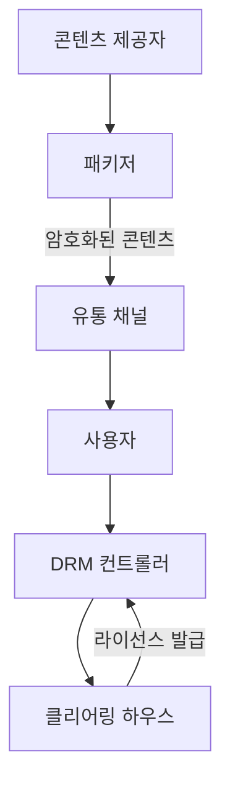
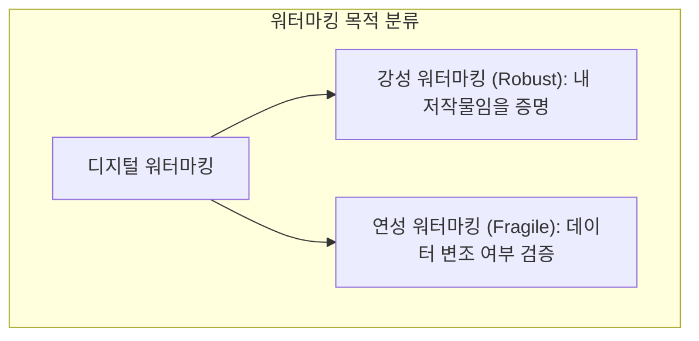
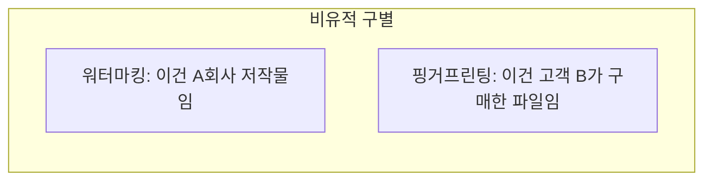
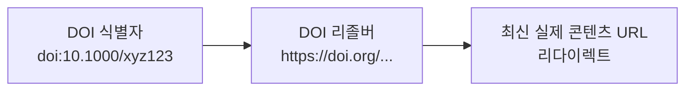
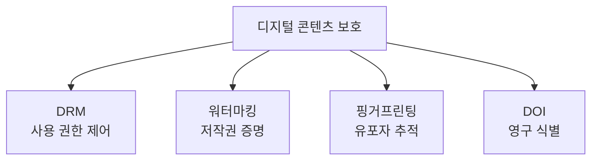

## 🌐 개요 (Overview)

**디지털 콘텐츠 보호**는 저작권을 보호하고 불법 복제를 방지하기 위한 기술입니다.

---

## 🔐 DRM (Digital Rights Management)

### 정의
디지털 콘텐츠의 **생성, 유통, 이용** 전 과정에서 **사용 권한을 제어**하고 불법 복제를 방지하는 기술입니다.

### 구성 요소

```mermaid
graph TD
    CP[콘텐츠 제공자] --> PKG[패키저]
    PKG --> |암호화된 콘텐츠| DIST[유통 채널]
    DIST --> USER[사용자]
    
    USER --> CTRL[DRM 컨트롤러]
    CTRL --> CH[클리어링 하우스]
    CH --> |라이선스 발급| CTRL
```

| 구성 요소 | 역할 |
|----------|------|
| **콘텐츠 제공자** | 콘텐츠 생성, DRM 패키징 의뢰 |
| **패키저** | 콘텐츠 암호화 + 메타데이터 결합 |
| **클리어링 하우스** | 라이선스 발급, 저작권료 정산 |
| **DRM 컨트롤러** | 사용자 디바이스에서 권한 통제 |

### 보호 방식

| 방식 | 설명 |
|------|------|
| **암호화** | 권한 없이 재생 불가 |
| **라이선스** | 재생 횟수, 기간, 기기 제한 |
| **복사 방지** | 화면 캡처, 복사 차단 |

---

## 🖼️ 디지털 워터마킹 (Digital Watermarking)

### 정의
디지털 콘텐츠에 **저작권자 정보**를 **인간이 인지할 수 없도록** 은닉하여 삽입하는 기술입니다.

### 분류

| 유형 | 특징 | 주요 용도 |
|------|------|------|
| **강성 (Robust)** | 이미지 압축/변환에도 손상되지 않고 유지됨 | **저작권 증명 및 소유권 주장** |
| **연성 (Fragile)** | 미세한 변조 시에도 워터마크가 깨짐 | **무결성 및 위변조 검증** |

```mermaid
graph TD
    subgraph "워터마킹 목적 분류"
        WM[디지털 워터마킹]
        WM --> Robust["강성 워터마킹 (Robust): 내 저작물임을 증명"]
        WM --> Fragile["연성 워터마킹 (Fragile): 데이터 변조 여부 검증"]
    end
```

---

## 👤 핑거프린팅 (Fingerprinting)

### 정의
워터마킹과 유사하지만, 저작권자 정보 대신 **구매자(사용자) 정보**를 보이지 않게 삽입하는 기술입니다.

### 목적
**불법 유포자 추적 (Traitor Tracing)** - 최초로 원본 콘텐츠를 유출한 사람을 적발하기 위해 사용됩니다.

👉 **상세 비교 노트**: [Watermarking vs Fingerprinting](watermarking-vs-fingerprinting.md)

### 워터마킹 vs 핑거프린팅 핵심 요약

| 특성 | 워터마킹 | 핑거프린팅 |
|------|---------|-----------|
| **삽입 정보** | **저작권자 (제작자)** | **구매자 (사용자)** |
| **주요 목적** | 저작권 소유권 증명 | **불법 유포자 추적 (Traitor Tracing)** |
| **삽입 시점** | 제작 / 패키징 시 | 구매 / 배포 시 |

```mermaid
graph LR
    subgraph "비유적 구별"
        WM["워터마킹: 이건 A회사 저작물임"]
        FP["핑거프린팅: 이건 고객 B가 구매한 파일임"]
    end
```

---

## ⚔️ 워터마킹 공격 기법

| 공격 | 설명 |
|------|------|
| **Mosaic Attack** | 이미지를 잘게 쪼개어 웹상에서 재조합함으로써 워터마크 검출을 회피 |
| **Copy Attack** | 타인의 워터마크를 복사하여 무관한 타 콘텐츠에 이식 |
| **Stirmark** | 기하학적 미세 변형(회전, 확대, 축소)으로 워터마크를 왜곡시키는 대표적인 공격 도구 |

---

## 📖 DOI (Digital Object Identifier)

### 정의
디지털 저작물에 **영구적인 식별 번호**를 부여하는 시스템입니다.

### 특징

| 특징 | 설명 |
|------|------|
| **영구성** | URL 이 변해도 DOI 는 불변 유지 |
| **유일성** | 전 세계에서 유일한 식별자 |
| **용도** | 학술 논문, 특허, 데이터셋 식별 |

```mermaid
graph LR
    DOI["DOI 식별자<br/>doi:10.1000/xyz123"] --> Resolver["DOI 리졸버<br/>https://doi.org/..."]
    Resolver --> Target["최신 실제 콘텐츠 URL<br/>리다이렉트"]
```

---

## 📊 기술 비교

| 기술 | 목적 | 주요 방식 |
|------|------|------|
| **DRM** | 불법 복제 및 무단 사용 방지 | 암호화 + 라이선스 기반 접근 통제 |
| **워터마킹** | 저작권 증명 | 원작자 정보 비가시적 삽입 |
| **핑거프린팅** | 불법 유포자 추적 | 구매자 정보 비가시적 삽입 |
| **DOI** | 디지털 콘텐츠 식별 | 영구 식별자 및 리다이렉션 |

```mermaid
graph TD
    DCP[디지털 콘텐츠 보호]
    
    DCP --> DRM[DRM<br/>사용 권한 제어]
    DCP --> WM[워터마킹<br/>저작권 증명]
    DCP --> FP[핑거프린팅<br/>유포자 추적]
    DCP --> DOI[DOI<br/>영구 식별]
```

---

## 🔗 연결 문서 (Related Documents)

- [watermarking-vs-fingerprinting](watermarking-vs-fingerprinting.md) - 워터마킹 vs 핑거프린팅 상세 비교 노트
- [cryptography-basics](fundamentals/cryptography-basics.md) - 암호화 및 해시 기술
- [identity-management](fundamentals/identity-management.md) - DRM 클리어링하우스 및 사용자 신원 관리
- [security-fundamentals](fundamentals/security-fundamentals.md) - 무결성 및 기밀성 보안 속성
