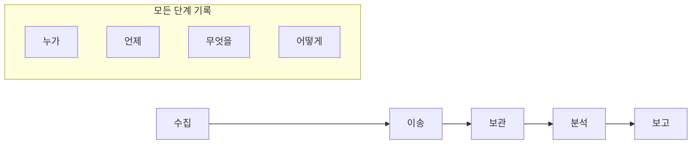
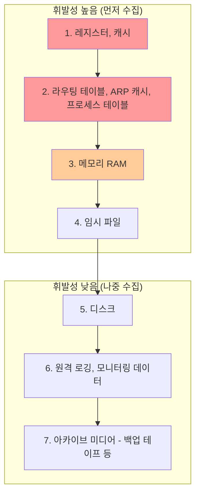

## 🌐 개요 (Overview)

**디지털 포렌식(Digital Forensics)** 은 컴퓨터나 디지털 기기에서 법적 증거를 수집, 보존, 분석하는 과학적 기법입니다. 사이버 범죄 수사, 보안 사고 분석, 법적 분쟁에 활용됩니다.

## 📜 기본 원칙

법적 효력을 갖기 위해 다음 원칙을 준수해야 합니다.

| 원칙 | 설명 |
|------|------|
| **정당성 (Legitimacy)** | 적법한 절차에 의해 수집되어야 함 |
| **재현성 (Reproducibility)** | 동일한 조건에서 항상 동일한 결과 |
| **신속성 (Promptness)** | 휘발성 데이터 소실 방지를 위해 신속 진행 |
| **연계 보관성 (Chain of Custody)** | 증거의 모든 처리 과정이 기록되어야 함 |
| **무결성 (Integrity)** | 수집된 증거가 원본과 동일해야 함 |

### 연계 보관성 (Chain of Custody)



**기록 내용**:
- 증거 발견 일시 및 장소
- 수집자 정보
- 이송 경로 및 담당자
- 보관 장소 및 조건
- 분석 과정 및 결과

---

## 📊 증거 수집 순서

### 휘발성 순서 (Order of Volatility)

**전원이 꺼지면 사라지는 데이터**를 먼저 수집합니다.



### 휘발성 데이터 수집

```bash
# 현재 시간 기록
date
hwclock

# 네트워크 연결 상태
netstat -an
ss -tlnp

# ARP 캐시
arp -a

# 라우팅 테이블
route -n
ip route

# 실행 중인 프로세스
ps aux
top -b -n 1

# 열린 파일
lsof

# 로그인 사용자
who
w
last

# 메모리 덤프 (별도 도구 필요)
# 예: LiME, fmem
```

### 비휘발성 데이터 수집

```bash
# 디스크 이미지 생성 (비트 단위 복사)
dd if=/dev/sda of=/forensic/disk.img bs=4M conv=noerror,sync

# 해시값 계산 (무결성 검증)
md5sum /dev/sda > /forensic/disk.md5
sha256sum /dev/sda > /forensic/disk.sha256

# 더 빠른 이미지 생성 도구
dcfldd if=/dev/sda of=/forensic/disk.img hash=md5,sha256
```

---

## 🔍 분석 기법

### 파일시스템 분석

```bash
# 삭제된 파일 복구
foremost -i disk.img -o /recovered

# 파일시스템 타임라인
fls -r -m / disk.img > timeline.body
mactime -b timeline.body > timeline.txt

# 파일 카빙 (Carving)
scalpel disk.img -o /carved
```

### 메모리 분석 (Volatility)

```bash
# 프로파일 확인
vol.py -f memory.dmp imageinfo

# 프로세스 목록
vol.py -f memory.dmp --profile=Win7SP1x64 pslist
vol.py -f memory.dmp --profile=Win7SP1x64 pstree

# 네트워크 연결
vol.py -f memory.dmp --profile=Win7SP1x64 netscan

# 악성코드 탐지
vol.py -f memory.dmp --profile=Win7SP1x64 malfind
```

### 로그 분석

```bash
# 시스템 로그 분석
grep -r "Failed password" /var/log/auth.log
grep -r "Accepted" /var/log/auth.log

# Apache 로그 분석 (SQL Injection 탐지)
grep -E "(union|select|insert|delete|update|drop)" /var/log/apache2/access.log

# 타임라인 생성
cat /var/log/syslog | awk '{print $1,$2,$3,$5,$0}' | sort
```

---

## 🛡️ 안티 포렌식 (Anti-Forensic)

포렌식 분석을 **방해하는 기술**입니다.

### 데이터 삭제/파괴

| 기법 | 설명 |
|------|------|
| **Wiping** | 데이터를 여러 번 덮어쓰기 |
| **Degaussing** | 강한 자기장으로 데이터 삭제 (HDD) |
| **물리적 파괴** | 디스크 파쇄 |

```bash
# 안전한 삭제 (여러 번 덮어쓰기)
shred -vfz -n 10 /path/to/file

# 디스크 전체 와이핑
dd if=/dev/urandom of=/dev/sda bs=4M
```

### 데이터 은닉

| 기법 | 설명 |
|------|------|
| **스테가노그래피** | 이미지/음악 파일 안에 데이터 숨기기 |
| **슬랙 공간** | 파일시스템의 미사용 공간에 숨기기 |
| **ADS (Windows)** | NTFS의 대체 데이터 스트림에 숨기기 |

```bash
# 스테가노그래피 탐지
steghide info image.jpg
stegdetect image.jpg
```

### 암호화

```plaintext
- 전체 디스크 암호화 (BitLocker, LUKS)
- 파일/폴더 암호화 (VeraCrypt)
- 키 없이는 분석 불가능
```

---

## 🛠️ 주요 도구

### 디스크 이미징

| 도구 | 설명 |
|------|------|
| **dd** | Unix 기본 이미징 도구 |
| **dcfldd** | dd의 포렌식 버전 (해시 병행) |
| **FTK Imager** | GUI 기반 이미징 도구 (Windows) |
| **Guymager** | GUI 기반 (Linux) |

### 분석 도구

| 도구 | 분야 |
|------|------|
| **Autopsy** | 종합 포렌식 플랫폼 |
| **Sleuth Kit** | 파일시스템 분석 |
| **Volatility** | 메모리 분석 |
| **Wireshark** | 네트워크 패킷 분석 |
| **Foremost/Scalpel** | 파일 카빙 |

### 상용 도구

| 도구 | 회사 |
|------|------|
| **EnCase** | Guidance Software |
| **FTK** | AccessData |
| **X-Ways** | X-Ways Software |

---

## 📋 포렌식 절차

### 1. 준비 (Preparation)

```plaintext
- 포렌식 키트 준비 (부팅 USB, 케이블, 저장 매체)
- 문서화 도구 준비 (카메라, 노트)
- 해시 검증 도구 준비
```

### 2. 식별 (Identification)

```plaintext
- 증거가 될 수 있는 기기 식별
- 현장 사진 촬영
- 담당자 면담
```

### 3. 수집 (Collection)

```plaintext
- 휘발성 순서대로 수집
- 원본 보존 (쓰기 방지 장치 사용)
- 비트 단위 이미지 생성
- 해시값 기록
```

### 4. 분석 (Analysis)

```plaintext
- 타임라인 분석
- 삭제된 파일 복구
- 악성코드 분석
- 로그 분석
```

### 5. 보고 (Reporting)

```plaintext
- 발견 사항 문서화
- 기술적/비기술적 보고서 작성
- 증거 목록 및 해시값 첨부
```

---

## 🔗 연결 문서 (Related Documents)

- [[linux-log-management]] - 로그 분석
- [[malware-types]] - 악성코드 분석
- [[cryptography-basics]] - 암호화와 해시
- [[linux-security-tools]] - 보안 도구
