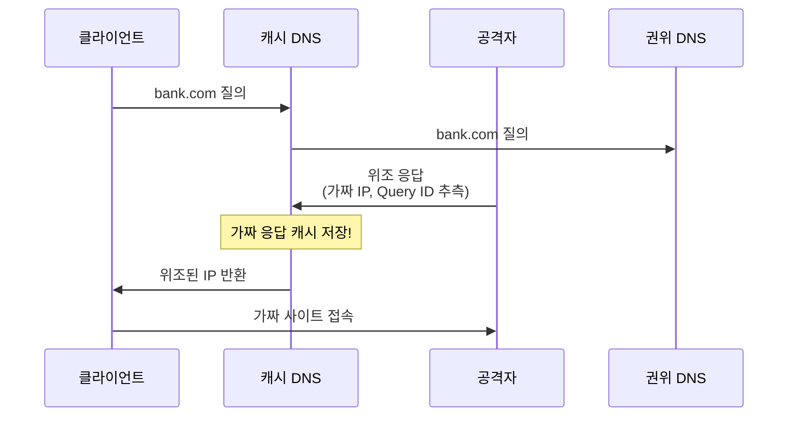
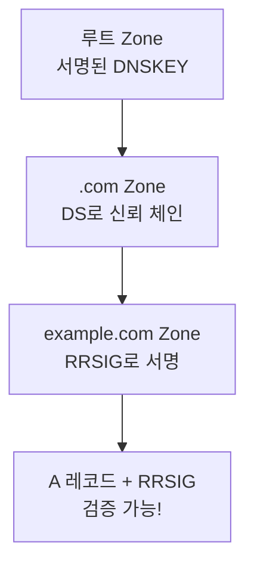

## 🌐 개요 (Overview)

**DNS (Domain Name System)** 는 도메인 이름을 IP 주소로 변환하는 인터넷 핵심 인프라입니다. 인증 없이 동작하므로 다양한 공격에 취약합니다.

## 📋 DNS 기본 개념

### DNS 질의 유형

| 유형 | 설명 |
|------|------|
| **Recursive Query** | 캐시 DNS가 최종 IP까지 반복 질의 |
| **Iterative Query** | 참조할 DNS 서버 정보만 반환 |

### Zone Transfer (존 전송)

**Master 네임서버 → Slave 네임서버**로 DNS 데이터를 동기화합니다.

```plaintext
목적: DNS 서버 간 Zone 파일 복제
포트: TCP 53
```

---

## 🚨 DNS 공격 및 취약점

### 1. DNS Cache Poisoning (DNS Spoofing)

**DNS 캐시에 위조된 IP 정보를 저장**시켜 사용자를 가짜 사이트로 유도합니다.



**공격 원리**:
1. 공격자가 **Transaction ID (Query ID)** 를 추측
2. 정상 응답보다 먼저 위조 응답 전송
3. DNS 캐시에 위조 정보 저장
4. 이후 모든 요청이 가짜 사이트로 연결

**피해**: 피싱 (Phishing), 파밍 (Pharming)

### 대응 방안

| 방법 | 설명 |
|------|------|
| **랜덤 Query ID** | 추측 어렵게 |
| **랜덤 소스 포트** | 응답 위조 어렵게 |
| **TTL 최적화** | 캐시 시간 적절히 설정 |
| **DNSSEC** | 전자서명으로 무결성 검증 |

---

### 2. Zone Transfer 정보 유출

**비인가 대상에게 전체 Zone 파일이 노출**됩니다.

```bash
# 공격 시도
dig @ns1.example.com example.com AXFR

# 결과: 모든 DNS 레코드 노출
; example.com.			86400	IN	SOA	ns1.example.com.
mail.example.com.	3600	IN	A	192.168.1.10
vpn.example.com.	3600	IN	A	192.168.1.20
db.example.com.		3600	IN	A	192.168.1.30
```

**위험**: 내부 서버 목록, 네트워크 구조 노출

### 대응 방안

```bind
# BIND 설정 (named.conf)
zone "example.com" {
    type master;
    file "example.com.zone";
    allow-transfer { 192.168.1.2; };  # Slave 서버만 허용
};
```

---

### 3. DNS Amplification Attack (증폭 공격)

[[ddos-attacks]] DRDoS의 일종입니다.

```plaintext
1. 공격자: Src IP를 피해자로 위조
2. 공격자 → 개방 DNS 서버: 큰 응답 유발 질의
3. DNS 서버 → 피해자: 대량 응답 (증폭)
```

**증폭률**: 약 50배

---

## 🔐 DNSSEC (DNS Security Extensions)

**전자서명**으로 DNS 데이터의 **무결성과 인증**을 제공합니다.

### 특징

| 항목 | 내용 |
|------|------|
| **제공** | 무결성, 인증 |
| **미제공** | ❌ 기밀성 (암호화 아님) |
| **기술** | 공개키 전자서명 |

### 주요 레코드

| 레코드 | 역할 |
|--------|------|
| **RRSIG** | 리소스 레코드 서명 |
| **DNSKEY** | Zone 서명에 사용한 공개키 |
| **DS** | 상위 Zone에서 하위 Zone 신뢰 체인 |
| **NSEC/NSEC3** | 존재하지 않는 레코드 증명 |

### 동작 원리



---

## 📊 DNS 보안 체크리스트

```plaintext
✅ DO
- Zone Transfer 제한 (allow-transfer)
- 최신 DNS 소프트웨어 유지
- DNSSEC 적용
- DNS 로그 모니터링
- 랜덤 Query ID/포트 사용

❌ DON'T
- 모든 IP에 Zone Transfer 허용
- 오래된 BIND 버전 사용
- DNS 서버 공개 재귀 질의 허용
```

---

## 📋 DNS 관련 레코드

| 레코드 | 용도 |
|--------|------|
| **A** | 도메인 → IPv4 |
| **AAAA** | 도메인 → IPv6 |
| **MX** | 메일 서버 |
| **NS** | 네임서버 |
| **CNAME** | 별칭 |
| **TXT** | 텍스트 정보 (SPF, DKIM 등) |
| **PTR** | IP → 도메인 (역방향) |

## 🔗 연결 문서 (Related Documents)

- [[ddos-attacks]] - DNS Amplification
- [[attack-types]] - 네트워크 공격 유형
- [[network-diagnostic-tools]] - nslookup, dig
