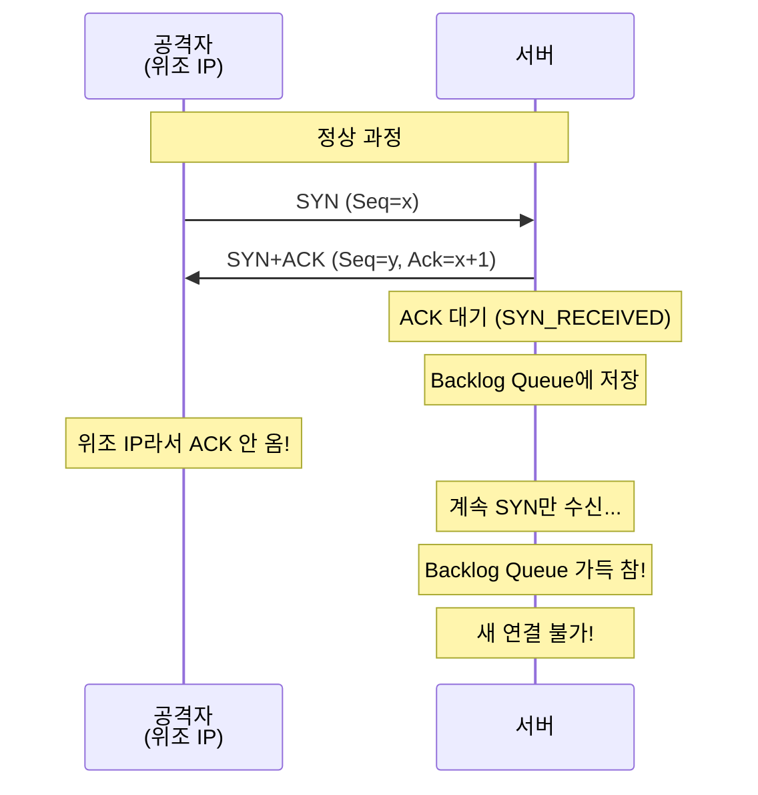
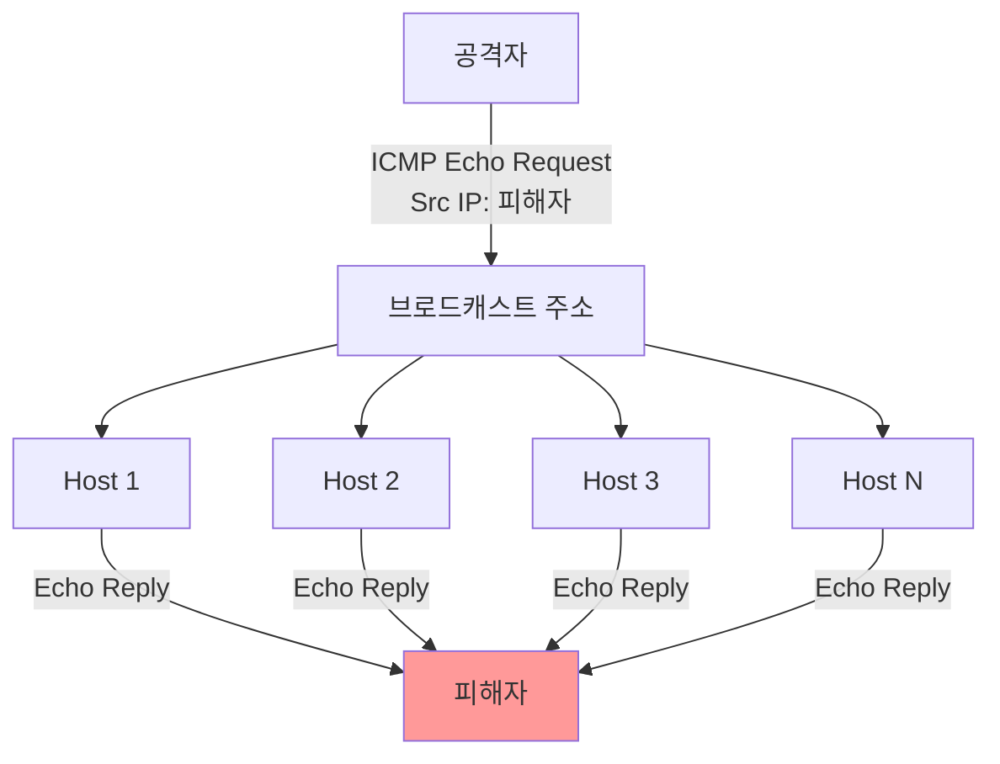
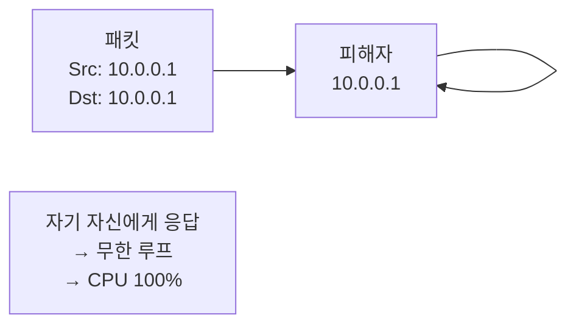

## 🌐 개요 (Overview)

**서비스 거부 공격 (DoS: Denial of Service)** 은 시스템이나 네트워크의 **가용성(Availability)** 을 침해하는 공격입니다. 정상 사용자가 서비스에 접근하지 못하도록 방해합니다.

## 📋 DoS 공격 특징

| 특징 | 설명 |
|------|------|
| **목적** | 시스템 가용성 침해 (데이터 유출/변조 아님) |
| **추적 어려움** | IP 스푸핑으로 공격 원점 숨김 |
| **피해** | 서비스 중단, 시스템 다운 |

---

## ⚡ 1. SYN Flooding 공격

TCP **3-Way Handshake의 취약점**을 이용한 공격입니다.

### 공격 원리



**과정**:
1. 공격자가 **존재하지 않는 IP로 위조**하여 다량의 SYN 전송
2. 서버는 SYN+ACK 응답 후 **SYN_RECEIVED** 상태로 대기
3. **Backlog Queue**에 정보 저장하고 ACK 대기
4. 위조 IP이므로 ACK 안 옴 → Queue 가득 참
5. **정상 연결 요청 수락 불가**

### 대응 방법

| 방법 | 설명 |
|------|------|
| **SYN Cookies** | ACK 올 때까지 리소스 할당 안 함 (쿠키로 검증) |
| **Backlog Queue 증가** | 대기 큐 크기 확대 |
| **Timeout 단축** | ACK 대기 시간 축소 |
| **IP 차단** | 비정상 IP 대역 필터링 |

```bash
# Linux SYN Cookies 활성화
sysctl -w net.ipv4.tcp_syncookies=1

# Backlog Queue 증가
sysctl -w net.ipv4.tcp_max_syn_backlog=4096
```

---

## ⚡ 2. UDP Flooding 공격

**UDP의 비연결성**을 이용한 공격입니다.

### 공격 원리

```plaintext
1. 공격자 → 대상 시스템의 임의 포트로 대량 UDP 패킷 전송
2. 시스템: 해당 포트에 서비스 있는지 확인
3. 없으면 ICMP Destination Unreachable 응답 시도
4. CPU/메모리/대역폭 고갈
```

### 대응

```bash
# 불필요한 UDP 서비스 비활성화
# 방화벽에서 Rate Limiting
iptables -A INPUT -p udp --dport 53 -m limit --limit 10/s -j ACCEPT
iptables -A INPUT -p udp -j DROP
```

---

## ⚡ 3. Smurf 공격

**ICMP Echo (Ping)** 와 **브로드캐스트**를 이용한 **증폭 공격**입니다.

### 공격 원리



**과정**:
1. 공격자가 **출발지 IP를 피해자 IP로 위조**
2. 네트워크 **브로드캐스트 주소**로 ICMP Echo Request 전송
3. 네트워크의 **모든 호스트가 피해자에게 Echo Reply 전송**
4. 피해자는 트래픽 폭탄으로 마비

### 증폭 효과

```plaintext
예: 브로드캐스트 네트워크에 100대 호스트
공격자 1개 패킷 → 피해자 100개 패킷 수신 (100배 증폭)
```

### 대응

```cisco
! 라우터에서 Directed Broadcast 차단
Router(config-if)# no ip directed-broadcast

! ICMP 응답 비활성화
sysctl -w net.ipv4.icmp_echo_ignore_broadcasts=1
```

---

## ⚡ 4. Ping of Death 공격

**규정보다 큰 패킷**을 전송하여 버퍼 오버플로우를 유발합니다.

### 공격 원리

```plaintext
IP 패킷 최대 크기: 65,535 bytes

공격:
- 65,535 bytes 초과하는 ICMP 패킷 생성
- 전송 시 단편화됨
- 수신 측에서 재조합 시 버퍼 오버플로우!
```

### 대응

- 방화벽에서 비정상 크기 패킷 차단
- OS 패치 (현대 OS는 모두 수정됨)

---

## ⚡ 5. Teardrop 공격

IP **단편화 Offset 값 조작**으로 재조합 오류를 유발합니다.

### 공격 원리

```plaintext
정상 단편화:
[Frag 1: offset=0, length=100]
[Frag 2: offset=100, length=100]

Teardrop (중첩):
[Frag 1: offset=0, length=100]
[Frag 2: offset=50, length=100]  ← 중첩!

→ 재조합 시 시스템 크래시
```

### 대응

- 중첩된 fragment 탐지/차단
- OS 패치

---

## ⚡ 6. Land 공격

**출발지 IP = 목적지 IP**로 설정하여 무한 루프를 유발합니다.

### 공격 원리



### 대응

```cisco
! 라우터/방화벽에서 필터링
access-list 110 deny ip host 10.0.0.1 host 10.0.0.1
```

---

## ⚡ 7. 기타 단편화 공격

### Tiny Fragment

TCP 헤더가 쪼개질 정도로 **아주 작은 조각**을 만들어 **IDS/방화벽 우회**.

```plaintext
첫 번째 조각: IP 헤더 + TCP 헤더 일부 (포트 번호 없음)
두 번째 조각: 나머지 TCP 헤더 + 데이터

→ 방화벽이 포트 검사 못함
```

### Fragment Overlap

단편화 조각 재조합 시 **덮어쓰기**로 악성 코드 숨기기.

### Bonk / Boink

**순서 번호 (Sequence Number)** 조작:
- **Bonk**: 모든 조각의 시퀀스를 1로 설정
- **Boink**: 중간에 순서 어긋나게 전송

---

## ⚡ 8. WinNuke (OOB Attack)

Windows **NetBIOS 포트 (139)** 로 **OOB (Out of Band)** 긴급 데이터를 전송하여 **블루스크린**을 유발합니다.

```plaintext
공격 대상: Windows 95, NT
포트: TCP 139 (NetBIOS)
원리: URG 플래그 + OOB 데이터 → 처리 불가 → BSOD
```

---

## 📊 DoS 공격 요약표

| 공격 | 프로토콜 | 원리 | 대응 |
|------|----------|------|------|
| **SYN Flooding** | TCP | Backlog Queue 고갈 | SYN Cookies |
| **UDP Flooding** | UDP | 대역폭/CPU 고갈 | Rate Limiting |
| **Smurf** | ICMP | 브로드캐스트 증폭 | Directed BC 차단 |
| **Ping of Death** | ICMP | 오버사이즈 패킷 | 패킷 크기 검사 |
| **Teardrop** | IP | Offset 중첩 | OS 패치 |
| **Land** | TCP | Src=Dst 루프 | IP 필터링 |
| **WinNuke** | TCP | OOB 데이터 | 포트 차단/패치 |

## 🔗 연결 문서 (Related Documents)

- [[ddos-attacks]] - 분산 서비스 거부 공격
- [[tcp-udp-protocols]] - TCP/UDP 프로토콜
- [[icmp-protocol]] - ICMP 프로토콜
- [[firewall-ids-ips]] - 방화벽과 IDS/IPS
