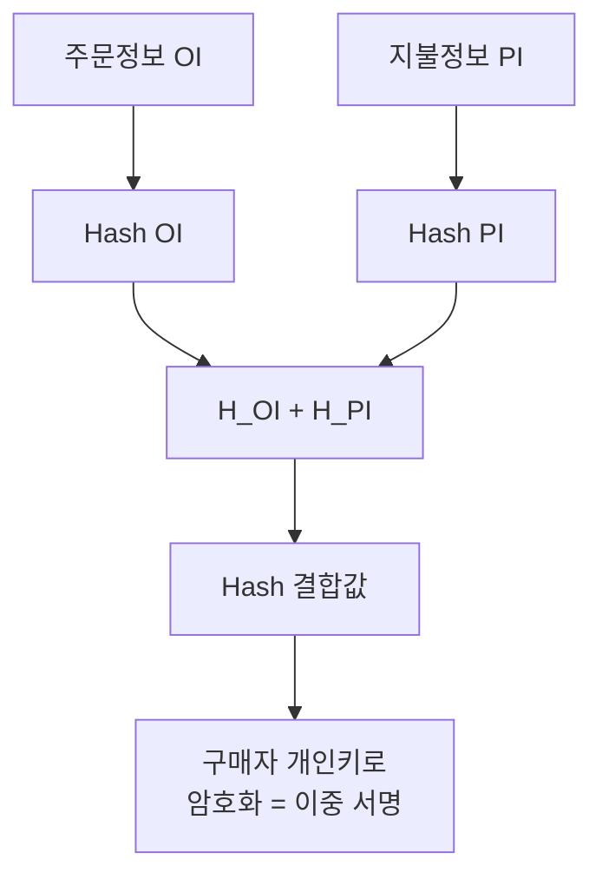
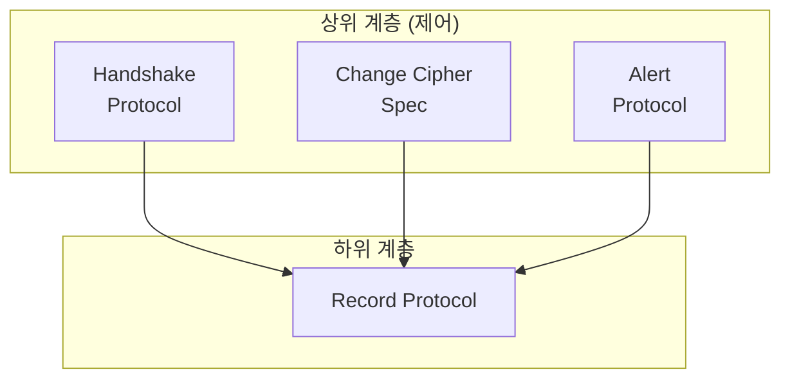
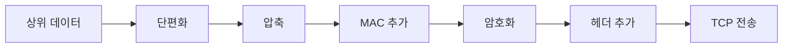
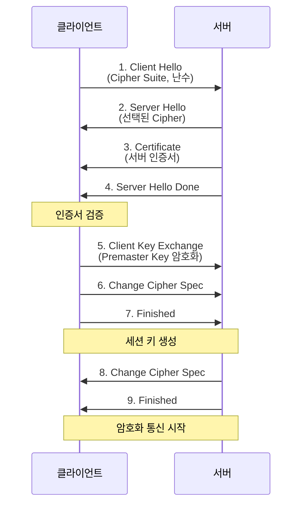
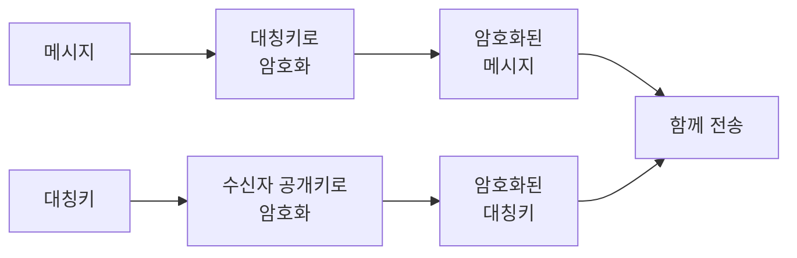

## 🌐 개요 (Overview)

**전자상거래 보안**은 인터넷 결제 시 **기밀성, 무결성, 인증, 부인방지**를 보장하는 기술입니다.

## 📋 전자상거래 구성 요소

| 구성 요소 | 역할 |
|----------|------|
| **구매자 (Card Holder)** | 카드로 결제하는 사람 |
| **판매자 (Merchant)** | 상품 판매, 결제 요청 |
| **PG (Payment Gateway)** | 상점-금융망 중계 |
| **발급사 (Issuer)** | 구매자에게 카드 발급 |
| **CA (인증기관)** | 인증서 발급 |

---

## 🔐 SET (Secure Electronic Transaction)

**Visa와 MasterCard**가 개발한 신용카드 전용 결제 프로토콜입니다.

### 특징

| 장점 | 단점 |
|------|------|
| SSL보다 높은 보안성 | 복잡한 암호화 |
| 정보 분리 보호 | 전용 S/W 필요 |
| 이중 서명 | 구현 어려움 |

### 핵심: 이중 서명 (Dual Signature) ⭐

**구매자의 프라이버시를 보호**하는 핵심 기술입니다.

#### 목적

| 정보 | 상점이 알 수 있는 것 | PG/카드사가 알 수 있는 것 |
|------|-------------------|------------------------|
| **OI (주문정보)** | ✅ | ❌ |
| **PI (지불정보)** | ❌ | ✅ |

```plaintext
상점: "뭘 샀는지는 알지만, 카드 정보는 모른다"
카드사: "얼마 결제했는지는 알지만, 뭘 샀는지는 모른다"
```

#### 이중 서명 생성 과정



```plaintext
이중 서명 = E_PrivateKey( Hash( Hash(OI) + Hash(PI) ) )
```

#### 정보 전송

| 받는 곳 | 전송 내용 |
|--------|----------|
| **상점** | OI 원본 + Hash(PI) + 이중 서명 |
| **PG** | PI 원본 + Hash(OI) + 이중 서명 |

#### 검증 과정

```plaintext
상점의 검증:
1. 받은 OI에서 Hash(OI) 계산
2. 받은 Hash(PI)와 결합
3. 결합값의 해시 계산
4. 이중 서명 복호화 결과와 비교 → 일치하면 유효!

(상점은 PI 원본을 모르지만 검증 가능!)
```

---

## 🔒 SSL/TLS 상세

[[network-security-protocols]] 기본 내용 참조

### 프로토콜 구조



| 프로토콜 | 역할 |
|----------|------|
| **Handshake** | 인증, 암호화 협상, 키 교환 |
| **Change Cipher Spec** | 협상된 파라미터 적용 알림 |
| **Alert** | 오류/경고 통보 |
| **Record** | 단편화, 압축, MAC, 암호화 수행 |

### Record Protocol 처리 순서



### SSL Handshake 과정 ⭐



### Handshake 핵심 단계

| 단계 | 설명 |
|------|------|
| **Client Hello** | 지원 암호화 방식, 난수 전송 |
| **Server Hello** | 암호화 방식 선택, 서버 인증서 |
| **Premaster Key** | 클라이언트가 서버 공개키로 암호화 전송 |
| **Session Key** | 양측이 동일 세션키 생성 (대칭키) |

### 인증 유형

| 유형 | 설명 |
|------|------|
| **서버 인증** | 필수 (인증서 제공) |
| **클라이언트 인증** | 선택 (서버가 요청 시) |

---

## 📊 SET vs SSL 비교

| 특성 | SET | SSL/TLS |
|------|-----|---------|
| **개발** | Visa/MasterCard | Netscape |
| **용도** | 결제 전용 | 범용 |
| **정보 분리** | ✅ 이중 서명 | ❌ |
| **부인방지** | ✅ | ❌ 별도 필요 |
| **구현** | 복잡 (별도 S/W) | 간편 (브라우저 내장) |
| **현재 사용** | ❌ 거의 없음 | ✅ 주류 |

---

## 🔑 전자봉투 (Digital Envelope)

**기밀성**을 위한 하이브리드 암호화 기법입니다.



**역할**:
- 대칭키의 **키 배송 문제** 해결
- 공개키의 **속도 문제** 해결

---

## 🌐 ebXML 보안

**B2B 전자상거래** XML 기반 표준입니다.

| 기술 | 역할 |
|------|------|
| **XML Signature** | XML 문서의 전자서명 (무결성, 인증) |
| **XML Encryption** | 엘리먼트 단위 암호화 (기밀성) |
| **XKMS** | PKI 기능을 서버에 위임 |
| **SAML** | 인증/권한 정보 교환 ([[authentication-authorization|SSO]]) |

---

## 📱 무선 보안 (WPKI)

| 기술 | 설명 |
|------|------|
| **WAP** | 무선 통신 프로토콜 |
| **WTLS** | 무선용 TLS (최적화) |
| **WPKI** | 무선용 PKI (인증서 경량화) |

## 🔗 연결 문서 (Related Documents)

- [[network-security-protocols]] - SSL/TLS 기본
- [[cryptography-basics]] - 암호화 기초
- [[biometrics-otp]] - OTP
- [[authentication-authorization]] - SAML, SSO
