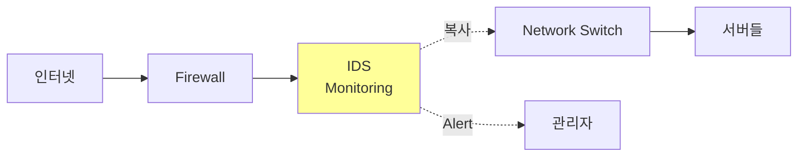
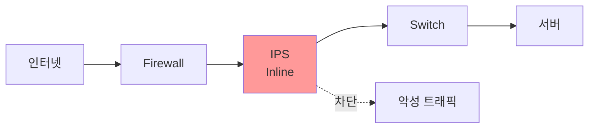

## 🌐 개요 (Overview)

네트워크 보안의 핵심 방어 시스템인 방화벽, IDS, IPS는 각각 다른 방식으로 네트워크를 보호합니다.

## 🔥 방화벽 (Firewall)

### 방화벽 세대별 발전


### 방화벽 유형 비교

| 유형 | 검사 계층 | 상태 추적 | 성능 | 보안성 |
|------|-----------|----------|------|--------|
| **Packet Filter** | L3-L4 | ❌ | 매우 빠름 | 낮음 |
| **Stateful** | L3-L4 | ✅ | 빠름 | 중간 |  
| **Application** | L7 | ✅ | 느림 | 높음 |
| **NGFW** | L3-L7 | ✅ | 중간 | 매우 높음 |

### 패킷 필터링 방화벽

```bash
# iptables 예시
iptables -P INPUT DROP          # 기본 정책: 차단
iptables -A INPUT -p tcp --dport 22 -j ACCEPT  # SSH 허용
iptables -A INPUT -p tcp --dport 80 -j ACCEPT  # HTTP 허용
iptables -A INPUT -m state --state ESTABLISHED,RELATED -j ACCEPT
```

**장점**: 빠른 속도
**단점**: 애플리케이션 제어 불가

### 상태 추적 방화벽 (Stateful Firewall)

**연결 상태 테이블**:
```
SRC_IP    DST_IP      SPORT  DPORT  STATE
10.0.0.1  8.8.8.8     12345  53     ESTABLISHED
10.0.0.2  192.168.1.1 54321  443    NEW
```

**장점**: 
- 동적 포트 개방/차단
- TCP 시퀀스 검증

### 차세대 방화벽 (NGFW)

**주요 기능**:
1. **애플리케이션 제어**: YouTube 차단, Facebook 허용
2. **사용자 기반 정책**: "마케팅 팀은 LinkedIn 허용"
3. **IPS 통합**: 공격 패턴 차단
4. **SSL/TLS 복호화**: 암호화 트래픽 검사
5. **위협 인텔리전스**: 실시간 위협 DB 연동

## 🛡️ IDS (Intrusion Detection System)

### IDS 배치



**특징**:
- **수동적**: 탐지만 수행, 차단 안 함
- **Out-of-band**: 네트워크 경로 밖

### IDS vs IPS

| 특성 | IDS | IPS |
|------|-----|-----|
| **동작 모드** | Passive (감시) | Active (차단) |
| **위치** | Out-of-band | In-line |
| **응답** | 경고만 | 차단 가능 |
| **오탐 영향** | 로그만 | 서비스 차단 위험 |
| **성능** | 영향 없음 | 병목 가능 |

### 탐지 방식

#### 1. 시그니처 기반 (Signature-based)

```
Rule: alert tcp any any -> $HOME_NET 80 (
    msg:"SQL Injection Attempt";
    content:"SELECT"; 
    content:"FROM";
    sid:1000001;
)
```

**장점**: 낮은 오탐률
**단점**: 알려지지 않은 공격 탐지 불가 (Zero-day)

#### 2. 이상 행위 기반 (Anomaly-based)

**정상 행동 프로파일**:
```
평균 트래픽: 100 Mbps
평균 연결 수: 500/sec
```

**이상 탐지**:
```
현재 트래픽: 1000 Mbps (⚠️ 10배 증가)
현재 연결: 50000/sec (⚠️ DDoS 의심)
```

**장점**: Zero-day 공격 탐지 가능
**단점**: 높은 오탐률

### Snort 규칙 예시

```bash
# HTTP GET 공격 탐지
alert tcp any any -> $HTTP_SERVERS 80 (
    msg:"HTTP GET Buffer Overflow";
    flow:to_server,established;
    content:"GET ";
    content:!"|0a|";
    byte_test:1,>,200,0,relative;
    sid:1000002;
)

# SSH 무차별 대입 공격
alert tcp any any -> $HOME_NET 22 (
    msg:"SSH Brute Force Attempt";
    flow:to_server,established;
    detection_filter:track by_src, count 5, seconds 60;
    sid:1000003;
)
```

## ⚔️ IPS (Intrusion Prevention System)

### In-line 배치



### IPS 동작 모드

1. **차단 모드 (Prevention)**
   - 공격 패킷 드롭
   - 연결 종료
   - 공격자 IP 차단

2. **감지 모드 (Detection)**
   - IDS처럼 동작
   - 로그만 기록
   - 테스트/튜닝 용도

### False Positive 관리

```
오탐 (False Positive): 정상을 공격으로 판단
→ 정상 서비스 차단 (심각!)

미탐 (False Negative): 공격을 정상으로 판단
→ 공격 허용
```

**해결 방법**:
- 화이트리스트: 신뢰 IP 예외 처리
- 규칙 튜닝: 환경에 맞게 조정
- 임계값 조정: 탐지 민감도 설정

## 🔍 HIDS vs NIDS

| 특성 | HIDS (Host-based) | NIDS (Network-based) |
|------|-------------------|----------------------|
| **위치** | 각 호스트 | 네트워크 구간 |
| **탐지 대상** | 파일 변조, 로그 분석 | 네트워크 패킷 |
| **암호화 트래픽** | ✅ 복호화 후 탐지 | ❌ 탐지 불가 |
| **성능 영향** | 호스트 부하 | 네트워크 분석 부하 |
| **예시** | OSSEC, Wazuh | Snort, Suricata |

## 💡 실무 배치 전략

### 심층 방어 (Defense in Depth)

```
Internet
   ↓
[외부 방화벽]
   ↓
[IPS]
   ↓
[DMZ] - 웹 서버
   ↓
[내부 방화벽]
   ↓
[IDS]
   ↓
[내부 네트워크] - DB 서버
   ↓
[HIDS on Servers]
```

### UTM (Unified Threat Management)

**통합 보안 장비**:
- 방화벽 + IPS + 안티바이러스
- Web 필터링
- VPN
- DLP (Data Loss Prevention)

**장점**: 통합 관리
**단점**: 단일 장애점

## 🔗 연결 문서 (Related Documents)

- [[network-security-protocols]] - 네트워크 암호화
- [[attack-types]] - 탐지 대상 공격 유형
- [[tcp-ip-model]] - 네트워크 계층별 보안
