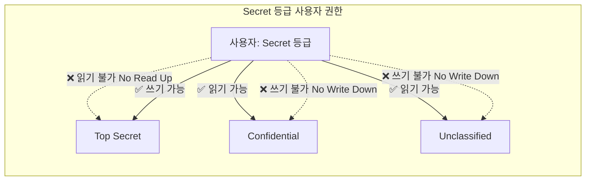
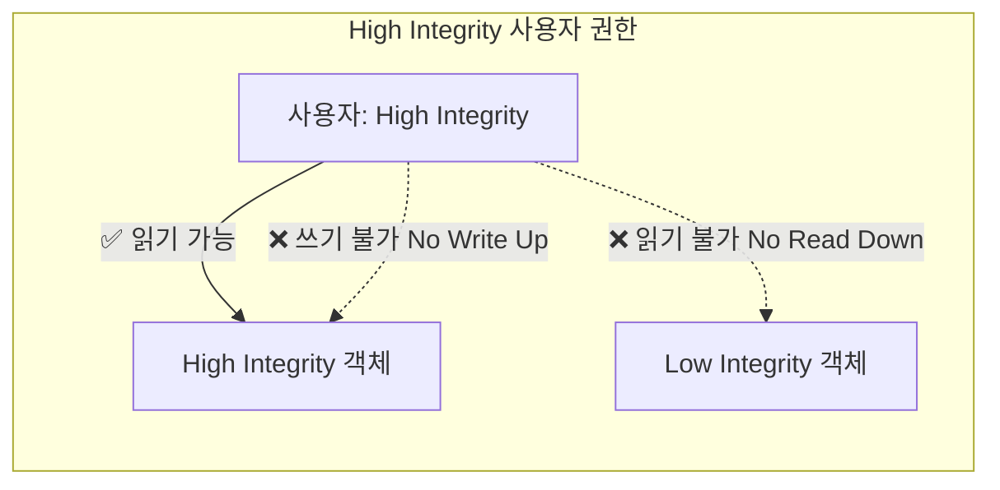
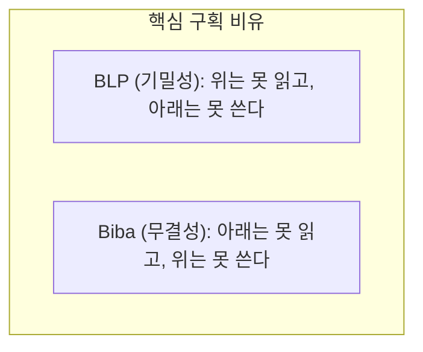
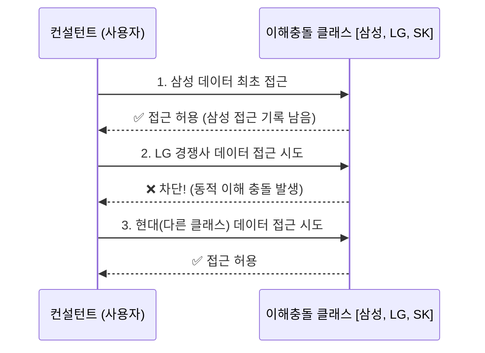

## 🌐 개요 (Overview)

**접근통제 모델**은 보안 정책을 이론적으로 정립한 모델로, 시스템이 **기밀성** 또는 **무결성**을 보장하도록 접근 규칙을 정의합니다.

---

## 🔐 벨 - 라파듈라 모델 (BLP: Bell-LaPadula)

### 목적
**기밀성 (Confidentiality)** 유지에 중점을 둡니다. (미국 국방부 군사 보안 시스템을 위해 개발)

### 규칙

| 규칙 | 이름 | 설명 |
|------|------|------|
| **No Read Up** | 단순 보안 속성 | 낮은 등급 주체는 **높은 등급 객체를 읽을 수 없다** |
| **No Write Down** | *- 속성 (Star Property) | 높은 등급 주체는 **낮은 등급 객체에 쓸 수 없다** (하위 등급 유출 방지) |

### 접근 예시 (User: Secret 등급)

---

## 🛡️ 비바 모델 (Biba)

### 목적
**무결성 (Integrity)** 보장에 중점을 둡니다. BLP 의 **역방향(Dual)** 모델입니다.

### 규칙

| 규칙 | 이름 | 설명 |
|------|------|------|
| **No Read Down** | 단순 무결성 속성 | 높은 등급 주체는 **낮은 등급 객체를 읽을 수 없다** (오염된 데이터 수용 방지) |
| **No Write Up** | *- 무결성 속성 | 낮은 등급 주체는 **높은 등급 객체에 쓸 수 없다** (중요 데이터 변조 방지) |

### 접근 예시 (User: High Integrity 등급)

---

## 📊 BLP vs Biba 비교

👉 **상세 비교 노트**: [BLP vs Biba Model](blp-vs-biba.md)

| 항목 | BLP 모델 | Biba 모델 |
|------|-----|------|
| **핵심 목표** | **기밀성 (Confidentiality)** | **무결성 (Integrity)** |
| **읽기 규칙** | **No Read Up** | **No Read Down** |
| **쓰기 규칙** | **No Write Down** | **No Write Up** |
| **주요 목적** | 정보 유출 방지 | 정보 변조 및 오염 방지 |
| **주요 용도** | 군사/정부 보안 시스템 | 금융/상업 데이터베이스 |

---

## 🏢 클락 - 윌슨 모델 (Clark-Wilson)

### 목적
**상업용 무결성** 보장을 위해 개발되었습니다.

### 특징

| 특징 | 설명 |
|------|------|
| **직무 분리** | Separation of Duty (단일 사용자의 오남용 방지) |
| **트랜잭션 처리** | 잘 정의된 프로시저(TP)로만 데이터 변경 허용 |
| **인가된 실수 방지** | 비인가 변조뿐만 아니라 인가된 사용자의 실수에 의한 무결성 훼손도 방지 |

### 구성 요소

| 요소 | 설명 |
|------|------|
| **CDI (Constrained Data Item)** | 무결성이 보장되어야 하는 핵심 데이터 |
| **UDI (Unconstrained Data Item)** | 무결성이 검증되지 않은 외부 입력 데이터 |
| **TP (Transformation Procedure)** | CDI 를 조작하는 인가된 트랜잭션 절차 |
| **IVP (Integrity Verification Procedure)** | CDI 의 무결성 상태를 검증하는 절차 |

---

## 🏯 만리장성 모델 (Chinese Wall)

### 목적
**이해 충돌 (Conflict of Interest)** 방지

### 특징

| 특징 | 설명 |
|------|------|
| **동적 권한** | 접근 이력에 따라 사용자 권한이 **동적으로 변경**됨 |
| **이해 충돌 클래스** | 경쟁 관계 기업군(예: 금융, IT 통신) 정의 |
| **최초 접근** | 임의 기업 데이터에 자유롭게 접근 허용 |
| **이후 접근** | 접근했던 기업과 동일한 충돌 클래스 내 타 경쟁 기업 접근 **차단** |

### 동작 시나리오

---

## 📋 보안 모델 요약

| 모델 | 중점 | 핵심 규칙 | 주요 용도 |
|------|------|------|------|
| **BLP** | 기밀성 | No Read Up, No Write Down | 군사/안보 |
| **Biba** | 무결성 | No Read Down, No Write Up | 상업/금융 |
| **Clark-Wilson** | 무결성 | TP(트랜잭션 절차), 직무 분리 | 비즈니스 프로세스 |
| **Chinese Wall** | 이해 충돌 | 동적 접근 제한 (접근 이력 기반) | 컨설팅/법무 |

---

## 🔗 연결 문서 (Related Documents)

- [blp-vs-biba](blp-vs-biba.md) - 벨-라파듈라 vs 비바 상세 비교 노트
- [authentication-authorization](authentication-authorization.md) - 접근통제 정책 (DAC, MAC, RBAC)
- [security-fundamentals](security-fundamentals.md) - CIA Triad (기밀성, 무결성, 가용성)
- [linux-account-security](../../linux/security/linux-account-security.md) - Linux 접근통제 및 사용자 권한 관리
