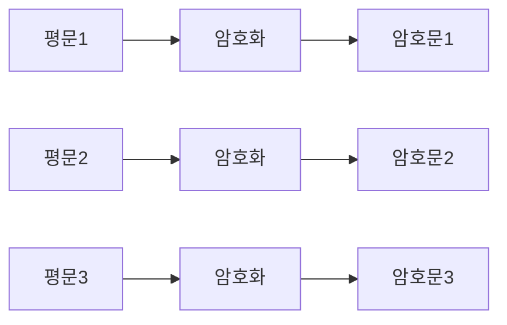
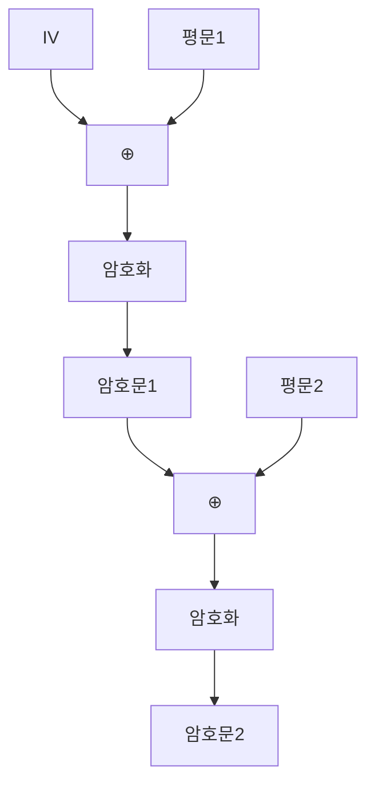
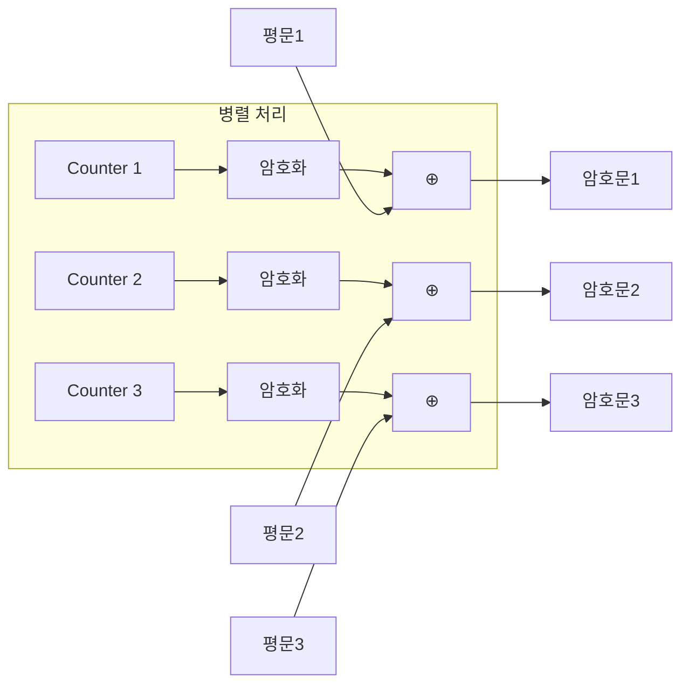

## 🌐 개요 (Overview)

**블록 암호 (Block Cipher)** 는 평문을 고정된 크기의 블록으로 나누어 암호화합니다. 긴 평문을 처리하기 위해 다양한 **운영 모드 (Modes of Operation)** 를 사용합니다.

## 📋 기본 용어

| 용어 | 정의 |
|------|------|
| **평문 (Plaintext)** | 암호화 전 원본 메시지 |
| **암호문 (Ciphertext)** | 암호화된 메시지 |
| **키 (Key)** | 암호화/복호화 비밀 매개변수 |
| **IV (초기화 벡터)** | 첫 블록 암호화에 사용되는 랜덤 값 |

---

## 🔓 암호 분석 (Cryptanalysis) 공격 분류

| 공격 | 약어 | 공격자가 알고 있는 것 |
|------|:----:|---------------------|
| **암호문 단독 공격** | COA | 암호문만 |
| **기지 평문 공격** | KPA | 암호문 + **일부 평문** |
| **선택 평문 공격** | CPA | 원하는 평문 → 암호문 획득 가능 |
| **선택 암호문 공격** | CCA | 원하는 암호문 → 평문 획득 가능 |

```plaintext
공격 난이도: COA < KPA < CPA < CCA

공개키 암호화는 CPA에 노출되어 있다고 가정
(누구나 공개키로 암호화 가능)
```

---

## 📦 스트림 암호 vs 블록 암호

| 특징 | 스트림 암호 | 블록 암호 |
|------|-----------|----------|
| **단위** | 비트/바이트 | 고정 블록 (64/128bit) |
| **속도** | 빠름 | 보통 |
| **에러 전파** | 없음 | 모드에 따라 다름 |
| **예시** | RC4, ChaCha20 | DES, AES |

---

## 🔐 블록 암호 운영 모드

### 1. ECB (Electronic Code Book)

가장 **단순**한 모드입니다.



| 항목 | 내용 |
|------|------|
| **동작** | 각 블록 독립적으로 암호화 |
| **병렬화** | ✅ 가능 |
| **에러 전파** | 해당 블록만 |
| **취약점** | 평문 패턴 → 암호문에 노출 |

```plaintext
❌ 단점:
- 같은 평문 블록 → 같은 암호문
- 이미지 암호화 시 윤곽 보임
- 재전송 공격, 사전 공격 취약
```

### 2. CBC (Cipher Block Chaining)

**가장 널리 사용**되는 모드입니다. (IPSec, SSL/TLS)



| 항목 | 내용 |
|------|------|
| **동작** | 이전 암호문과 XOR 후 암호화 |
| **IV** | 첫 블록은 IV와 XOR |
| **병렬화** | ❌ 불가 (암호화) / ✅ 가능 (복호화) |
| **에러 전파** | 해당 블록 + 다음 블록 |

```plaintext
✅ 장점:
- 같은 평문도 다른 암호문 생성
- 패턴 은폐
```

### 3. CFB (Cipher FeedBack)

블록 암호를 **스트림 암호처럼** 동작하게 합니다.

| 항목 | 내용 |
|------|------|
| **동작** | 이전 암호문을 암호화 → 키 스트림 생성 → 평문과 XOR |
| **패딩** | 불필요 |
| **에러 전파** | 해당 블록 + 이후 블록들 |
| **용도** | 실시간 전송 |

### 4. OFB (Output FeedBack)

**키 스트림을 미리 생성**할 수 있습니다.

| 항목 | 내용 |
|------|------|
| **동작** | 암호화 출력을 다시 입력으로 피드백 |
| **에러 전파** | ❌ 없음 (해당 비트만) |
| **용도** | 잡음 있는 채널 (영상, 음성) |

```plaintext
✅ 장점:
- 전송 에러에 강함
- 비트 오류가 해당 비트에만 영향
```

### 5. CTR (Counter)

**병렬 처리 최적화** 모드입니다.



| 항목 | 내용 |
|------|------|
| **동작** | 증가하는 카운터를 암호화 → 평문과 XOR |
| **병렬화** | ✅ 완전 가능 |
| **에러 전파** | ❌ 없음 |
| **속도** | 가장 빠름 |

---

## 📊 운영 모드 비교

| 모드 | IV | 병렬화 | 에러 전파 | 특징 |
|------|:--:|:------:|:---------:|------|
| **ECB** | ❌ | ✅ | 해당 블록 | 패턴 노출, **비권장** |
| **CBC** | ✅ | 복호화만 | 2블록 | **가장 널리 사용** |
| **CFB** | ✅ | ❌ | 이후 블록 | 스트림처럼 동작 |
| **OFB** | ✅ | ❌ | ❌ | 잡음 채널 적합 |
| **CTR** | Nonce | ✅ | ❌ | **최신 권장** |

---

## 🔐 주요 대칭키 알고리즘

| 알고리즘 | 블록 | 키 길이 | 구조 | 특징 |
|----------|:----:|:-------:|------|------|
| **DES** | 64bit | 56bit | Feistel | 1977년, 현재 취약 |
| **3DES** | 64bit | 168bit | Feistel | DES 3회, 느림 |
| **AES** | 128bit | 128/192/256 | SPN | **NIST 표준**, 빠름 |
| **IDEA** | 64bit | 128bit | 혼합 | PGP 사용 |
| **SEED** | 128bit | 128/256 | Feistel | **국내 KISA 표준** |
| **ARIA** | 128bit | 128/192/256 | SPN | **국내 공공기관** |

### Feistel vs SPN 구조

| 구조 | 특징 | 예시 |
|------|------|------|
| **Feistel** | 라운드마다 절반씩 처리 | DES, SEED |
| **SPN** | 대치(S-box) + 치환(P-box) | AES, ARIA |

---

## 🔑 비대칭키 알고리즘

| 알고리즘 | 기반 문제 | 용도 |
|----------|----------|------|
| **RSA** | 소인수분해 | 암호화, 서명 |
| **DH** | 이산대수 | **키 교환** |
| **ElGamal** | 이산대수 | 암호화 (2배 확장) |
| **ECC** | 타원곡선 이산대수 | **짧은 키**, 경량 환경 |

### ECC 키 길이 비교

```plaintext
ECC 160bit ≈ RSA 1024bit
ECC 256bit ≈ RSA 3072bit

→ 모바일, IoT에 적합
```

---

## #️⃣ 해시 함수

| 알고리즘 | 출력 | 상태 |
|----------|:----:|:----:|
| **MD5** | 128bit | ❌ 취약 |
| **SHA-1** | 160bit | ⚠️ 전환 중 |
| **SHA-256** | 256bit | ✅ 권장 |
| **SHA-512** | 512bit | ✅ 권장 |
| **HAS-160** | 160bit | 국내 표준 |

### MAC (Message Authentication Code)

**비밀키 + 해시**로 무결성과 인증을 동시에 제공합니다.

```plaintext
MAC = Hash(Key || Message)

- HMAC: Hash-based MAC
- 제3자 위조 불가
```

## 🔗 연결 문서 (Related Documents)

- [[cryptography-basics]] - 암호학 기초
- [[network-security-protocols]] - TLS/SSL
- [[authentication-authorization]] - 인증과 인가
