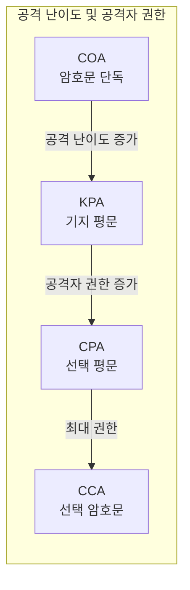
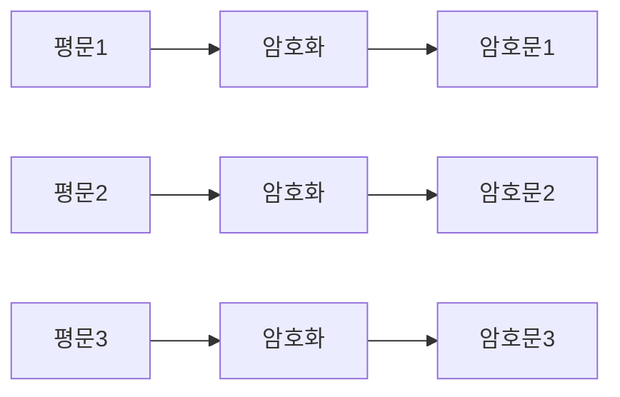
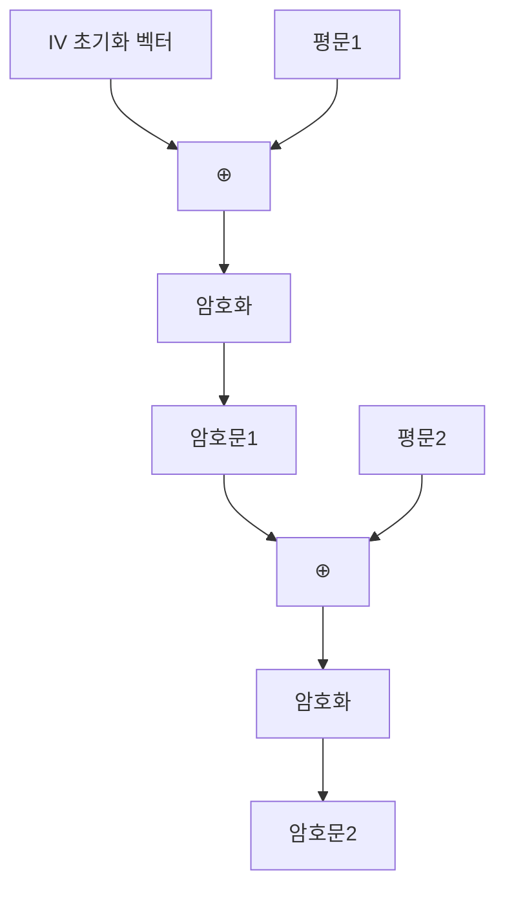
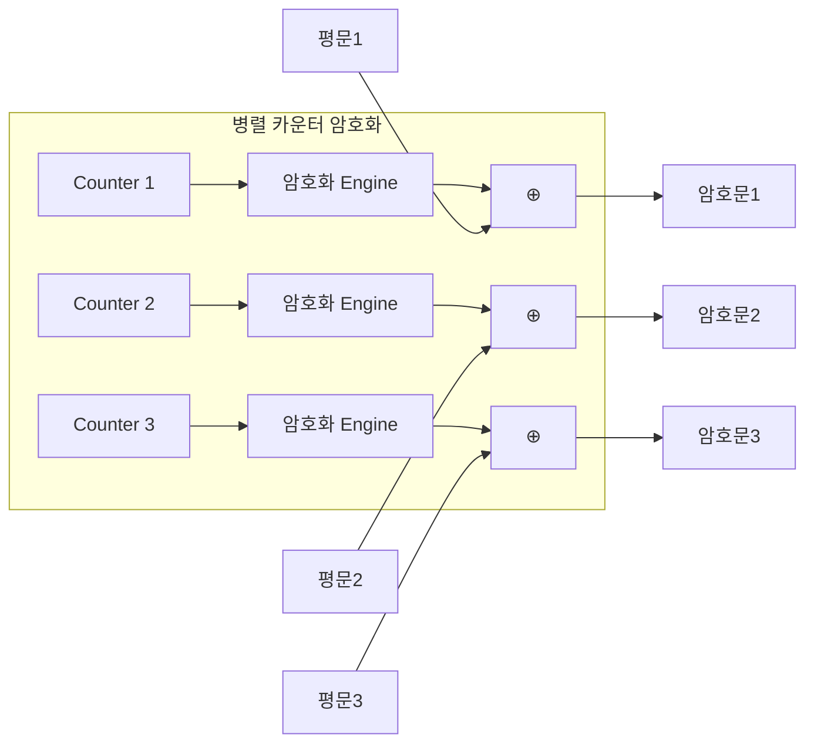
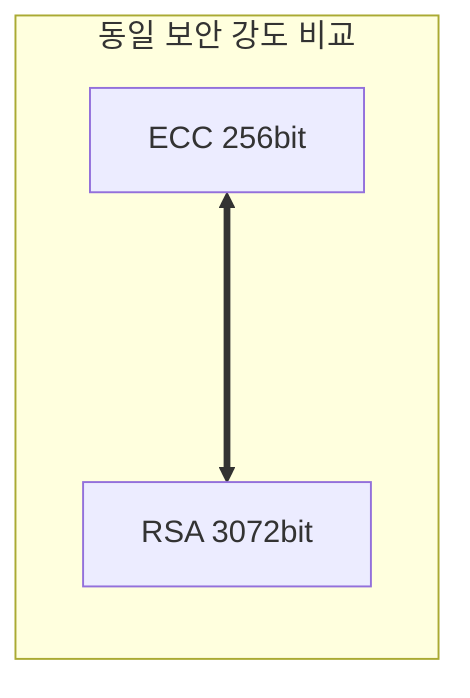
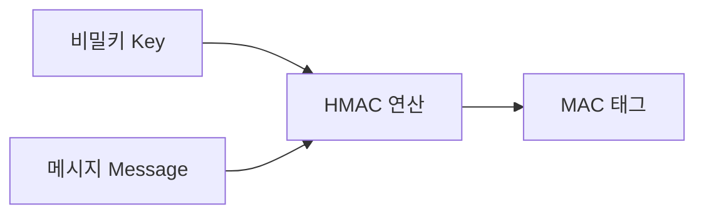

## 🌐 개요 (Overview)

**블록 암호 (Block Cipher)** 는 평문을 고정된 크기의 블록으로 나누어 암호화합니다. 긴 평문을 처리하기 위해 다양한 **운영 모드 (Modes of Operation)** 를 사용합니다.

---

## 📋 기본 용어

| 용어 | 정의 |
|------|------|
| **평문 (Plaintext)** | 암호화 전 원본 메시지 |
| **암호문 (Ciphertext)** | 암호화된 메시지 |
| **키 (Key)** | 암호화/복호화 비밀 매개변수 |
| **IV (초기화 벡터)** | 첫 블록 암호화에 사용되는 랜덤 값 |

---

## 🔓 암호 분석 (Cryptanalysis) 공격 분류

| 공격 | 약어 | 공격자가 알고 있는 것 |
|------|:----:|---------------------|
| **암호문 단독 공격** | COA | 암호문만 |
| **기지 평문 공격** | KPA | 암호문 + **일부 평문** |
| **선택 평문 공격** | CPA | 원하는 평문 $\rightarrow$ 암호문 획득 가능 |
| **선택 암호문 공격** | CCA | 원하는 암호문 $\rightarrow$ 평문 획득 가능 |

```mermaid
graph LR
    subgraph "공격 난이도 및 공격자 권한"
        COA[COA<br/>암호문 단독] -->|공격 난이도 증가| KPA[KPA<br/>기지 평문]
        KPA -->|공격자 권한 증가| CPA[CPA<br/>선택 평문]
        CPA -->|최대 권한| CCA[CCA<br/>선택 암호문]
    end
```

> [!NOTE]
> 공개키 암호화는 누구나 공개키로 원하는 평문을 암호화할 수 있으므로 기본적으로 **CPA(선택 평문 공격)** 환경에 노출되어 있다고 가정합니다.

---

## 📦 스트림 암호 vs 블록 암호 (Stream Cipher vs Block Cipher)

👉 **상세 비교 노트**: [Stream Cipher vs Block Cipher](stream-vs-block-cipher.md)

| 특징 | 스트림 암호 (Stream Cipher) | 블록 암호 (Block Cipher) |
|------|--------------------------|------------------------|
| **처리 단위** | 비트(bit) 또는 바이트(byte) 연속 연산 | 고정 블록 (64bit, 128bit) |
| **연산 속도** | 🚀 빠름 (실시간 처리) | ⚡ 보통 |
| **에러 전파** | ❌ 없음 (해당 비트에만 국한) | ⚠️ 모드에 따라 다름 (CBC는 2개 블록 전파) |
| **대표 알고리즘**| ChaCha20, RC4 | AES, DES, 3DES, SEED, ARIA |

---

## 🔐 블록 암호 운영 모드

### 1. ECB (Electronic Code Book)

가장 **단순**한 모드입니다.

```mermaid
graph LR
    P1[평문1] --> E1[암호화] --> C1[암호문1]
    P2[평문2] --> E2[암호화] --> C2[암호문2]
    P3[평문3] --> E3[암호화] --> C3[암호문3]
```

| 항목 | 내용 |
|------|------|
| **동작** | 각 블록을 독립적으로 암호화 |
| **병렬화** | ✅ 가능 |
| **에러 전파** | 해당 블록만 영향 |
| **취약점** | 동일한 평문 블록은 항상 동일한 암호문 블록 생성 $\rightarrow$ 패턴 노출 취약 |

> [!WARNING]
> ECB 모드는 동일한 데이터 패턴이 암호문 이미지 등에 그대로 노출되므로 실무에서 절대 사용을 금지합니다.

### 2. CBC (Cipher Block Chaining)

**가장 널리 사용**되는 모드 중 하나입니다. (IPSec, TLS 등)

```mermaid
graph TD
    IV[IV 초기화 벡터] --> XOR1[⊕]
    P1[평문1] --> XOR1
    XOR1 --> E1[암호화] --> C1[암호문1]
    
    C1 --> XOR2[⊕]
    P2[평문2] --> XOR2
    XOR2 --> E2[암호화] --> C2[암호문2]
```

| 항목 | 내용 |
|------|------|
| **동작** | 이전 블록의 암호문과 현재 평문 블록을 XOR 연산 후 암호화 |
| **IV** | 첫 번째 블록은 랜덤한 초기화 벡터(IV)와 XOR |
| **병렬화** | ❌ 암호화 시 불가 / ✅ 복호화 시 가능 |
| **에러 전파** | 해당 블록 + 다음 1개 블록까지 전파 |

### 3. CFB (Cipher FeedBack)

블록 암호를 **스트림 암호처럼** 동작하게 합니다.

| 항목 | 내용 |
|------|------|
| **동작** | 이전 암호문을 암호화하여 키 스트림을 생성한 후 평문과 XOR |
| **패딩** | ❌ 불필요 |
| **에러 전파** | 해당 블록 + 이후 블록 전파 |
| **용도** | 실시간 스트리밍 전송 |

### 4. OFB (Output FeedBack)

**키 스트림을 미리 생성**할 수 있는 모드입니다.

| 항목 | 내용 |
|------|------|
| **동작** | 암호화 알고리즘의 출력을 다시 입력으로 피드백하여 키 스트림 생성 |
| **에러 전파** | ❌ 없음 (해당 비트에만 영향) |
| **용도** | 전송 에러가 많은 잡음 채널 (음성, 영상 통신) |

### 5. CTR (Counter)

**병렬 처리 최적화** 모드입니다.

```mermaid
graph LR
    subgraph "병렬 카운터 암호화"
        CTR1[Counter 1] --> E1[암호화 Engine] --> XOR1[⊕]
        CTR2[Counter 2] --> E2[암호화 Engine] --> XOR2[⊕]
        CTR3[Counter 3] --> E3[암호화 Engine] --> XOR3[⊕]
    end
    
    P1[평문1] --> XOR1 --> C1[암호문1]
    P2[평문2] --> XOR2 --> C2[암호문2]
    P3[평문3] --> XOR3 --> C3[암호문3]
```

| 항목 | 내용 |
|------|------|
| **동작** | 1씩 증가하는 카운터(Counter) 값을 암호화하여 평문과 XOR |
| **병렬화** | ✅ 완전 가능 (암복호화 모두) |
| **에러 전파** | ❌ 없음 |
| **속도** | 가장 빠름 (현대 고속 네트워크 표준 권장) |

---

## 📊 운영 모드 종합 비교

| 모드 | IV / Nonce | 병렬화 (암/복) | 에러 전파 | 주요 특징 |
|------|:--:|:------:|:---------:|------|
| **ECB** | ❌ | ✅ / ✅ | 해당 블록 | 평문 패턴 노출, **사용 금지** |
| **CBC** | ✅ IV | ❌ / ✅ | 2개 블록 | 패턴 은폐, **파일 암호화 표준** |
| **CFB** | ✅ IV | ❌ / ✅ | 이후 블록 | 스트림 암호 방식 동작 |
| **OFB** | ✅ IV | ❌ / ❌ | ❌ 없음 | 전송 잡음 채널 적합 |
| **CTR** | ✅ Nonce | ✅ / ✅ | ❌ 없음 | **병렬 처리 최적화, 최신 권장** |

---

## 🔐 주요 대칭키 알고리즘

| 알고리즘 | 블록 크기 | 키 길이 | 구조 | 특징 |
|----------|:----:|:-------:|------|------|
| **DES** | 64bit | 56bit | Feistel | 1977년 취약, 사용 금지 |
| **3DES** | 64bit | 168bit | Feistel | DES 3회 반복, 느림 |
| **AES** | 128bit | 128/192/256 | SPN | **NIST 현행 표준**, 고속 연산 |
| **IDEA** | 64bit | 128bit | 혼합 | PGP에서 사용 |
| **SEED** | 128bit | 128/256 | Feistel | **국내 KISA 표준** |
| **ARIA** | 128bit | 128/192/256 | SPN | **국내 공공기관 표준** |

### Feistel vs SPN 구조

| 구조 | 특징 | 대표 예시 |
|------|------|------|
| **Feistel** | 라운드마다 입력 데이터를 절반씩 나누어 처리 (암/복호화 구조 동일) | DES, SEED |
| **SPN** | 대치(S-box)와 치환(P-box)을 번갈아 병렬로 전체 블록 처리 | AES, ARIA |

---

## 🔑 비대칭키 알고리즘 요약

| 알고리즘 | 기반 수학 문제 | 주요 용도 |
|----------|----------|------|
| **RSA** | 소인수분해의 어려움 | 암호화, 디지털 서명 |
| **DH** | 이산대수 문제 | **키 교환 전용** |
| **ElGamal** | 이산대수 문제 | 암호화, 디지털 서명 |
| **ECC** | 타원곡선 이산대수 문제 | **짧은 키 길이**, 경량/모바일 환경 |

### ECC 키 길이 보안성 비유

```mermaid
graph LR
    subgraph "동일 보안 강도 비교"
        ECC[ECC 256bit] <===> RSA[RSA 3072bit]
    end
```

---

## #️⃣ 해시 함수 & MAC

| 알고리즘 | 출력 크기 | 보안 상태 |
|----------|:----:|:----:|
| **MD5** | 128bit | ❌ 취약 (충돌 발견) |
| **SHA-1** | 160bit | ⚠️ 취약 (사용 폐지) |
| **SHA-256** | 256bit | ✅ 권장 |
| **SHA-512** | 512bit | ✅ 권장 |
| **HAS-160** | 160bit | 국내 레거시 표준 |

### MAC (Message Authentication Code)
**공유 비밀키 + 해시 함수**를 결합하여 **데이터 무결성**과 **송신자 인증**을 동시에 제공합니다.

```mermaid
graph LR
    Key[비밀키 Key] --> HMAC[HMAC 연산]
    Msg[메시지 Message] --> HMAC
    HMAC --> MAC[MAC 태그]
```

---

## 🔗 연결 문서 (Related Documents)

- [stream-vs-block-cipher](stream-vs-block-cipher.md) - 스트림 암호 vs 블록 암호 상세 비교
- [cryptography-basics](cryptography-basics.md) - 암호학 기초 개념
- [symmetric-vs-asymmetric-crypto](symmetric-vs-asymmetric-crypto.md) - 대칭키 vs 비대칭키 암호화 비교
- [network-security-protocols](../protocols/network-security-protocols.md) - TLS/SSL 프로토콜과 암호화
- [authentication-authorization](authentication-authorization.md) - 인증과 인가 메커니즘
