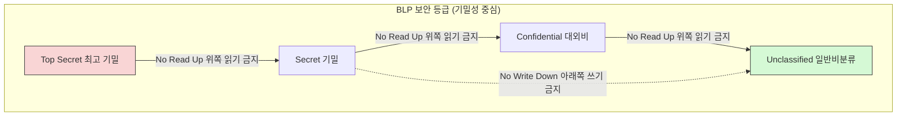
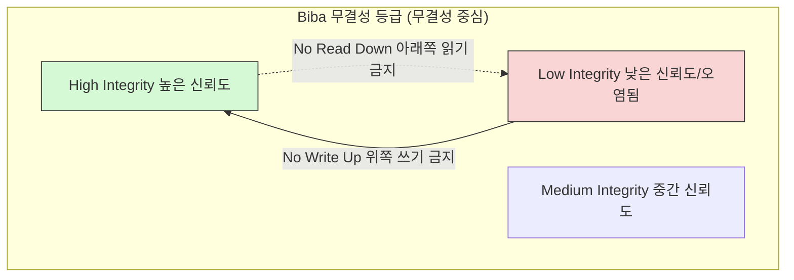

## 💡 1. 개념 및 쉬운 비유 (Concept & Intuitive Analogy)

| 구분 | 벨-라파듈라 모델 (BLP: Bell-LaPadula) | 비바 모델 (Biba Model) |
|------|------------------------------------|----------------------|
| **한 줄 요약** | **기밀성(Confidentiality)** 보장을 최우선으로 하는 군사 목적 보안 모델 | **무결성(Integrity)** 보장을 최우선으로 하는 상업/금융 목적 보안 모델 |
| **쉬운 비유** | 🪖 **국방부 극비 문서 관리 (유출 방지)** "일병은 장군의 1급 기밀을 볼 수 없고(No Read Up), 장군은 1급 기밀 내용을 병사 게시판에 적어 유출할 수 없다(No Write Down)." | 🍽️ **고급 레스토랑 주방 위생 (오염 방지)** "셰프는 쓰레기통의 오염된 식재료를 가져와 쓰면 안 되고(No Read Down), 알바생이 셰프의 비법 레시피 노트를 오염/변조할 수 없다(No Write Up)." |

---

## ❓ 2. 왜 비교가 필요한가? (Why Comparison Matters)

보안 모델을 설계할 때 시스템이 지켜야 하는 **핵심 가치**가 무엇인지에 따라 규칙이 180도 달라집니다.

1. **기밀성 vs 무결성 대립**: 정보를 남에게 숨기는 것(기밀성)과 정보가 변조되지 않도록 지키는 것(무결성)은 서로 다른 보안 규칙을 요구합니다.
2. **정반대의 규칙 구조 (Dual/Reverse)**: 비바(Biba) 모델은 벨-라파듈라(BLP) 모델의 두 가지 핵심 속성을 정확히 **역방향(Dual)**으로 뒤집어서 정립한 모델입니다.
3. **적용 분야의 차이**: 군사/국방 시스템은 정보 유출을 막는 **BLP**가 적합하고, 금융/의료/시스템 펌웨어 관리에는 정보 변조를 막는 **Biba**가 적합합니다.

---

## ⚙️ 3. 핵심 원리 및 동작 방식 (Core Mechanism & Workflow)

### (1) 벨-라파듈라 (BLP) 모델: 기밀성 (Confidentiality)

- **단순 보안 속성 (Simple Security Property)**: **No Read Up** (낮은 보안 등급의 주체는 높은 보안 등급의 객체를 읽을 수 없다.)
- ***-속성 (Star Property)**: **No Write Down** (높은 보안 등급의 주체는 낮은 보안 등급의 객체에 쓸 수 없다. - 상위 기밀의 하위 유출 차단)

### (2) 비바 (Biba) 모델: 무결성 (Integrity)

- **단순 무결성 속성 (Simple Integrity Property)**: **No Read Down** (높은 무결성 등급의 주체는 낮은 무결성 등급의 객체를 읽을 수 없다. - 신뢰할 수 없는 오염된 정보 수용 차단)
- ***-무결성 속성 (Star Integrity Property)**: **No Write Up** (낮은 무결성 등급의 주체는 높은 무결성 등급의 객체에 쓸 수 없다. - 중요한 상위 데이터 변조 차단)

---

## 📊 4. 주요 특징 및 상세 비교 (Detailed Comparison)

| 비교 항목 | 벨-라파듈라 모델 (BLP) | 비바 모델 (Biba) |
|----------|----------------------|----------------|
| **최우선 목표** | 🔒 **기밀성 (Confidentiality)** | 🛡️ **무결성 (Integrity)** |
| **핵심 목적** | 상위 보안 정보의 **유출 방지** | 신뢰할 수 없는 데이터로 인한 **변조/오염 방지** |
| **읽기 권한 규칙** | **No Read Up** (나보다 높은 등급 읽기 금지) | **No Read Down** (나보다 낮은 등급 읽기 금지 - 오염 방지) |
| **쓰기 권한 규칙** | **No Write Down** (나보다 낮은 등급 쓰기 금지) | **No Write Up** (나보다 높은 등급 쓰기 금지 - 변조 방지) |
| **정보의 흐름** | 하위 등급 $\rightarrow$ 상위 등급 방향으로만 흐름 | 상위 등급 $\rightarrow$ 하위 등급 방향으로만 흐름 |
| **주요 비유** | 군대 1급 기밀문서 관리 규칙 | 레스토랑 주방 식재료 위생 및 수사관 원본 기록 보존 |
| **주요 적용 대상** | 국방/군사 시스템, 정부 안보 기관 | 금융 거래 시스템, 의료 데이터, 펌웨어 무결성 검증 |

---

## 🚀 5. 실무 활용 및 관련 문서 (Real-world Use Cases & Related Documents)

### 실무 활용 패턴
- **BLP 활용**: 국가 기밀문서 관리 시스템, 디렉토리 레벨 강제적 접근통제(MAC: Mandatory Access Control).
- **Biba 활용**: 은행의 잔고 송금 데이터베이스(인가되지 않은 하위 사용자의 데이터 변조 차단), OS 핵심 커널 영역 보호.

### 연결 문서 (Related Documents)
- [access-control-models](access-control-models.md) - 접근통제 모델 전반 (Clark-Wilson, Chinese Wall 포함)
- [security-fundamentals](security-fundamentals.md) - CIA Triad (기밀성, 무결성, 가용성)
- [authentication-authorization](authentication-authorization.md) - 인증 및 인가 정책 (DAC, MAC, RBAC)
- [linux-account-security](../../linux/security/linux-account-security.md) - Linux 접근통제 및 보안 정책
