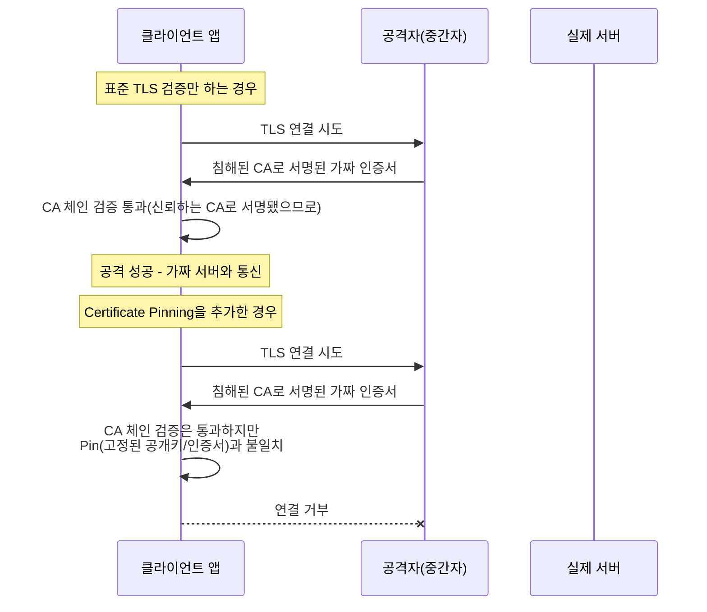

## Certificate Pinning(인증서 고정)이란 무엇인가

**Certificate Pinning(인증서 고정)** 은 클라이언트가 TLS 연결을 맺을 때, "신뢰할 수 있는 CA(인증 기관) 체인으로 서명됐는가"라는 표준 검증에 더해 "서버 인증서(또는 그 공개키)가 내가 미리 알고 있는 특정 값과 정확히 일치하는가"까지 추가로 확인하는 기법이다. 시스템이 신뢰하는 수백 개의 CA 중 **어느 하나라도** 악의적으로 발급하거나 침해당하면 그 CA 로 서명된 가짜 인증서가 표준 TLS 검증을 통과해버린다는 문제를, "이 서버는 반드시 이 인증서(또는 이 공개키)여야 한다"고 미리 못 박아 차단한다.



## 왜 필요했나

TLS 의 신뢰 모델은 "시스템이 신뢰하는 **모든** CA 중 하나라도 서명하면 그 인증서를 믿는다"는 구조다(체인 검증 자체는 [root-of-trust-and-chain-of-trust](root-of-trust-and-chain-of-trust.md) 참고). 문제는 시스템 신뢰 저장소(trust store)에 보통 수백 개의 CA 가 들어 있고, 그중 단 하나만 실수로 오발급하거나 해킹당해도 공격자는 그 CA 로 임의의 도메인용 "유효한" 인증서를 만들어낼 수 있다는 점이다. 실제로 2011년 DigiNotar CA 침해 사건에서 공격자가 `*.google.com` 을 포함한 위조 인증서를 발급받아 실사용자를 감청한 사례가 있었다.

Certificate Pinning 은 "이 CA 저장소 전체를 믿는다"는 넓은 신뢰 대신, "이 앱이 통신하는 이 서버는 반드시 이 특정 인증서(또는 공개키)여야 한다"는 좁은 신뢰로 범위를 줄인다. 특히 앱처럼 통신 상대(자사 서버)가 고정된 클라이언트에서 효과적이다 — 브라우저처럼 임의의 웹사이트에 접속하는 범용 클라이언트에는 적용하기 어렵다(접속할 모든 사이트의 인증서를 미리 알 수 없으므로).

## 무엇을 고정하는가: 인증서 vs 공개키

| 방식 | 고정 대상 | 장점 | 단점 |
| --- | --- | --- | --- |
| **인증서 고정** | 인증서 전체(만료일 포함) | 구현이 직관적 | 인증서 갱신마다 앱 업데이트 필요 |
| **공개키 고정(Public Key Pinning)** | 인증서 안의 공개키만 | 같은 키 쌍으로 인증서를 재발급하면 앱 업데이트 불필요 | 키 쌍 자체를 교체하면 여전히 앱 업데이트 필요 |

실무에서는 대부분 **공개키 고정**을 쓴다. 인증서는 만료일마다 재발급되지만 같은 키 쌍을 재사용하는 경우가 많아, 공개키 해시(SPKI hash)를 고정해두면 인증서가 갱신돼도 앱을 다시 배포할 필요가 없다.

## 구현 개념 예시 (Android Network Security Config)

```xml
<!-- res/xml/network_security_config.xml -->
<network-security-config>
    <domain-config>
        <domain includeSubdomains="true">api.example.com</domain>
        <pin-set expiration="2027-01-01">
            <!-- 현재 사용 중인 공개키의 SHA-256 해시 -->
            <pin digest="SHA-256">7HIpactkIAq2Y49orFOOQKurWxmmSFZhBCoQYcRhJ3Y=</pin>
            <!-- 키 교체(rotation)에 대비한 백업 pin(필수) -->
            <pin digest="SHA-256">fwza0LRMXouZHRC8Ei+4PyuldPDcf3UKgO/04cDM1oE=</pin>
        </pin-set>
    </domain-config>
</network-security-config>
```

**백업 pin 이 필수인 이유**: pin 을 하나만 등록하면, 서버 운영자가 정상적으로 키를 교체(rotation)하는 순간 모든 클라이언트가 즉시 접속 불가 상태가 된다(이를 "pin 이 앱을 벽돌로 만든다"고 표현하기도 한다). 최소 2개(현재 키 + 다음에 쓸 예정인 백업 키)를 등록해야 안전하게 키를 교체할 수 있다.

## 대가와 실패 모드

Certificate Pinning 은 공짜가 아니다.

1. **인증서/키 교체 시 강제 앱 업데이트 위험**: 백업 pin 없이 배포했거나, 서버가 예정에 없던 긴급 키 교체를 하면 그 pin 을 가진 모든 클라이언트가 서버에 접속하지 못한다.
2. **디버깅/테스트 어려움**: 사내 프록시나 디버깅 도구(Charles, mitmproxy 등)로 트래픽을 관찰하려 해도 pinning 이 이를 정확히 차단한다(이게 pinning 의 존재 목적이기도 하다 — MITM 프록시와 실제 공격자를 기술적으로 구분할 수 없다).
3. **점진적 완화 필요**: 그래서 실무에서는 pin 불일치를 즉시 연결 차단이 아니라 먼저 보고(report-only 모드)만 하도록 배포해 실제 영향 범위를 관찰한 뒤, 문제가 없다고 확인되면 강제(enforce) 모드로 전환하는 단계적 롤아웃을 쓴다.

## 연결 문서

- [root-of-trust-and-chain-of-trust](root-of-trust-and-chain-of-trust.md) - Certificate Pinning 이 좁히는 대상인 CA 체인 검증 자체의 동작 방식
