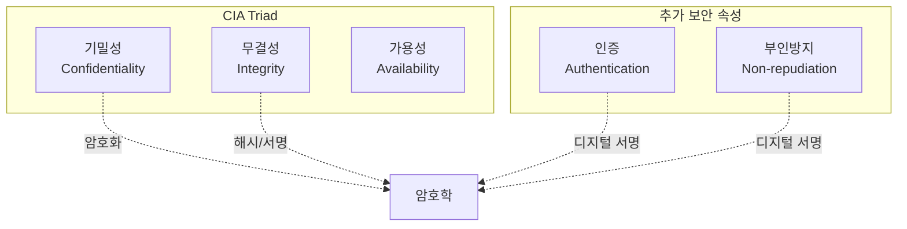
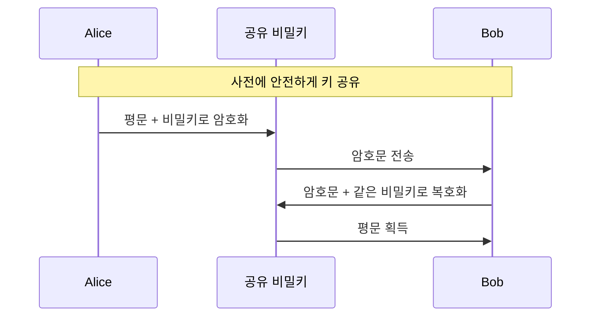
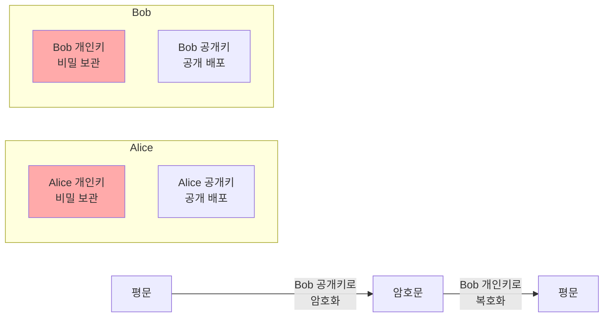
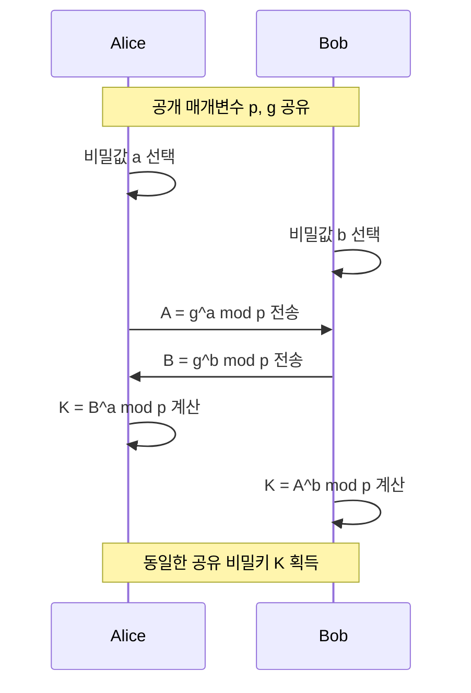
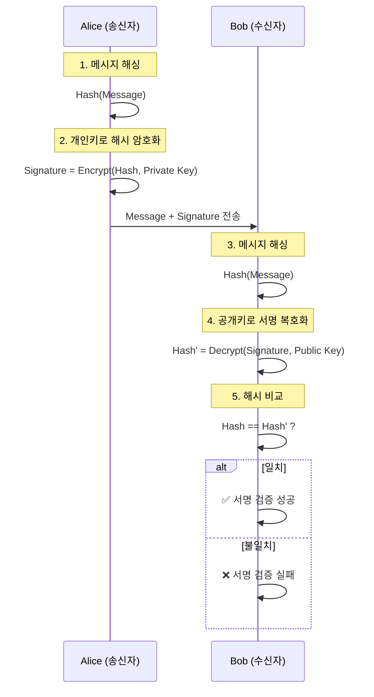
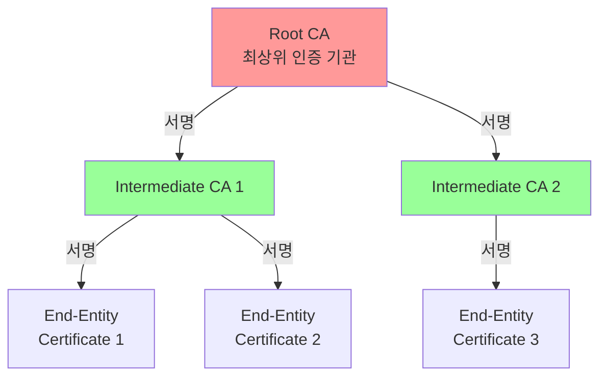
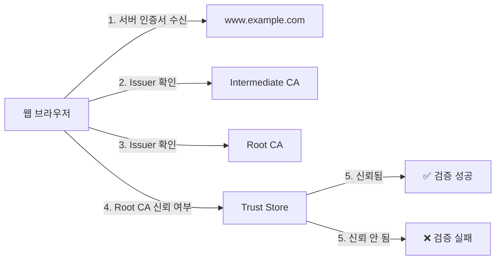
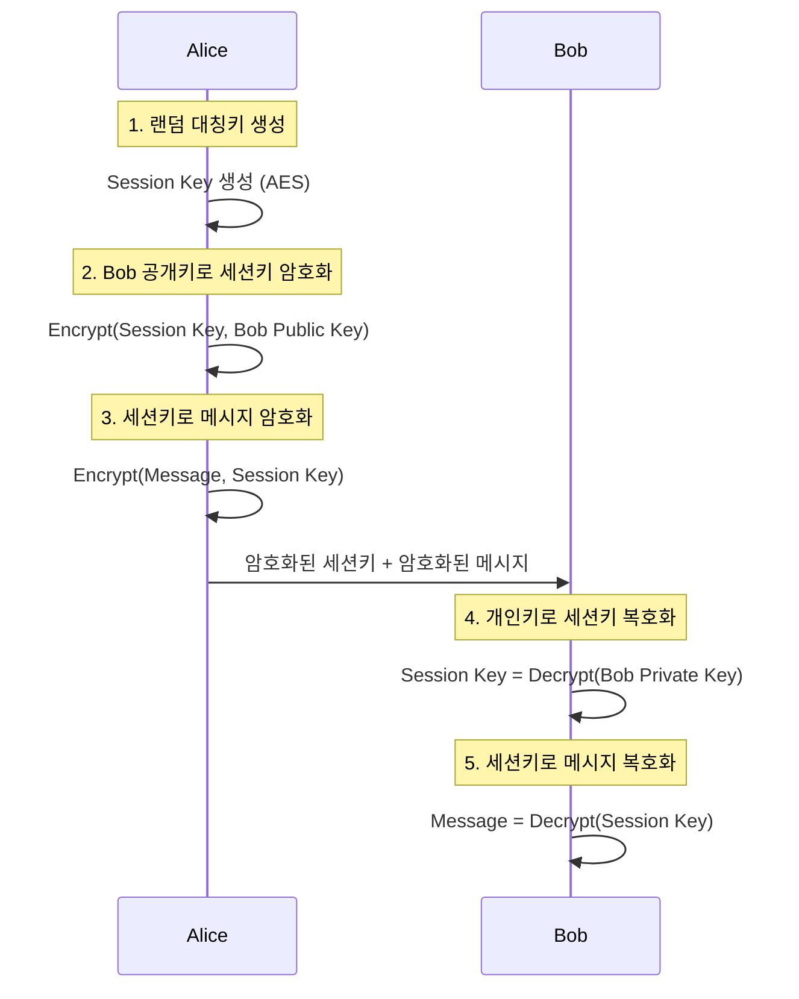

## 🌐 개요 (Overview)

**암호학 (Cryptography)** 은 정보를 보호하기 위해 데이터를 변환하는 과학입니다. 기밀성(Confidentiality), 무결성(Integrity), 인증(Authentication), 부인방지(Non-repudiation)를 제공하여 안전한 통신을 가능하게 합니다.

## 🔑 암호화의 목적 (Cryptographic Goals)

### CIA Triad + 부가 목표



1. **기밀성 (Confidentiality)**: 권한 없는 사람이 정보를 읽지 못하도록 보호
2. **무결성 (Integrity)**: 데이터가 변조되지 않았음을 보장
3. **인증 (Authentication)**: 통신 상대방의 신원 확인
4. **부인방지 (Non-repudiation)**: 송신자가 메시지 전송을 부인하지 못하도록 방지

## 🔐 대칭키 암호화 (Symmetric Encryption)

### 개념

**같은 키**로 암호화와 복호화를 수행하는 방식입니다.



### 주요 알고리즘

#### DES (Data Encryption Standard)
- **키 길이**: 56비트 (실제 64비트, 8비트는 패리티)
- **블록 크기**: 64비트
- **상태**: **deprecated** (현재 사용 금지)
- **취약점**: 무차별 대입 공격(Brute Force)에 취약

#### 3DES (Triple DES)
- **키 길이**: 112비트 또는 168비트
- **방식**: DES를 3번 적용 (Encrypt-Decrypt-Encrypt)
- **상태**: 레거시 시스템에서만 사용
- **단점**: 느린 속도

#### AES (Advanced Encryption Standard)
- **키 길이**: 128, 192, 256비트
- **블록 크기**: 128비트
- **상태**: **현재 표준** (2001년 채택)
- **특징**:
  - Rijndael 알고리즘 기반
  - 하드웨어 가속 지원 (AES-NI)
  - 정부 및 금융 기관 표준

```
AES-128: 10라운드
AES-192: 12라운드
AES-256: 14라운드

각 라운드: SubBytes → ShiftRows → MixColumns → AddRoundKey
```

#### ChaCha20
- **키 길이**: 256비트
- **타입**: 스트림 암호
- **특징**: 
  - 소프트웨어에서 매우 빠름
  - TLS 1.3에서 지원
  - 모바일 기기에 적합

### 블록 암호 운영 모드 (Block Cipher Modes)

| 모드 | 특징 | 병렬화 | 보안성 | 사용 예 |
|------|------|--------|--------|---------|
| **ECB** | 각 블록 독립 암호화 | ✅ 가능 | ❌ 취약 (패턴 노출) | 사용 금지 |
| **CBC** | 이전 블록과 XOR | ❌ 불가 | ✅ 안전 | 파일 암호화 |
| **CTR** | 카운터 기반 스트림 | ✅ 가능 | ✅ 안전 | 디스크 암호화 |
| **GCM** | 인증 암호화 (AEAD) | ✅ 가능 | ✅ 매우 안전 | [[network-security-protocols\|TLS]], VPN |

### 장단점

| 장점 | 단점 |
|------|------|
| ✅ 빠른 속도 | ❌ 키 배포 문제 |
| ✅ 대용량 데이터에 적합 | ❌ n명이 통신 시 n(n-1)/2개 키 필요 |
| ✅ 낮은 계산 비용 | ❌ 키 관리 복잡도 증가 |

## 🔓 비대칭키 암호화 (Asymmetric Encryption)

### 개념

**공개키**와 **개인키** 쌍을 사용하는 방식입니다.



### 주요 알고리즘

#### RSA (Rivest-Shamir-Adleman)
- **키 길이**: 2048, 3072, 4096비트
- **기반**: 큰 소수의 곱셈의 인수분해 어려움
- **용도**:
  - 디지털 서명
  - 키 교환
  - 소량 데이터 암호화

**RSA 동작 원리**:
```
1. 키 생성:
   - 두 큰 소수 p, q 선택
   - n = p × q 계산
   - φ(n) = (p-1)(q-1)
   - e 선택 (보통 65537)
   - d 계산: d × e ≡ 1 (mod φ(n))
   - 공개키: (e, n), 개인키: (d, n)

2. 암호화: C = M^e mod n
3. 복호화: M = C^d mod n
```

#### ECC (Elliptic Curve Cryptography)
- **키 길이**: 256, 384, 521비트
- **기반**: 타원곡선 이산로그 문제
- **특징**:
  - RSA보다 짧은 키로 같은 보안 강도
  - ECC-256 ≈ RSA-3072
  - 모바일/IoT에 적합

**주요 곡선**:
- **secp256r1** (NIST P-256): 일반적 사용
- **Curve25519**: 고속, EdDSA 서명
- **secp256k1**: Bitcoin에서 사용

#### Diffie-Hellman (DH)
- **용도**: 키 교환 전용 (암호화 불가)
- **기반**: 이산로그 문제
- **변형**: 
  - DHE (Ephemeral): 일회용 키
  - ECDHE: 타원곡선 기반



## 🔨 해시 함수 (Hash Functions)

### 개념

임의 길이의 데이터를 고정 길이의 값으로 변환하는 **일방향 함수**입니다.

### 해시 함수의 요구사항

1. **일방향성 (Pre-image Resistance)**: 해시값으로부터 원본 복원 불가
2. **충돌 저항성 (Collision Resistance)**: 같은 해시값을 갖는 두 입력 찾기 어려움
3. **약한 충돌 저항성 (Second Pre-image Resistance)**: 특정 입력과 같은 해시값을 갖는 다른 입력 찾기 어려움

### 주요 알고리즘

| 알고리즘 | 해시 길이 | 상태 | 용도 |
|----------|----------|------|------|
| **MD5** | 128비트 | ❌ 취약 (사용 금지) | 체크섬 (비보안) |
| **SHA-1** | 160비트 | ❌ 취약 (deprecated) | Git (레거시) |
| **SHA-256** | 256비트 | ✅ 안전 | 디지털 서명, 블록체인 |
| **SHA-384** | 384비트 | ✅ 안전 | 고보안 요구사항 |
| **SHA-512** | 512비트 | ✅ 안전 | 매우 높은 보안 |
| **SHA-3** | 가변 | ✅ 안전 (최신) | 차세대 표준 |
| **BLAKE2/BLAKE3** | 가변 | ✅ 안전 (고속) | 최신 응용 |

### 실무 활용

```bash
# 파일 무결성 검증
sha256sum file.iso
echo "hash_value file.iso" | sha256sum -c

# 패스워드 해싱 (절대 단순 해시 사용 금지!)
# 대신 bcrypt, scrypt, Argon2 사용
```

### 패스워드 해싱 전용 함수

일반 해시 함수는 **너무 빠르기** 때문에 패스워드 해싱에 부적합합니다.

| 함수 | 특징 | 보안 강도 |
|------|------|-----------|
| **bcrypt** | Blowfish 기반, 비용 조절 가능 | ✅ 안전 |
| **scrypt** | 메모리 집약적 (ASIC 저항) | ✅ 매우 안전 |
| **Argon2** | 최신 표준 (PHC 우승) | ✅ 가장 안전 |

## ✍️ 디지털 서명 (Digital Signature)

### 목적

1. **인증**: 서명자의 신원 확인
2. **무결성**: 메시지가 변조되지 않았음을 보증
3. **부인방지**: 서명자가 서명 사실을 부인할 수 없음

### 동작 방식



### 서명 알고리즘

- **RSA 서명**: RSA 개인키로 서명
- **ECDSA**: ECC 기반 디지털 서명
- **EdDSA**: Curve25519 기반 (빠르고 안전)
  - Ed25519: 서명
  - X25519: 키 교환

## 🏢 PKI (Public Key Infrastructure)

### 개념

공개키 암호화를 실제 환경에서 사용하기 위한 **인프라**입니다.

### PKI 구성 요소



#### 주요 구성 요소

1. **CA (Certificate Authority)**: 인증서 발급 기관
2. **RA (Registration Authority)**: 인증서 등록 기관
3. **Certificate**: 공개키 + 신원 정보 + CA 서명
4. **CRL (Certificate Revocation List)**: 폐기된 인증서 목록
5. **OCSP (Online Certificate Status Protocol)**: 실시간 인증서 상태 확인

### X.509 인증서 구조

```
Certificate:
    Version: 3
    Serial Number: 0x1234567890abcdef
    Signature Algorithm: sha256WithRSAEncryption
    Issuer: CN=Example CA, O=Example Inc
    Validity:
        Not Before: 2025-01-01 00:00:00
        Not After:  2026-01-01 00:00:00
    Subject: CN=www.example.com, O=Example Inc
    Subject Public Key Info:
        Public Key Algorithm: rsaEncryption
        RSA Public Key: (2048 bit)
    X509v3 Extensions:
        X509v3 Subject Alternative Name:
            DNS:www.example.com, DNS:example.com
        X509v3 Key Usage:
            Digital Signature, Key Encipherment
        X509v3 Extended Key Usage:
            TLS Web Server Authentication
```

### 인증서 체인 검증



### 실무 명령어

```bash
# 인증서 정보 확인
openssl x509 -in cert.pem -text -noout

# 인증서 유효성 검증
openssl verify -CAfile ca.pem cert.pem

# 개인키와 인증서 매칭 확인
openssl x509 -noout -modulus -in cert.pem | openssl md5
openssl rsa -noout -modulus -in key.pem | openssl md5

# CSR (Certificate Signing Request) 생성
openssl req -new -key private.key -out request.csr
```

## 🔗 하이브리드 암호화 (Hybrid Encryption)

실무에서는 **대칭키 + 비대칭키**를 결합하여 사용합니다.



**사용 예**: TLS/SSL, PGP, S/MIME

## 🔗 연결 문서 (Related Documents)

- [[network-security-protocols]] - TLS/SSL에서의 암호화 활용
- [[authentication-authorization]] - 인증에서의 암호화 역할
- [[tcp-ip-model]] - 네트워크 계층과 암호화
