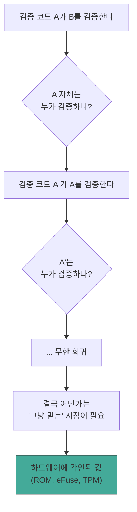
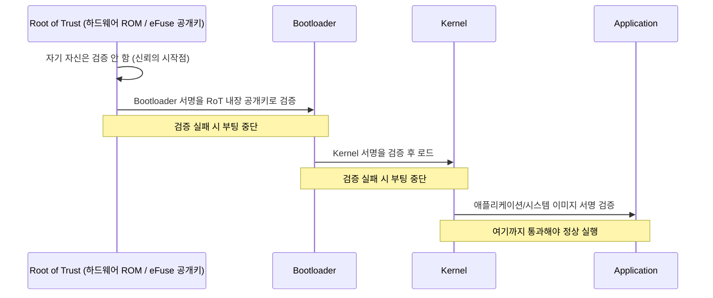

## Root of Trust 란 무엇인가

**Root of Trust(RoT, 신뢰의 뿌리)** 는 어떤 검증 체계에서도 **더 이상 다른 무언가에 의해 검증되지 않는, 그 자체로 신뢰될 수밖에 없는 출발점**을 말한다. "이 서명이 진짜인지 확인하려면 이 공개키가 필요하고, 그 공개키가 진짜인지 확인하려면 또 다른 무언가가 필요하고..." 라는 검증의 연쇄는 무한히 이어질 수 없다. 어딘가에서는 "이것만은 그냥 믿는다" 는 지점이 있어야 하며, 그 지점이 Root of Trust 다.

실무에서 Root of Trust 는 대개 **하드웨어에 물리적으로 각인되어 소프트웨어로는 변경할 수 없는 값이나 회로**로 구현된다.

- **ROM(Read-Only Memory)에 태워진 최초 부트 코드**: 칩 제조 단계에서 새겨져, 이후 어떤 소프트웨어 업데이트로도 바뀌지 않는다.
- **eFuse 에 저장된 공개키 해시**: 제조 시점에 한 번만 "태울" 수 있는 물리적 퓨즈. 이후 프로그램적으로 되돌릴 수 없다.
- **TPM(Trusted Platform Module)**: 메인보드에 붙은 독립적인 보안 칩으로, 내부에 자체 개인키를 생성하고 절대 외부로 노출하지 않는다.
- **Secure Enclave / TEE(Trusted Execution Environment)**: CPU 안에 격리된 실행 영역으로, 일반 OS 조차 접근할 수 없는 메모리와 연산 공간을 갖는다.

### 왜 반드시 하드웨어여야 하는가

소프트웨어만으로는 근본적인 문제가 있다: **"이 검증 코드 자체가 조작되지 않았다" 는 것을 무엇이 보증하는가?** 검증 로직 A 가 "B 가 서명한 대로다" 를 확인한다고 해도, A 자신이 이미 공격자에 의해 바뀌어 있다면 그 확인 결과 자체를 믿을 수 없다. A 를 검증하는 A' 를 두더라도 같은 문제가 A' 에 대해 반복된다. 이 무한 회귀를 끊으려면, 소프트웨어로는 절대 수정할 수 없는 지점이 필요하다 — 그것이 하드웨어(또는 최소한 부팅 극초반, 아직 아무 소프트웨어도 개입하기 전의 회로/펌웨어)여야 하는 이유다.

## Chain of Trust 란 무엇인가

**Chain of Trust(신뢰 사슬)** 는 Root of Trust 에서 시작해, 각 단계가 다음 단계를 암호학적으로 검증하며 신뢰를 단계적으로 전파하는 구조다. "A 는 B 의 서명을 검증하고 나서야 B 를 실행하고, B 는 실행되고 나서 C 의 서명을 검증하고 나서야 C 를 실행한다" 는 식으로 이어진다. 각 단계는 자신을 검증한 이전 단계보다 낮은 특권/더 큰 코드베이스를 갖는 것이 일반적이다 — Root of Trust 는 극도로 단순하고 작지만(공격 표면이 작을수록 안전하다), 체인을 따라 내려갈수록 기능이 풍부하고 복잡한 코드(부트로더, 커널, 애플리케이션)로 확장된다.

**핵심은 "각 단계가 실행되기 *전에* 검증이 끝나야 한다"** 는 순서다. 먼저 실행하고 나중에 검증하면, 이미 실행된 악성 코드가 검증 로직 자체를 무력화할 수 있다. 그래서 체인의 각 링크는 항상 "다음 것을 로드하기 전에 서명을 확인 -> 통과하면 로드 및 실행 -> 실행된 코드가 그다음 것을 같은 방식으로 검증" 순서를 지킨다.

## 왜 이런 체계가 필요한가

공격자가 시스템을 영속적으로 장악하는 가장 강력한 방법은 **부팅 과정 자체에 개입하는 것**이다. 펌웨어나 부트로더, 커널 이미지를 변조된 것으로 바꿔치기할 수 있다면, 그 위에서 동작하는 OS 나 안티바이러스, 무결성 검사 도구는 애초에 변조된 환경 위에서 실행되는 것이므로 스스로의 손상 여부를 신뢰성 있게 판단할 수 없다(루트킷이 커널보다 먼저 로드되면, 커널이 아무리 "정상"이라고 보고해도 그 보고 자체가 조작된 것일 수 있다).

Chain of Trust 는 이 문제를 "가장 먼저 실행되는 것부터 검증한다" 는 순서로 해결한다. Root of Trust 가 부트로더를 검증하고, 검증된 부트로더가 커널을 검증하고, 검증된 커널이 그 위의 소프트웨어를 검증하는 식으로 이어지면, 체인의 어느 지점에서든 서명 불일치가 발견되는 즉시 부팅을 중단시킬 수 있다. 결과적으로 "지금 실행 중인 소프트웨어 스택 전체가 제조/배포 시점 그대로임" 을 하드웨어 신뢰 하나로부터 논리적으로 보장할 수 있게 된다.

## 실제 사용처

- **UEFI Secure Boot**: 메인보드 펌웨어에 내장된 신뢰된 인증서(Root of Trust)가 OS 부트로더의 서명을 검증하고, 부트로더는 다시 OS 커널을 검증한다. 서명되지 않았거나 신뢰 목록에 없는 부트로더/커널은 로드를 거부한다.
- **TPM 기반 부팅 무결성 측정(Measured Boot)**: TPM 은 부팅 각 단계의 해시를 PCR(Platform Configuration Register)에 순차적으로 누적 기록한다. 이후 원격의 검증자가 이 PCR 값을 조회해(remote attestation) "이 기기가 실제로 어떤 소프트웨어 스택으로 부팅했는지" 를 검증할 수 있다. Secure Boot 가 "허용되지 않으면 막는다" 는 능동적 차단이라면, Measured Boot 는 "무엇으로 부팅했는지 증거를 남긴다" 는 수동적 기록에 가깝다.
- **Android Verified Boot(AVB)**: 하드웨어에 내장된 Root of Trust 에서 시작해 Bootloader, Kernel, System/Vendor 파티션까지 서명과 **Merkle Tree** 해시(**dm-verity**)로 이어지는 체인을 구성한다. 이는 이 문서에서 설명한 일반 Chain of Trust 패턴을 모바일 플랫폼에 적용한 구체적인 구현 사례이며, Android 자체의 세부 사항(vbmeta 파티션, Verified Boot State 등)은 android 지식베이스의 관련 노트에서 별도로 다룬다.

## 연결 문서

- [merkle-tree](../../../02_references/computer-science/merkle-tree.md) - Chain of Trust 의 각 단계에서 대량 데이터 무결성을 효율적으로 검증하는 자료구조
- [device-mapper-and-dm-verity](../../../02_references/operating-systems/device-mapper-and-dm-verity.md) - Chain of Trust 가 커널 진입 이후 파일시스템 계층까지 확장되는 구체적 메커니즘
