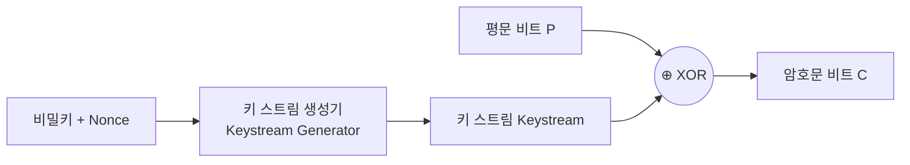

## 💡 1. 개념 및 쉬운 비유 (Concept & Intuitive Analogy)

| 구분 | 스트림 암호 (Stream Cipher) | 블록 암호 (Block Cipher) |
|------|--------------------------|------------------------|
| **한 줄 요약** | 평문을 **비트(bit) 또는 바이트(byte) 단위**로 연속하여 암호화하는 방식 | 평문을 **고정된 크기의 블록(64/128비트)** 단위로 나누어 암호화하는 방식 |
| **쉬운 비유** | 🚰 **흐르는 수도꼭지 (비트 연속 암호화)**<br/>데이터가 한 글자씩 들어오는 즉시 난수 키 스트림과 XOR 연산하여 실시간 암호화합니다. | 📦 **규격화된 택배 상자 포장 (블록 암호화)**<br/>정해진 크기 상자에 물건(데이터)을 꽉 채운 후 한 번에 자물쇠로 잠급니다. (부족하면 패딩 채움) |

---

## ❓ 2. 왜 비교가 필요한가? (Why Comparison Matters)

데이터가 송수신되는 환경과 요구되는 보안 성능에 따라 암호화의 기본 단위(Granularity)를 다르게 선택해야 합니다.

1. **실시간성 vs 단위 처리**: 음성/영상 통화나 스트리밍 데이터처럼 버퍼링 없이 즉시 전송해야 하는 환경에서는 **스트림 암호**가 유리합니다.
2. **패딩(Padding) 문제**: 블록 암호는 데이터가 블록 크기의 배수가 아니면 빈 공간을 채워넣는 패딩(PKCS#7 등)이 필요하지만, 스트림 암호는 패딩이 전혀 필요하지 않습니다.
3. **에러 전파 (Error Propagation)**: 전송 채널의 1비트 에러가 전체 블록 복호화에 영향을 주는지, 혹은 해당 비트에만 국한되는지 파악하기 위해 두 방식의 차이를 이해해야 합니다.

---

## ⚙️ 3. 핵심 원리 및 동작 방식 (Core Mechanism & Workflow)

### (1) 스트림 암호 동작 메커니즘
시드 키(Seed Key)와 논스(Nonce)를 키 스트림 생성기(PRNG)에 입력하여 무한한 키 스트림을 생성한 뒤, 평문과 1비트씩 **XOR** 연산합니다.



### (2) 블록 암호 동작 메커니즘
입력 데이터를 고정 크기(예: AES 128비트) 블록으로 잘라 여러 라운드(SubBytes, ShiftRows, MixColumns, AddRoundKey)를 거쳐 암호화합니다.

```mermaid
graph TD
    P[평문 메시지] --> Split[고정 크기 블록 분할<br/>예: 128 bit]
    Split --> B1[블록 1]
    Split --> B2[블록 2]
    Split --> B3[블록 3 (패딩 추가)]
    
    B1 --> Enc1[라운드 암호화 연산<br/>SPN / Feistel]
    B2 --> Enc2[라운드 암호화 연산<br/>SPN / Feistel]
    B3 --> Enc3[라운드 암호화 연산<br/>SPN / Feistel]
    
    Enc1 --> C1[암호문 블록 1]
    Enc2 --> C2[암호문 블록 2]
    Enc3 --> C3[암호문 블록 3]
```

---

## 📊 4. 주요 특징 및 상세 비교 (Detailed Comparison)

| 비교 항목 | 스트림 암호 (Stream Cipher) | 블록 암호 (Block Cipher) |
|----------|--------------------------|------------------------|
| **암호화 단위** | 비트(Bit) 또는 바이트(Byte) 연속 처리 | 고정 크기 블록 (64bit, 128bit 등) |
| **패딩(Padding)** | ❌ 불필요 (가변 길이 평문 그대로 암호화) | ⚠️ 필요 (블록 크기에 맞춰 패딩 추가) |
| **연산 속도** | 🚀 **매우 빠름** (소프트웨어/하드웨어 경량화) | ⚡ 보통 (복잡한 라운드 함수 수행) |
| **에러 전파** | ❌ **없음** (1비트 오차는 해당 1비트에만 영향) | ⚠️ **모드에 따라 다름** (CBC는 다음 블록까지 영향) |
| **무작위 접근성** | ❌ 불가능 (처음부터 키 스트림을 생성해야 함) | ✅ 가능 (운영 모드에 따라 특정 블록 직접 복호화) |
| **구현 복잡도** | 논리 회로가 단순함 (XOR 중심) | 대치(S-Box), 치환(P-Box) 등 복잡한 구조 |
| **취약점** | 키 스트림 재사용 시 평문 노출 (Reused Key Attack) | ECB 모드 사용 시 평문 패턴 노출 |
| **대표 알고리즘** | RC4, ChaCha20, Salsa20, A5/1 | AES, DES, 3DES, SEED, ARIA, IDEA |

---

## 🚀 5. 실무 활용 및 관련 문서 (Real-world Use Cases & Related Documents)

### 실무 활용 패턴
- **스트림 암호**:
  - **TLS 1.3 / Mobile**: ChaCha20-Poly1305 (하드웨어 AES-NI 가속이 없는 모바일 기기나 실시간 통신에서 고속 처리).
  - **레거시/무선**: RC4 (과거 WEP, SSL 3.0에서 사용되었으나 현재는 취약점으로 폐기).
- **블록 암호**:
  - **파일 & 디스크 암호화**: AES-128/256 (CBC, CTR 모드 사용).
  - **웹 트래픽 암호화**: AES-GCM (인증과 암호화를 동시에 처리하는 AEAD 모드 표준).

### 연결 문서 (Related Documents)
- [block-cipher-modes](block-cipher-modes.md) - 블록 암호의 다양한 운영 모드 (ECB, CBC, CTR, GCM)
- [cryptography-basics](cryptography-basics.md) - 대칭키/비대칭키 암호학 기초
- [symmetric-vs-asymmetric-crypto](symmetric-vs-asymmetric-crypto.md) - 대칭키 vs 비대칭키 암호화 비교
