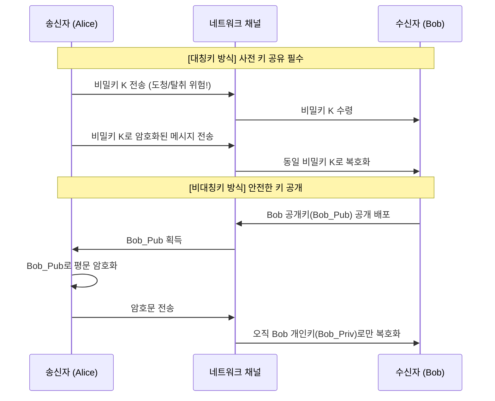

## 💡 1. 개념 및 쉬운 비유 (Concept & Intuitive Analogy)

| 구분 | 대칭키 암호화 (Symmetric) | 비대칭키 암호화 (Asymmetric) |
|------|-------------------------|---------------------------|
| **한 줄 요약** | **하나의 비밀 키**로 암호화와 복호화를 모두 수행하는 방식 | **공개키/개인키 쌍**을 사용하여 암호화와 복호화를 따로 수행하는 방식 |
| **쉬운 비유** | 🔐 **하나의 열쇠로 잠그고 열기 (금고 열쇠)** 열쇠를 가진 사람끼리만 금고를 열 수 있으므로, 상대를 신뢰하고 사전에 열쇠를 나눠 가져야 합니다. | 📮 **누구나 넣는 우체통과 개인 열쇠 (우체통과 열쇠)** 누구나 우체통(공개키)에 편지를 넣을 수 있지만, 열어서 편지를 꺼내는 것(복호화)은 집주인(개인키 소유자)만 가능합니다. |

---

## ❓ 2. 왜 비교가 필요한가? (Why Comparison Matters)

암호화 시스템을 설계할 때 속도와 보안성(키 관리) 사이의 **트레이드오프(Trade-off)**를 해결해야 합니다.

1. **대칭키의 한계**: 속도가 매우 빠르지만, **"비밀 키를 어떻게 상대방에게 도청 없이 전달할 것인가?"**라는 **키 배포 문제(Key Distribution Problem)**가 발생합니다.
2. **비대칭키의 한계**: 공개키를 누구에게나 자유롭게 공개하므로 키 배포 문제가 완벽히 해결되지만, 복잡한 수학적 연산으로 인해 **속도가 대칭키에 비해 100배~1000배 이상 느립니다.**
3. **해결책 (하이브리드 암호화)**: 실무 시스템(TLS/SSL, HTTPS, PGP)에서는 비대칭키로 빠르게 세션키(대칭키)만 교환하고, 실제 대용량 데이터는 대칭키로 암호화하는 **하이브리드 방식**을 채택합니다. 두 암호 체계의 차이점을 명확히 파악하는 것이 보안 아키텍처 이해의 기본입니다.

---

## ⚙️ 3. 핵심 원리 및 동작 방식 (Core Mechanism & Workflow)

### (1) 데이터 흐름 비교

### (2) 키 전달 메커니즘 시퀀스

---

## 📊 4. 주요 특징 및 상세 비교 (Detailed Comparison)

| 비교 항목 | 대칭키 암호화 (Symmetric) | 비대칭키 암호화 (Asymmetric) |
|----------|-------------------------|---------------------------|
| **키의 개수** | 1개 (공유 비밀키) | 2개 (공개키 + 개인키 쌍) |
| **키 공유 필요성** | ⚠️ 필요 (사전 공유 필수) | ❌ 불필요 (공개키는 자유롭게 공개) |
| **연산 속도** | 🚀 **매우 빠름** (대량 데이터에 적합) | 🐢 **느림** (대칭키 대비 100~1000배) |
| **키 관리 수량** | $n$명 통신 시 $\frac{n(n-1)}{2}$개 필요 (급격히 증가) | $n$명 통신 시 $2n$개 필요 (공개키 $n$개 + 개인키 $n$개) |
| **보안 요구사항** | 비밀키의 절대적 기밀성 유지 | 개인키의 엄격한 비밀 보관 + 공개키 무결성 보장 |
| **주요 제공 기능** | 기밀성 | 기밀성, 디지털 서명(인증, 무결성, 부인방지) |
| **대표 알고리즘** | AES, DES, 3DES, ChaCha20, SEED, ARIA | RSA, ECC, Diffie-Hellman, DSA, ElGamal |
| **주요 한계점** | 키 배포 및 안전한 보관 문제 | 높은 CPU 연산 비용, 대용량 데이터 직접 암호화 부적합 |

---

## 🚀 5. 실무 활용 및 관련 문서 (Real-world Use Cases & Related Documents)

### 실무 활용 패턴
- **하이브리드 암호화 (Hybrid Encryption)**: TLS 1.2/1.3, HTTPS, SSH, PGP/GPG 등 대부분의 현대 네트워크 프로토콜에서 **비대칭키(ECDHE/RSA)**로 세션키를 안전하게 교환한 뒤, 실제 전송 데이터는 **대칭키(AES-256-GCM/ChaCha20)**로 빠르게 암호화합니다.
- **디지털 서명 및 PKI**: 비대칭키의 개인키로 메시지 해시값을 암호화하여 서명을 생성하고, 검증자는 공개키로 이를 복호화하여 **송신자 인증 및 부인방지**를 구현합니다.

### 연결 문서 (Related Documents)
- [cryptography-basics](cryptography-basics.md) - 암호학 기초 전반
- [block-cipher-modes](block-cipher-modes.md) - 블록 암호 운영 모드
- [authentication-authorization](authentication-authorization.md) - 인증 및 인가 메커니즘
- [network-security-protocols](../protocols/network-security-protocols.md) - TLS/SSL 프로토콜
