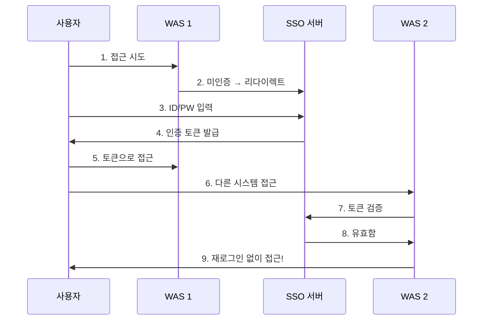
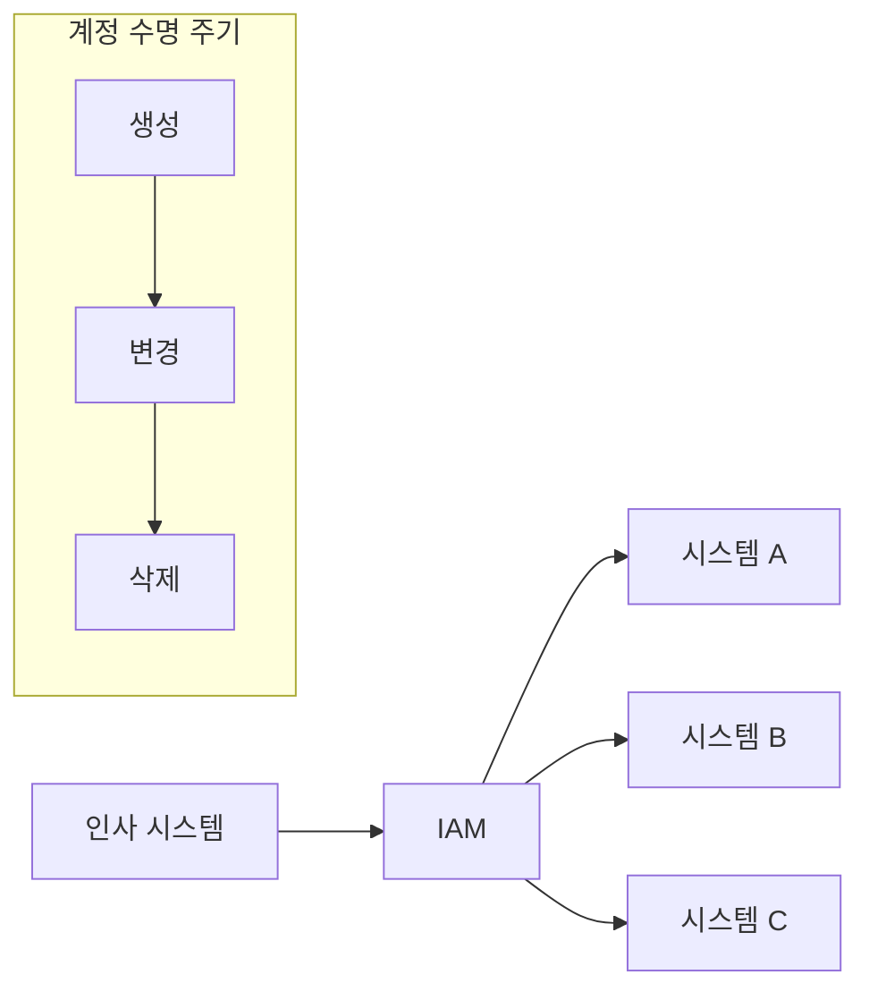
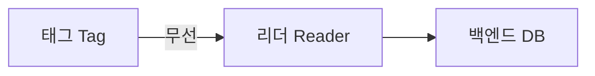

## 🌐 개요 (Overview)

**통합 인증 및 접근 관리**는 기업의 복잡한 정보 시스템에서 사용자 인증과 권한을 **중앙에서 효율적으로 관리**하기 위한 기술입니다.

---

## 🔐 SSO (Single Sign On)

### 정의

**단 한 번의 로그인**으로 인가된 모든 시스템에 재인증 없이 접근할 수 있는 기술입니다.

### 구성 요소

| 구성 요소 | 역할 |
|----------|------|
| **사용자** | 서비스 이용 주체 |
| **인증 서버** | 신원 확인, 토큰 발급 |
| **LDAP** | 디렉터리 서비스 (사용자 정보 조회) |
| **SSO Agent** | 각 시스템에 설치, 인증 요청 가로채기 |

### 동작 과정



### 장단점

| 장점 | 단점 |
|------|------|
| 사용자 편의성 | **SPoF** (단일 실패 지점) |
| 운영 비용 절감 | 인증 서버 침해 시 전체 노출 |
| 중앙 집중 보안 정책 | |

---

## 🔑 Kerberos (SSO 구현)

[[authentication-authorization]] 참조

| 구성 요소 | 역할 |
|----------|------|
| **KDC** | AS + TGS |
| **TGT** | Ticket Granting Ticket |
| **서비스 티켓** | 실제 서비스 접근용 |

---

## 📋 OAuth / SAML

[[authentication-authorization]] 참조

### OAuth 역할

| 역할 | 설명 |
|------|------|
| **Resource Owner** | 자원 소유자 (사용자) |
| **Resource Server** | 자원 호스팅 서버 |
| **Client** | 자원 접근 요청 앱 |
| **Authorization Server** | 액세스 토큰 발급 |

### OAuth Grant Types

| 방식 | 특징 |
|------|------|
| **Authorization Code** | 가장 안전, 서버 간 통신 |
| **Implicit** | 브라우저 앱, 보안 약함 |
| **Password** | 신뢰할 수 있는 앱만 |
| **Client Credentials** | 서버 간 통신 |

### SAML

| 용어 | 설명 |
|------|------|
| **IdP** | Identity Provider (인증) |
| **SP** | Service Provider (서비스) |
| **Assertion** | 인증 정보 XML |

---

## 🏢 EAM (Extranet Access Management)

### 정의

**SSO + 권한 관리 (Access Control)** + 자원 관리를 통합한 솔루션입니다.

### SSO와 차이

| 특성 | SSO | EAM |
|------|-----|-----|
| **중점** | 편의성 | **보안성** |
| **권한 관리** | ❌ | ✅ |

### 주요 기능

- 통합 인증 (SSO)
- **세밀한 권한 관리** (URL, 메뉴별)
- 중앙 정책 관리

---

## 🏛️ IAM (Identity and Access Management)

### 정의

사용자 **계정 수명 주기 (Life Cycle)** 전체를 관리하는 솔루션입니다. EAM의 확장 개념입니다.

### 주요 기능

| 기능 | 설명 |
|------|------|
| **프로비저닝** | 입사/승진/퇴사 시 계정 자동 생성/변경/삭제 |
| **워크플로우** | 계정 신청/승인 자동화 |
| **감사/컴플라이언스** | 권한 이력 기록, 규제 준수 |



---

## 📊 SSO vs EAM vs IAM 비교

| 특성 | SSO | EAM | IAM |
|------|-----|-----|-----|
| **통합 인증** | ✅ | ✅ | ✅ |
| **권한 관리** | ❌ | ✅ | ✅ |
| **계정 수명 주기** | ❌ | ❌ | ✅ |
| **프로비저닝** | ❌ | ❌ | ✅ |
| **조직 프로세스 통합** | ❌ | △ | ✅ |

```plaintext
SSO ⊂ EAM ⊂ IAM (포함 관계)
```

---

## 🔒 HSM (Hardware Security Module)

### 정의

**암호화 키**를 안전하게 생성, 저장, 관리하는 **전용 하드웨어**입니다.

### 특징

| 특징 | 설명 |
|------|------|
| **Tamper Resistant** | 물리적 탈취 시 데이터 자동 파괴 |
| **고성능** | 전용 프로세서로 암호 연산 고속 처리 |
| **키 보호** | 키가 HSM 외부로 유출되지 않음 |

### 용도

- CA 서버 루트 키 보관
- 금융 거래 키 관리
- SSL/TLS 키 오프로딩

---

## 📡 RFID 보안

### 개요

**무선 주파수**로 대상을 식별하는 기술입니다.

### 구성



### 보안 위협

| 위협 | 설명 |
|------|------|
| **도청** | 무선 구간 정보 가로채기 |
| **트래픽 분석** | 이동 경로 추적 |
| **위조/변조** | 태그 복제, 내용 변경 |

### 보호 기술

| 기술 | 설명 |
|------|------|
| **Kill Tag** | 태그 영구 정지 (프라이버시) |
| **Faraday Cage** | 금속 망으로 신호 차단 |
| **Blocker Tag** | 방해 신호로 읽기 차단 |
| **Hash Lock** | 인증된 리더만 접근 |

## 🔗 연결 문서 (Related Documents)

- [[authentication-authorization]] - OAuth, SAML, Kerberos
- [[access-control-models]] - DAC, MAC, RBAC
- [[cryptography-basics]] - 암호화 키 관리
