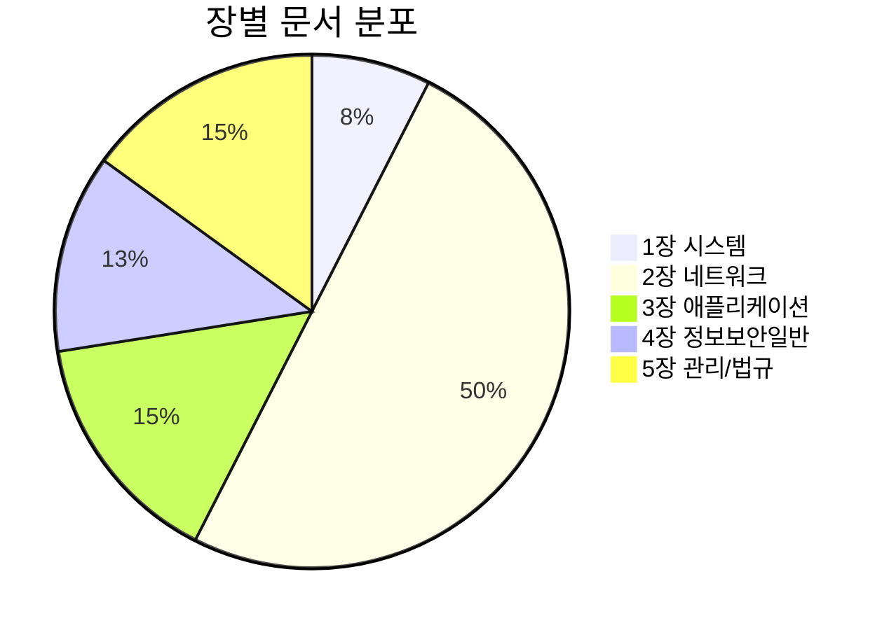

## 📚 정보보안기사 필기 개념 정리

정보보안기사 필기시험 전 과목의 핵심 개념을 정리한 Obsidian 노트입니다.

---

## 📌 1장. 시스템 보안

### 운영체제 보안

| 주제 | 문서 |
|------|------|
| Windows 보안 | [[windows-client-security]] |
| 시스템 공격 | [[system-attacks]] |
| 악성코드 | [[malware-types]] |

### 참고 문서

- [[authentication-authorization]] - 시스템 인증과 접근 통제

---

## 📌 2장. 네트워크 보안

### 2-1절. 네트워크 기초

| 주제 | 문서 |
|------|------|
| OSI 7계층 | [[osi-7-layer-model]] |
| TCP/IP 모델 | [[tcp-ip-model]] |
| IP 헤더 구조 | [[ip-header-structure]] |
| IP 주소 체계 | [[ip-addressing]] |
| TCP/UDP | [[tcp-udp-protocols]] |
| ARP | [[arp-protocol]] |
| ICMP | [[icmp-protocol]] |
| HTTP | [[http-protocol]] |
| DHCP/NAT | [[dhcp-nat-protocols]] |
| FTP | [[ftp-protocol]] |
| SNMP | [[snmp-protocol]] |
| DNS 기초 | [[dns-fundamentals]] |

### 2-2절. 네트워크 활용

| 주제 | 문서 |
|------|------|
| 라우팅 기초 | [[routing-basics]] |
| 라우팅 프로토콜 | [[routing-protocols]] |
| 네트워크 장비 | [[network-devices]] |
| 라우터/ACL 보안 | [[router-acl-security]] |
| 무선 보안 | [[wireless-security]] |
| 진단 도구 | [[network-diagnostic-tools]] |

### 2-3절. 네트워크 공격

| 주제 | 문서 |
|------|------|
| DoS 공격 | [[dos-attacks]] |
| DDoS/DRDoS | [[ddos-attacks]] |
| APT 공격 | [[apt-attacks]] |
| 공격 유형 종합 | [[attack-types]] |

### 네트워크 보안 솔루션

| 주제 | 문서 |
|------|------|
| 방화벽/IDS/IPS | [[firewall-ids-ips]] |
| 이메일 보안 | [[email-security]] |
| 네트워크 보안 프로토콜 | [[network-security-protocols]] |

---

## 📌 3장. 애플리케이션 보안

### 3-1절. 인터넷 응용 보안

| 주제 | 문서 |
|------|------|
| 웹 보안 (OWASP) | [[web-security]] |
| DNS 보안 | [[dns-security]] |
| IPSec/VPN | [[ipsec-vpn]] |

### 3-2절. 전자상거래 보안

| 주제 | 문서 |
|------|------|
| SET/SSL/TLS | [[ecommerce-security]] |
| 암호화 프로토콜 | [[network-security-protocols]] |

### 3-3절. 기타 보안

| 주제 | 문서 |
|------|------|
| SSO/EAM/IAM | [[identity-management]] |
| DRM/워터마킹 | [[digital-content-protection]] |
| 디지털 포렌식 | [[digital-forensics]] |

---

## 📌 4장. 정보보안 일반

### 4-1절. 보안 요소 기술

| 주제 | 문서 |
|------|------|
| 인증과 인가 | [[authentication-authorization]] |
| 생체인증/OTP | [[biometrics-otp]] |
| 접근통제 모델 | [[access-control-models]] |
| 암호학 기초 | [[cryptography-basics]] |

### 4-2절. 암호학

| 주제 | 문서 |
|------|------|
| 블록 암호 모드 | [[block-cipher-modes]] |
| 대칭키/비대칭키 | [[cryptography-basics]] |

---

## 📌 5장. 정보보안 관리 및 법규

### 5-1절. 정보보호 관리

| 주제 | 문서 |
|------|------|
| 정보보호 기초 (CIA) | [[security-fundamentals]] |
| 위험 관리 | [[risk-management]] |
| BCP/재해복구 | [[bcp-disaster-recovery]] |

### 5-2절. 표준 및 지침

| 주제 | 문서 |
|------|------|
| 평가 기준 (CC/TCSEC) | [[security-evaluation-criteria]] |
| ISMS 인증 | [[isms-certification]] |

### 5-3절. 정보보호 법규

| 주제 | 문서 |
|------|------|
| 정보보호 관련 법률 | [[information-security-laws]] |

---

## 📊 문서 통계

---

## 🔗 빠른 링크

### 핵심 개념

| 개념 | 링크 |
|------|------|
| **CIA Triad** | [[security-fundamentals]] |
| **암호화** | [[cryptography-basics]] |
| **접근통제** | [[access-control-models]] |
| **인증** | [[authentication-authorization]] |

### 주요 공격

| 공격 | 링크 |
|------|------|
| **DoS/DDoS** | [[dos-attacks]] / [[ddos-attacks]] |
| **SQL Injection** | [[web-security]] |
| **XSS/CSRF** | [[web-security]] |
| **APT** | [[apt-attacks]] |

### 보안 솔루션

| 솔루션 | 링크 |
|--------|------|
| **방화벽/IDS/IPS** | [[firewall-ids-ips]] |
| **VPN** | [[ipsec-vpn]] |
| **SSL/TLS** | [[ecommerce-security]] |
| **ISMS** | [[isms-certification]] |

---

## ✅ 학습 체크리스트

- [ ] 1장: 시스템 보안 (OS, 악성코드)
- [ ] 2장: 네트워크 보안 (프로토콜, 공격, 솔루션)
- [ ] 3장: 애플리케이션 보안 (웹, 전자상거래)
- [ ] 4장: 정보보안 일반 (암호학, 인증)
- [ ] 5장: 관리 및 법규 (ISMS, 법률)
