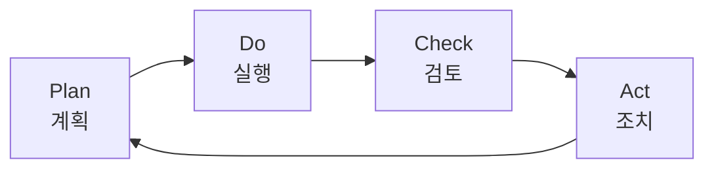
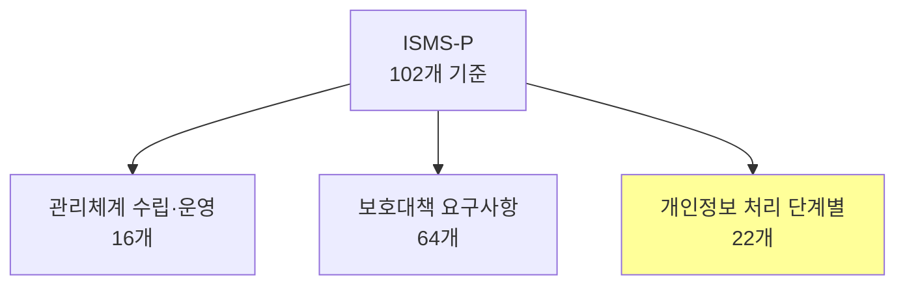
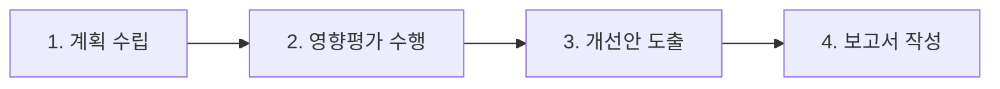

## 🌐 개요 (Overview)

**정보보호 관리체계 (ISMS)** 는 조직의 정보보안을 체계적으로 관리하기 위한 프레임워크이며, 다양한 **인증 제도**를 통해 보안 수준을 검증받을 수 있습니다.

---

## 🌍 ISO/IEC 27000 시리즈

**국제표준화기구 (ISO)** 에서 제정한 정보보호 관리체계 표준입니다.

### 주요 표준

| 표준 | 내용 |
|------|------|
| **ISO/IEC 27001** | ISMS **요구사항 (Requirements)** - 인증 기준 |
| **ISO/IEC 27002** | **실무 지침 (Code of Practice)** - 통제 구현 안내 |
| ISO/IEC 27003 | 구현 지침 |
| ISO/IEC 27004 | 측정/메트릭 |
| ISO/IEC 27005 | 위험 관리 |

### PDCA 모델

ISMS는 **지속적 개선**을 위해 PDCA 순환 주기를 따릅니다.



| 단계 | 활동 |
|------|------|
| **Plan** | ISMS 정책/목표 수립 |
| **Do** | 통제 구현, 운영 |
| **Check** | 모니터링, 내부 감사 |
| **Act** | 시정 조치, 개선 |

---

## 🇰🇷 ISMS-P (국내 통합 인증)

기존 **ISMS** + **PIMS** 를 통합한 **정보보호 및 개인정보보호 관리체계** 인증입니다.

### 인증 의무 대상자

「정보통신망법」 제47조 제2항에 따른 의무 대상:

| 대상 | 기준 |
|------|------|
| **ISP** | 서울/광역시에서 서비스 제공 |
| **IDC** | 집적정보통신시설 사업자 |
| **상급종합병원** | 매출액 1,500억 원 이상 |
| **매출액** | 정보통신서비스 100억 원 이상 |
| **이용자 수** | 일평균 100만 명 이상 (직전 3개월) |

### 인증 기준 (102개)



| 영역 | 항목 수 | 주요 내용 |
|------|:-------:|----------|
| **관리체계 수립·운영** | 16 | 경영진 참여, 위험 관리, 점검/개선 |
| **보호대책 요구사항** | 64 | 정책, 접근통제, 암호화, 사고대응 |
| **개인정보 처리** | 22 | 수집/이용/제공/파기 보호조치 |

> **ISMS만 필요한 경우**: 개인정보 처리 22개 제외 → **80개 기준**

### 인증 관련 기관

| 기관 | 역할 |
|------|------|
| **정책기관** | 과기정통부, 개인정보위, 행안부 |
| **인증기관** | **KISA** (심의/인증서 발급) |
| **심사기관** | KISA 또는 지정 기관 |

### 인증 유효기간

```plaintext
✅ 유효기간: 3년
✅ 사후 심사: 매년 1회 이상
```

---

## ☁️ CSAP (클라우드 보안 인증)

「클라우드컴퓨팅법」에 따라 **공공기관**에 안전한 민간 클라우드 서비스를 공급하기 위한 인증입니다.

### 인증 등급

| 유형 | 설명 |
|------|------|
| **IaaS** | 서버, 스토리지 등 인프라 |
| **SaaS** | 소프트웨어 서비스 (표준/간편) |
| **DaaS** | 데스크톱 가상화 |

### 평가 기준

- 관리적, 물리적, 기술적 보호조치
- 공공기관용 추가 보호조치
- **14개 부문**

### 유효기간

```plaintext
✅ 유효기간: 3년
✅ 매년 사후 평가
```

---

## 📋 PIA (개인정보 영향평가)

### 개념

개인정보를 취급하는 **새 시스템 구축/변경 시** 개인정보 보호에 미치는 영향을 **사전 조사/분석/개선**하는 제도입니다.

### 평가 대상 (공공기관)

| 조건 | 기준 |
|------|------|
| 신규 시스템 | 정보주체 **5만 명** 이상 |
| 연동 시스템 | 정보주체 **50만 명** 이상 |

### 평가 절차



| 단계 | 활동 |
|------|------|
| **계획 수립** | 범위, 일정, 인력 계획 |
| **영향평가 수행** | 개인정보 흐름 분석, 침해 위험 분석 |
| **개선안 도출** | 보호조치 방안 수립 |
| **보고서 작성** | 결과 문서화 |

---

## 📊 인증 제도 비교

| 인증 | 대상 | 유효기간 | 특징 |
|------|------|:--------:|------|
| **ISO 27001** | 글로벌 | 3년 | 국제 표준 |
| **ISMS-P** | 국내 | 3년 | 정보보호+개인정보 통합 |
| **CSAP** | 클라우드 (공공) | 3년 | IaaS/SaaS/DaaS |
| **PIA** | 공공기관 시스템 | - | 사전 영향평가 |

## 🔗 연결 문서 (Related Documents)

- [[security-fundamentals]] - 정보보호 기초
- [[security-evaluation-criteria]] - 보안 평가 기준
- [[risk-management]] - 위험 관리
- [[bcp-disaster-recovery]] - 업무 연속성
