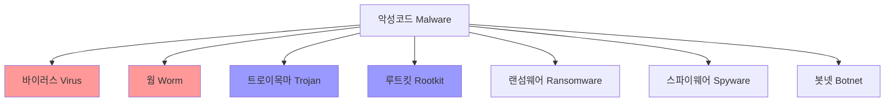
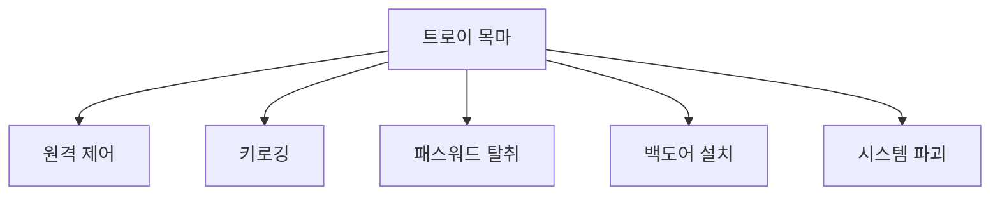
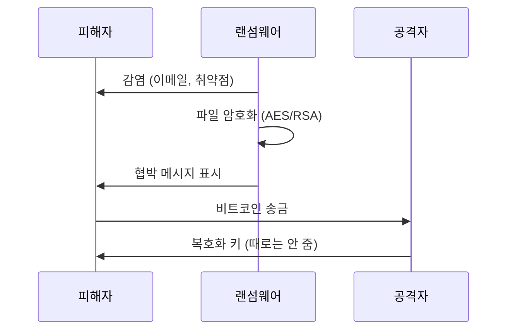
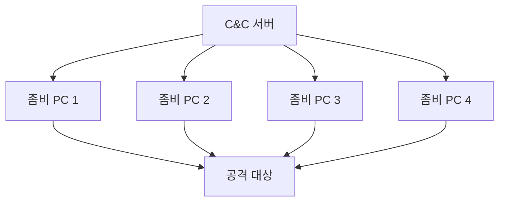

## 🌐 개요 (Overview)

**악성코드(Malware)** 는 시스템에 해를 끼치거나 무단 접근을 목적으로 설계된 소프트웨어입니다. 종류에 따라 전파 방식, 목적, 피해 양상이 다릅니다.

## 📊 악성코드 분류 체계



---

## 🦠 바이러스 (Virus)

### 정의

스스로를 복제하여 **다른 프로그램이나 파일에 기생**하는 악성코드입니다.

### 특징

- **감염 대상 필요**: 실행 파일, 부트 섹터, 매크로 등
- **자기 복제**: 감염 대상에 자신을 복사
- **조건부 실행**: 특정 조건에서 악성 행위 수행

### 세대별 발전

| 세대 | 유형 | 특징 | 예시 |
|------|------|------|------|
| **1 세대** | 원시형 (Primitive) | 단순 구조, 분석 쉬움 | Jerusalem |
| **2 세대** | 암호화형 (Encrypted) | 백신 진단 회피용 코드 암호화 | Cascade |
| **3 세대** | 은폐형 (Stealth) | 검사 시 원본 보여줌 | Brain |
| **4 세대** | 갑옷형 (Armored) | 분석 방해 (안티 디버깅) | Whale |
| **5 세대** | 매크로형 (Macro) | 오피스 매크로 악용 | Melissa |

### 감염 대상별 분류

```plaintext
1. 파일 바이러스
   - 실행 파일 (.exe, .com) 감염
   - 파일 실행 시 활성화

2. 부트 바이러스
   - 부트 섹터/MBR 감염
   - 시스템 부팅 시 활성화

3. 매크로 바이러스
   - 문서 파일 (Word, Excel) 감염
   - 문서 열 때 활성화

4. 스크립트 바이러스
   - VBS, JavaScript 등 스크립트 언어
```

---

## 🐛 웜 (Worm)

### 정의

**독자적으로 실행**되며 네트워크를 통해 **스스로 전파**하는 악성코드입니다.

### 특징

| 특성 | 바이러스 | 웜 |
|------|---------|-----|
| **감염 대상** | 필요 (파일, 부트섹터) | 불필요 |
| **전파 방식** | 감염 파일 복사 | 네트워크 자가 전파 |
| **독립 실행** | 불가 | **가능** |
| **주요 피해** | 파일 손상 | **리소스 고갈** |

### 대표 웜

| 웜 | 연도 | 전파 방식 | 피해 |
|-----|------|----------|------|
| **Morris** | 1988 | Unix 취약점 | 최초의 인터넷 웜 |
| **ILOVEYOU** | 2000 | 이메일 첨부 | 수십억 달러 피해 |
| **Code Red** | 2001 | IIS 취약점 | 웹서버 감염 |
| **SQL Slammer** | 2003 | SQL Server 취약점 | 10 분 만에 전세계 확산 |
| **Conficker** | 2008 | Windows 취약점 | 수백만 대 감염 |
| **WannaCry** | 2017 | SMB 취약점 | 랜섬웨어 + 웜 |

---

## 🐴 트로이 목마 (Trojan Horse)

### 정의

**정상적인 프로그램으로 위장**하여 잠복해 있다가 악성 기능을 수행합니다.

### 특징

- **위장**: 유용한 프로그램처럼 보임
- **자기 복제 없음**: 바이러스/웜과 구분
- **원격 제어**: 백도어 기능이 핵심

### 주요 기능



### 대표 도구

| 도구 | 포트 | 설명 |
|------|------|------|
| **BackOrifice** | 31337 (eleet) | Windows 원격 제어 |
| **NetBus** | 12345, 12346 | GUI 기반 원격 제어 |
| **SubSeven** | 6711-6713 | 키로깅, 화면 캡처 |

---

## 🥷 루트킷 (Rootkit)

### 정의

시스템에 침입 후 **자신의 존재를 숨기고** 재침입을 위해 설치하는 도구 모음입니다.

### 특징

- **은닉**: ls, ps, netstat 등 명령어 변조
- **백도어**: 재침입 경로 유지
- **지속성**: 재부팅 후에도 유지

### 유형

| 유형 | 레벨 | 특징 | 탐지 난이도 |
|------|------|------|------------|
| **사용자 레벨** | Ring 3 | 라이브러리/바이너리 교체 | 상대적 용이 |
| **커널 레벨** | Ring 0 | 커널 모듈/시스템 콜 훅 | **매우 어려움** |
| **하이퍼바이저** | Ring -1 | 가상화 레이어 | 극히 어려움 |
| **펌웨어** | - | BIOS/UEFI 감염 | 거의 불가능 |

### 은닉 기법

```plaintext
1. 시스템 명령어 변조
   - ls: 악성 파일 숨김
   - ps: 악성 프로세스 숨김
   - netstat: 악성 연결 숨김

2. 커널 레벨 후킹
   - 시스템 콜 테이블 변조
   - VFS (Virtual File System) 후킹

3. 메모리 조작
   - /proc 파일시스템 조작
   - 프로세스 목록에서 제외
```

### 탐지 방법

```bash
# 무결성 검사 (Tripwire)
tripwire --check

# Rootkit 탐지 도구
rkhunter --check
chkrootkit

# 시스템 콜 테이블 검증
cat /proc/kallsyms | grep sys_call_table
```

---

## 💀 랜섬웨어 (Ransomware)

### 정의

파일을 **암호화**하고 **복호화 대가로 금전**을 요구하는 악성코드입니다.

### 동작 과정



### 대표 랜섬웨어

| 이름 | 연도 | 특징 |
|------|------|------|
| **CryptoLocker** | 2013 | 현대 랜섬웨어의 시초 |
| **WannaCry** | 2017 | 웜 기능, SMB 취약점 |
| **NotPetya** | 2017 | 우크라이나 대상, 파괴형 |
| **Ryuk** | 2018 | 대기업/병원 표적 |
| **REvil** | 2019 | RaaS (서비스형 랜섬웨어) |

### 대응

```plaintext
예방:
- 정기적 백업 (3-2-1 규칙)
- 보안 업데이트 적용
- 이메일 첨부파일 검증

감염 시:
- 네트워크 분리
- 백업에서 복구
- 복호화 도구 확인 (No More Ransom)
- 비트코인 지불 비권장
```

---

## 🕵️ 스파이웨어 및 기타

### 스파이웨어 (Spyware)

사용자 동의 없이 설치되어 **정보를 수집**하거나 광고를 노출합니다.

### 키로거 (Key Logger)

**키보드 입력**을 가로채 파일로 저장하거나 전송합니다.

```plaintext
유형:
- 소프트웨어 키로거: 드라이버/API 후킹
- 하드웨어 키로거: USB 사이 장치 삽입

대응:
- 가상 키보드 사용
- 안티키로거 소프트웨어
- 2FA 사용
```

### 봇넷 (Botnet)

악성코드에 감염된 **좀비 PC 들의 네트워크**입니다.



**용도**: DDoS 공격, 스팸 발송, 암호화폐 채굴

---

## 🔓 패스워드 크래킹

### 공격 기법

| 기법 | 설명 | 특징 |
|------|------|------|
| **사전 공격** | 사전의 단어 대입 | 빠름, 간단한 패스워드에 효과적 |
| **무차별 대입** | 모든 조합 시도 | 느림, 확실함 |
| **레인보우 테이블** | 미리 계산된 해시 테이블 | 빠름, 저장 공간 필요 |
| **하이브리드** | 사전 + 규칙 조합 | 효율적 |

### 대표 도구

| 도구 | 대상 | 설명 |
|------|------|------|
| **John the Ripper** | Unix/Linux | 다양한 해시 지원 |
| **Hashcat** | GPU 기반 | 매우 빠름 |
| **L0phtCrack** | Windows | SAM 파일 크래킹 |
| **PwDump** | Windows | SAM 에서 해시 추출 |
| **Ophcrack** | Windows | 레인보우 테이블 기반 |

### 대응

```plaintext
- 강력한 패스워드 정책 (12자+, 복잡성)
- 솔트(Salt) 사용
- 느린 해시 함수 (bcrypt, Argon2)
- 계정 잠금 정책
- 2FA/MFA
```

---

## 🛡️ 탐지 및 대응

### 안티바이러스 탐지 방식

| 방식 | 설명 | 장단점 |
|------|------|--------|
| **시그니처 기반** | 알려진 악성코드 패턴 매칭 | 빠름, 신종 탐지 불가 |
| **휴리스틱** | 행동 패턴 분석 | 신종 탐지 가능, 오탐 가능 |
| **행위 기반** | 실행 중 행동 모니터링 | 정확, 리소스 사용 |
| **샌드박스** | 격리 환경에서 실행 | 정확, 느림 |

### 대응 절차

```plaintext
1. 탐지: 안티바이러스, IDS/IPS
2. 격리: 네트워크 분리
3. 분석: 샘플 수집, 행위 분석
4. 제거: 악성코드 삭제, 시스템 복구
5. 복구: 백업에서 데이터 복원
6. 학습: 침해 보고서 작성, 재발 방지
```

## 🔗 연결 문서 (Related Documents)

- [[attack-types]] - 공격 유형
- [[email-security]] - 이메일을 통한 악성코드 전파
- [[linux-log-management]] - 악성코드 탐지를 위한 로그 분석
- [[secure-operating-systems]] - 시스템 보안
