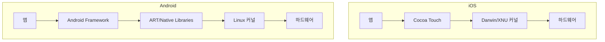
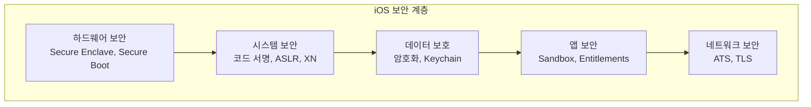
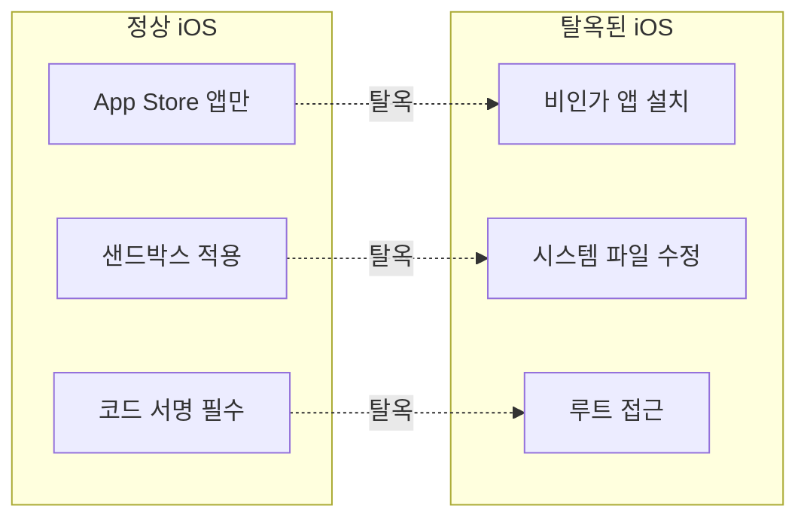
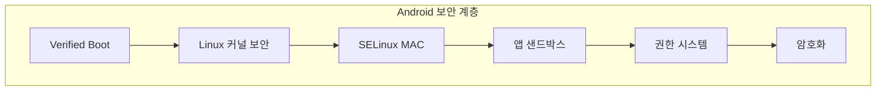
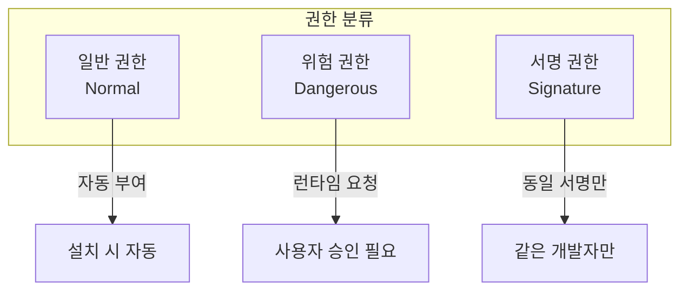
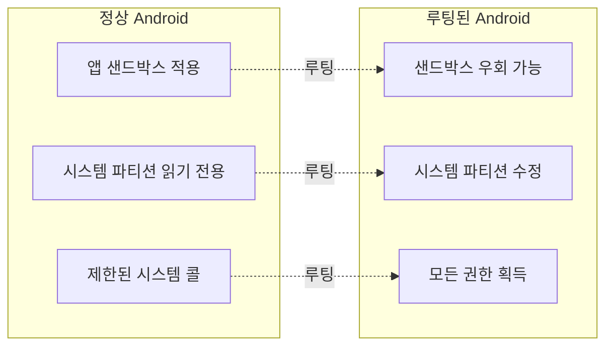
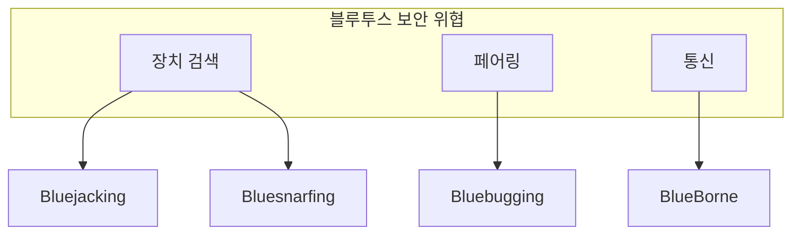

## 🌐 개요 (Overview)

**모바일 보안**은 스마트폰과 태블릿 등 모바일 기기에서의 보안 위협과 보호 메커니즘을 다룹니다. iOS 와 Android 는 각각 고유한 보안 아키텍처를 가지고 있습니다.

---

## 📱 iOS vs Android 플랫폼 비교

### 기본 구조



| 항목 | iOS | Android |
|------|-----|---------|
| **커널** | XNU (BSD/Mach 기반) | Linux 커널 |
| **개발사** | Apple | Google (AOSP) |
| **앱 배포** | App Store (폐쇄적) | Play Store + APK 사이드로딩 |
| **소스 코드** | 비공개 (Closed Source) | 공개 (Open Source) |
| **기기 다양성** | Apple 기기만 | 다양한 제조사 |
| **업데이트** | 중앙 집중식 | 제조사/통신사 의존 |

---

## 🔒 iOS 보안 아키텍처

### 보안 구조



### 핵심 보안 기능

| 기능 | 설명 |
|------|------|
| **Secure Enclave** | 암호화 키와 생체인증 데이터를 저장하는 별도의 보안 프로세서 |
| **코드 서명** | 모든 앱은 Apple 의 인증서로 서명되어야 실행 가능 |
| **ASLR** | 메모리 주소 무작위화 (Address Space Layout Randomization) |
| **XN (Execute Never)** | 데이터 영역의 코드 실행 방지 |
| **Data Protection** | 파일 단위 암호화 (AES-256) |

### 샌드박스 (Sandbox)

iOS 의 핵심 격리 메커니즘입니다.

```plaintext
iOS Sandbox 구조:

┌─────────────────────────────────────────┐
│                 App A                   │
│  ┌─────────────────────────────────┐    │
│  │  자체 Documents/                 │    │
│  │  자체 Library/                   │    │
│  │  자체 tmp/                       │    │
│  │  (다른 앱 접근 불가)                │    │
│  └─────────────────────────────────┘    │
└─────────────────────────────────────────┘
         ↓ 공유 불가 ↓
┌─────────────────────────────────────────┐
│                 App B                   │
│  ┌─────────────────────────────────┐    │
│  │  자체 Documents/                 │    │
│  │  자체 Library/                   │    │
│  │  자체 tmp/                       │    │
│  └─────────────────────────────────┘    │
└─────────────────────────────────────────┘
```

**특징**:
- 각 앱은 **독립된 파일 시스템 영역**만 접근 가능
- 시스템 리소스 접근은 **권한 (Entitlements)** 필요
- 앱 간 데이터 공유는 **정해진 API(Extension, App Groups)** 만 가능

### Entitlements (권한)

```xml
<!-- 카메라 접근 권한 -->
<key>NSCameraUsageDescription</key>
<string>사진 촬영을 위해 카메라가 필요합니다.</string>

<!-- 위치 서비스 -->
<key>NSLocationWhenInUseUsageDescription</key>
<string>현재 위치 표시를 위해 필요합니다.</string>
```

### 탈옥 (Jailbreak)

**정의**: iOS 의 보안 제한을 우회하여 **루트 권한을 획득**하고 비인가 앱을 설치할 수 있게 하는 행위



**탈옥 유형**:

| 유형 | 설명 | 특징 |
|------|------|------|
| **Untethered** | 재부팅 후에도 유지 | 영구적, 희귀 |
| **Tethered** | 재부팅 시 PC 연결 필요 | 불편 |
| **Semi-tethered** | 재부팅 후 제한된 기능 | 중간 |
| **Semi-untethered** | 재부팅 후 앱 실행으로 재탈옥 | 현재 가장 일반적 |

**탈옥의 보안 위험**:
- 악성코드 설치 가능
- 시스템 보안 메커니즘 무력화
- 개인정보 유출 위험
- 기기 불안정성
- Apple 보증 무효

---

## 🤖 Android 보안 아키텍처

### 보안 구조



### 핵심 보안 기능

| 기능 | 설명 |
|------|------|
| **Verified Boot** | 부팅 과정에서 시스템 무결성 검증 |
| **SELinux** | 강제적 접근통제 (MAC) 적용 |
| **앱 샌드박스** | 앱별 UID 할당, Linux 프로세스 격리 |
| **권한 시스템** | 런타임 권한 요청 체계 |
| **FDE/FBE** | 전체/파일 기반 암호화 |

### 앱 샌드박스

```plaintext
Android Sandbox 구조:

┌─────────────────────────────────────────┐
│  App A (UID: 10001)                     │
│  - /data/data/com.app.a/ (700)          │
│  - 자체 프로세스 격리                       │
│  - SELinux 컨텍스트: untrusted_app        │
└─────────────────────────────────────────┘
         ↓ 격리 ↓
┌─────────────────────────────────────────┐
│  App B (UID: 10002)                     │
│  - /data/data/com.app.b/ (700)          │
│  - 자체 프로세스 격리                       │
│  - SELinux 컨텍스트: untrusted_app        │
└─────────────────────────────────────────┘
```

**격리 메커니즘**:
1. **UID 분리**: 각 앱에 고유 Linux UID 할당
2. **파일 시스템 권한**: 앱 데이터 디렉토리는 해당 앱만 접근
3. **SELinux**: 강제적 접근통제로 추가 격리
4. **seccomp**: 시스템 콜 필터링

### 권한 시스템



**위험 권한 그룹**:

| 권한 그룹 | 포함 권한 |
|----------|----------|
| **CALENDAR** | READ_CALENDAR, WRITE_CALENDAR |
| **CAMERA** | CAMERA |
| **CONTACTS** | READ_CONTACTS, WRITE_CONTACTS |
| **LOCATION** | ACCESS_FINE_LOCATION, ACCESS_COARSE_LOCATION |
| **PHONE** | READ_PHONE_STATE, CALL_PHONE |
| **SMS** | SEND_SMS, READ_SMS |
| **STORAGE** | READ_EXTERNAL_STORAGE, WRITE_EXTERNAL_STORAGE |

```java
// 런타임 권한 요청 예시
if (ContextCompat.checkSelfPermission(this, Manifest.permission.CAMERA)
        != PackageManager.PERMISSION_GRANTED) {
    ActivityCompat.requestPermissions(this,
            new String[]{Manifest.permission.CAMERA},
            REQUEST_CAMERA_PERMISSION);
}
```

### 루팅 (Rooting)

**정의**: Android 기기에서 **root 권한(UID 0)을 획득**하여 시스템 전체에 대한 접근 권한을 얻는 행위



**루팅 방법**:

| 방법 | 설명 |
|------|------|
| **Bootloader Unlock** | 부트로더 잠금 해제 후 커스텀 리커버리 설치 |
| **Exploit 기반** | 커널/시스템 취약점 이용 |
| **Magisk** | 시스템 수정 없이 root 권한 제공 (systemless) |

**루팅의 보안 위험**:
- 악성 앱이 시스템 전체 접근 가능
- SafetyNet/Play Integrity 검증 실패
- 보안 업데이트 불가능한 경우 있음
- 뱅킹 앱 등 사용 불가
- 보증 무효

### SELinux in Android

```bash
# Android SELinux 정책 예시
# untrusted_app(일반 앱)은 시스템 데이터 접근 불가
neverallow untrusted_app system_data_file:file { read write };

# 앱은 자신의 데이터만 접근
allow untrusted_app app_data_file:file { read write create };
```

---

## ⚠️ 모바일 취약점 유형

### OWASP Mobile Top 10 (2024)

| 순위 | 취약점 | 설명 |
|------|--------|------|
| **M1** | 부적절한 자격증명 사용 | 하드코딩된 API 키, 토큰 |
| **M2** | 불충분한 공급망 보안 | 써드파티 라이브러리 취약점 |
| **M3** | 안전하지 않은 인증/권한 | 취약한 인증 메커니즘 |
| **M4** | 불충분한 입력/출력 검증 | SQL Injection, XSS |
| **M5** | 안전하지 않은 통신 | 암호화 미적용, 인증서 검증 실패 |
| **M6** | 불충분한 개인정보 보호 | 과도한 정보 수집 |
| **M7** | 불충분한 바이너리 보호 | 역공학, 코드 변조 |
| **M8** | 보안 설정 오류 | 디버그 모드 활성화, 불필요한 권한 |
| **M9** | 안전하지 않은 데이터 저장 | 평문 저장, 로그에 민감정보 |
| **M10** | 불충분한 암호화 | 취약한 알고리즘, 키 관리 부실 |

### 주요 공격 유형

```plaintext
1. 스미싱 (Smishing)
   - SMS를 통한 피싱 공격
   - 악성 링크 클릭 유도

2. 악성 앱 (Malware)
   - 정상 앱으로 위장
   - 개인정보 탈취, 랜섬웨어

3. 중간자 공격 (MITM)
   - 공공 Wi-Fi에서 통신 가로채기
   - SSL Stripping

4. 기기 분실/도난
   - 암호화되지 않은 데이터 유출
   - 원격 초기화 불가 시 위험
```

---

## 📶 블루투스 취약점 (Bluetooth Vulnerabilities)

### 블루투스 보안 개요

블루투스는 **근거리 무선 통신** 기술로, 편리함과 함께 다양한 보안 위협이 존재합니다.



### 주요 블루투스 공격

| 공격 유형 | 설명 | 위험도 |
|----------|------|--------|
| **Bluejacking** | 원치 않는 메시지/명함 전송 | 낮음 (스팸) |
| **Bluesnarfing** | 연락처, 캘린더, 이메일 등 **데이터 탈취** | **높음** |
| **Bluebugging** | 장치 **원격 제어** (통화, SMS 전송) | **매우 높음** |
| **BlueBorne** | 페어링 없이 **원격 코드 실행** | **치명적** |
| **KNOB Attack** | 암호화 키 길이 축소 공격 | 높음 |
| **BIAS Attack** | 인증 우회 공격 | 높음 |

### 1. Bluejacking

**스팸성 메시지** 전송 공격입니다. 피해는 낮지만 사회공학적 공격의 시작점이 될 수 있습니다.

```plaintext
공격 방식:
1. 검색 가능 모드의 기기 탐색
2. vCard(전자 명함) 형태로 메시지 전송
3. 피해자에게 원치 않는 메시지 표시

위험:
- 스팸/광고 수신
- 피싱 링크 유도
```

### 2. Bluesnarfing

**데이터를 무단으로 탈취**하는 심각한 공격입니다.

```plaintext
공격 방식:
1. OBEX (Object Exchange) 프로토콜 취약점 악용
2. 연락처, 캘린더, 이메일 등 접근
3. 사용자 동의 없이 데이터 복사

탈취 가능한 정보:
- 주소록 (연락처)
- 캘린더/일정
- 이메일
- SMS 메시지
- IMEI 번호
```

### 3. Bluebugging

장치를 **완전히 제어**할 수 있는 가장 위험한 공격입니다.

```plaintext
공격 방식:
1. AT 명령어 취약점 악용
2. 피해자 기기에 백도어 설치
3. 원격에서 기기 완전 제어

가능한 행위:
- 전화 걸기/받기
- SMS 전송/읽기
- 통화 도청
- 인터넷 접속
- 기기 정보 수집
```

### 4. BlueBorne (2017)

**페어링 없이** 블루투스가 켜진 모든 기기를 공격할 수 있는 **치명적인 취약점**입니다.

```plaintext
영향:
- Android, iOS, Windows, Linux 모두 영향
- 약 53억 대 기기 취약
- 페어링/인증 없이 공격 가능
- 원격 코드 실행 (RCE)

CVE:
- CVE-2017-1000251 (Linux)
- CVE-2017-0781~0785 (Android)
- CVE-2017-8628 (Windows)
```

### 블루투스 보안 대책

```plaintext
✅ 권장 사항:
- 사용하지 않을 때 블루투스 OFF
- 검색 가능 모드 비활성화 (숨김 모드)
- 알 수 없는 페어링 요청 거부
- OS 및 펌웨어 최신 업데이트
- 공공장소에서 블루투스 사용 자제

⚠️ 위험 상황:
- 블루투스 상시 ON + 검색 가능
- 오래된 OS/펌웨어 사용
- 불필요한 페어링 승인
```

### 블루투스 버전별 보안

| 버전 | 보안 특징 |
|------|----------|
| **BT 2.0** | 취약한 PIN 인증 |
| **BT 2.1** | SSP (Secure Simple Pairing) 도입 |
| **BT 4.0 LE** | AES-CCM 암호화, 개인정보 보호 개선 |
| **BT 4.2** | LE Secure Connections, ECDH 키 교환 |
| **BT 5.0+** | 향상된 보안, 더 긴 키 길이 |

---

## 🛡️ 모바일 보안 대책

### 기업 환경 (MDM/EMM)

| 기능 | 설명 |
|------|------|
| **MDM** | Mobile Device Management - 기기 관리 |
| **MAM** | Mobile Application Management - 앱 관리 |
| **원격 초기화** | 분실 시 원격 데이터 삭제 |
| **앱 블랙리스트** | 특정 앱 설치/실행 차단 |
| **VPN 강제** | 회사 네트워크 접속 시 VPN 필수 |

### 개인 보안 수칙

```plaintext
✅ 권장 사항:
- 공식 앱 스토어만 이용
- OS 및 앱 최신 버전 유지
- 화면 잠금 및 생체인증 설정
- 불필요한 권한 거부
- 공공 Wi-Fi 사용 자제

❌ 주의 사항:
- 탈옥/루팅 금지
- 출처 불명 APK 설치 금지
- 피싱 링크 클릭 금지
- 중요 정보 평문 저장 금지
```

---

## 📊 iOS vs Android 보안 비교

| 항목 | iOS | Android |
|------|-----|---------|
| **앱 배포** | App Store 심사 필수 | Play Store + 사이드로딩 |
| **샌드박스** | 강력한 격리 | SELinux + UID 격리 |
| **권한** | 사용 시 요청 | 런타임 권한 (Android 6.0+) |
| **암호화** | 기본 활성화 | 기본 활성화 (Android 10+) |
| **업데이트** | 신속하고 통일 | 파편화 문제 |
| **오픈소스** | 커널만 공개 (XNU) | 전체 공개 (AOSP) |
| **보안 취약점** | 탈옥 익스플로잇 | 루팅, 악성 앱 |

---

## 🔗 연결 문서 (Related Documents)

- [[access-control-models]] - MAC/DAC 접근통제 모델
- [[selinux]] - Android 의 SELinux 구현
- [[secure-operating-systems]] - 보안 운영체제 개념
- [[authentication-authorization]] - 인증 및 권한 부여
- [[malware-types]] - 모바일 악성코드
