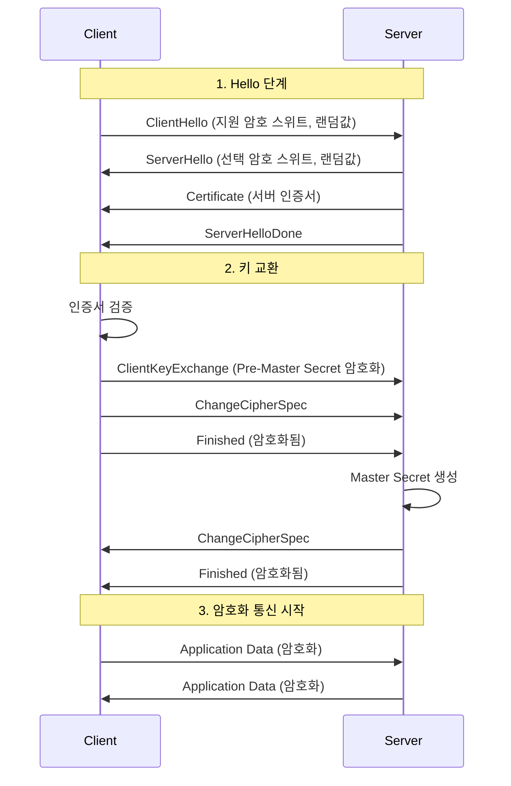
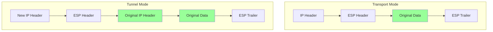
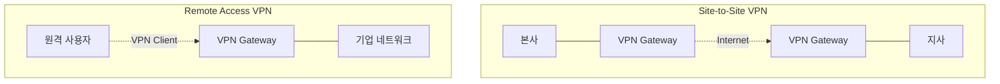
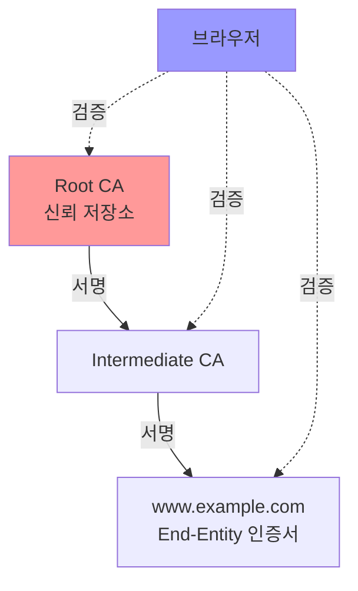

## 🌐 개요 (Overview)

네트워크 보안 프로토콜은 [[tcp-ip-model|TCP/IP 네트워크]]에서 안전한 통신을 제공하는 프로토콜입니다. 기밀성, 무결성, 인증을 보장하여 중간자 공격, 도청, 데이터 변조를 방지합니다.

## 🔐 TLS/SSL (Transport Layer Security)

### TLS Handshake



### TLS 버전

| 버전 | 출시 | 상태 | 주요 특징 |
|------|------|------|-----------|
| SSL 2.0 | 1995 | ❌ Deprecated | 치명적 취약점 |
| SSL 3.0 | 1996 | ❌ Deprecated | POODLE 공격 |
| TLS 1.0 | 1999 | ❌ Deprecated | BEAST 공격 |
| TLS 1.1 | 2006 | ❌ Deprecated | - |
| TLS 1.2 | 2008 | ✅ 사용 중 | SHA-256, GCM |
| TLS 1.3 | 2018 | ✅ 권장 | 1-RTT, 0-RTT, 단순화 |

### TLS 1.3 개선사항

- **빠른 핸드셰이크**: 1-RTT (왕복 1회)
- **0-RTT 재개**: 이전 세션 재사용
- **암호 스위트 단순화**: 안전한 알고리즘만
- **Perfect Forward Secrecy**: 기본 활성화

## 🛡️ IPSec (Internet Protocol Security)

### 구성 요소

1. **AH (Authentication Header)**
   - 무결성 + 인증
   - 암호화 없음
   - 프로토콜 번호: 51

2. **ESP (Encapsulating Security Payload)**
   - 무결성 + 인증 + **암호화**
   - 프로토콜 번호: 50
   - 일반적으로 ESP 사용

### 모드



**Transport Mode**: 데이터만 암호화 (호스트 간)
**Tunnel Mode**: 전체 IP 패킷 암호화 (VPN)

### IKE (Internet Key Exchange)

**Phase 1**: SA (Security Association) 수립
**Phase 2**: IPSec SA 협상

## 🔑 SSH (Secure Shell)

### SSH 프로토콜 계층

```
SSH-USERAUTH (인증)
SSH-CONNECTION (채널 다중화)
SSH-TRANS (전송 계층 - 암호화)
TCP (포트 22)
```

### 인증 방식

1. **Password**: 패스워드 인증
2. **Public Key**: [[cryptography-basics|공개키]] 인증 (권장)
3. **Host-based**: 호스트 기반
4. **Keyboard-interactive**: 동적 챌린지

### 공개키 인증

```bash
# 1. 키 쌍 생성
ssh-keygen -t ed25519 -C "email@example.com"
# 또는
ssh-keygen -t rsa -b 4096

# 2. 공개키를 서버에 복사
ssh-copy-id user@server

# 3. 로그인 (패스워드 없이)
ssh user@server
```

### SSH 터널링

```bash
# Local Port Forwarding
ssh -L 8080:localhost:80 user@server

# Remote Port Forwarding  
ssh -R 8080:localhost:3000 user@server

# Dynamic Port Forwarding (SOCKS 프록시)
ssh -D 1080 user@server
```

## 🌐 VPN (Virtual Private Network)

### VPN 유형



### VPN 프로토콜

| 프로토콜 | 계층 | 암호화 | 속도 | 용도 |
|----------|------|--------|------|------|
| **PPTP** | L2 | ❌ 취약 | 빠름 | 사용 금지 |
| **L2TP/IPSec** | L2 | ✅ IPSec | 중간 | 레거시 |
| **OpenVPN** | SSL/TLS | ✅ 강력 | 중간 | 범용 |
| **WireGuard** | L3 | ✅ 경량 | 매우 빠름 | 최신 권장 |
| **IKEv2/IPSec** | L3 | ✅ 강력 | 빠름 | 모바일 |

### WireGuard

- **경량**: 4,000줄 미만 코드
- **빠름**: 기존 VPN 대비 3~4배
- **모던 암호**: ChaCha20, Curve25519
- **간단한 설정**

```ini
[Interface]
PrivateKey = <client-private-key>
Address = 10.0.0.2/24

[Peer]
PublicKey = <server-public-key>
Endpoint = server.example.com:51820
AllowedIPs = 0.0.0.0/0
```

## 🔒 HTTPS (HTTP over TLS)

### 인증서 체인



### HSTS (HTTP Strict Transport Security)

```http
Strict-Transport-Security: max-age=31536000; includeSubDomains; preload
```

**효과**:
- HTTP 자동 HTTPS 전환
- 중간자 공격 방지
- 인증서 경고 무시 방지

## 🔗 연결 문서 (Related Documents)

- [[cryptography-basics]] - 암호화 알고리즘
- [[tcp-ip-model]] - 네트워크 프로토콜 스택
- [[authentication-authorization]] - 인증 메커니즘
- [[dns-fundamentals]] - DNS over HTTPS/TLS
