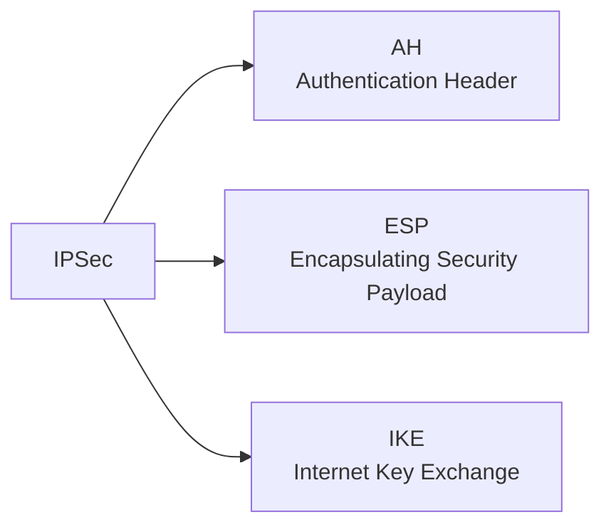
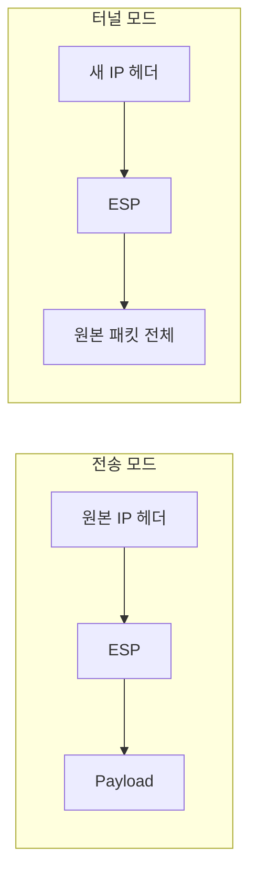
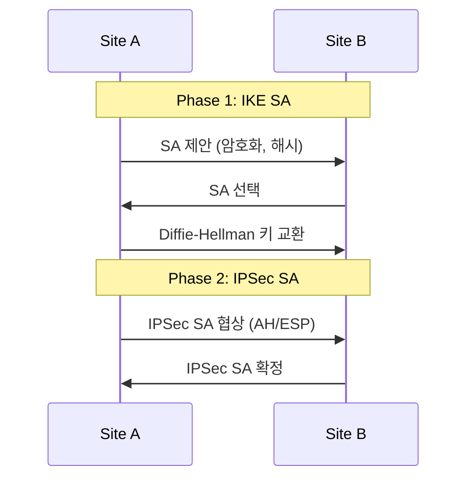

## 🌐 개요 (Overview)

**IPSec (IP Security)** 은 **IP 계층 (Layer 3)** 에서 데이터의 **기밀성, 무결성, 인증**을 제공하는 보안 프로토콜입니다. VPN 구현에 널리 사용됩니다.

## 📋 IPSec 프로토콜 구성



| 프로토콜 | 역할 |
|----------|------|
| **AH** | 무결성, 인증 (암호화 없음) |
| **ESP** | 기밀성, 무결성, 인증 |
| **IKE** | 키 교환, SA 설정 |

---

## 🔐 AH (Authentication Header)

**무결성과 인증**만 제공하며, **기밀성(암호화)은 제공하지 않습니다**.

### 제공 기능

| 기능 | 제공 |
|------|:----:|
| 무결성 | ✅ |
| 인증 | ✅ |
| 기밀성 | ❌ |
| 재전송 방지 | ✅ |

### 헤더 구조

```plaintext
+---------------+---------------+
|  Next Header  | Payload Len   |
+---------------+---------------+
|        Security Parameter     |
|           Index (SPI)         |
+-------------------------------+
|       Sequence Number         |
+-------------------------------+
|   Authentication Data (ICV)   |
|         (무결성 검증값)         |
+-------------------------------+
```

### 한계

- **NAT 환경에서 동작 불가** (IP 헤더도 인증에 포함되어 NAT가 수정하면 검증 실패)

---

## 🔒 ESP (Encapsulating Security Payload)

**기밀성, 무결성, 인증** 모두 제공합니다.

### 제공 기능

| 기능 | 제공 |
|------|:----:|
| 기밀성 | ✅ |
| 무결성 | ✅ |
| 인증 | ✅ |
| 재전송 방지 | ✅ |

### 헤더 구조

```plaintext
+-------------------------------+
|        SPI (32 bits)          |
+-------------------------------+
|     Sequence Number (32)      |
+-------------------------------+
|                               |
|      Payload Data (암호화)     |
|                               |
+-------------------------------+
|  Padding  | Pad Len | Next Hdr|
+-------------------------------+
|   Authentication Data (ICV)   |
+-------------------------------+
```

---

## 📊 AH vs ESP 비교

| 특성 | AH | ESP |
|------|:--:|:---:|
| **기밀성 (암호화)** | ❌ | ✅ |
| **무결성** | ✅ | ✅ |
| **인증** | ✅ | ✅ |
| **NAT 호환** | ❌ | ✅ (NAT-T) |
| **IP 헤더 보호** | ✅ | ❌ (외부 헤더) |

---

## 🚀 IPSec 운영 모드

### 1. 전송 모드 (Transport Mode)

**Payload만 암호화/인증**합니다. 원본 IP 헤더는 유지됩니다.

```plaintext
[원본 IP 헤더][ESP/AH 헤더][암호화된 Payload]

용도: 종단 간 (End-to-End) 통신
      호스트 ↔ 호스트
```

### 2. 터널 모드 (Tunnel Mode)

**전체 IP 패킷 (헤더 포함)** 을 암호화하고 새 IP 헤더를 추가합니다.

```plaintext
[새 IP 헤더][ESP/AH 헤더][암호화된 원본 IP 패킷]

용도: VPN 게이트웨이 간 통신
      게이트웨이 ↔ 게이트웨이
```

### 모드 비교



| 특성 | 전송 모드 | 터널 모드 |
|------|----------|----------|
| **암호화 범위** | Payload만 | IP 패킷 전체 |
| **헤더** | 원본 유지 | 새 헤더 추가 |
| **용도** | Host-to-Host | **VPN (GW-to-GW)** |
| **오버헤드** | 낮음 | 높음 |

---

## 🔑 IKE (Internet Key Exchange)

**보안 연계 (SA) 설정**과 **키 교환**을 자동화합니다.

### SA (Security Association)

IPSec 통신을 위한 **보안 매개변수 집합**입니다.

| 항목 | 내용 |
|------|------|
| **SPI** | Security Parameter Index (SA 식별자) |
| **암호화 알고리즘** | AES, 3DES 등 |
| **인증 알고리즘** | HMAC-SHA1, SHA-256 등 |
| **키** | 암호화/인증 키 |
| **수명** | SA 유효 기간 |

### IKE 2단계

| 단계 | 목적 | 산출물 |
|------|------|--------|
| **Phase 1** | IKE SA 수립 (보안 채널) | ISAKMP SA |
| **Phase 2** | IPSec SA 수립 | IPSec SA (AH/ESP) |



---

## 🏢 VPN 아키텍처

### Site-to-Site VPN


### Remote Access VPN


---

## 📊 SSL VPN vs IPSec VPN

| 특성 | IPSec VPN | SSL VPN |
|------|----------|---------|
| **계층** | Layer 3 | Layer 4-7 |
| **클라이언트** | 필요 | 웹 브라우저로 가능 |
| **접근 범위** | 전체 네트워크 | 특정 애플리케이션 |
| **NAT 호환** | 문제 가능 (NAT-T) | ✅ 양호 |
| **용도** | Site-to-Site | 원격 접속 |

## 🔗 연결 문서 (Related Documents)

- [[network-security-protocols]] - SSL/TLS
- [[cryptography-basics]] - 암호화 기초
- [[block-cipher-modes]] - AES-CBC 등
