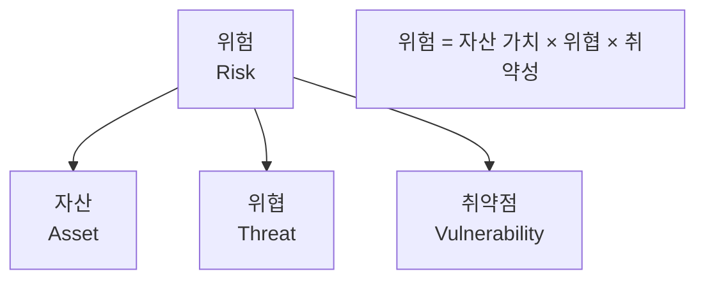
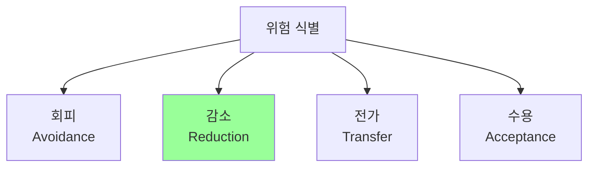

## 🌐 개요 (Overview)

**위험 관리 (Risk Management)** 는 조직의 자산에 대한 위험을 식별하고, **수용 가능한 수준으로 낮추는** 핵심 정보보호 활동입니다.

## 📋 위험 관리 요소



| 요소 | 정의 | 예시 |
|------|------|------|
| **자산 (Asset)** | 보호해야 할 대상 | 정보, 하드웨어, 소프트웨어, 인력 |
| **위협 (Threat)** | 손실을 초래할 수 있는 원인 | 해커, 바이러스, 천재지변, 내부자 |
| **취약점 (Vulnerability)** | 위협이 파고들 수 있는 약점 | 버그, 미흡한 물리 보안, 설정 오류 |
| **위험 (Risk)** | 위협이 취약점을 이용해 손실을 끼칠 가능성 | |

---

## 📊 위험 분석 접근법

### 1. 베이스라인 접근법 (Baseline Approach)

모든 시스템에 **표준화된 보안 체크리스트**를 일괄 적용합니다.

| 장점 | 단점 |
|------|------|
| 시간/비용 절약 | 조직 특성 반영 못함 |
| 일관된 보안 수준 | 과잉/부족 보호 가능 |

### 2. 비정형 접근법 (Informal Approach)

**전문가의 지식과 경험**에 의존하여 위험을 분석합니다.

| 장점 | 단점 |
|------|------|
| 빠른 수행 | 주관적 결과 |
| 비용 절감 | 전문가 역량에 의존 |

### 3. 상세 위험 분석 (Detailed Risk Analysis)

자산 가치, 위협, 취약성을 **정밀하게 분석**합니다.

| 장점 | 단점 |
|------|------|
| 정확한 위험 평가 | 시간/비용/노력 많이 소요 |
| 적절한 대책 수립 | |

### 4. 복합 접근법 (Combined Approach)

| 시스템 | 적용 방법 |
|--------|----------|
| 중요 시스템 | 상세 위험 분석 |
| 일반 시스템 | 베이스라인 접근법 |

---

## 📈 정량적 vs 정성적 분석

### 정성적 분석 (Qualitative)

위험을 **등급**으로 표현합니다.

| 기법 | 설명 |
|------|------|
| **델파이법** | 전문가 합의 |
| **시나리오법** | 가상 상황 분석 |
| **순위결정법** | 위험 우선순위 결정 |

```plaintext
위험 등급: 상, 중, 하
또는: 매우 높음, 높음, 보통, 낮음, 매우 낮음
```

### 정량적 분석 (Quantitative)

위험을 **금액(화폐 가치)** 으로 표현합니다.

#### ALE 계산 (연간 예상 손실액)

```plaintext
ALE = SLE × ARO

SLE (Single Loss Expectancy) = 자산 가치 × 노출 계수(EF)
ARO (Annualized Rate of Occurrence) = 연간 발생 빈도
```

| 용어 | 정의 | 예시 |
|------|------|------|
| **AV (Asset Value)** | 자산 가치 | 1억 원 |
| **EF (Exposure Factor)** | 노출 계수 (피해 비율) | 30% |
| **SLE** | 단일 손실 예상액 | 1억 × 0.3 = 3,000만 원 |
| **ARO** | 연간 발생 빈도 | 2회/년 |
| **ALE** | 연간 예상 손실액 | 3,000만 × 2 = 6,000만 원/년 |

---

## 🛡️ 위험 처리 전략 (Risk Treatment)



### 1. 위험 회피 (Risk Avoidance)

위험을 유발하는 **프로세스/사업 자체를 중단**합니다.

```plaintext
예: 위험한 신규 서비스 출시 포기
```

### 2. 위험 감소/완화 (Risk Reduction)

**보안 대책**을 구현하여 위험 발생 가능성이나 피해를 줄입니다.

```plaintext
예: 방화벽 도입, 암호화 적용, 접근 통제 강화
✅ 가장 일반적인 방법
```

### 3. 위험 전가 (Risk Transfer)

위험 책임을 **제3자에게 이전**합니다.

```plaintext
예: 보험 가입, 외주(Outsourcing)
```

### 4. 위험 수용 (Risk Acceptance)

위험 수준이 낮거나 대책 비용이 손실보다 클 경우 **감수**합니다.

```plaintext
조건:
- 위험 수준 < 수용 가능 수준
- 대책 비용 > 예상 손실액
```

---

## 📊 위험 처리 전략 비교

| 전략 | 설명 | 예시 |
|------|------|------|
| **회피** | 위험 원인 제거 | 사업 중단 |
| **감소** | 통제로 위험 완화 | 방화벽, 암호화 |
| **전가** | 책임 이전 | 보험, 외주 |
| **수용** | 위험 감수 | 비용 대비 효과 |

---

## 💡 위험 관리 프로세스


| 단계 | 활동 |
|------|------|
| **위험 식별** | 자산, 위협, 취약점 목록화 |
| **위험 분석** | 위험 발생 가능성, 영향도 평가 |
| **위험 평가** | 허용 가능 수준과 비교 |
| **위험 처리** | 회피/감소/전가/수용 결정 |
| **모니터링** | 지속적 관찰 및 재평가 |

## 🔗 연결 문서 (Related Documents)

- [[security-fundamentals]] - 정보보호 기초
- [[bcp-disaster-recovery]] - 업무 연속성 및 재해 복구
- [[firewall-ids-ips]] - 위험 감소 대책
- [[backup-strategies]] - 백업 전략
