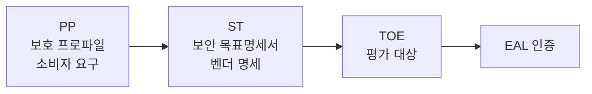

## 🌐 개요 (Overview)

정보보호 제품의 보안성을 **공정하고 신뢰성 있게 평가**하기 위한 국제/국가 표준 평가 기준입니다.

## 📜 OECD 프라이버시 가이드라인

1980년 OECD 회원국이 채택한 **개인정보 보호 8대 원칙**입니다.

| 원칙 | 설명 |
|------|------|
| **수집제한** | 적법하고 공정한 수단, 동의 필요 |
| **정보 정확성** | 정확하고 완전하며 최신 상태 유지 |
| **목적 명확화** | 수집 전 목적 명시, 해당 목적에만 사용 |
| **이용 제한** | 동의나 법률 없이 다른 목적 사용 금지 |
| **안전성 보호** | 분실, 불법 접근, 파괴 등으로부터 보호 |
| **공개** | 정보 존재, 종류, 목적 등 공개 |
| **개인 참가** | 정보 열람, 이의 제기, 정정/삭제 권리 |
| **책임** | 정보관리자의 원칙 준수 책임 |

---

## 🇺🇸 TCSEC (Trusted Computer System Evaluation Criteria)

### 개요

**1983년 미국 국방부 (DoD)** 가 제정한 평가 기준입니다. 표지 색깔로 **오렌지북 (Orange Book)** 이라 불립니다.

### 특징

| 특징 | 설명 |
|------|------|
| **중시** | 기밀성 (Confidentiality) |
| **등급** | D, C1, C2, B1, B2, B3, A1 (7등급) |

### 보안 등급

| 등급 | 이름 | 설명 |
|:----:|------|------|
| **D** | Minimal Protection | 보안 기능 없음 |
| **C1** | Discretionary Security | 사용자 인증, 임의적 접근통제 |
| **C2** | Controlled Access | **감사(Audit)** 기능, 접근 통제 (일반 OS 수준) |
| **B1** | Labeled Security | **강제적 접근통제 (MAC)** 도입, 보안 레이블 |
| **B2** | Structured Protection | 형식화된 보안 정책 모델 |
| **B3** | Security Domains | 보안 도메인 기반 분리 |
| **A1** | Verified Design | **수학적 검증**, 최상위 등급 |

```plaintext
D < C1 < C2 < B1 < B2 < B3 < A1
              │
              └── 일반 상용 OS
```

---

## 🇪🇺 ITSEC (Information Technology Security Evaluation Criteria)

### 개요

**1991년 유럽 4개국** (영국, 독일, 프랑스, 네덜란드)이 제정했습니다.

### 특징

| 특징 | TCSEC 대비 |
|------|----------|
| **고려 요소** | 기밀성 + **무결성 + 가용성** |
| **평가 분리** | 기능성 (F) vs 보증 (E) 분리 |
| **보증 등급** | E0 ~ E6 (7단계) |

### 보증 등급

| 등급 | 설명 |
|:----:|------|
| E0 | 부적합 |
| E1 | 비정형적 보안 정책 |
| E2 | 비정형적 설계 명세 |
| E3 | 소스 코드/하드웨어 설계 |
| E4 | 형식적 보안 정책 모델 |
| E5 | 설계-소스코드 대응 |
| E6 | **형식적 검증** |

---

## 🌍 CC (Common Criteria, ISO 15408)

### 개요

서로 다른 평가 기준 (**TCSEC, ITSEC, CTCPEC** 등)을 **통합**한 **국제 공통 평가 기준**입니다.

### 구성 (3 Parts)

| Part | 내용 |
|:----:|------|
| **Part 1** | 평가 원칙과 모델 |
| **Part 2** | 보안 기능 요구사항 (11개 클래스) |
| **Part 3** | 보증 요구사항 (EAL 정의) |

### 주요 용어

| 용어 | 정의 |
|------|------|
| **PP (Protection Profile)** | 특정 제품군에 대한 **소비자 요구사항** 집합 |
| **ST (Security Target)** | **벤더**가 PP 만족을 기술한 명세서 |
| **TOE (Target of Evaluation)** | **평가 대상** IT 제품/시스템 |



### EAL (Evaluation Assurance Level)

| 등급 | 이름 | 설명 |
|:----:|------|------|
| **EAL1** | 기능적 시험 | 기능 정상 동작 확인 |
| **EAL2** | 구조적 시험 | 개발자 테스트 검토, 취약성 분석 |
| **EAL3** | 방법론적 시험과 점검 | 보안 공학 기법 적용 확인 |
| **EAL4** | 방법론적 설계, 시험 및 검토 | **상업용 제품 일반**, 소스코드 일부 검토 |
| **EAL5** | 준정형적 설계 및 시험 | 정형화된 모델 요구 |
| **EAL6** | 준정형적 검증된 설계 및 시험 | 높은 보증 요구 환경 |
| **EAL7** | 정형적 검증된 설계 및 시험 | **수학적 검증**, 최상위 |

---

## 📊 평가 기준 비교

| 특성 | TCSEC | ITSEC | CC |
|------|-------|-------|------|
| **제정** | 미국 (1983) | 유럽 (1991) | 국제 (ISO) |
| **중점** | 기밀성 | CIA 모두 | CIA 모두 |
| **등급** | D~A1 (7) | E0~E6 (7) | EAL1~7 |
| **기능/보증** | 통합 | **분리** | 분리 |
| **국제 표준** | ❌ | ❌ | **ISO 15408** |

## 🔗 연결 문서 (Related Documents)

- [[security-fundamentals]] - 정보보호 기초 (CIA)
- [[isms-certification]] - ISMS 인증 제도
- [[cryptography-basics]] - 암호화 기초
