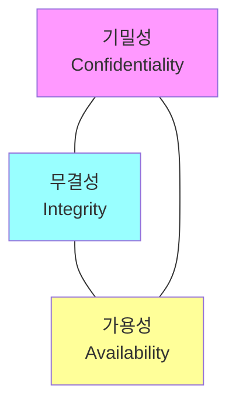
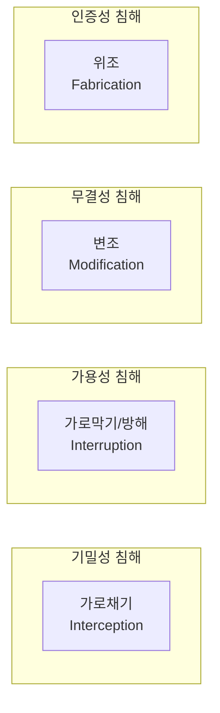

## 🌐 개요 (Overview)

**정보보안 (Information Security)** 은 정보의 수집, 가공, 저장, 검색, 송신, 수신 중에 정보의 **훼손, 변조, 유출 등을 방지**하기 위한 관리적, 기술적 수단입니다.

## 📋 보호 대상

| 유형 | 예시 |
|------|------|
| **유형 자산 (Tangible)** | 건물, 금고, 서버, 네트워크 장비 |
| **무형 자산 (Intangible)** | 소프트웨어, 데이터, 지적 재산, 노하우 |

---

## 🔐 정보보호 3대 목표 (CIA Triad)



### 1. 기밀성 (Confidentiality)

**인가된 사용자만** 정보 자산에 접근할 수 있도록 보장합니다.

| 위협 | 대책 |
|------|------|
| 도청, 스니핑 | **암호화** |
| 비인가 접근 | **접근 통제** |
| 정보 유출 | DLP, 분류 체계 |

**침해 예시**: 개인정보 유출, 기업 기밀 도청

### 2. 무결성 (Integrity)

정보가 **인가된 방법에 의해서만 변경**될 수 있도록 보장합니다.

| 위협 | 대책 |
|------|------|
| 데이터 변조 | **해시, 디지털 서명** |
| 권한 없는 수정 | **접근 통제** |
| 전송 중 변조 | HMAC, 체크섬 |

**침해 예시**: 계좌 잔액 조작, 로그 위변조

### 3. 가용성 (Availability)

인가된 사용자가 **필요할 때 지체 없이** 정보와 서비스를 사용할 수 있도록 보장합니다.

| 위협 | 대책 |
|------|------|
| DoS/DDoS 공격 | 방어 솔루션, CDN |
| 시스템 장애 | **이중화, 백업** |
| 재해 | **DR (재해 복구)** |

**침해 예시**: 서비스 중단, 시스템 다운

---

## 🔒 추가 보안 특성

| 특성 | 설명 |
|------|------|
| **인증성 (Authenticity)** | 정보 출처가 확실한지, 사용자 신원이 진짜인지 확인 |
| **책임 추적성 (Accountability)** | 누가 언제 무엇을 했는지 추적 가능 (로그, 감사) |
| **부인 방지 (Non-Repudiation)** | 송/수신 사실을 부인하지 못하게 함 (전자서명) |
| **신뢰성 (Reliability)** | 시스템이 의도대로 일관되게 동작 |

---

## ⚠️ 정보 위협 유형



| 위협 유형 | 설명 | 침해 대상 |
|----------|------|----------|
| **가로채기 (Interception)** | 비인가자가 몰래 정보 열람/도청 | 기밀성 |
| **가로막기 (Interruption)** | 하드웨어/데이터 파괴, 사용 불가 | 가용성 |
| **변조 (Modification)** | 데이터를 가로채 내용 변경 | 무결성 |
| **위조 (Fabrication)** | 다른 송신자처럼 데이터 생성 | 인증성 |

---

## 📑 정보보호 정책 체계

### 정책 수립 방식

| 방식 | 설명 | 특징 |
|------|------|------|
| **하향식 (Top-Down)** | 경영진 주도로 정책 수립 | ✅ 권장, 강력한 추진력 |
| **상향식 (Bottom-Up)** | 실무자 레벨에서 시작 | 기술적 완성도 높음 |

### 정책 계층 구조

```mermaid
graph TD
    POL[정책 Policy<br/>"무엇을 해야 하는가"] --> STD[표준 Standard<br/>"통일된 규격"]
    STD --> GUI[지침 Guideline<br/>"권고 사항"]
    STD --> PRO[절차 Procedure<br/>"어떻게 수행할 것인가"]
```

| 문서 | 설명 | 강제성 |
|------|------|:------:|
| **정책 (Policy)** | "What" - 요구사항 정의 | ✅ 필수 |
| **표준 (Standard)** | 기술/절차적 규격 | ✅ 필수 |
| **지침 (Guideline)** | 권고 사항, 모범 사례 | ❌ 권고 |
| **절차 (Procedure)** | "How" - 상세 단계 | ✅ 필수 |

---

## 👥 정보보호 조직

| 역할 | 책임 |
|------|------|
| **CEO/CSO** | 총괄 책임, 정책 승인, 자원 할당 |
| **정보보호 위원회** | 정책/대책 심의 및 의결 |
| **정보보호 관리자** | 정책 수립, 시스템 운영, 사고 대응 |
| **데이터 소유자 (Owner)** | 정보 분류/등급 결정 (현업) |
| **데이터 관리자 (Custodian)** | 저장, 백업, 무결성 유지 (IT) |

---

## 🛡️ 통제 (Control) 분류

### 시점에 따른 분류

| 통제 | 설명 | 예시 |
|------|------|------|
| **예방 (Preventive)** | 사고 발생 전 방지 | 암호화, 방화벽, 출입통제 |
| **탐지 (Detective)** | 사고 실시간 인지 | IDS, 로그 감사, CCTV |
| **교정 (Corrective)** | 사고 후 복구 | 백업, 복구, 백신 치료 |

### 성격에 따른 분류

| 통제 | 예시 |
|------|------|
| **관리적** | 정책, 절차, 교육, 조직 |
| **기술적** | 시스템, 네트워크, 암호화 |
| **물리적** | 경비원, 잠금장치, 출입통제 |

---

## 🔑 접근 통제 절차

```mermaid
graph LR
    ID[1. 식별<br/>Identification<br/>"나는 홍길동"] --> AUTH[2. 인증<br/>Authentication<br/>"증명하세요"]
    AUTH --> AUTHZ[3. 인가<br/>Authorization<br/>"권한 부여"]
    AUTHZ --> ACC[4. 책임추적<br/>Accountability<br/>"로그 기록"]
```

| 단계 | 설명 | 예시 |
|------|------|------|
| **식별** | 자신이 누구인지 밝힘 | ID 입력 |
| **인증** | 신원 검증 | Password, 생체인증 |
| **인가** | 권한 부여 | 접근 권한 할당 |
| **책임추적** | 행동 기록/추적 | 로그, 감사 |

## 🔗 연결 문서 (Related Documents)

- [[risk-management]] - 위험 관리
- [[bcp-disaster-recovery]] - 업무 연속성 및 재해 복구
- [[authentication-authorization]] - 인증과 인가
- [[cryptography-basics]] - 암호화 기초
